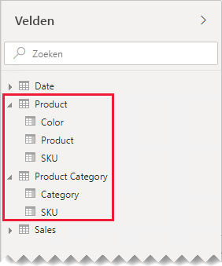

# Richtlijnen voor een-op-een-relaties

Dit artikel is geschreven voor iedereen die gegevensmodellen maakt met Power BI Desktop. Het biedt richtlijnen voor het werken met een-op-een-modelrelaties. Een een-op-een-relatie kan worden gemaakt wanneer beide tabellen elk een kolom met algemene en unieke waarden bevatten.

[!INCLUDE [relationships-prerequisite-reading](includes/relationships-prerequisite-reading.md)]

Er zijn twee scenario's waarbij een-op-een-relaties zijn vereist:

- [Losstaande dimensies](#degenerate-dimensions): U kunt een [losstaande dimensie](star-schema.md#degenerate-dimensions) afleiden uit een feitentabel.
- [Rijgegevens die verschillende tabellen omvatten](#row-data-spans-across-tables): Eén bedrijfsentiteit of bedrijfsonderwerp wordt geladen als twee (of meer) modeltabellen, mogelijk omdat de bijbehorende gegevens afkomstig zijn uit verschillende gegevensarchieven. Dit scenario kan gebruikelijk zijn voor dimensietabellen. De hoofdproductdetails worden bijvoorbeeld opgeslagen in een operationeel verkoopsysteem, en aanvullende productdetails worden opgeslagen in een andere bron.

    Het is echter ongebruikelijk om twee feitentabellen via een een-op-een-relatie aan elkaar te koppelen. De reden hiervoor is dat beide feitentabellen dan dezelfde dimensionaliteit en granulatie moeten hebben. Elke feitentabel heeft dan bovendien unieke kolommen nodig voordat de modelrelatie kan worden gemaakt.

## Losstaande dimensies

Als kolommen uit een feitentabel worden gebruikt voor filteren of groeperen, kunt u overwegen om ze beschikbaar te maken in een afzonderlijke tabel. Op deze manier scheidt u kolommen die worden gebruikt voor filteren en groeperen, van de kolommen die worden gebruikt voor feitenrijen. Deze scheiding biedt de volgende voordelen:

- Verkleinen van de benodigde opslagruimte
- Vereenvoudigen van modelberekeningen
- Bijdragen aan verbeterde queryprestaties
- Auteurs van rapporten een intuïtiever deelvenster **Velden** bieden

Stel dat u een bronverkooptabel hebt waarin de details van verkooporders worden opgeslagen in twee kolommen.

De kolom **OrderNumber** bevat het ordernummer, en de kolom **OrderLineNumber** bevat een reeks regels binnen de order.

In het volgende modeldiagram ziet u dat de kolommen ordernummers en orderregels niet zijn geladen in de tabel **Sales**. In plaats hiervan zijn de bijbehorende waarden gebruikt om een kolom met [surrogaatsleutels](star-schema.md#surrogate-keys) te maken met de naam **SalesOrderLineID**. (De sleutelwaarde wordt berekend door het ordernummer te vermenigvuldigen met 1000, en vervolgens het orderregelnummer toe te voegen.)

De tabel **Sales Order** biedt een rijke ervaring voor auteurs van rapporten, met drie kolommen: **Sales Order**, **Sales Order Line** en **Line Number**. Het bevat ook een hiërarchie. Deze tabelbronnen bieden ondersteuning voor rapportontwerpen die het mogelijk moeten maken te filteren, te groeperen of in te zoomen op orders en orderregels.

Aangezien de tabel **Sales Order** is afgeleid uit de verkoopgegevens, moet elke tabel precies hetzelfde aantal rijen bevatten. Verder moeten er overeenkomende waarden zijn tussen elke kolom **SalesOrderLineID**.

## Rijgegevens die verschillende tabellen omvatten

Bekijk een voorbeeld van twee gerelateerde een-op-een-dimensietabellen: **Product** en **Product Category**. Elke tabel vertegenwoordigt geïmporteerde gegevens en heeft een kolom **SKU** (Stock-Keeping Unit) met unieke waarden.

Hier volgt een gedeeltelijk modeldiagram van de twee tabellen.

De eerste tabel heet **Product** en bevat drie kolommen: **Color**, **Product** en **SKU**. De tweede tabel heet **Product Category** en bevat twee kolommen: **Category** en **SKU**. De kolommen **SKU** zijn gekoppeld via een een-op-een-relatie. De relatie wordt gefilterd in beide richtingen, wat altijd het geval is voor een-op-een-relaties.

Het modeldiagram is zodanig gewijzigd dat de tabelrijen worden weergegeven om aan te geven hoe de doorgifte van relatiefilters werkt. Alle voorbeelden in dit artikel zijn gebaseerd op deze gegevens.

> [!NOTE]
> Het is niet mogelijk om tabelrijen weer te geven in het Power BI Desktop-modeldiagram. Het wordt wel gedaan in dit artikel om duidelijke voorbeelden te kunnen geven.

De rijgegevens voor de twee tabellen worden beschreven in de volgende lijst:

- De tabel **Product** heeft drie rijen:
  - **SKU** CL-01, **Product** T-shirt, **Color** Groen
  - **SKU** CL-02, **Product** Jeans, **Color** Blauw
  - **SKU** AC-01, **Product** Hoed, **Color** Blauw
- De tabel **Product Category** heeft twee rijen:
  - **SKU** CL-01, **Category** Kleding
  - **SKU** AC-01, **Category** Accessoires

U ziet dat de tabel **Product Category** geen rij bevat voor de product-SKU CL-02. De gevolgen van deze ontbrekende rij worden verderop in dit artikel besproken.

In het deelvenster **Velden** kunnen auteurs van rapporten productgerelateerde velden in twee tabellen vinden: **Product** en **Product Category**.

Laten we eens kijken wat er gebeurt als velden uit beide tabellen worden toegevoegd aan een tabelvisual. In dit voorbeeld is de kolom **SKU** afkomstig uit de tabel **Product**.

U ziet dat de waarde **Category** voor product-SKU CL-02 is leeg. Dit komt omdat de tabel **Product Category** geen rij bevat voor dit product.

### Aanbevelingen

We raden u aan om het maken van een-op-een-modelrelaties zoveel mogelijk te vermijden wanneer rijgegevens verschillende tabellen omvatten. Nadelen van dit ontwerp:

- Het deelvenster **Velden** kan te vol raken, omdat er meer tabellen worden weergegeven dan nodig is
- Auteurs van rapporten kunnen gerelateerde velden mogelijk moeilijk vinden, omdat deze zijn verdeeld over meerdere tabellen
- De mogelijkheid om hiërarchieën te maken kan beperkt zijn, omdat niveaus moeten zijn gebaseerd op kolommen uit _dezelfde tabel_
- Er kunnen onverwachte resultaten worden gegenereerd wanneer rijen in de tabellen niet volledig overeenkomen

Specifieke aanbevelingen kunnen variëren, afhankelijk van of het gaat om een _‘intra-island’_ of _‘inter-island’_ een-op-een-relatie. Raadpleeg [Modelrelaties in Power BI Desktop (evaluatie van relaties)](../transform-model/desktop-relationships-understand.md#relationship-evaluation) voor meer informatie over de evaluatie van relaties.

### Een ‘intra-island’ een-op-een-relatie

Wanneer er een _‘intra-island’_ een-op-een-relatie tussen tabellen bestaat, raden we u aan om de gegevens samen te voegen in één modeltabel. Dit wordt gedaan door Power Query-query's samen te voegen.

De volgende stappen vertegenwoordigen een methode voor het samenvoegen en modelleren van gegevens die zijn gerelateerd aan een een-op-een-relatie:

1. **Query's samenvoegen**: Kijk bij het [combineren van de twee query’s](../connect-data/desktop-shape-and-combine-data.md#combine-queries) naar de volledigheid van de gegevens in elke query. Als één query een volledige set rijen bevat (zoals een hoofdlijst), moet u de andere query met deze query samenvoegen. Configureer de samenvoegtransformatie voor het gebruik van een _left outer join_. Dit is het standaard-join-type. Dit join-type zorgt ervoor dat alle rijen uit de eerste query behouden blijven, en worden aangevuld met eventuele overeenkomende rijen uit de tweede query. Vouw alle vereiste kolommen uit de tweede query uit in de eerste query.
2. **Laden van query uitschakelen**: Zorg ervoor dat u [laden uitschakelt](import-modeling-data-reduction.md#disable-power-query-query-load) voor de tweede query. Op deze manier wordt het bijbehorende resultaat niet geladen als een modeltabel. Deze configuratie vermindert de opslaggrootte van het gegevensmodel, en zorgt ervoor dat het deelvenster **Velden** minder vol is.

    In ons voorbeeld zien de auteurs van rapporten nu één tabel met de naam **Product** in het deelvenster **Velden**. Deze tabel bevat alle productgerelateerde velden.

    
3. **Ontbrekende waarden vervangen**: Als de tweede query niet-overeenkomende rijen bevat, worden null-waarden weergegeven in de afgeleide kolommen. U kunt deze null-waarden vervangen door een tokenwaarde, indien dit van toepassing is. Het vervangen van ontbrekende waarden is met name belangrijk wanneer auteurs van rapporten filteren of groeperen op de kolomwaarden, omdat er lege waarden kunnen worden weergegeven in rapportvisuals.

    In de volgende tabelvisual ziet u dat de categorie voor product-SKU LC-02 nu _[Undefined]_ is. Null-categorieën in de query zijn vervangen door deze tokentekstwaarde.

    

4. **Hiërarchieën maken**: Als er relaties _tussen de kolommen_ van de nu-geconsolideerde tabel bestaan , kunt u overwegen om hiërarchieën te maken. Op deze manier kunnen auteurs van rapporten snel mogelijkheden identificeren om in te zoomen op rapportvisuals.

    In ons voorbeeld kunnen auteurs van rapporten nu een hiërarchie gebruiken die twee niveaus heeft: **Category** en **Product**.

    

Als u wilt weten hoe afzonderlijke tabellen kunnen helpen om uw velden te organiseren, raden we nog steeds aan om alles samen te voegen in één tabel. U kunt uw velden nog steeds ordenen, maar in plaats hiervan met behulp van _mappen weergeven_.

In ons voorbeeld kunnen auteurs van rapporten het veld **Category** vinden in de weergavemap **Marketing**.

Als u nog steeds een ‘intra-island’ een-op-een-relatie in uw model wilt, moet u er, waar mogelijk, voor zorgen dat de gerelateerde tabellen overeenkomende rijen bevatten. Aangezien een intra-eiland-een-op-een-relatie is geëvalueerd als een [reguliere relatie](../transform-model/desktop-relationships-understand.md#regular-relationships), kunnen problemen met de gegevensintegriteit in uw rapportvisuals optreden als lege waarden. (U ziet een voorbeeld van een lege groepering in de eerste tabelvisual in dit artikel.)

### ‘Inter-island’ een-op-een-relatie

Als er een _‘inter-island’_ een-op-een-relatie tussen tabellen bestaat, is geen alternatief modelontwerp beschikbaar, tenzij u de gegevens in uw gegevensbronnen vooraf samenvoegt. In Power BI wordt de een-op-een-modelrelatie geëvalueerd als een [beperkte relatie](../transform-model/desktop-relationships-understand.md#limited-relationships). Zorg er daarom voor dat de gerelateerde tabellen overeenkomende rijen bevatten, aangezien niet-overeenkomende rijden worden geëlimineerd in de queryresultaten.

Laten we eens kijken wat er gebeurt wanneer velden uit beide tabellen worden toegevoegd aan een tabelvisual, en er een beperkte relatie tussen de tabellen bestaat.

In de tabel worden slechts twee rijen weergegeven. De product-SKU LC-02 ontbreekt, omdat er geen overeenkomende rij is in de tabel **Product Category**.

## Volgende stappen

Bekijk de volgende resources voor meer informatie over dit artikel:

- [Modelrelaties in Power BI Desktop](../transform-model/desktop-relationships-understand.md)
- [Meer informatie over stervormige schema's en het belang daarvan voor Power BI](star-schema.md)
- [Richtlijnen voor het oplossen van problemen met relaties](relationships-troubleshoot.md)
- Vragen? [Misschien dat de Power BI-community het antwoord weet](https://community.powerbi.com/)
- Suggesties? [Ideeën bijdragen om Power BI te verbeteren](https://ideas.powerbi.com/)
