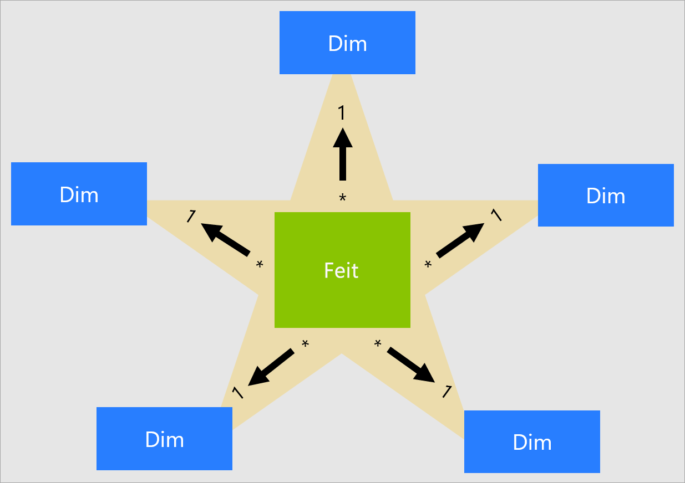
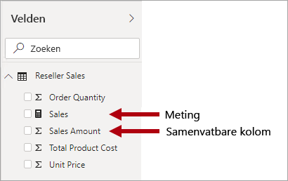
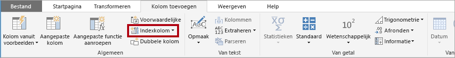
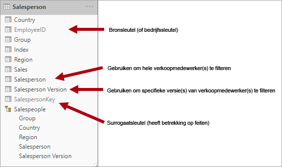
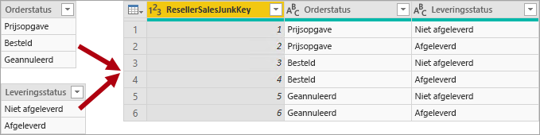
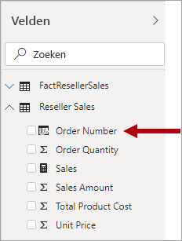

# Meer informatie over stervormige schema's en het belang daarvan voor Power BI

Dit artikel is bedoeld voor ontwikkelaars van Power BI Desktop-gegevensmodellen. Hierin wordt het ontwerp van een stervormig schema beschreven en wordt uitgelegd wat het belang daarvan is voor de ontwikkeling van Power BI-gegevensmodellen die voor prestaties en bruikbaarheid zijn geoptimaliseerd.

Dit artikel is niet bedoeld om een volledige uitleg te geven over het ontwerpen van stervormige schema's. Voor meer informatie kunt u rechtstreeks gepubliceerde inhoud bekijken, zoals **The Data Warehouse Toolkit: The Definitive Guide to Dimensional Modeling** (3e editie, 2013) door Ralph Kimball et al.

## Overzicht stervormige schema's

Een **stervormig schema** is een volwaardige modelleringsmethode die op grote schaal wordt gebruikt door relationele datawarehouses. Hiervoor moeten modelleerders hun modeltabellen ofwel als _dimensie_ of als _feit_ classificeren.

Met **Dimensietabellen** worden bedrijfsentiteiten beschreven, oftewel de _dingen_ die u modelleert. Entiteiten zijn bijvoorbeeld producten, personen, locaties en concepten zoals tijd. De meest consistente tabel in een stervormig schema is een datumdimensietabel. Een dimensietabel bevat een of meer sleutelkolommen die als unieke id fungeren, en beschrijvende kolommen.

In **Feitentabellen** worden waarnemingen of gebeurtenissen opgeslagen. Dit kunnen verkooporders, inventarissen, wisselkoersen, temperaturen, enzovoort zijn. Een feitentabel bevat sleutelkolommen voor dimensies die betrekking hebben op dimensietabellen, en kolommen met numerieke meetwaarden. De sleutelkolommen voor dimensies bepalen de _dimensionaliteit_ van een feitentabel; de sleutelwaarden voor dimensies bepalen de _granulariteit_ van een feitentabel. Stel bijvoorbeeld dat u een feitentabel hebt ontworpen om verkoopdoelen op te slaan. Deze tabel bevat de twee dimensiesleutelkolommen **Datum** en **Productsleutel**. Het moge duidelijk zijn dat de tabel uit twee dimensies bestaat. De granulariteit kan echter niet worden bepaald zonder rekening te houden met de dimensiesleutelwaarden. In dit voorbeeld beschouwen we de waarden die in de kolom **Datum** zijn opgeslagen als de eerste dag van elke maand. In dit geval ligt de granulariteit op het niveau van maand-product.

Over het algemeen bevatten dimensietabellen een relatief klein aantal rijen. Feitentabellen kunnen daarentegen een groot aantal rijen bevatten en zelfs na verloop van tijd toenemen.

## Relevantie van stervormig schema ten opzichte van Power BI-modellen

Het ontwerp van stervormige schema's en vele gerelateerde concepten waarover in dit artikel wordt gesproken, zijn uiterst relevant voor de ontwikkeling van Power BI-modellen die voor prestaties en bruikbaarheid zijn geoptimaliseerd.

Houd er rekening mee dat door elke visual in een Power BI-rapport een query wordt gegenereerd die wordt verzonden naar het Power BI-model (dat in de Power BI-service een gegevensset wordt genoemd). Deze query's worden gebruikt om modelgegevens te filteren, te groepen en samen te vatten. Een goed ontworpen model is dus een model dat tabellen biedt om te filteren en te groeperen en tabellen om gegevens samen te vatten. Dit ontwerp sluit goed aan op de principes voor stervormige schema's:

- Dimensietabellen bieden ondersteuning voor _filtering_ en _groepering_
- Feitentabellen bieden ondersteuning voor _samenvatting_

Er is geen tabeleigenschap die ontwikkelaars van modellen instellen om het tabeltype te configureren als een dimensie- of feitentabel. Dit wordt in feite bepaald door de modelrelaties. Via een modelrelatie wordt een doorgiftepad voor filters tussen twee tabellen tot stand gebracht; het is de eigenschap **Kardinaliteit** van de relatie waardoor het tabeltype wordt bepaald. Een algemene relatiekardinaliteit is _één-op-veel_, of het omgekeerde _veel-op-één_. De 'één' in deze term verwijst altijd naar een tabel van het type Dimensie; 'veel' verwijst altijd naar een feitentabel. Raadpleeg [Modelrelaties in Power BI Desktop](../desktop-relationships-understand.md) voor meer informatie over relaties.

Een modelontwerp met een goede structuur moet tabellen bevatten die ofwel dimensietabellen of feitentabellen zijn. Gebruik geen combinatie van de twee typen voor één tabel. U wordt ook aangeraden ernaar te streven het juiste aantal tabellen te leveren waarvoor de juiste relaties zijn ingesteld. Ook is het belangrijk dat gegevens altijd met een consistente nauwkeurigheid in feitentabellen worden geladen.

Als laatste is het van belang dat u begrijpt dat het ontwerpen van het optimale model deels wetenschap en deels pure kunst is. Soms is het mogelijk om de teugels wat te laten vieren als dit het meest logisch lijkt.

Er kunnen vele aanvullende concepten zijn die betrekking hebben op het ontwerp van een stervormig schema die op een Power BI-model kunnen worden toegepast. Dit zijn de volgende concepten:

- [Metingen](#measures)
- [Surrogaatsleutels](#surrogate-keys)
- [Sneeuwvlokdimensies](#snowflake-dimensions)
- [Rollenspeldimensies](#role-playing-dimensions)
- [Langzaam veranderende dimensies](#slowly-changing-dimensions)
- [Restdimensies](#junk-dimensions)
- [Losstaande dimensies](#degenerate-dimensions)
- [Feitentabellen zonder feiten](#factless-fact-tables)

## Metingen

In een stervormig schemaontwerp is een **meting** een kolom in een feitentabel waarin de samen te vatten waarden worden opgeslagen.

In een Power BI-model wordt een **meting** op een andere, maar wel vergelijkbare manier gedefinieerd. Het is een formule die wordt geschreven in [Data Analysis Expressions (DAX)](https://docs.microsoft.com/dax/data-analysis-expressions-dax-reference) waarmee u een samenvatting kunt maken. Voor expressies voor metingen worden vaak DAX-aggregatiefuncties gebruikt zoals SUM, MIN, MAX, AVERAGE, enzovoort om een scalair waarderesultaat te produceren tijdens de query (de waarden worden nooit opgeslagen in het model). Expressies voor metingen kunnen eenvoudige aggregaties met een kolom zijn tot uitgekiende formules waarmee context- en/of relatiedoorgifte worden overschreven. Lees het artikel [DAX basics in Power BI Desktop](https://docs.microsoft.com/power-bi/desktop-quickstart-learn-dax-basics) (Basisbeginselen van DAX in Power BI Desktop) voor meer informatie.

Belangrijk: Power BI-modellen bieden ondersteuning voor een tweede methode om een samenvatting te maken. Elke kolom kan met behulp van een visual in een rapport of een Q&A worden samengevat, met name numerieke kolommen. Deze kolommen worden _impliciete metingen_ genoemd. Ze zijn handig voor u als modelontwerper, omdat u in veel gevallen niet zelf metingen hoeft te maken. De kolom **Verkoophoeveelheid** van de reseller Adventure Works kan bijvoorbeeld op verschillende manieren worden samengevat (som, aantal, gemiddelde, mediaanwaarde, min, max, enzovoort), zonder een meting te hoeven maken voor elk mogelijke aggregatietype.

Er zijn voor u echter drie aantrekkelijke redenen om metingen te maken, zelfs voor eenvoudige samenvattingen op kolomniveau:

- Wanneer u weet dat uw rapportauteurs query's op het model gaan uitvoeren met behulp van [Multidimensional Expressions (MDX)](https://docs.microsoft.com/sql/analysis-services/multidimensional-models/mdx/mdx-query-the-basic-query?view=sql-server-2017), moet het model _expliciete metingen_ bevatten. Expliciete metingen worden gedefinieerd met behulp van DAX. Deze ontwerpmethode is vooral handig wanneer een query op een Power BI-gegevensset wordt uitgevoerd met behulp van MDX, omdat met MDX geen kolomwaarden kunnen worden samengevat. MDX wordt vooral gebruikt bij het uitvoeren van [Analyseren in Excel](https://docs.microsoft.com/power-bi/service-analyze-in-excel), omdat u met draaitabellen MDX-query’s krijgt).
- Wanneer u weet dat uw rapportauteurs gepagineerde Power BI-rapporten gaan maken met behulp van de MDX-queryontwerpfunctie, moet het model expliciete metingen bevatten. Alleen de MDX-queryontwerpfunctie ondersteunt [serveraggregaties](/sql/reporting-services/report-design/report-builder-functions-aggregate-function). Als de rapportauteurs dus metingen nodig hebben die zijn geëvalueerd door Power BI (in plaats van de engine voor gepagineerde rapporten), moeten ze de MDX-queryontwerpfunctie gebruiken.
- Als u ervoor wilt zorgen dat uw rapportauteurs kolommen alleen op specifieke manieren kunnen samenvatten. De kolom **Eenheidsprijs** (die een tarief per eenheid vertegenwoordigt) voor de verkoop bij de reseller kan bijvoorbeeld worden samengevat, maar alleen door specifieke aggregatiefuncties te gebruiken. De waarden in deze kolom mogen nooit worden opgeteld, maar kunnen wel worden gebruikt om een samenvatting te maken met behulp van andere aggregatiefuncties, zoals min, max en gemiddelde. In dit geval kan de modelleerder de kolom **Eenheidsprijs** verbergen en metingen maken voor alle toepasselijke aggregatiefuncties.

Deze ontwerpmethode werkt goed voor rapporten die in de Power BI-service en voor Q&A zijn geschreven. Tijdens live-verbindingen van Power BI Desktop kunnen rapportauteurs echter verborgen velden laten zien in het deelvenster **Velden**, waardoor deze ontwerpmethode zal worden omzeild.

## Surrogaatsleutels

Een **surrogaatsleutel** is een unieke id die u aan een tabel toevoegt om het maken van modellen met een stervormig schema te ondersteunen. Per definitie worden deze sleutels niet gedefinieerd of opgeslagen in de brongegevens. Over het algemeen worden surrogaatsleutels toegevoegd aan relationele dimensietabellen van datawarehouses om een unieke id te bieden voor elke rij in de dimensietabel.

Power BI-modelrelaties zijn gebaseerd op één unieke kolom in één tabel, waardoor filters voor één kolom in een andere tabel worden doorgegeven. Wanneer een dimensietabel in uw model niet één unieke kolom bevat, moet u een unieke id toevoegen die het 'één'-deel van een relatie wordt. In Power BI Desktop kunt u eenvoudig voldoen aan deze vereiste door een [Power BI-indexkolom](https://docs.microsoft.com/powerquery-m/table-addindexcolumn) te maken.

U moet deze query samenvoegen met de query aan de 'veel'-zijde, zodat u hieraan ook de indexkolom kunt toevoegen. Wanneer u deze query's in het model laadt, kunt u vervolgens een één-op-veel-relatie tussen de modeltabellen maken.

## Sneeuwvlokdimensies

Een **sneeuwvlokdimensie** is een set genormaliseerde tabellen voor één bedrijfsentiteit. Adventure Works classificeert producten bijvoorbeeld op categorie en subcategorie. Categorieën worden toegewezen aan subcategorieën en producten worden op hun beurt toegewezen aan subcategorieën. In de relationele datawarehouse van Adventure Works wordt de productdimensie genormaliseerd en opgeslagen in drie gerelateerde tabellen: **DimProductCategory**, **DimProductSubcategory** en **DimProduct**.

Met een beetje fantasie kunt u een beeld vormen van de genormaliseerde tabellen die vanuit de feitentabel naar buiten zijn gericht en een sneeuwvlokontwerp vormen.

In Power BI Desktop kunt u ervoor kiezen een ontwerp van een sneeuwvlokdimensie na te bootsen (mogelijk omdat dit ook voor uw brongegevens wordt gedaan) of de brontabellen in één modeltabel te integreren (denormaliseren). Over het algemeen wegen de voordelen van meerdere modeltabellen niet op tegen de voordelen van één modeltabel. Welke beslissing het meest optimaal is, kan afhangen van de gegevensvolumes en de bruikbaarheidsvereisten voor het model.

Wanneer u ervoor kiest om een sneeuwvlokdimensieontwerp na te bootsen:

- In Power BI kunnen meer tabellen worden geladen; dit is minder efficiënt met het oog op opslag en prestaties. Deze tabellen moeten kolommen bevatten om ondersteuning te bieden voor modelrelaties; dit kan leiden tot een groter model.
- Langere ketens voor het doorgeven van relatiefilters moeten worden gepasseerd, wat waarschijnlijk minder efficiënt zal zijn dan filters die worden toegepast op één tabel.
- In het deelvenster **Velden** staan meer modeltabellen voor rapportauteurs, wat kan leiden tot een minder intuïtieve ervaring, met name wanneer sneeuwvlokdimensietabellen slechts één of twee kolommen bevatten.
- Het is niet mogelijk om een hiërarchie te maken die de tabellen omspant.

Wanneer u ervoor kiest om alles in één modeltabel te integreren, kunt u ook een hiërarchie definiëren met daarin de hoogste en laagste vezel van de dimensie. Mogelijk kan de opslag van redundante gedenormaliseerde gegevens leiden tot een grotere modelopslag, met name voor zeer grote dimensietabellen.

## Langzaam veranderende dimensies

Een **langzaam veranderende dimensie** (SCD) is een dimensie waarmee de wijziging van dimensieleden over een bepaalde tijd kan worden beheerd. Het is van toepassing wanneer waarden van bedrijfsentiteiten over een bepaalde tijd en ad hoc worden gewijzigd. Een goed voorbeeld van een _langzaam_ veranderende dimensie is een klantendimensie, met name de kolommen met contactgegevens zoals e-mailadres en telefoonnummer. Andere dimensies worden daarentegen beschouwd als _snel_ veranderende dimensies wanneer een dimensiekenmerk vaak verandert, zoals de prijs op een aandelenmarkt. De algemene ontwerpmethode in deze gevallen is snel veranderende kenmerkwaarden op te slaan in een meting in een feitentabel.

De ontwerptheorie waarbij een stervormig schema wordt gemaakt, verwijst naar twee algemene SCD-typen: Type 1 en Type 2. Een dimensietabel kan van Type 1 of Type 2 zijn, of ondersteuning bieden voor beide typen tegelijk voor verschillende kolommen.

### SCD van type 1

Een **SCD** van **Type 1** weerspiegelt altijd de meest recente waarden. Wanneer wijzigingen in de brongegevens worden gedetecteerd, worden de gegevens in de dimensietabel overschreven. Dit is de algemene ontwerpmethode voor kolommen waarin aanvullende waarden worden opgeslagen, zoals het e-mailadres of telefoonnummer van een klant. Wanneer het e-mailadres of telefoonnummer van een klant wordt gewijzigd, wordt de rij waarin deze klant staat in de dimensietabel bijgewerkt met de nieuwe waarden. Het ziet er dan uit alsof de klant altijd al deze contactgegevens had.

Een niet-incrementele vernieuwing van een dimensietabel in een Power BI-model leidt tot een SCD van type 1. De tabelgegevens worden vernieuwd om er zeker van te zijn dat de meest recente waarden worden geladen.

### SCD van type 2

Een **SCD** van **Type 2** biedt ondersteuning voor versiebeheer van dimensieleden. Als er geen versies in het bronsysteem worden opgeslagen, worden wijzigingen doorgaans door het laadproces van de datawarehouse gedetecteerd en wordt de wijziging in een dimensietabel beheerd. In dit geval moet voor de dimensietabel een surrogaatsleutel worden gebruikt om een unieke verwijzing naar een _versie_ van het dimensielid op te geven. Het bevat ook kolommen waarmee de geldigheid van het datumbereik wordt gedefinieerd voor de versie (bijvoorbeeld **StartDate** en **EndDate**) en mogelijk een vlagkolom (bijvoorbeeld **IsCurrent**) om eenvoudig te filteren op huidige dimensieleden.

Adventure Works wijst bijvoorbeeld verkooppersoneel toe aan een verkoopregio. Wanneer een verkoopmedewerker naar een andere regio overstapt, moet een nieuwe versie van de verkoopmedewerker worden gemaakt om ervoor te zorgen dat historische feiten gekoppeld blijven aan de voormalige regio. Ter ondersteuning van accurate historische analyse van verkoop per verkoopmedewerker moeten in de dimensietabel versies van verkooppersoneel en de aan hun gekoppelde regio('s) worden opgeslagen. De tabel moet ook waarden voor de begin- en einddatum bevatten om de geldigheid van de tijd te definiëren. In de huidige versies kan een lege einddatum (of 31-12-9999) worden gedefinieerd, waarmee wordt aangegeven dat de rij de huidige versie is. In de tabel moet ook een surrogaatsleutel worden gedefinieerd omdat de bedrijfssleutel (in dit geval de werknemers-id) niet uniek zal zijn.

Het is belangrijk om te weten dat wanneer er geen versies worden opgeslagen in de brongegevens, u een tussenliggend systeem moet gebruiken (zoals een datawarehouse) om wijzigingen te detecteren en op te slaan. Tijdens het laadproces voor de tabel moeten bestaande gegevens worden bewaard en wijzigingen worden gedetecteerd. Wanneer een wijziging wordt gedetecteerd, moet tijdens het laadproces van de tabel de huidige versie komen te vervallen. Deze wijzigingen worden vastgelegd door de **EndDate**-waarde bij te werken en een nieuwe versie in te voegen waarbij de **StartDate**-waarde begint vanaf de vorige **EndDate**-waarde. Daarnaast moet voor gerelateerde feiten een op tijd gebaseerde zoekfunctie worden gebruikt om de dimensiesleutelwaarde op te halen die relevant is voor de datum van het feit. Met een Power BI-model waarbij u Power Query gebruikt, kan dit resultaat niet worden bereikt. Er kunnen echter wel gegevens vanuit een vooraf geladen SCD-dimensietabel van type 2 worden geladen.

Het Power BI-model moet ondersteuning bieden voor het uitvoeren van query's op historische gegevens voor een lid, ongeacht eventuele wijzigingen, en voor een versie van het lid, die een specifieke status van het lid over tijd vertegenwoordigt. In de context van Adventure Works stelt dit ontwerp u in staat om een query uit te voeren op de verkoopmedewerker, ongeacht de toegewezen verkoopregio, of voor een specifieke versie van de verkoopmedewerker.

Hiervoor moet de dimensietabel van het Power BI-model een kolom bevatten om de verkoopmedewerker te filteren en een andere kolom om een specifieke versie van de verkoopmedewerker te filteren. Het is belangrijk dat in de versiekolom een non-ambigue beschrijving staat, zoals 'Maarten Schalkwijk (15-12-2008 tot 26-06-2019)' of 'Maarten Schalkwijk (huidig)'. Ook is het belangrijk om rapportauteurs en -consumenten de basisprincipes te leren van SCD-type 2 en dat zij weten hoe ze geschikte rapportontwerpen kunnen maken door de juiste filters toe te passen.

Ook is het bij ontwerpen handig om een hiërarchie op te nemen zodat in visuals kan worden ingezoomd op versieniveau.

## Rollenspeldimensies

Een **rollenspeldimensie** is een dimensie waarin op een andere manier op gerelateerde feiten kan worden gefilterd. Bij Adventure Works bestaat de datumdimensietabel bijvoorbeeld uit drie relaties met de verkoopfeiten van de reseller. Dezelfde dimensietabel kan worden gebruikt om de feiten te filteren op orderdatum, verzenddatum of bezorgdatum.

In een datawarehouse bestaat de geaccepteerde ontwerpmethode uit het definiëren van één datumdimensietabel. Op het moment van de query wordt de 'rol' van de datumdimensie vastgesteld. Van deze rol gebruikt u de feitenkolom om de tabellen aan elkaar te koppelen. Wanneer u bijvoorbeeld de verkoop op orderdatum analyseert, heeft de tabelkoppeling betrekking op de kolom Orderdatum van de verkoop van de reseller.

In een Power BI-model kan dit ontwerp worden geïmiteerd door meerdere relaties tussen twee tabellen te maken. In het voorbeeld van Adventure Works zouden de tabellen voor de verkoop op datum en de verkoop op reseller drie relaties hebben. Hoewel dit ontwerp wel mogelijk is, is het belangrijk om te weten dat er maar één actieve relatie tussen twee Power BI-modeltabellen kan bestaan. Alle overige relaties worden op inactief ingesteld. Als u één actieve relatie hebt, betekent dit dat er een standaarddoorgifte van filters van verkoop op datum naar verkoop op reseller wordt gebruikt. In dit geval wordt de actieve relatie ingesteld op het meest algemene filter dat in rapporten wordt gebruikt; bij Adventure Works is dit de relatie op basis van de orderdatum.

De enige manier om een inactieve relatie te gebruiken, is door een DAX-expressie te definiëren waarvoor de [functie USERELATIONSHIP](https://docs.microsoft.com/dax/userelationship-function-dax) wordt gebruikt. In ons voorbeeld moet de modelontwikkelaar metingen instellen om de analyse van de verkoop van een reseller op verzenddatum en bezorgdatum in te schakelen. Dit kan een lastige klus zijn, met name wanneer in de resellertabel vele metingen worden gedefinieerd. Ook ontstaat hierdoor een chaos in het deelvenster **Velden**, met een overvloed aan metingen. Er zijn meer beperkingen:

- Wanneer rapportauteurs niet op het definiëren van metingen maar op het samenvatten van kolommen vertrouwen, kunnen ze geen samenvatting voor de inactieve relaties krijgen zonder een meting op rapportniveau te schrijven. Metingen op rapportniveau kunnen alleen worden gedefinieerd wanneer rapporten in Power BI Desktop worden geschreven.
- Met maar één actief relatiepad tussen de verkoop op datum en de verkoop op reseller, is het niet mogelijk om de verkoop op reseller gelijktijdig te filteren op verschillende datumtypen. U kunt bijvoorbeeld geen visual produceren waarin de verkoop op orderdatum wordt uitgezet op basis van verzonden verkoop.

Als u deze beperkingen wilt vermijden, is het een algemene Power BI-modelleringstechniek om voor elke rollenspelinstantie een dimensietabel te maken. Doorgaans maakt u de extra dimensietabellen als [berekende tabellen](https://docs.microsoft.com/dax/calculatetable-function-dax) met behulp van DAX. Met behulp van berekende tabellen kan het model de tabellen **Datum**, **Verzenddatum** en **Bezorgdatum** bevatten, elk met één actieve relatie met hun respectieve kolommen over de verkoop per reseller.

Voor deze ontwerpmethode hoeft u niet meerdere metingen voor verschillende datumrollen te definiëren en kunt u bovendien tegelijkertijd verschillende datumrollen filteren. Het enige kleine nadeel van deze ontwerpmethode is echter dat er duplicatie van de datumdimensietabel zal optreden, waardoor de modelopslaggrootte zal toenemen. Maar omdat er, in vergelijking met feitentabellen, doorgaans minder rijen in dimensietabellen worden opgeslagen, is dit nauwelijks een probleem.

Bekijk de volgende handige ontwerpprocedures wanneer u voor elke rol modeldimensietabellen gaat maken:

- Zorg ervoor dat de kolomnamen een goede eigen beschrijving bevatten. Het is mogelijk om in alle datumtabellen een kolom **Jaar** op te nemen (kolomnamen zijn uniek binnen hun tabel), maar de standaardinstellingen voor titels van visuals bevatten geen goede eigen beschrijving. U kunt de naam van kolommen in elke tabel van een dimensierol wijzigen, zodat de tabel **Verzenddatum** een jaarkolom heeft met de naam **Jaar van verzending**, enzovoort.
- Indien relevant moet u ervoor zorgen dat rapportauteurs via tabelbeschrijvingen feedback krijgen (via de knopinfo in het deelvenster **Velden**) over de manier waarop filterdoorgifte wordt geconfigureerd. Deze verduidelijking is belangrijk wanneer het model een tabel met een generieke naam bevat, zoals **Datum**, welke wordt gebruikt om een groot aantal feitentabellen te filteren. In het geval deze tabel bijvoorbeeld een actieve relatie heeft met de kolom Verkoop van de reseller op orderdatum, is het wellicht handig om een tabelbeschrijving op te geven, zoals 'Filtert de verkoop van de reseller op orderdatum'.

Raadpleeg [Richtlijnen voor actieve versus inactieve relaties](relationships-active-inactive.md) voor meer informatie.

## Restdimensies

Een **restdimensie** is handig wanneer er vele dimensies bestaan, die met name dimensies die uit maar een aantal kenmerken (of zelfs maar één kenmerk) bestaan en wanneer deze kenmerken een aantal waarden bevatten. Denk hierbij bijvoorbeeld aan kolommen over de orderstatus of kolommen met demografische klantgegevens (geslacht, leeftijdsgroep, enzovoort).

De ontwerpdoelstelling van een restdimensie is het grote aantal 'kleine' dimensies samen te voegen in één dimensie om zowel de opslaggrootte van het model te verkleinen als de chaos op het deelvenster **Velden** te verminderen door minder modeltabellen weer te geven.

Een restdimensietabel is doorgaans het Cartesisch product van alle leden van een dimensiekenmerk, met de kolom met een surrogaatsleutel. De surrogaatsleutel biedt een unieke verwijzing naar elke rij in de tabel. U kunt de dimensie in een datawarehouse bouwen, of u bouwt deze met behulp van Power Query om een query te maken waarmee een [volledige outer join van query's](https://docs.microsoft.com/powerquery-m/table-join) wordt uitgevoerd en waarmee vervolgens een surrogaatsleutel (indexkolom) wordt toegevoegd.

U laadt deze query in het model als een dimensietabel. Daarnaast moet u deze query samenvoegen met de feitenquery, zodat de indexkolom in het model wordt geladen om een 'één-op-veel'-modelrelatie te helpen maken.

## Losstaande dimensies

Een **losstaande dimensie** verwijst naar een kenmerk van de feitentabel dat vereist is om te filteren. Bij Adventure Works is het aantal verkooporders van de reseller een goed voorbeeld. In dit geval is het niet handig om een onafhankelijke tabel te maken die alleen uit deze ene kolom bestaat, omdat de modelopslaggrootte hierdoor zou toenemen en zou leiden tot in chaos in het deelvenster **Velden**.

In het Power BI-model kan het nuttig zijn om de kolom met verkoopordernummers aan de feitentabel toe te voegen, zodat kan worden gefilterd of gegroepeerd op verkoopordernummer. Dit is een uitzondering op de eerder geïntroduceerde regel dat u geen tabeltypen mag combineren (over het algemeen moeten modeltabellen ofwel van het type Dimensie of van het type Feiten zijn).

Als de tabel voor de verkoop door Adventure Works-wederverkopers kolommen voor ordernummers _en_ orderregelnummers bevat en deze vereist zijn voor het filteren, is een tabel met losstaande dimensies een goed ontwerp. Raadpleeg [Richtlijnen voor een-op-een-relaties (losstaande dimensies)](relationships-one-to-one.md#degenerate-dimensions) voor meer informatie.

## Feitloze feitentabellen

Een **feitloze feitentabel** bevat geen enkele metingkolom. Deze tabel bevat uitsluitend dimensiesleutels.

In een feitloze feitentabel kunnen observaties worden opgeslagen die worden gedefinieerd door dimensiesleutels. Bijvoorbeeld op een specifieke datum en tijd heeft een specifieke klant zich bij uw website aangemeld. U kunt een meting definiëren om de rijen van de feitloze feitentabel te tellen, zodat u kunt analyseren wanneer en hoeveel klanten zich hebben aangemeld.

Een aantrekkelijker gebruik van een feitloze feitentabel is de opslag van relaties tussen dimensies; het is de ontwerpmethode voor Power BI-modellen die wij aanbevelen voor het definiëren van veel-op-veel-dimensierelaties. In een ontwerp met een [veel-op-veel-dimensierelatie](relationships-many-to-many.md#relate-many-to-many-dimensions) wordt de feitloze feitentabel een _brugtabel_ genoemd.

Houd er bijvoorbeeld rekening mee dat verkooppersoneel kan worden toegewezen aan een _of meer_  verkoopregio's. De brugtabel wordt ontworpen als een feitloze feitentabel die uit twee kolommen bestaat: de verkoopmedewerkersleutel en de regiosleutel. Dubbele waarden kunnen worden opgeslagen in beide kolommen.

Deze veel-op-veel-ontwerpmethode is goed beschreven en kan worden bereikt zonder een brugtabel. De brugtabelmethode wordt echter als best practice beschouwd wanneer u een relatie tussen twee dimensies tot stand brengt. Raadpleeg [Richtlijnen voor veel-op-veel-relaties (twee dimensietabellen relateren)](relationships-many-to-many.md#relate-many-to-many-dimensions) voor meer informatie.

## Volgende stappen

Raadpleeg de volgende artikelen voor meer informatie over stervormig schemaontwerp of het ontwerpen van Power BI-modellen:

- [Het Wikipedia-artikel Dimensional modeling (Dimensionale modellering)](https://go.microsoft.com/fwlink/p/?linkid=246459)
- [Relaties maken en beheren in Power BI Desktop](../desktop-create-and-manage-relationships.md)
- [Richtlijnen voor een-op-een-relaties](relationships-one-to-one.md)
- [Richtlijnen voor veel-op-veel-relaties](relationships-many-to-many.md)
- [Richtlijnen voor bidirectionele relaties](relationships-bidirectional-filtering.md)
- [Richtlijnen voor actieve versus inactieve relaties](relationships-active-inactive.md)
- Vragen? [Misschien dat de Power BI-community het antwoord weet](https://community.powerbi.com/)
- Suggesties? [Ideeën bijdragen om Power BI te verbeteren](https://ideas.powerbi.com/)
