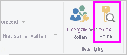

## De rollen in Power BI Desktop valideren
Nadat u uw rollen hebt gemaakt, kunt u de resultaten van de rollen testen binnen Power BI Desktop.

1. Selecteer in het tabblad **Modellering** de optie **Als rollen weergeven**. 

    

    In het venster **Als rollen weergeven** dat wordt weergegeven, kunt u de rollen zien die u hebt gemaakt.

    

3. Selecteer een rol die u hebt gemaakt en selecteer **OK** om die rol toe te passen. 

   De rapporten geven de gegevens weer die relevant zijn voor die rol.

4. U kunt ook **Andere gebruiker** selecteren en een bepaalde gebruiker opgeven. 

    

   U kunt het beste de User Principal Name (UPN) opgeven, omdat die door de Power BI-service Power BI Report Server wordt gebruikt.

   Binnen Power BI Desktop geeft **Andere gebruiker** alleen verschillende resultaten weer wanneer u dynamische beveiliging gebruikt op basis van uw DAX-expressies. 

5. Selecteer **OK**. 

   Het rapport wordt weergegeven op basis van wat de gebruiker kan zien.

