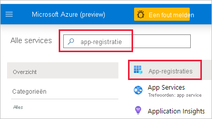
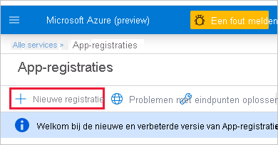
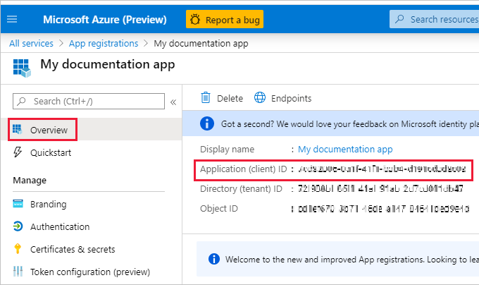

1. Meld u aan bij [Microsoft Azure](https://ms.portal.azure.com/#allservices).

2. Zoek naar **App-registraties** en klik op de koppeling **App-registraties**.

    

3. Klik op **Nieuwe registratie**.

    

4. Vul de vereiste gegevens in:
    * **Naam**: voer een naam in voor de toepassing
    * **Ondersteunde accounttypen**: selecteer ondersteunde accounttypen
    * (Optioneel) **Omleidings-URI**: voer een URI in, indien nodig

5. Klik op **Registreren**.

6. Na de app-registratie is de *toepassings-id* beschikbaar op het tabblad **Overzicht**. Kopieer de *toepassings-id* en sla deze op voor later gebruik.

    