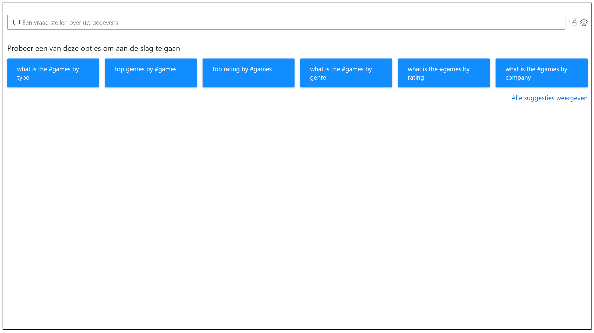

# Inleiding tot Power BI Q&A

Soms krijgt u het snelst een antwoord uit uw gegevens wanneer u in natuurlijke taal een zoekopdracht uitvoert op uw gegevens. Met de Q&A-functie in Power BI kunt u uw gegevens verkennen in uw eigen woorden met behulp van natuurlijke taal. Q&A is interactief, zelfs leuk. Vaak leidt een vraag naar andere vragen wanneer de visualisaties interessante paden onthullen om verder te onderzoeken. Het stellen van de vraag is slechts het begin. Reis door uw gegevens en verfijn of verbreed uw vraag om nieuwe informatie aan het licht te brengen, in te zoomen op details of uit te zoomen voor een breder perspectief. De ervaring is interactief en snel, dankzij opslag in het geheugen. 

Power BI Q&A is gratis en beschikbaar voor alle gebruikers. In Power BI Desktop kunnen rapportontwerpers Q&A gebruiken om gegevens te verkennen en visualisaties te maken. In de Power BI-service kan iedereen zijn gegevens verkennen met Q&A. Als u gemachtigd bent om een dashboard of rapport te bewerken, kunt u uw Q&A-resultaten ook vastmaken.

## Q&A gebruiken

Voordat u begint te typen, worden in een nieuw scherm suggesties weergegeven om u te helpen uw vraag te formuleren. Begin met een van de voorgestelde vragen of typ uw eigen vragen. Q&A ondersteunt een breed scala aan vragen, inclusief maar niet beperkt tot:

- **Natuurlijke vragen stellen** Welke verkoop heeft de hoogste omzet?
- **Relatieve datumfiltering gebruiken** Toon de verkoopcijfers van het afgelopen jaar
- **Alleen de top N als resultaat geven** Top 10-producten op verkoop
- **Een filter opgeven** Toon de verkoopcijfers in de VS
- **Complexe voorwaarden opgeven** Toon de verkoopcijfers waarbij productcategorie Categorie 1 of Categorie 2 is
- **Een specifieke visual retourneren** Toon verkoop per product als cirkeldiagram
- **Complexe aggregaties gebruiken** Toon gemiddelde omzet per product
- **Resultaten sorteren** Toon top 10 van landen op verkoopcijfers geordend op landnummer
- **Gegevens vergelijken** Toon datum op totale verkoopcijfers versus totale kosten
- **Trends weergeven** Toon verkoopcijfers gedurende een periode

### Automatisch aanvullen

Wanneer u uw vraag typt, geeft Power BI Q&A relevante en contextuele suggesties weer die u helpen om snel productief te zijn met natuurlijke taal. Terwijl u typt, krijgt u onmiddellijk feedback en resultaten. De ervaring is vergelijkbaar met het typen in een zoekmachine.

### Rode/blauwe onderstrepingen

Q&A geeft woorden weer met onderstrepingen zodat u kunt zien welke woorden het systeem heeft begrepen of niet heeft herkend. Een ononderbroken blauwe onderstreping geeft aan dat het systeem het woord heeft gekoppeld aan een veld of waarde in het gegevensmodel. In het onderstaande voorbeeld ziet u dat Q&A het woord *EU Sales* heeft herkend.

Wanneer u een woord typt in Q&A, wordt er vaak een rode streep onder gezet. Een rode onderstreping kan een of twee mogelijke problemen aangeven. Het eerste type probleem wordt gecategoriseerd als *lage betrouwbaarheid*. Als u een vaag of dubbelzinnig woord typt, wordt het veld rood onderstreept. Een voorbeeld hiervan is het woord Verkoop. Meerdere velden kunnen het woord Verkoop bevatten. Het systeem gebruikt daarom een rode onderstreping om u te vragen het veld te kiezen dat u bedoelde. Een ander voorbeeld van lage betrouwbaarheid is als u het woord 'gebied' typt, maar de kolom die overeenkomt is 'Regio'. Power BI Q&A herkent woorden die hetzelfde betekenen, dankzij de integratie met Bing en Office. Q&A zet een rode onderstreping onder het woord, zodat u weet dat het geen rechtstreekse overeenkomst is.

Het tweede type probleem doet zich voor wanneer Q&A het woord helemaal niet herkent. U kunt dit probleem tegenkomen wanneer u een domeinspecifieke term gebruikt die nergens in de gegevens wordt gebruikt, of wanneer de gegevensvelden een onjuiste naam hebben. Een voorbeeld is het gebruik van het woord 'Kosten', hoewel het nergens in de gegevens bestaat. Het woord staat in de woordenlijst, maar Q&A markeert deze term met een rode onderstreping.

> [!NOTE]
> U kunt de blauwe/rode onderstrepingskleuren aanpassen in het Q&A-deelvenster **Visuele opmaak**. In het artikel [Q&A-hulpprogramma's](q-and-a-tooling-teach-q-and-a.md) wordt dieper ingegaan op *Q&A trainen*, waarmee u de termen definieert die Q&A niet heeft herkend.

### Visualisatieresultaten

Wanneer u uw vraag typt, probeert Q&A het antwoord direct te interpreteren en visualiseren. Als onderdeel van de meest recente updates probeert Q&A nu de vraag te interpreteren en de velden automatisch op de juiste as te zetten. Als u bijvoorbeeld 'Omzet per jaar' typt, detecteert Q&A dat de term jaar een datumveld is en geeft het plaatsen van dit veld op de X-as altijd prioriteit. Als u het visualisatietype wilt wijzigen, typt u 'als *grafiektype*' na de vraag. Q&A ondersteunt momenteel deze typen visualisaties:

- Lijndiagram
- Staafdiagram
- Matrix
- Tabel
- Kaart
- Onderwerp
- Cirkeldiagram
- Spreidings-/bellendiagram
 

## Q&A toevoegen aan een rapport

U kunt op twee verschillende manieren Q&A toevoegen aan een rapport in de Power BI Desktop of de Power BI-service:

- Voeg een Q&A-visual toe.
- Voeg een Q&A-knop toe.

Als u de Q&A-visual aan een rapport wilt toevoegen, selecteert u het nieuwe pictogram **Q&A** en selecteert u de nieuwe Q&A-visual in het deelvenster Visualisatie. U kunt ook ergens op het canvas van het rapport dubbelklikken om de Q&A-visual in te voegen.

Als u een knop wilt toevoegen, selecteert u op het lint **Start** de opties **Knoppen** > **Q&A**. U kunt de Q&A-knopafbeelding volledig aanpassen.

> [!NOTE]
> Wanneer u Q&A start met de knop, wordt nog steeds de oude Q&A gebruikt. Dit wordt gewijzigd in volgende versies van Power BI.

## Q&A gebruiken voor dashboards

Q&A is standaard beschikbaar bovenaan dashboards. Als u Q&A wilt gebruiken, typt u in het vak **Een vraag stellen over uw gegevens**.

## Volgende stappen

U kunt op verschillende manieren natuurlijke taal in uw rapporten integreren. Raadpleeg voor meer informatie de volgende artikelen:

* [Q&A-visual](../visuals/power-bi-visualization-q-and-a.md)
* [Best practices voor Q&A](q-and-a-best-practices.md)
