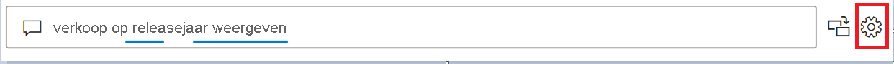
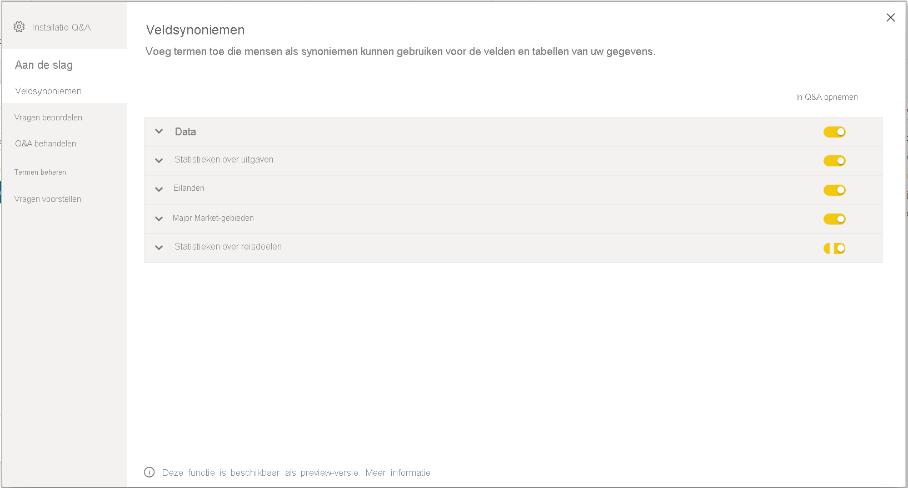
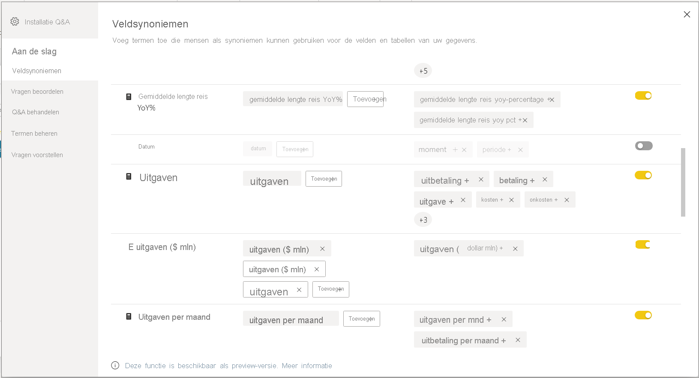

# Inleiding tot Q&A-hulpprogramma's om Power BI Q&A (preview) te trainen

Met Power BI Q&A *hulpprogramma's* kunt u de ervaring van uw gebruikers met natuurlijke taal verbeteren. Als ontwerper of beheerder communiceert u met de engine voor natuurlijke taal en maakt u verbeteringen op drie gebieden: 

- Bekijk de vragen die uw gebruikers hebben gesteld.
- Train Q&A om vragen te begrijpen.
- Beheer termen die u Q&A hebt geleerd.

Naast deze speciale hulpmiddelen biedt het tabblad **Modellen maken** in Power BI Desktop meer opties:  

- Synoniemen
- Rijlabels
- Verbergen voor Q&A
- Het linguïstische schema configureren (geavanceerd)

## Aan de slag met Q&A-hulpprogramma's

Q&A-hulpprogramma is alleen beschikbaar in Power BI Desktop en ondersteunt momenteel alleen de importmodus.

1. Open Power BI Desktop en gebruik Q&A om een visual te maken. 
2. Selecteer in de hoek van de visual het pictogram van het tandwiel. 

    

    De pagina Aan de slag wordt geopend.  

    

### Veldsynoniemen

Selecteer **Veldsynoniemen** om alle tabellen en kolommen van het model weer te geven. Met deze weergave kunt u alternatieve namen aan de kolommen toevoegen om gebruikers te helpen. U kunt ook kiezen of een kolom of tabel wel of niet moet worden verborgen in Q&A.

Klik op een van de tabellen om deze uit te breiden. U ziet dan een dialoogvenster dat vergelijkbaar is met het onderstaande.

In het dialoogvenster worden alle kolommen en tabellen weergegeven met hun termen/synoniemen die gebruikers kunnen gebruiken wanneer ze vragen stellen over de gegevensset. U ziet alle termen snel op één plek en kunt of termen voor meerdere kolommen toevoegen of verwijderen. 

- Termen toevoegen. Als u een veld hebt dat Verkoop heet, kunt u een term toevoegen als Omzet, zodat een gebruiker dit woord kan gebruiken in plaats van dat het nodig is om Verkoop te gebruiken. Klik op het teken Toevoegen om snel een nieuwe term toe te voegen

- Opnemen in Q&A. Met deze optie kunt u een kolom of tabel weglaten in Q&A, wat betekent dat het niet wordt weergegeven en dat er geen resultaat kan worden weergegeven met deze kolom. U kunt bijvoorbeeld besluiten om een kolom niet op te namen als u met datums te maken hebt. Als er veel datumvelden zijn of refererende sleutels, kunt u beslissen om alle datumvelden op een na te verbergen, zodat de juiste datumkolom wordt gekozen wanneer een gebruiker een vraag met betrekking tot datums stelt.

- Voorgestelde termen. Q&A raadt ook voorgestelde termen aan die zijn opgehaald uit onze suggestie-engine. Dit helpt u om snel termen/synoniemen toe te voegen. Als de suggesties niet worden toegevoegd, werken de suggesties nog wel, maar krijgt de gebruiker een oranje gestippelde lijn te zien die aangeeft dat Q&A een antwoord denkt te hebben, maar het niet zeker weet. Als het voorgestelde synoniem correct is, klikt u op het pictogram +, zodat de suggestie als synoniem kan worden gebruikt. Als de suggestie onjuist is, klikt u op de X. De term wordt dan verwijderd en niet gebruikt als term/synoniem en werkt niet in Q&A. De suggesties worden mogelijk gemaakt door het woordenboek van Office en zijn ook afkomstig van naamwijzigingen in een rapport

### Vragen beoordelen

Selecteer **Vragen beoordelen** om een lijst weer te geven met gegevenssets die in de Power BI-service worden gebruikt voor uw tenant. Op de pagina **Vragen beoordelen** worden ook de eigenaar van de gegevensset, de werkruimte en de laatst vernieuwde datum weergegeven. Hier kunt u een gegevensset selecteren en zien welke vragen gebruikers hebben gesteld. In de gegevens worden ook woorden weergegeven die niet zijn herkend. Alle gegevens die hier worden weergegeven, zijn van de afgelopen 28 dagen.

### Q&A trainen

Met de sectie **Q&A trainen** kunt u Q&A trainen om woorden te herkennen. Typ om te beginnen een vraag die een woord of woorden bevat die Q&A niet herkent. Q&A vraagt u om de definitie van die term. Voer een filter- of een veldnaam in die overeenkomt met waar het woord voor staat. Q&A interpreteert de oorspronkelijke vraag dan opnieuw. Als u tevreden bent met de resultaten, kunt u uw invoer opslaan. Zie [Q&A trainen](q-and-a-tooling-teach-q-and-a.md) voor meer informatie

### Termen beheren

Hier wordt alles wat u hebt opgeslagen in de sectie Q&A trainen weergegeven, zodat u de door u gedefinieerde termen kunt bekijken of verwijderen. Op dit moment kunt u een bestaande definitie niet bewerken. Als u een term opnieuw wilt definiëren, moet u deze verwijderen en opnieuw maken.

### Vragen voorstellen

> [!NOTE]
> De voorgestelde vragen worden weergegeven voor alle exemplaren van de Q&A-visual. Het is niet mogelijk om een afzonderlijke set suggesties te maken voor elke Q&A-visual.
> 
> 

Ook wanneer u geen configuratie uitvoert, worden met de Q&A-visual een aantal vragen voorgesteld om aan de slag te gaan. Deze vragen worden automatisch gegenereerd op basis van uw gegevensmodel. In **Vragen voorstellen** kunt u de automatisch gegenereerde vragen overschrijven met uw eigen vragen.

Om te beginnen typt u de vraag in het tekstvak dat u wilt toevoegen. In de preview-sectie ziet u hoe het resultaat eruit komt te zien in de Q&A-visual. 

:::image type="content" source="media/q-and-a-tooling-intro/power-bi-qna-suggest-questions.png" alt-text="Q&A-vragen voorstellen":::
 
Selecteer de knop **Toevoegen** om deze vraag toe te voegen aan **Uw voorgestelde vragen**. Elke extra vraag wordt toegevoegd aan het einde van deze lijst. De vragen worden in de Q&A-visual in dezelfde volgorde weergegeven als in deze lijst. 

:::image type="content" source="media/q-and-a-tooling-intro/power-bi-qna-save-suggest-questions.png" alt-text="Voorgestelde vragen opslaan":::
 
Zorg ervoor dat u **Opslaan** selecteert om uw lijst met voorgestelde vragen weer te geven in de Q&A-visual. 

## Andere Q&A-instellingen

### Een rijlabel instellen

Met een rijlabel kunt u definiëren welke kolom (of welk *veld*) het beste één rij in een tabel identificeert. In het geval van een tabel met de naam 'Klant' is het rijlabel bijvoorbeeld meestal 'Weergavenaam'. Door deze extra metagegevens op te geven, kan Q&A een handiger visual plotten wanneer gebruikers 'Toon verkoopcijfers per klant' typen. In plaats van 'klant' te beschouwen als een tabel, kan Q&A in plaats daarvan 'Weergavenaam' gebruiken en een staafdiagram weergeven met de verkoopcijfers van elke klant. U kunt alleen de rijlabel Modelweergave instellen. 

1. Selecteer Modelweergave in Power BI Desktop.

2. Selecteer een tabel om het deelvenster **Eigenschappen** weer te geven.

3. Selecteer een veld in het vak **Rijlabel**.

## Het linguïstische schema configureren (geavanceerd)

In Power BI kunt u de engine van de natuurlijke taal in Q&A volledig trainen en verbeteren, inclusief het wijzigen van de score en weging van de onderliggende resultaten van de natuurlijke taal. Raadpleeg [Edit Q&A linguistic schema and add phrasings](q-and-a-tooling-advanced.md) (Het taalkundige Q&A-schema bewerken en formuleringen toevoegen) voor meer informatie.

## Volgende stappen

Er zijn een aantal best practices om de engine voor natuurlijke taal te verbeteren. Zie de [aanbevolen procedures voor Q&A](q-and-a-best-practices.md) voor meer informatie.
