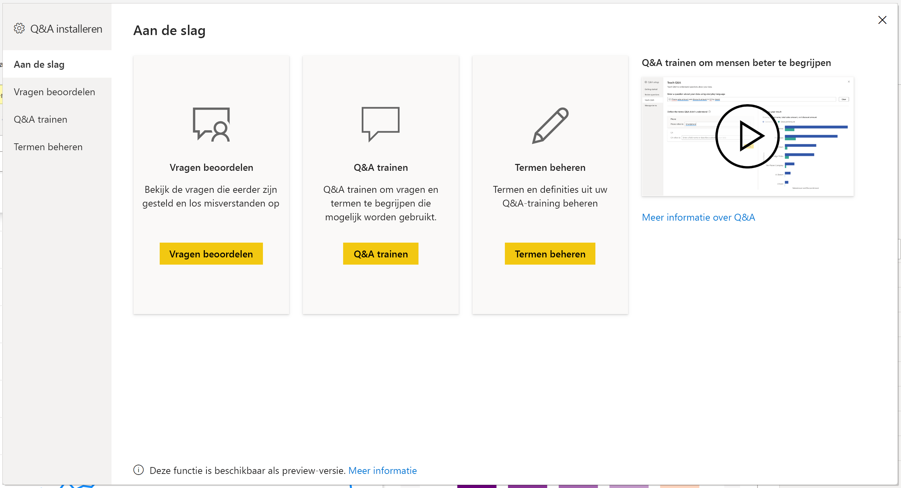
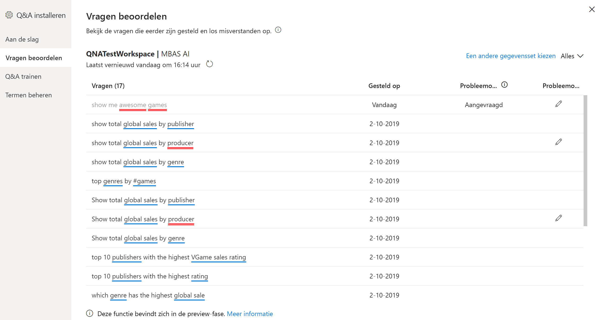
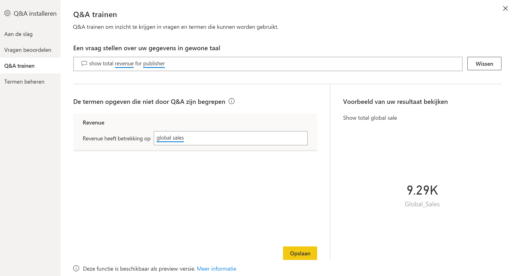
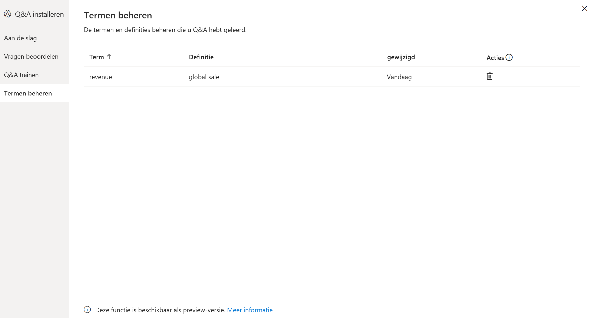
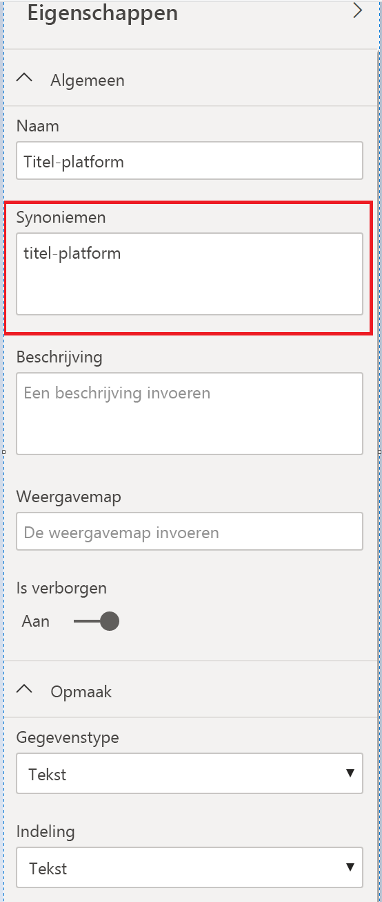

# Inleiding tot Q&A-hulpprogramma's om Power BI Q&A (preview) te trainen

Met Power BI Q&A *hulpprogramma's* kunt u de ervaring van uw gebruikers met natuurlijke taal verbeteren. Als ontwerper of beheerder communiceert u met de engine voor natuurlijke taal en maakt u verbeteringen op drie gebieden: 

- Bekijk de vragen die uw gebruikers hebben gesteld.
- Train Q&A om vragen te begrijpen.
- Beheer termen die u Q&A hebt geleerd.

Naast deze speciale hulpmiddelen biedt het tabblad **Modellen maken** in Power BI Desktop meer opties:  

- Synoniemen
- Rijlabels
- Verbergen voor Q&A
- Het linguïstische schema configureren (geavanceerd)

## Aan de slag met Q&A-hulpprogramma's

Q&A-hulpprogramma is alleen beschikbaar in Power BI Desktop en ondersteunt momenteel alleen de importmodus.

1. Open Power BI Desktop en gebruik Q&A om een visual te maken. 
2. Selecteer in de hoek van de visual het pictogram van het tandwiel. 

    

    De pagina Aan de slag wordt geopend.  

    

### Vragen beoordelen

Selecteer **Vragen beoordelen** om een lijst weer te geven met gegevenssets die in de Power BI-service worden gebruikt voor uw tenant. Op de pagina **Vragen beoordelen** worden ook de eigenaar van de gegevensset, de werkruimte en de laatst vernieuwde datum weergegeven. Hier kunt u een gegevensset selecteren en zien welke vragen gebruikers hebben gesteld. In de gegevens worden ook woorden weergegeven die niet zijn herkend. Alle gegevens die hier worden weergegeven, zijn van de afgelopen 28 dagen.

### Q&A trainen

Met de sectie **Q&A trainen** kunt u Q&A trainen om woorden te herkennen. Typ om te beginnen een vraag die een woord of woorden bevat die Q&A niet herkent. Q&A vraagt u om de definitie van die term. Voer een filter- of een veldnaam in die overeenkomt met waar het woord voor staat. Q&A interpreteert de oorspronkelijke vraag dan opnieuw. Als u tevreden bent met de resultaten, kunt u uw invoer opslaan. Zie [Q&A trainen](q-and-a-tooling-teach-q-and-a.md) voor meer informatie

### Termen beheren

Hier wordt alles wat u hebt opgeslagen in de sectie Q&A trainen weergegeven, zodat u de door u gedefinieerde termen kunt bekijken of verwijderen. Op dit moment kunt u een bestaande definitie niet bewerken. Als u een term opnieuw wilt definiëren, moet u deze verwijderen en opnieuw maken.

## Andere Q&A-instellingen

### Bulksynoniemen

Op het Power BI Desktop-tabblad **Modellen maken** vindt u meer opties voor het verbeteren van de Q&A-ervaring. 

1. Selecteer Modelweergave in Power BI Desktop.

2. Selecteer een veld of tabel om het deelvenster **Eigenschappen** weer te geven.  Dit deelvenster wordt weergegeven aan de rechterkant van het canvas en geeft verschillende Q&A-acties weer. Een optie is **Synoniemen**. In het vak **Synoniemen** kunt u snel alternatieven definiëren voor de tabel die, of het veld dat, u selecteert. U kunt ook synoniemen definiëren in de sectie **Q&A trainen** van het dialoogvenster Hulpprogramma, maar het gaat vaak sneller om hier synoniemen te definiëren voor veel velden in een tabel.

    

3. Als u meerdere synoniemen voor één veld wilt definiëren, gebruikt u komma's om het volgende synoniem aan te geven.

### Verbergen voor Q&A

U kunt ook velden en tabellen verbergen, zodat deze niet worden weergegeven in Q&A-resultaten. 

1. Selecteer Modelweergave in Power BI Desktop.

2. Selecteer een veld of tabel om het deelvenster **Eigenschappen** weer te geven en stel **Is verborgen** in op **Aan**.

    Q&A respecteert die instellingen en zorgt ervoor dat het veld niet wordt herkend door Q&A. Het is bijvoorbeeld mogelijk dat u id-velden en refererende sleutels wilt verbergen om onnodige dubbele velden met dezelfde naam te voorkomen. Ook als u het veld verbergt, kunt u het nog steeds in Power BI Desktop gebruiken in visuals buiten Q&A.

### Een rijlabel instellen

Met een rijlabel kunt u definiëren welke kolom (of welk *veld*) het beste één rij in een tabel identificeert. In het geval van een tabel met de naam 'Klant' is het rijlabel bijvoorbeeld meestal 'Weergavenaam'. Door deze extra metagegevens op te geven, kan Q&A een handiger visual plotten wanneer gebruikers 'Toon verkoopcijfers per klant' typen. In plaats van 'klant' te beschouwen als een tabel, kan Q&A in plaats daarvan 'Weergavenaam' gebruiken en een staafdiagram weergeven met de verkoopcijfers van elke klant. U kunt alleen de rijlabel Modelweergave instellen. 

1. Selecteer Modelweergave in Power BI Desktop.

2. Selecteer een tabel om het deelvenster **Eigenschappen** weer te geven.

3. Selecteer een veld in het vak **Rijlabel**.

## Het linguïstische schema configureren (geavanceerd)

In Power BI kunt u de engine van de natuurlijke taal in Q&A volledig trainen en verbeteren, inclusief het wijzigen van de score en weging van de onderliggende resultaten van de natuurlijke taal. Raadpleeg [Edit Q&A linguistic schema and add phrasings](q-and-a-tooling-advanced.md) (Het taalkundige Q&A-schema bewerken en formuleringen toevoegen) voor meer informatie.

## Volgende stappen

Er zijn een aantal best practices om de engine voor natuurlijke taal te verbeteren. Raadpleeg voor meer informatie hete volgende artikel:

* [Best practices voor Q&A](q-and-a-best-practices.md)
