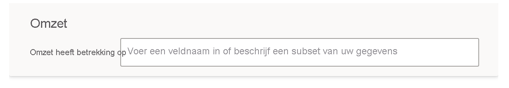
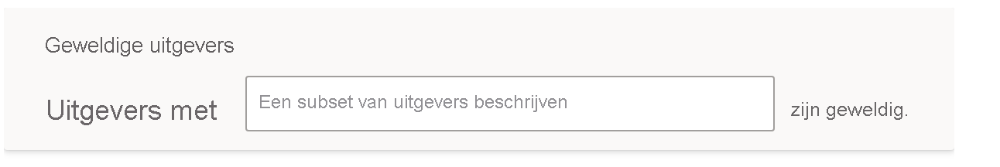

# Q&A trainen om inzicht te krijgen in vragen en termen in Power BI Q&A

In de sectie **Q&A trainen** van Q&A-setup, traint u Q&A om inzicht te krijgen in vragen over natuurlijke taal en termen die niet worden herkend. Typ om te beginnen een vraag die een woord of woorden bevat die Q&A niet herkent. Vervolgens wordt u door Q&A gevraagd om die term te definiëren. Voer een filter- of een veldnaam in die overeenkomt met de inhoud van dat woord. Q&A interpreteert de oorspronkelijke vraag dan opnieuw. Als u tevreden bent met de resultaten, kunt u deze opslaan.

> [!NOTE]
> De functie Q&A trainen ondersteunt alleen de importmodus. Er wordt nog geen ondersteuning geboden voor het maken van een verbinding met een on-premises of Azure Analysis Services-gegevensbron. Deze beperking wordt verwijderd in latere releases van Power BI.

## Beginnen met Q&A trainen

1. Selecteer in Power BI Desktop op het lint **Model maken** **Q&A-installatie** > **Q&A trainen**.

    

2. Typ een zin met een term die door Q&A niet wordt herkend en selecteer **Verzenden**.

3. Selecteer het rood onderstreepte woord. 

    Q&A biedt suggesties en vraagt u de juiste definitie van de term op te geven. 
    
3. Geef een beschrijving op onder **Definieer de termen die Q&A niet begrijpt**.

    

4. Selecteer **Opslaan** om een voorbeeld van de bijgewerkte visual te bekijken.

5. Voer de volgende vraag in of selecteer **X** om af te sluiten.

Uw rapportgebruikers zien deze wijziging pas nadat u het rapport terug naar de service hebt gepubliceerd.

## Zelfstandige naamwoorden en bijvoeglijke naamwoorden definiëren

U kunt Q&A twee soorten termen leren:

- Zelfstandige naamwoorden
- Bijvoeglijke naamwoorden

### Een zelfstandig naamwoord definiëren

Wanneer u met gegevens werkt, kunnen er vaak namen van velden zijn waarnaar kan worden verwezen met alternatieve namen. Een voorbeeld hiervan is Verkoop. Talloze woorden of zinsdelen kunnen verwijzen naar verkoop, bijvoorbeeld opbrengst. Als een kolom de naam Verkoop heeft en rapportgebruikers typen Opbrengst, dan kiest Q&A mogelijk niet de juiste kolom om de vraag correct te beantwoorden. In dat geval wilt u Q&A vertellen dat Verkoop en Opbrengst naar hetzelfde verwijzen.

Q&A detecteert automatisch wanneer een niet herkend woord een zelfstandig naamwoord is met behulp van kennis van Microsoft Office. Als Q&A een zelfstandig naamwoord detecteert, wordt u dit op de volgende manier gevraagd:

- <your term> **verwijst naar** 

U vult het vakje in met de term uit uw gegevens.

Als u iets anders dan een veld uit het gegevensmodel opgeeft, krijgt u mogelijk ongewenste resultaten.

### Definieer een filtervoorwaarde voor een bijvoeglijk naamwoord

Soms wilt u termen definiëren die als voorwaarde dienen voor de onderliggende gegevens. Een voorbeeld hiervan kan zijn Geweldige uitgevers. Geweldig kan een voorwaarde zijn waarmee alleen uitgevers worden geselecteerd die een X aantal producten hebben gepubliceerd. Q&A probeert bijvoeglijke naamwoorden te detecteren, met een andere prompt:

- <field name> **die** hebben  

U vult het vakje in met de voorwaarde.

Enkele voorwaarden die u kunt definiëren zijn:

- 'Land' dat 'VS' is
- 'Land' dat niet 'VS' is
- Aantal producten > 100
- Aantal producten groter dan 100
- Aantal producten = 100
- Aantal producten is 100
- Aantal producten < 100
- Aantal producten kleiner dan 100

In deze voorbeelden kan 'Aantal producten' ofwel een kolomnaam of een meting zijn. 

U kunt ook een aggregatie in de Q&A-expressie zelf opgeven. Als populaire producten bijvoorbeeld producten zijn waarvan ten minste 100 eenheden zijn verkocht, kunt u producten met een som van de verkochte eenheden > 100 definiëren als populair.  

:::image type="content" source="media/q-and-a-tooling-teach-q-and-a/power-bi-qna-popular-products.png" alt-text="Populaire producten definiëren":::

U kunt slechts één voorwaarde definiëren in het hulpprogramma. Als u meer complexe voorwaarden wilt definiëren, gebruikt u DAX om een ​​berekende kolom of meting te maken en gebruikt u vervolgens het hulpprogrammagedeelte om een ​​enkele voorwaarde voor die kolom of meting te maken.

## Termen beheren

Nadat u definities hebt opgegeven, kunt u teruggaan om alle oplossingen te zien die u hebt gemaakt en deze te bewerken of te verwijderen. 

1. Ga in **Q&A-installatie** naar de sectie **Termen beheren**.

2. Verwijder de voorwaarden die u niet meer nodig hebt. Momenteel kunt u geen voorwaarden bewerken. Als u een term opnieuw wilt definiëren, verwijdert u de term en definieert u deze.

    

## Volgende stappen

Er zijn een aantal best practices om de engine voor natuurlijke taal te verbeteren. Zie de [aanbevolen procedures voor Q&A](q-and-a-best-practices.md) voor meer informatie.
