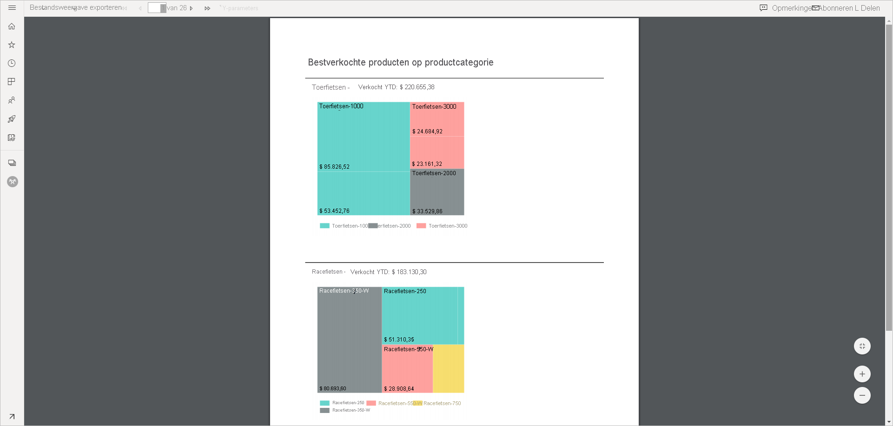
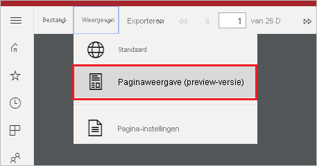
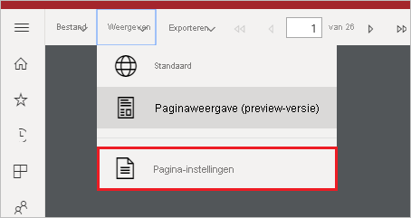
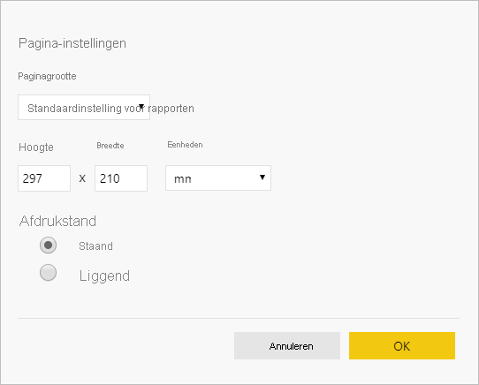

# Rapportweergaven instellen voor gepagineerde rapporten in de Power BI-service

Wanneer u een gepagineerd rapport weergeeft in de Power BI-service, is de standaardweergave gebaseerd op HTML en interactief. Een andere rapportweergave, voor vaste pagina-indelingen, zoals PDF, is de nieuwe optie Paginaweergave.

**Standaard interactieve weergave**

**Paginaweergave**

In de Paginaweergave ziet het weergegeven rapport er anders uit dan in de standaardweergave. Sommige eigenschappen en concepten in gepagineerde rapporten gelden alleen voor vaste pagina's. De weergave is vergelijkbaar met een afgedrukt of geëxporteerd rapport. U kunt nog steeds een aantal elementen wijzigen, zoals parameterwaarden, maar er zijn geen andere interactieve functies beschikbaar, zoals het sorteren van kolommen en schakelfuncties.

Paginaweergave ondersteunt alle functies die ook door de PDF-viewer van de browser worden ondersteund, zoals Inzoomen, Uitzoomen en Aan pagina aanpassen.

## Naar Paginaweergave overschakelen

Wanneer u een gepagineerd rapport opent, wordt dit standaard in de interactieve weergave weergegeven. Als het rapport parameters heeft, selecteert u de parameters en bekijkt u het rapport.

1. Selecteer op de werkbalk **Weergave** > **Paginaweergave**.

    

2. U kunt de instellingen van de paginaweergave wijzigen door de **pagina-instellingen te selecteren** in het menu **Weergave** op de werkbalk. 

    
    
    Het dialoogvenster **Pagina-instellingen** bevat opties om **Paginaformaat** en **Afdrukstand** in te stellen voor de paginaweergave. Nadat u de pagina-instellingen hebt toegepast, worden dezelfde opties toegepast als u de pagina later afdrukt.
   
    

3. Als u wilt terugkeren naar de interactieve weergave, selecteert u **Standaard** in de vervolgkeuzelijst **Weergave**.

## Browserondersteuning

Paginaweergave wordt ondersteund door de browsers Google Chrome en Microsoft Edge. Zorg ervoor dat het weergeven van PDF's in de browser is ingeschakeld. Dit is de standaardinstelling voor deze browsers.

Paginaweergave wordt niet ondersteund door Internet Explorer en Safari, dus die optie is uitgeschakeld. Paginaweergave wordt ook niet ondersteund door browsers op mobiele apparaten of in de systeemeigen mobiele Power BI-apps.  

## Volgende stappen

- [Een gepagineerd rapport weergeven in de Power BI-service](../consumer/paginated-reports-view-power-bi-service.md)
- [Wat zijn gepagineerde rapporten in Power BI Premium?](paginated-reports-report-builder-power-bi.md)
