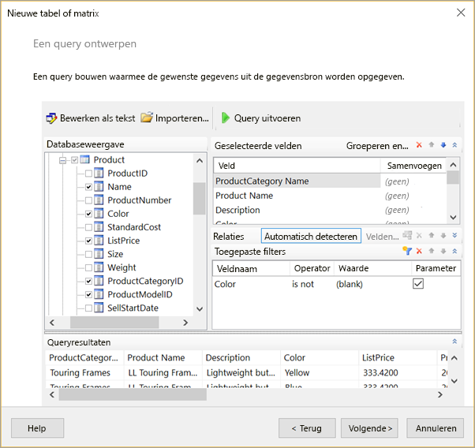
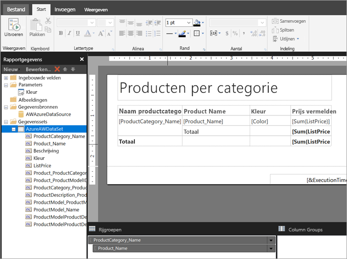

# Een ingesloten gegevensset maken voor een gepagineerd rapport in de Power BI-service

In dit artikel leert u hoe u op basis van een ingesloten gegevensbron een ingesloten gegevensset maakt voor een gepagineerd rapport in de Power BI-service. Ingesloten gegevenssets bevinden zich in één gepagineerd rapport, voor gebruik in dat rapport. Momenteel zijn voor rapporten die in de Power BI-service zijn gepubliceerd, ingesloten gegevenssets en ingesloten gegevensbronnen nodig. De ingesloten gegevensbron en gegevensset worden tijdens het maken van uw rapport in Power BI Report Builder gemaakt. 

Voordat u de gegevensset kunt maken, moet u een gegevensbron maken. Zie [Embedded data sources for paginated reports](paginated-reports-embedded-data-source.md) (Ingesloten gegevensbronnen voor gepagineerde rapporten) in de Power BI-service om te lezen hoe u dat doet.
  
## Een ingesloten gegevensset maken
  
1. In het deelvenster Rapportgegevens in Power BI Report Builder selecteert u **Nieuw** > **Gegevensset**.

1. Op het tabblad **Query** van het dialoogvenster **Eigenschappen van gegevensset** geeft u de gegevensset een naam. De ingesloten gegevensbron is al aanwezig in het vak **Gegevensbron**. U kunt ook **Nieuw** selecteren om een andere ingesloten gegevensbron te maken.
 
     

3. Selecteer onder **Querytype** het type opdracht of query dat u voor de gegevensset wilt gebruiken. 
    - Met **Tekst** wordt een query uitgevoerd om gegevens ui de database op te halen. Het is de standaardoptie en wordt voor de meeste query's gebruikt. Typ een query of importeer een bestaande query door **Importeren** te selecteren. Selecteer **Queryontwerpfunctie** om de query grafisch te bouwen. Als u de queryontwerpfunctie gebruikt om een query te maken, verschijnt de tekst van de query in dit vak. Selecteer de knop **Expressie** (**fx**) om een expressie te gebruiken voor het dynamisch genereren van de query. 
    - Met **Tabel** wordt alle velden in een tabel geselecteerd. Voer de naam in van de tabel die u als gegevensset wilt gebruiken.
    - Met **Opgeslagen procedure** wordt een opgeslagen procedure op naam uitgevoerd.

4. In de queryontwerpfunctie kunt u met de tabellen en velden in de gegevensset werken, of een query importeren of als tekst bewerken. U kunt hier ook filters en parameters toevoegen. 

    

5. In de queryontwerpfunctie selecteert u **Query uitvoeren** om de query te testen. Selecteer vervolgens **OK**.

1. Terug in het dialoogvenster Eigenschappen van de gegevensset typt u in het vak **Time-out (seconden)** het aantal seconden voordat er een time-out voor de query optreedt. De standaardwaarde is 30 seconden. De waarde voor **Time-out** moet leeg zijn of groter dan nul. Als de waarde leeg is, vindt er geen time-out van de query plaats.

7.  Op de andere tabbladen kunt u andere eigenschappen voor de gegevensset instellen:
    - Maak berekende velden op het tabblad **Velden**.
    - Stel geavanceerde opties in op het tabblad **Opties**.
    - Voeg **Filters** en **Parameters** toe of werk ze bij op de bijbehorende tabbladen.

8. Selecteer **OK**
 
   Het rapport wordt geopend in de ontwerpweergave van een rapport. De gegevensbron, de gegevensset en de gegevensveldverzameling worden weergegeven in het deelvenster Rapportgegevens en u kunt doorgaan met het ontwerpen van uw gepagineerde rapport.  

     
 
## Volgende stappen 

- [Wat zijn gepagineerde rapporten in Power BI Premium?](paginated-reports-report-builder-power-bi.md)  
- [Zelfstudie: Een gepagineerd rapport maken en uploaden naar de Power BI-service](paginated-reports-quickstart-aw.md)
- [Publish a paginated report to the Power BI service](paginated-reports-save-to-power-bi-service.md) (Een gepagineerd rapport publiceren in de Power BI-service)

