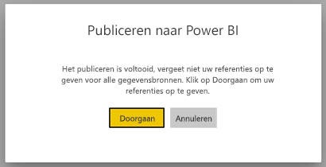
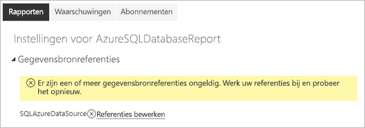
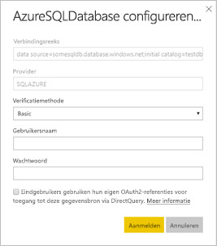

# Ondersteunde gegevensbronnen voor gepagineerde rapporten in Power BI

In dit artikel vindt u informatie over ondersteunde gegevensbronnen voor gepagineerde rapporten in de Power BI-service en hoe u verbinding maakt met Azure SQL Database-gegevensbronnen. Sommige gegevensbronnen worden inherent ondersteund. U kunt verbinding maken met andere gegevensbronnen via gegevensgateways.

## Inherent ondersteunde gegevensbronnen

Gepagineerde rapporten bieden inherente ondersteuning voor de volgende lijst met gegevensbronnen:

| Gegevensbron | Verificatie | Opmerkingen |
| --- | --- | --- |
| Azure SQL Database  Azure SQL Data Warehouse | Basic, eenmalige aanmelding (SSO), OAuth2 | U kunt een Enterprise Gateway gebruiken met Azure SQL DB. U mag in deze scenario's echter voor verificatie geen Eenmalige aanmelding of oAuth2 gebruiken.   |
| Beheerd exemplaar voor Azure SQL | Basic | via een openbaar eindpunt of een privé-eindpunt (privé-eindpunt moet worden gerouteerd via een Enterprise Gateway)  |
| Azure Analysis Services | SSO, OAuth2 | De AAS-firewall moet worden uitgeschakeld of geconfigureerd om alle IP-bereiken toe te staan.|
| Power BI-gegevensset | SSO | Premium Power BI-gegevenssets en andere Power BI-gegevenssets. Leesmachtiging vereist |
| Premium-Power BI-gegevensset (XMLA) | SSO |   |
| Gegevens invoeren | N.v.t. | Gegevens zijn in het rapport ingesloten. |

Met uitzondering van Azure SQL Database zijn alle gegevensbronnen gereed voor gebruik nadat u het rapport hebt geüpload naar de Power BI-service. Voor de gegevensbronnen wordt standaard gebruikgemaakt van eenmalige aanmelding (SSO), indien van toepassing. Voor Azure Analysis Services kunt u het verificatietype wijzigen in OAuth2. Wanneer u het verificatietype voor een bepaalde gegevensbron echter wijzigt in OAuth2, kunt u dit niet meer ongedaan maken om opnieuw SSO te gebruiken.  Deze wijziging is bovendien van toepassing op alle rapporten die gebruikmaken van die gegevensbron in alle werkruimten voor een bepaalde tenant.  Beveiliging op rijniveau in gepagineerde rapporten werkt niet, tenzij gebruikers SSO kiezen als verificatietype.

Voor Azure SQL Database-gegevensbronnen moet u meer informatie opgeven, zoals beschreven in de sectie [Azure SQL Database-verificatie.](#azure-sql-database-authentication)

## Andere gegevensbronnen

Naast de inherent ondersteunde gegevensbronnen zijn de volgende gegevensbronnen toegankelijk via een [Power BI-gegevensgateway](../connect-data/service-gateway-onprem.md):

- SQL Server
- SQL Server Analysis Services
- Oracle
- Teradata

Voor gepagineerde rapporten zijn Azure SQL Database en Azure Analysis Services momenteel niet toegankelijk via een Power BI-gegevensgateway.

## Azure SQL Database-verificatie

For Azure SQL Database-gegevensbronnen moet u een verificatietype instellen voordat u het rapport uitvoert. Dit geldt alleen als u een gegevensbron voor het eerst in een werkruimte gebruikt. Die eerste keer ziet u het volgende bericht:

Als u geen referenties opgeeft, treedt er een fout op wanneer u het rapport uitvoert. Selecteer **Doorgaan** om naar de pagina **Gegevensbronreferenties** te gaan voor het rapport dat u zojuist hebt geüpload:

Selecteer de koppeling **Referenties bewerken** voor een bepaalde gegevensbron om het dialoogvenster **Configureren** weer te geven:

Voor Azure SQL Database-gegevensbronnen zijn dit de ondersteunde verificatietypen:

- Basic (gebruikersnaam en wachtwoord)
- SSO (eenmalige aanmelding)
- OAuth2 (opgeslagen AAD-token)

SSO en OAuth2 werken alleen correct als [ondersteuning voor AAD-verificatie is ingeschakeld](https://docs.microsoft.com/azure/sql-database/sql-database-aad-authentication-configure) voor de Azure SQL Database-server waarmee de gegevensbron verbinding maakt. Voor de verificatiemethode OAuth2 wordt in AAD een token gegenereerd. Dit token wordt opgeslagen voor toekomstige gegevensbrontoegang. Als u in plaats daarvan de [SSO-verificatiemethode](https://docs.microsoft.com/power-bi/service-azure-sql-database-with-direct-connect#single-sign-on) wilt gebruiken, selecteert u de optie SSO direct eronder, **Eindgebruikers gebruiken hun eigen OAuth2-referenties bij de toegang tot deze gegevensbron via DirectQuery**.
  
## Volgende stappen

[Een gepagineerd rapport weergeven in de Power BI-service](../consumer/paginated-reports-view-power-bi-service.md)

Hebt u nog vragen? [Misschien dat de Power BI-community het antwoord weet](https://community.powerbi.com/)

