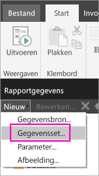
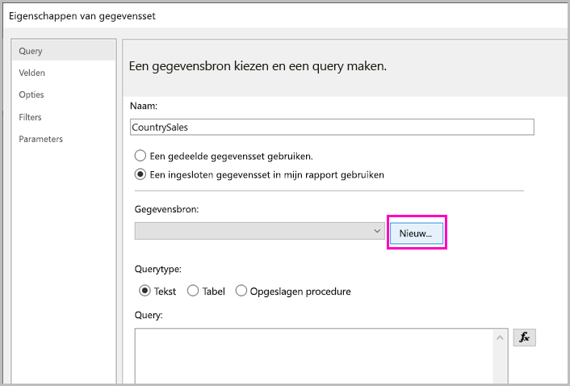
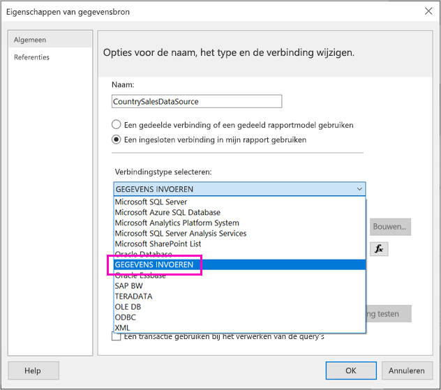
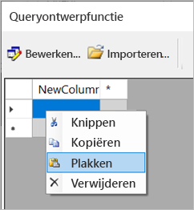
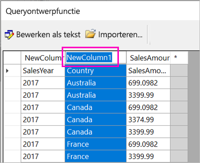
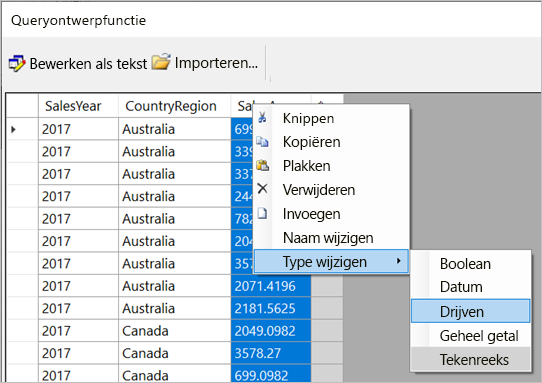
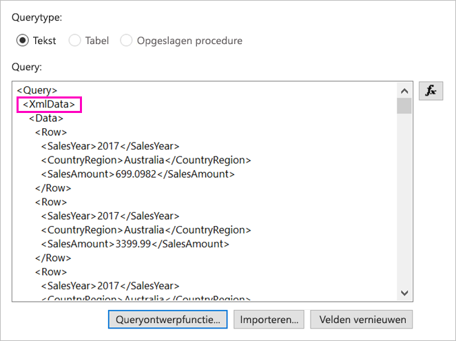
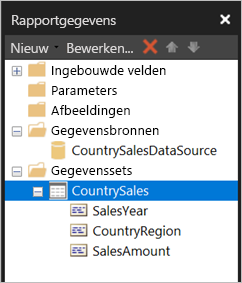
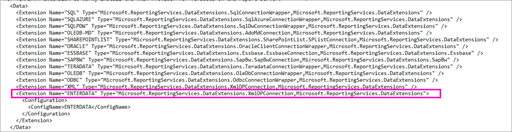

# <a name="enter-data-directly-in-a-paginated-report-in-report-builder---power-bi"></a>Voer gegevens rechtstreeks in een gepagineerd rapport in Report Builder in - Power BI

In dit artikel leest u meer over een functie in de nieuwe versie van Microsoft Power BI Report Builder waarmee u gegevens rechtstreeks als ingesloten gegevensset in een RDL-rapport kunt invoeren.  Deze functie is vergelijkbaar met Power BI Desktop. U kunt de gegevens rechtstreeks in een gegevensset in uw rapport typen of deze uit een ander programma plakken zoals Microsoft Excel. Nadat u een gegevensset hebt gemaakt door gegevens te hebben ingevoerd, kunt u deze set gebruiken zoals elke andere ingesloten gegevensset die u hebt gemaakt. Bovendien kunt u meer dan een tabel toevoegen en één tabel als filter voor de andere tabellen gebruiken. Deze functie is met name nuttig voor kleine, statische gegevenssets die u wellicht in uw rapport wilt gebruiken, zoals rapportparameters.
 
## <a name="prerequisites"></a>Vereisten

- Als u gegevens direct in een gepagineerd rapport wilt invoeren, [downloadt en installeert u Power BI Report Builder](https://aka.ms/pbireportbuilder). 
- Als u uw gepagineerde rapport wilt opslaan naar de Power BI-service, hebt u een [Power BI Pro-account](../fundamentals/service-self-service-signup-for-power-bi.md) en schrijftoegang tot een werkruimte in een [Power BI Premium-capaciteit](../admin/service-premium-what-is.md) nodig.
- Als u uw gepagineerde rapport naar een rapportserver wilt opslaan, hebt u machtigingen nodig om [het bestand RsReportServer.config te bewerken](#upload-the-paginated-report-to-a-report-server).

## <a name="create-a-data-source-and-dataset"></a>Een gegevensbron en gegevensset maken

Nadat u Report Builder hebt gedownload en geïnstalleerd, volgt u dezelfde werkstroom die u gebruikt om een ingesloten gegevensbron en gegevensset aan uw rapport toe te voegen. In de volgende procedure ziet u onder **Gegevensbronnen** een nieuwe optie: **Gegevens invoeren**.  U hoeft deze gegevensbron maar eenmalig in een rapport in te stellen. Daarna kunt u meerdere tabellen maken met ingevoerde gegevens als afzonderlijke gegevenssets die elk die ene gegevensbron gebruiken.

1. In het deelvenster **Rapportgegevens** selecteert u **Nieuw** > **Gegevensset**.

    

1. In het dialoogvenster **Eigenschappen van gegevensset** selecteert u **Een in mijn rapport ingesloten gegevensset gebruiken**.

1. Naast **Gegevensbron** selecteert u **Nieuw**.

    

1. In het dialoogvenster **Eigenschappen van gegevensbron** selecteert u **Een in mijn rapport ingesloten verbinding gebruiken**.
2. In het vak **Verbindingstype selecteren** selecteert u **GEGEVENS INVOEREN** > **OK**.

    

1. In het dialoogvenster **Eigenschappen van gegevensset** selecteert u **Query Designer**.
2. In het deelvenster **Query Designer** klikt u met de rechtermuisknop en plakt u uw gegevens in de tabel.

    

1. Als u de kolomnamen wilt instellen, dubbelklikt u op elke **NewColumn** en typt u de kolomnaam.

    

1. Als de eerste rij kolomkoppen van de oorspronkelijke gegevens bevat, klikt u met de rechtermuisknop en verwijdert u deze kolomkoppen.
    
9. Het gegevenstype voor elke kolom is standaard ingesteld op Tekenreeks. Als u het gegevenstype wilt wijzigen, klikt u met de rechtermuisknop op de kolomkop > **Type wijzigen** en stelt u deze in op een ander gegevenstype, zoals Datum of Float.

    

1. Wanneer klaar bent met het maken van de tabel selecteert u **OK**.  

    De query die wordt gegenereerd, is dezelfde als de query die u ziet voor een XML-gegevensbron. Op de achtergrond gebruiken we XML als gegevensprovider.  We hebben deze aangepast zodat we ook dit scenario mogelijk kunnen maken.

    

12. In het dialoogvenster **Eigenschappen van gegevensset** selecteert u **OK**.

13. U ziet uw gegevensbron en gegevensset in het deelvenster **Rapportgegevens**.

    

U kunt uw gegevensset gebruiken als basis voor gegevensvisualisaties in uw rapport. U kunt ook nog een gegevensset toevoegen en hiervoor dezelfde gegevensbron gebruiken.

## <a name="design-the-report"></a>Het rapport ontwerpen

Nu u een gegevensbron en gegevensset hebt, kunt u het rapport maken. Met de volgende procedure maakt u een eenvoudig rapport op basis van de gegevens in de vorige sectie.

1. Selecteer in het menu **Invoegen** de optie **Tabel** > **Wizard Tabel**.

    :::image type="content" source="media/paginated-reports-enter-data/paginated-table-wizard.png" alt-text="Schermopname van het selecteren van de optie Wizard Tabel.":::

1. Selecteer de gegevensset die u zojuist hebt gemaakt > **Volgende**.

    :::image type="content" source="media/paginated-reports-enter-data/paginated-choose-dataset.png" alt-text="Schermopname van het dialoogvenster Een gegevensset kiezen.":::

2.  Sleep op de pagina Velden rangschikken de velden die u wilt groeperen van het vak **Beschikbare velden** naar het vak **Rijgroepen**. In dit voorbeeld:

    - CountryRegion
    - SalesYear

3.  Sleep de velden die u wilt aggregeren van het vak **Beschikbare velden** naar het vak **Waarden**. In dit voorbeeld:

    - SalesAmount

    Standaard telt Report Builder de velden in het vak **Waarden** op, maar u kunt een andere aggregatie kiezen.

    :::image type="content" source="media/paginated-reports-enter-data/paginated-select-aggregation.png" alt-text="Schermopname van verschillende aggregaties waaruit kan worden gekozen.":::
 
1. Selecteer **Volgende**.
4.  Behoud alle standaardinstellingen op de pagina **Kies de indeling**, maar schakel het selectievakje **Groepen uitvouwen/samenvouwen** uit. In het algemeen is uit- en samenvouwen van groepen een goede optie, maar we willen nu alle gegevens zien.

5.  Selecteer **Volgende** > **Voltooien**. De tabel wordt weergegeven op het ontwerpvlak.

    :::image type="content" source="media/paginated-reports-enter-data/paginated-design-view-matrix.png" alt-text="Schermopname van het rapport in Ontwerpweergave.":::

### <a name="run-the-report"></a>Het rapport uitvoeren

Als u de werkelijke waarden en een preview van het rapport wilt zien, voert u het uit.

1. Selecteer **Uitvoeren** op het lint **Start**.

    :::image type="content" source="media/paginated-reports-enter-data/paginated-run-report.png" alt-text="Schermopname van het selecteren van Uitvoeren op het lint Start.":::

    Nu ziet u de waarden. De matrix bevat meer rijen dan in de ontwerpweergave!  U kunt de pagina opmaken of de standaardinstellingen gebruiken voordat u deze opslaat op uw lokale computer of publiceert op de service.

1. Selecteer **Afdrukweergave** om te kijken hoe uw rapport eruit zal zien wanneer het wordt afgedrukt.

    :::image type="content" source="media/paginated-reports-enter-data/paginated-select-print.png" alt-text="Schermopname van het selecteren van Afdrukweergave.":::

    Nu ziet u het zoals het eruit ziet op een afgedrukte pagina.

    :::image type="content" source="media/paginated-reports-enter-data/paginated-print-layout.png" alt-text="Schermopname van rapport in afdrukweergave.":::

## <a name="upload-the-paginated-report-to-the-power-bi-service"></a>Een gepagineerd rapport uploaden naar de Power BI-service

Nu gepagineerde rapporten worden ondersteund in de Power BI-service, kunt u uw gepagineerde rapport uploaden naar een Premium-capaciteit. Zie [Een gepagineerd rapport uploaden](paginated-reports-save-to-power-bi-service.md) voor meer informatie.

## <a name="upload-the-paginated-report-to-a-report-server"></a>Upload het gepagineerde rapport naar een rapportserver

U kunt ook uw gepagineerde rapport uploaden naar een Power BI Report Server of SQL Server Reporting Services 2016- of 2017-rapportserver. Voordat u dit doet, moet u het volgende item toevoegen aan uw RsReportServer.config-bestand als extra gegevensextensie. Maak een back-up van uw RsReportServer.config-bestand voordat u de wijziging doorvoert, in het geval er problemen optreden.

```xml
<Extension Name="ENTERDATA" Type="Microsoft.ReportingServices.DataExtensions.XmlDPConnection,Microsoft.ReportingServices.DataExtensions">
    <Configuration>
        <ConfigName>ENTERDATA</ConfigName>
    </Configuration>
</Extension>
```

Nadat de bewerking ziet de lijst met gegevensproviders in het configuratiebestand er als volgt uit:



Dat is alles. U kunt nu rapporten die van deze nieuwe functionaliteit gebruikmaken naar uw rapportserver publiceren.

## <a name="next-steps"></a>Volgende stappen

- [Wat zijn gepagineerde rapporten in Power BI Premium?](paginated-reports-report-builder-power-bi.md)
- [Wat is Power BI Report Server?](../report-server/get-started.md)
