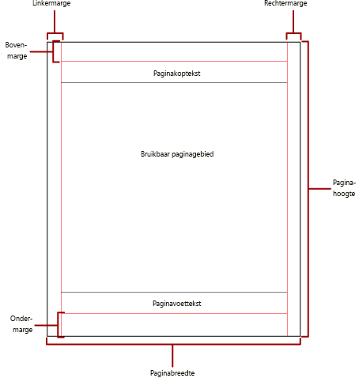
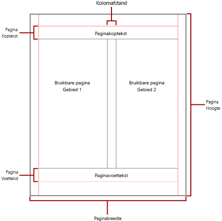

# Paginering in gepagineerde Power BI-rapporten

 *Paginering* verwijst naar het aantal pagina's in een rapport en hoe rapportitems op deze pagina's worden gerangschikt. De paginering in gepagineerde Power BI-rapporten is afhankelijk van de renderer die u gebruikt om het rapport weer te geven en te leveren. Wanneer u een rapport op de rapportserver uitvoert, gebruikt het rapport de HTML-renderer. HTML volgt een specifieke set pagineringsregels. Als u bijvoorbeeld hetzelfde rapport naar PDF exporteert, gebruikt u de PDF-renderer, die een andere set regels gebruikt. Het rapport wordt daarom anders gepagineerd. U moet de regels begrijpen die worden gebruikt voor het beheren van de paginering in gepagineerde Power BI-rapporten. Vervolgens kunt u een goed leesbaar rapport ontwerpen dat u optimaliseert voor de renderer waarmee u uw rapport wilt leveren.  
  
 In dit onderwerp wordt beschreven wat de impact van de fysieke paginagrootte en de rapportindeling is op de manier waarop renderers voor harde pagina-einden het rapport weergeven. U kunt eigenschappen instellen om de fysieke paginagrootte en marges te wijzigen en het rapport in kolommen te verdelen. Gebruik hiervoor het deelvenster **Rapporteigenschappen**, het deelvenster **Eigenschappen** of het dialoogvenster **Pagina-instelling**. Open het deelvenster **Rapporteigenschappen** door te klikken op het blauwe gebied buiten de hoofdtekst van het rapport. Open het dialoogvenster **Pagina-instelling** door te klikken op **Uitvoeren** op het tabblad Start en vervolgens op **Pagina-instelling** op het tabblad Uitvoeren.  
  
> [!NOTE]  
>  Als u een rapport hebt gemaakt dat één pagina breed moet zijn, maar dat wordt weergegeven op meerdere pagina's, controleert u of de breedte van de hoofdtekst van het rapport, inclusief marges, niet groter is dan de breedte van de fysieke pagina. Als u wilt voorkomen dat er lege pagina's aan uw rapport worden toegevoegd, kunt u de containergrootte verkleinen door de containerhoek naar links te slepen.  

## De hoofdtekst van het rapport  
 De hoofdtekst van het rapport is een rechthoekige container die wordt weergegeven als witruimte op het ontwerpoppervlak. De container kan worden vergroot of verkleind om te worden aangepast aan de rapportitems. De hoofdtekst van het rapport weerspiegelt niet de fysieke paginagrootte. De hoofdtekst van het rapport kan immers groter worden dan de grenzen van de fysieke paginagrootte om meerdere rapportpagina's te omvatten. Via sommige renderers, zoals Microsoft Excel, Word, HTML en MHTML, worden rapporten weergegeven die worden vergroot of verkleind op basis van de inhoud van de pagina. Rapporten die in deze indelingen worden weergegeven, zijn geoptimaliseerd voor weergave op het scherm, zoals in een webbrowser. Met deze renderers worden zo nodig verticale pagina-einden toegevoegd.  
  
 U kunt de hoofdtekst van het rapport opmaken met een randkleur, randstijl en randbreedte. U kunt ook een achtergrondkleur en achtergrondafbeelding toevoegen.  
  
## De fysieke pagina  
 De fysieke paginagrootte is het papierformaat. Het papierformaat dat u opgeeft voor het rapport, bepaalt hoe het rapport wordt weergegeven. In rapporten die in indelingen met harde pagina-einden worden weergegeven, worden pagina-einden horizontaal en verticaal ingevoegd op basis van de fysieke paginagrootte. Deze pagina-einden bieden een optimale leeservaring wanneer deze worden afgedrukt of weergegeven in een indeling met een hard pagina-einde. In rapporten die in indelingen met zachte pagina-einden worden weergegeven, worden pagina-einden horizontaal ingevoegd op basis van de fysieke grootte. De pagina-einden bieden ook in dit geval een optimale leeservaring wanneer ze worden weergegeven in een webbrowser.  
  
 Standaard is de paginagrootte 8,5 x 11 inch, maar u kunt deze grootte wijzigen in het deelvenster **Rapporteigenschappen** of dialoogvenster **Pagina-instelling**, of door de eigenschappen PageHeight en PageWidth te wijzigen in het deelvenster **Eigenschappen**. De paginagrootte kan niet worden vergroot of verkleind om ruimte aan de inhoud van de hoofdtekst van het rapport te bieden. Als u wilt dat het rapport op één pagina wordt weergegeven, moet alle inhoud in de hoofdtekst van het rapport op de fysieke pagina passen. Als de inhoud niet past en u de indeling met harde pagina-einden gebruikt, zijn voor het rapport extra pagina's nodig. Als de hoofdtekst van het rapport zich voorbij de rechterrand van de fysieke pagina bevindt, wordt er horizontaal een pagina-einde ingevoegd. Als de hoofdtekst van het rapport zich voorbij de onderrand van de fysieke pagina bevindt, wordt er verticaal een pagina-einde ingevoegd.  
  
 Als u de fysieke paginagrootte wilt overschrijven die in het rapport is gedefinieerd, kunt u de fysieke paginagrootte opgeven met behulp van de instellingen van Apparaatgegevens voor de specifieke renderer die u gebruikt om het rapport te exporteren. Zie [Device Information Settings for Rendering Extensions](https://docs.microsoft.com/sql/reporting-services/device-information-settings-for-rendering-extensions-reporting-services?view=sql-server-2017) (Instellingen van Apparaatgegevens voor renderers) in the SQL Server Reporting Services-documentatie voor een volledige lijst.  
  
### Marges

 Marges worden getekend vanaf de rand van de afmetingen van de fysieke pagina naar de opgegeven marge-instelling. Als een rapportitem wordt uitgebreid naar het margegebied, wordt het bijgesneden zodat het overlappende gebied niet wordt weergegeven. Als u margegrootten opgeeft waarmee de horizontale of verticale breedte van de pagina gelijk is aan nul, worden de marge-instellingen standaard ingesteld op nul. Marges worden opgegeven in het deelvenster **Rapporteigenschappen** of dialoogvenster **Pagina-instelling**, of door de eigenschappen TopMargin, BottomMargin, LeftMargin en RightMargin in het deelvenster **Eigenschappen**  te wijzigen. Als u de margegrootte wilt overschrijven die in het rapport is gedefinieerd, kunt u de margegrootte opgeven met behulp van de instellingen van Apparaatgegevens voor de specifieke renderer die u gebruikt om het rapport te exporteren.  
  
 Het gebied van de fysieke pagina dat overblijft nadat ruimte is toegewezen aan marges, de kolomafstand en de kop- en voettekst, wordt het *bruikbare paginagebied* genoemd. Marges worden alleen toegepast wanneer u rapporten weergeeft en afdrukt in renderer-indelingen voor harde pagina-einden. In de volgende afbeelding worden de marge en het bruikbare paginagebied van een fysieke pagina aangegeven.  
  
 
  
### Kolommen in nieuwsbriefstijl  

 Uw rapport kan worden onderverdeeld in kolommen, zoals kolommen in een krant. Kolommen worden behandeld als *logische* pagina's die op dezelfde *fysieke* pagina worden weergegeven. Ze zijn gerangschikt van links naar rechts en van boven naar beneden, en worden gescheiden door witruimte tussen elke kolom. Als het rapport is onderverdeeld in meerdere kolommen, wordt elke fysieke pagina verticaal onderverdeeld in kolommen en wordt elke kolom als een logische pagina beschouwd. Stel dat u op een fysieke pagina twee kolommen hebt. De inhoud van het rapport vult de eerste kolom en vervolgens de tweede kolom. Als het rapport niet volledig binnen de eerste twee kolommen past, worden de eerste en tweede kolom op de volgende pagina gevuld. Kolommen worden van links naar rechts en van boven naar beneden gevuld totdat alle rapportitems worden weergegeven. Als u kolomgrootten opgeeft waardoor de horizontale breedte of de verticale breedte gelijk is aan nul, wordt de standaardwaarde voor de kolomafstand automatisch nul.  
  
 U geeft kolommen op in het deelvenster **Rapporteigenschappen** of dialoogvenster **Pagina-instelling**, of door de eigenschappen TopMargin, BottomMargin, LeftMargin en RightMargin in het deelvenster **Eigenschappen** te wijzigen. Als u een margegrootte wilt gebruiken die niet is gedefinieerd, kunt u de margegrootte opgeven met behulp van de instellingen van Apparaatgegevens voor de specifieke renderer waarnaar u het rapport exporteert. Kolommen worden alleen toegepast wanneer u rapporten weergeeft en afdrukt in een PDF- of afbeeldingsindeling. In de volgende afbeelding wordt het bruikbare paginagebied van een pagina met kolommen aangegeven.  
  

  
## Pagina-einden en paginanamen

 Een rapport kan beter leesbaar zijn en de gegevens gemakkelijker te controleren en te exporteren wanneer het rapport paginanamen heeft. SQL Server Reporting Services biedt eigenschappen voor rapporten, tabel-, matrix- en lijstgegevensgebieden, groepen en rechthoeken in het rapport om de paginering te beheren, paginanummers opnieuw in te stellen en nieuwe rapportpaginanamen te leveren bij pagina-einden. Met deze functies kunt u rapporten verbeteren, ongeacht de indeling waarin rapporten worden weergegeven. Ze zijn echter vooral nuttig bij het exporteren van rapporten naar Excel-werkmappen.

> [!NOTE]
> Tabel-, matrix- en lijstgegevensgebieden zijn achter de schermen allemaal hetzelfde soort gegevensgebied: een *tablix*. Deze naam zult u daarom waarschijnlijk wel eens tegenkomen. 

 De eigenschap InitialPageName levert de initiële paginanaam van het rapport. Als uw rapport geen paginanamen voor pagina-einden bevat, wordt de initiële paginanaam gebruikt voor alle nieuwe pagina's die worden gemaakt door pagina-einden. U hoeft geen initiële paginanaam te gebruiken.  
  
 Een weergegeven rapport kan een nieuwe paginanaam leveren voor de nieuwe pagina die door een pagina-einde wordt veroorzaakt. Als u de paginanaam wilt leveren, stelt u de eigenschap PageName van een tabel, matrix, lijst, groep of rechthoek in. U hoeft geen paginanamen voor pagina-einden op te geven. Als u dat niet doet, wordt in plaats daarvan de waarde van InitialPageName gebruikt. Als InitialPageName ook leeg is, heeft de nieuwe pagina geen naam.  
  
 Tabel-, matrix-en lijstgegevensgebieden, groepen en rechthoeken ondersteunen pagina-einden.  
  
 Het pagina-einde bevat de volgende eigenschappen:  
  
- **BreakLocation** levert de locatie van het einde voor het rapportelement dat het resultaat is van het pagina-einde: aan het begin, einde of begin en einde. Bij groepen kan BreakLocation zich bevinden tussen groepen.  
  
- **Disabled** geeft aan of een pagina-einde wordt toegepast op het rapportelement. Als deze eigenschap waar is, wordt het pagina-einde genegeerd. Deze eigenschap wordt gebruikt om pagina-einden dynamisch uit te schakelen op basis van expressies wanneer het rapport wordt uitgevoerd.  
  
- **ResetPageNumber** geeft aan of het paginanummer opnieuw moet worden ingesteld op 1 wanneer er een pagina-einde plaatsvindt. Als deze eigenschap waar is, wordt het pagina-einde opnieuw ingesteld.  
  
 U kunt de eigenschap BreakLocation instellen in het dialoogvenster **Eigenschappen van tablix**, **Eigenschappen van rechthoek** of **Eigenschappen van groep**, maar u moet de eigenschappen Disabled, ResetPageNumber en PageName in het deelvenster Eigenschappen van Report Builder instellen. Als de eigenschappen in het deelvenster Eigenschappen zijn ingedeeld op categorie, vindt u de eigenschappen in de categorie **PageBreak**. Voor groepen bevindt de categorie **PageBreak** zich in de categorie **Group**.  
  
 U kunt constanten en eenvoudige of complexe expressies gebruiken om de waarde van de eigenschappen Disabled en ResetPageNumber in te stellen. U kunt echter geen expressie gebruiken bij de eigenschap BreakLocation. Zie [Expressies in Power BI Report Builder](report-builder-expressions.md) voor meer informatie over het schrijven en gebruiken van expressies.  
  
 U kunt in het rapport expressies schrijven die verwijzen naar de huidige paginanamen of paginanummers met de collectie **Globals**. Zie [Built-in Globals and Users References](https://docs.microsoft.com/sql/reporting-services/report-design/built-in-collections-built-in-globals-and-users-references-report-builder?view=sql-server-2017) (Ingebouwde globale variabelen en gebruikersnaslag) in de documentatie voor Report Builder en Reporting Services voor meer informatie.
  
### Tabbladen van Excel-werkbladen een naam geven

 Deze eigenschappen zijn handig wanneer u rapporten naar Excel-werkmappen exporteert. Gebruik de eigenschap InitialPage om een standaardnaam voor de naam van het werkbladtabblad op te geven wanneer u het rapport exporteert, en gebruik pagina-einden en de eigenschap PageName om voor elk werkblad verschillende namen op te geven. Elke nieuwe rapportpagina, die door een pagina-einde wordt gedefinieerd, wordt geëxporteerd naar een ander werkblad met de naam van de eigenschap PageName. Als PageName leeg is, maar het rapport een initiële paginanaam heeft, gebruiken alle werkbladen in de Excel-werkmap dezelfde naam, namelijk de initiële paginanaam.  
  
 Zie [Exporteren naar Microsoft Excel](https://docs.microsoft.com/sql/reporting-services/report-builder/exporting-to-microsoft-excel-report-builder-and-ssrs) in de documentatie voor Report Builder en Reporting Services voor meer informatie over hoe deze eigenschappen werken wanneer rapporten naar Excel worden geëxporteerd.  
  
## Volgende stappen

- [Een gepagineerd rapport weergeven in de Power BI-service](../consumer/paginated-reports-view-power-bi-service.md)
- [Lege pagina's voorkomen bij het afdrukken van gepagineerde rapporten](../guidance/report-paginated-blank-page.md)
- Hebt u nog vragen? [Misschien dat de Power BI-community het antwoord weet](https://community.powerbi.com/)
