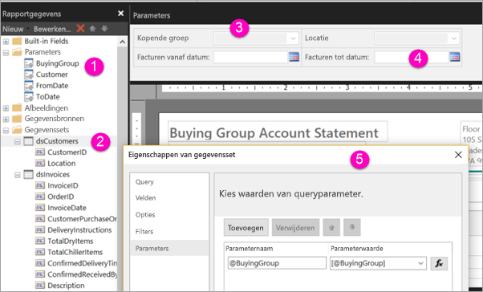

# Parameters maken voor gepagineerde rapporten in de Power BI-service

[!INCLUDE [applies-to](../includes/applies-to.md)] [!INCLUDE [yes-service](../includes/yes-service.md)] [!INCLUDE [yes-paginated](../includes/yes-paginated.md)] [!INCLUDE [yes-premium](../includes/yes-premium.md)] [!INCLUDE [no-desktop](../includes/no-desktop.md)] 

In dit artikel leert u hoe u parameters kunt maken voor gepagineerde rapporten in de Power BI-service.  Een rapportparameter biedt een manier om rapportgegevens te kiezen en de presentatie van een rapport te variëren. U kunt een standaardwaarde en een lijst met beschikbare waarden opgeven. Uw rapportlezers kunnen de selectie wijzigen. Ze kunnen ook in de tekstvakken van de parameter typen om te zoeken naar waarden. Zie [Parameters weergeven voor gepagineerde rapporten](../consumer/paginated-reports-view-parameters.md) om te zien hoe uw zakelijke gebruikers met parameters omgaan in de Power BI-service.  

In de volgende afbeelding ziet u de Ontwerpweergave in Power BI Report Builder voor een rapport met de parameters @BuyingGroup, @Customer, @FromDate en @ToDate. 
  

  
1.  De rapportparameters in het deelvenster Rapportgegevens.  
  
2.  De tabel met een van de parameters in de gegevensset.  
  
3.  Het deelvenster Parameters. U kunt de indeling van de parameters aanpassen in het deelvenster Parameters. 
  
4.  De parameters @FromDate en @ToDate hebben het gegevenstype **Datum/tijd**. Tijdens de weergave van het rapport kunt u een datum typen in het tekstvak of een datum kiezen in het agendabesturingselement. 

5.  Een van de parameters in het dialoogvenster **Eigenschappen voor gegevensset**.  

  
## Een rapportparameter maken of bewerken  
  
1.  Open het gepagineerde rapport in Power BI Report Builder.

1. Klik in **Rapportgegevens** met de rechtermuisknop op het knooppunt **Parameters** > **Parameter toevoegen**. Het dialoogvenster **Eigenschappen van rapportparameter** wordt geopend.  
  
2.  Typ bij **Naam** een naam voor de parameter of accepteer de standaardnaam.  
  
3.  Typ bij **Prompt** de tekst om weer te geven naast het parametertekstvak wanneer de gebruiker het rapport opent.  
  
4.  Selecteer bij **Gegevenstype** het gegevenstype voor de parameterwaarde.  
  
5.  Als de parameter een lege waarde bevat, selecteert u **Lege waarde toestaan**.  
  
6.  Als de parameter een null-waarde bevat, selecteert u **Null-waarde toestaan**.  
  
7.  Selecteer **Meerdere waarden toestaan** als u een gebruiker wilt toestaan om meer dan één waarde te selecteren voor de parameter.  
  
8.  Stel de zichtbaarheidsoptie in.  
  
    -   Selecteer **Zichtbaar** als u de waarde wilt weergeven op de werkbalk boven aan het rapport.  
  
    -   Selecteer **Verborgen** als u de parameter wilt verbergen zodat deze niet wordt weergegeven op de werkbalk.  
  
    -   Als u de parameter wilt verbergen en ervoor wilt zorgen dat deze, nadat het rapport is gepubliceerd, niet kan worden gewijzigd in de rapportserver, selecteert u **Intern**. De rapportparameter kan vervolgens alleen worden weergegeven in de rapportdefinitie. Voor deze optie moet u een standaardwaarde instellen of toestaan dat de parameter een null-waarde accepteert.  
  
9. Selecteer **OK**. 

## Volgende stappen

Zie [Parameters weergeven voor gepagineerde rapporten](../consumer/paginated-reports-view-parameters.md) om te zien hoe de parameters eruit zien in de Power BI-service.

Zie [Rapportparameters in Power BI Report Builder](report-builder-parameters.md) voor uitgebreide informatie over parameters in gepagineerde rapporten.
