# Zelfstudie: Een gepagineerd rapport maken en uploaden naar de Power BI-service

In deze zelfstudie maakt u verbinding met een Azure SQL-voorbeelddatabase. Vervolgens gebruikt u een wizard in Power BI Report Builder om een gepagineerd rapport te maken met een tabel die doorloopt over meerdere pagina's. Daarna uploadt u het gepagineerde rapport naar een werkruimte in een Premium-capaciteit in de Power BI-service.

In deze zelfstudie voltooit u de volgende stappen:

> [!div class="checklist"]
> * Een Azure-voorbeelddatabase maken.
> * Een matrix in Power BI Report Builder maken met behulp van een wizard.
> * Het rapport opmaken met een titel, paginanummers en kolomkoppen op elke pagina.
> * De valuta opmaken.
> * Het rapport uploaden naar de Power BI-service.

Als u nog geen abonnement voor Azure hebt, maakt u een [gratis account](https://azure.microsoft.com/free/?WT.mc_id=A261C142F) voordat u begint.
 
## Vereisten  

Hier volgen de vereisten voor het maken van het gepagineerde rapport:

- Installeer [Power BI Report Builder vanuit het Microsoft Downloadcentrum](https://aka.ms/pbireportbuilder). 

- Volg de snelstart [Een Azure SQL-voorbeelddatabase in Azure Portal](https://docs.microsoft.com/azure/sql-database/sql-database-get-started-portal). Kopieer de waarde uit het vak **Servernaam** op het tabblad **Overzicht** en sla deze op. Onthoud de gebruikersnaam en het wachtwoord dat u hebt gemaakt in Azure.

Hier volgen de vereisten voor het uploaden van uw gepagineerde rapport naar de Power BI-service:

- U hebt een [Power BI Pro-licentie](../admin/service-admin-licensing-organization.md) nodig.
- U hebt een werkruimte in de service in een [Power BI Premium-capaciteit](../admin/service-premium-what-is.md) nodig. Deze heeft het pictogram van een diamant  naast de naam van de werkruimte.

## De matrix maken met een wizard
  
1.  Start Power BI Report Builder vanaf uw computer.  
  
     Het dialoogvenster **Aan de slag** wordt geopend.  
  
     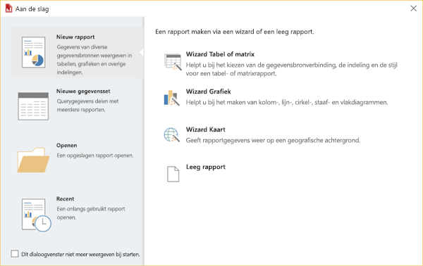
  
1.  Controleer in het linkerdeelvenster of **Nieuw rapport** is geselecteerd en selecteer in het rechterdeelvenster **Wizard Tabel of matrix**.  
  
4.  Op de pagina **Kies een gegevensset** selecteert u **Een gegevensset maken** > **Volgende**.  

    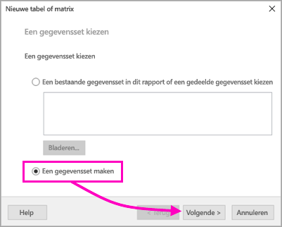
  
5.  Op de pagina **Een verbinding met een gegevensbron kiezen** selecteert u **Nieuw**. 

    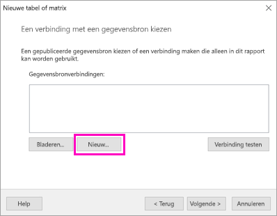
  
     Het dialoogvenster **Eigenschappen van gegevensbron** wordt geopend.  
  
6.  U kunt elke gewenste naam voor de gegevensbron opgeven, met tekens en onderstrepingstekens. Voor deze zelfstudie typt u in het vak **Naam** de naam **MyAzureDataSource**.  
  
7.  In het vak **Verbindingstype selecteren** selecteert u **Microsoft Azure SQL Database**.  
  
8.  Selecteer **Opbouwen** naast het vak **Verbindingsreeks**. 

    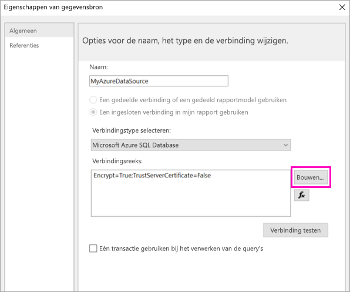

9. **In Azure:** Ga terug naar de Azure-portal en selecteer **SQL-databases**.

1. Selecteer de Azure SQL-database die u hebt gemaakt in de snelstart 'Een Azure SQL-voorbeelddatabase maken in Azure Portal' in de sectie **Vereisten** van dit artikel.

1. Op het tabblad **Overzicht** kopieert u de waarde uit het vak **Servernaam**.

2. **In Report Builder**: Plak de gekopieerde naam in het dialoogvenster **Verbindingseigenschappen** in **Servernaam**. 

1. Voor het **aanmelden bij de server** moet **SQL Server-verificatie gebruiken** zijn geselecteerd. Typ vervolgens de gebruikersnaam en het wachtwoord voor de voorbeelddatabase die u in Azure hebt gemaakt.

1. Selecteer onder **Verbinding maken met een database** de pijl omlaag en selecteer de naam van de database die u hebt gemaakt in Azure.
 
    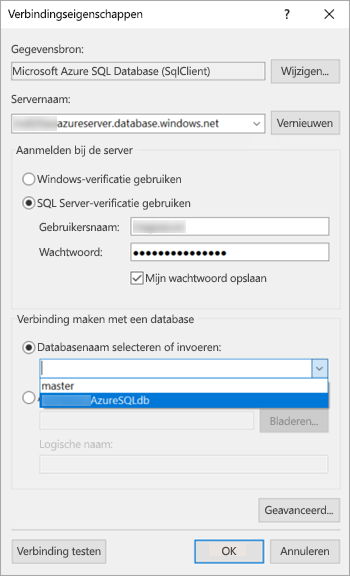

1. Selecteer **Verbinding testen**. U ziet in het bericht met **testresultaten** dat **de verbindingstest is geslaagd**.

1. Selecteer **OK** > **OK**. 

   In het vak **Verbindingsreeks** van Report Builder wordt nu de verbindingsreeks weergegeven die u zojuist hebt gemaakt. 

    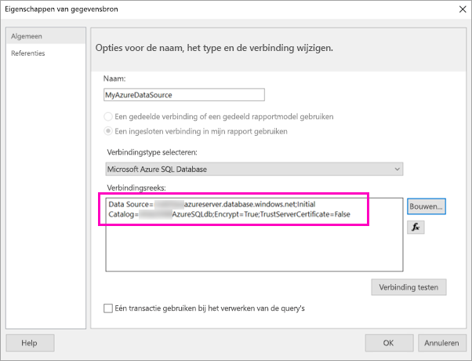

1. Selecteer **OK**.
  
9. Op de pagina **Een verbinding met een gegevensbron kiezen** ziet u '(in dit rapport)' onder de gegevensbronverbinding die u zojuist hebt gemaakt. Selecteer die gegevensbron > **Volgende**.  

    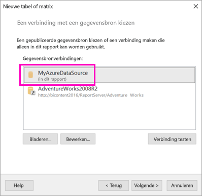

10. Typ dezelfde gebruikersnaam en hetzelfde wachtwoord in het vak. 
  
10. Op de pagina **Een query ontwerpen** vouwt u achtereenvolgens SalesLT en Tabellen uit en selecteert u deze tabellen:

    - Adres
    - Klant
    - Product
    - ProductCategory
    - SalesOrderDetail
    - SalesOrderHeader

     Omdat **Relaties** > **Automatisch detecteren** is geselecteerd, worden de relaties tussen deze tabellen automatisch in Report Builder gedetecteerd. 
    
    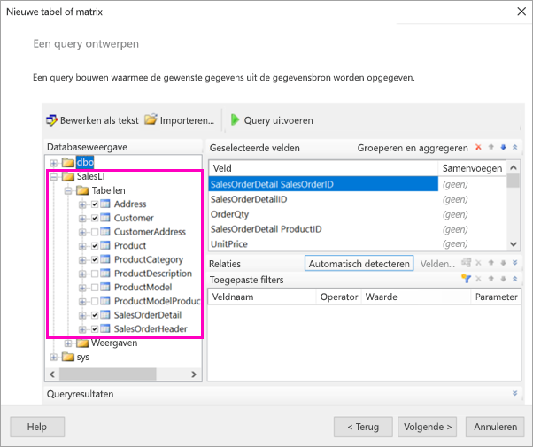
 
1.  Selecteer **Query uitvoeren**. De **queryresultaten** worden in Report Builder weergegeven. 
 
     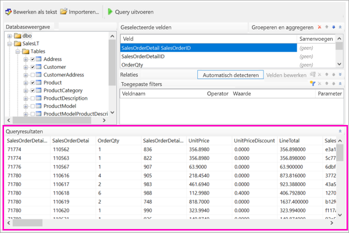

18. Selecteer **Volgende**. 

19. Kies op de pagina **Kies een gegevensset** de gegevensset die u zojuist hebt gemaakt > **Volgende**.

    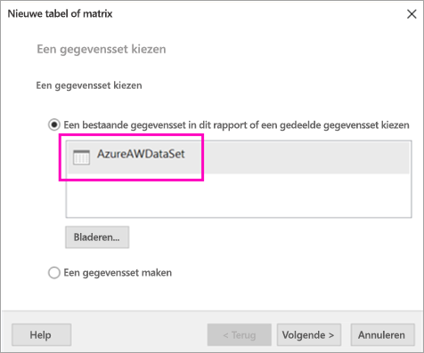

1. Sleep op de pagina **Velden rangschikken** de volgende velden van het vak **Beschikbare velden** naar het vak **Rijgroepen**:

    - CompanyName
    - SalesOrderNumber
    - Product_Name

1. Sleep deze velden van het vak **Beschikbare velden** naar het vak **Waarden**:

    - OrderQty
    - UnitPrice
    - LineTotal

    Report Builder heeft automatisch sommen gemaakt van de velden in het vak **Waarden**.

    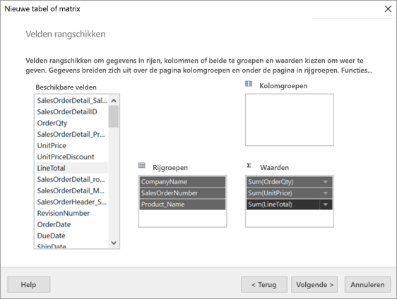

24. Behoud alle standaardinstellingen op de pagina **Kies de indeling**, maar schakel het selectievakje **Groepen uitvouwen/samenvouwen** uit. Over het algemeen is de functie Groepen uitvouwen/samenvouwen erg handig, maar ditmaal wilt u de tabel laten doorlopen over meerdere pagina's.

1. Selecteer **Volgende** > **Voltooien**. De tabel wordt weergegeven op het ontwerpvlak.
 
## Wat u hebt gemaakt

Laten we eens even stilstaan bij de resultaten van de wizard.

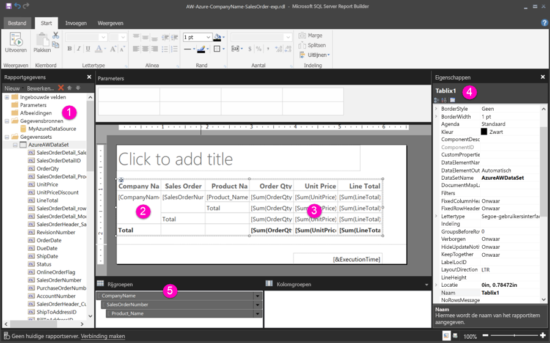

1. In het deelvenster Rapportgegevens ziet u zowel de ingesloten Azure-gegevensbron als de daarop gebaseerde ingesloten gegevensset die u hebt gemaakt. 

2. Het ontwerpvlak is ongeveer 15 cm breed. Op het ontwerpvlak ziet u de matrix met kolomkoppen en de waarden voor de tijdelijke aanduidingen. De matrix bevat zes kolommen en slechts vijf rijen. 

3. Orderhoeveelheid, Prijs per eenheid en Regeltotaal zijn allemaal sommen en dus heeft elke rijgroep een subtotaal. 

    U ziet echter nog steeds niet de werkelijke gegevenswaarden. Om die te zien, moet u het rapport uitvoeren.

4. In het deelvenster Eigenschappen heeft de geselecteerde matrix de naam Tablix1. Een *tablix* in Report Builder is een gegevensgebied waarin gegevens in rijen en kolommen worden weergegeven. Dit kan een tabel of een matrix zijn.

5. In het deelvenster Groeperen ziet u de drie rijgroepen die u hebt gemaakt in de wizard: 

    - CompanyName
    - Verkooporder
    - Productnaam

    Deze matrix bevat geen kolomgroepen.

### Het rapport uitvoeren

Als u de werkelijke waarden wilt zien, moet u het rapport uitvoeren.

1. Selecteer **Uitvoeren** op de werkbalk **Start**.

   Nu ziet u de waarden. De matrix bevat nu ook veel meer rijen dan in de ontwerpweergave. Ziet u dat dit pagina **1** van **2** is in Report Builder? Het rapport wordt zo snel mogelijk geladen in Report Builder door telkens maar gegevens voor een paar pagina's tegelijk op te halen. Het vraagteken geeft aan dat nog niet alle gegevens zijn geladen.

   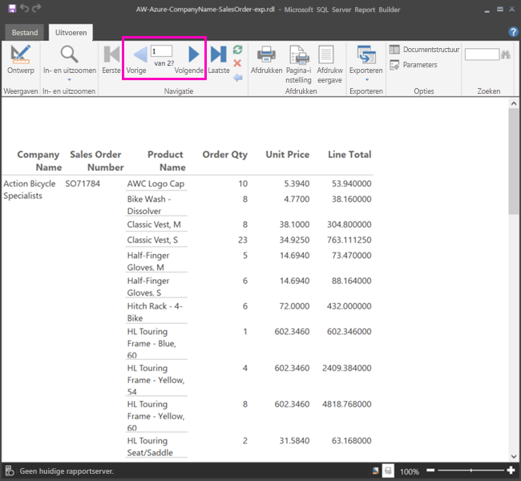

2. Selecteer **Afdrukweergave**. Dit is de indeling van het rapport wanneer u het afdrukt. Report Builder 'weet' nu dat het rapport 33 pagina's omvat en heeft automatisch een datum en tijd in de voettekst toegevoegd.

## Het rapport opmaken

U hebt nu een rapport met een matrix die doorloopt over 33 pagina's. We gaan een en ander toevoegen om het uiterlijk te verbeteren. U kunt het rapport na elke stap uitvoeren om te zien hoe het vordert met uw rapport.

- Op het tabblad **Uitvoeren** van het lint selecteert u **Ontwerpen** zodat u het rapport verder kunt aanpassen.  

### Paginabreedte instellen

Een gepagineerd rapport is gewoonlijk zo opgemaakt dat een pagina kan worden afgedrukt op papier met een formaat van 8,5 x 11 inch. 

1. Sleep de liniaal om het ontwerpvlak te vergroten tot een breedte van 7 inch. De standaardmarge is 1 inch aan elke zijde, dus de zijmarges moeten kleiner worden.

1. Klik in het grijze gebied rond het ontwerpvlak om de eigenschappen van het **rapport** weer te geven.

    Als u het deelvenster Eigenschappen niet ziet, klikt u op het tabblad **Weergave** > **Eigenschappen**.

2. Vouw **Marges** uit en wijzig **Links** en **Rechts** van 1 inch in 0,75 inch. 

    
  
### Een rapporttitel toevoegen  

1. Selecteer de woorden **Klik om een titel toe te voegen** bovenaan de pagina en typ **Verkoop per bedrijf**.  

2. Selecteer de titeltekst en wijzig in het deelvenster Eigenschappen, onder **Lettertype**, de **kleur** in **Blauw**.
  
### Een paginanummer toevoegen

U hebt gezien dat de voettekst van het rapport een datum en tijd bevat. U kunt ook een paginanummer aan de voettekst toevoegen.

1. Onderaan het ontwerpvlak, aan de rechterkant in de voettekst, ziet u [&ExecutionTime]. 

2. Vouw de map Ingebouwde velden uit in het deelvenster Rapportgegevens. Sleep **Paginanummer** naar de linkerzijde van de voettekst, op dezelfde hoogte als [&ExecutionTime].

3. Sleep de rechterzijde van het vak [&PageNumber] om het vierkant te maken.

4. Selecteer **Tekstvak** op het tabblad **Invoegen**.

5. Klik rechts van [& PageNumber], typ 'van' en maak het tekstvak vierkant.

6. Sleep **Algemeen totaal aantal pagina's** naar de voettekst, rechts van 'van', en maak het ook vierkant door de rechterzijde te verslepen.

    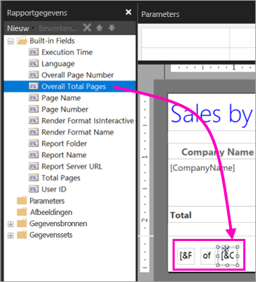

### De tabel breder maken  

U kunt nu de matrix breed genoeg maken om de breedte van de pagina te vullen, en de tekstkolommen breder maken zodat de namen niet zo veel schuiven. 
 
1. Selecteer de matrix en selecteer vervolgens de kolom Bedrijfsnaam.

3. Beweeg de muisaanwijzer over de grijze balk bovenaan de matrix aan de rechterrand van de kolom Bedrijfsnaam. Sleep naar rechts tot de kolom 1,375 inch breed is. 

    

4. Sleep de rechterrand van Productnaam tot de kolom 3,75 inch breed is.   

De matrix is nu bijna net zo breed als het afdrukgebied.

### De valuta opmaken

Bij het uitvoeren van het rapport hebt u wellicht al gemerkt dat de bedragen nog niet zijn opgemaakt als valuta.

1. Selecteer de cel linksboven [Sum(OrderQty)], houd de Shift-toets ingedrukt en selecteer de cel rechtsonder [Sum(LineTotal)].

    

2. Op het tabblad **Start** selecteert u het dollarteken ( **$** ) als valutasymbool. Vervolgens selecteert u de pijl naast **Stijlen voor tijdelijke aanduidingen** > **Voorbeeldwaarden**.
 
    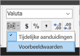

    Nu zijn de waarden opgemaakt als valuta.

    

### Kolomkoppen op elke pagina toevoegen

Nog een verbetering die u gaat aanbrengen in de opmaak voordat u het rapport publiceert naar Power BI-service, is ervoor te zorgen dat de kolomkoppen op elke pagina in het rapport worden weergegeven.

1. Helemaal rechts van de bovenste balk in het deelvenster Groeperen selecteert u de pijl omlaag > **Geavanceerde modus**.

    

2. Selecteer de bovenste **statische** balk in het vak **Rijgroepen**. U ziet dat de cel Bedrijfsnaam in de matrix is geselecteerd.

   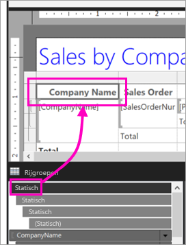

3. In het deelvenster **Eigenschappen** bekijkt u de eigenschappen voor **Tablixlid**. Stel **KeepWithGroup** in op **Na** en stel **RepeatOnNewPage** in op **Waar**.

    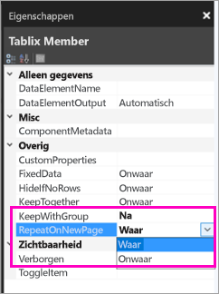

    Het is tijd om het rapport uit te voeren en te bekijken hoe het er nu uitziet.

5. Selecteer **Uitvoeren** op het tabblad **Start**.

6. Selecteer **Afdrukweergave**, als deze nog niet is geselecteerd. Het rapport heeft nu 29 pagina's. Blader door enkele pagina's. De valuta is opgemaakt, de kolommen hebben koppen op elke pagina en het rapport bevat een voettekst met paginanummers en de datum en tijd op elke pagina.
 
    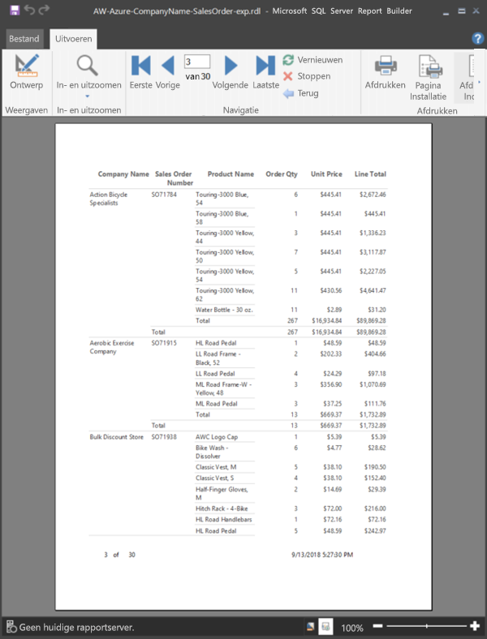

7. Sla het rapport op de computer op.
 
##  Het rapport uploaden naar de service

Nu u dit gepagineerde rapport hebt gemaakt, is het tijd om het rapport te uploaden naar Power BI-service.

1. In de Power BI-service (`https://app.powerbi.com`) selecteert u in het navigatievenster **Werkruimten** > **Werkruimte maken**.

2. Geef uw werkruimte de naam **Azure AW** of een andere unieke naam. Op dit moment bent u het enige lid. 

3. Selecteer de pijl naast **Geavanceerd** en schakel **Toegewezen capaciteit** in. 

    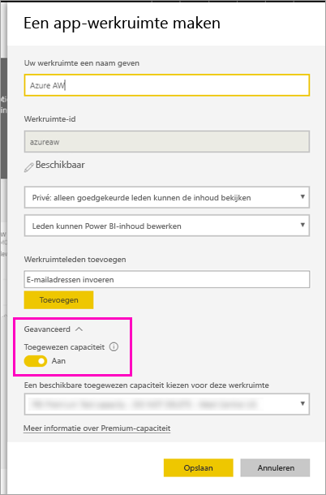

    Als u Toegewezen capaciteit niet kunt inschakelen, vraagt u de Power BI-beheerder u te machtigen voor het toevoegen van de werkruimte aan de toegewezen Premium-capaciteit.

4. Kies zo nodig een **beschikbare toegewezen capaciteit voor deze werkruimte** > **Opslaan**.
    
    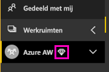

    Als de werkruimte zich niet in een Premium-capaciteit bevindt wanneer u het rapport probeert te uploaden, ziet u het bericht 'Kan het gepagineerde rapport niet uploaden.' Neem contact op met uw Power BI-beheerder voor het verplaatsen van de werkruimte.

1. Selecteer in uw nieuwe werkruimte de optie **Gegevens ophalen**.

2. Selecteer in het vak **Bestanden** > **Ophalen**.

3. Selecteer **Lokaal bestand**, ga naar de locatie waar u het bestand hebt opgeslagen > **Openen**.

   Uw bestand wordt geïmporteerd in Power BI en weergegeven onder **Rapporten** op de pagina Lijst met apps.

    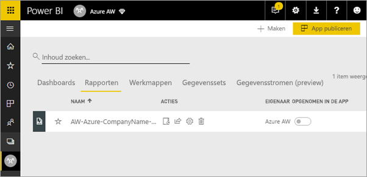

4. Selecteer het rapport om het weer te geven.

5. Als er een fout optreedt, moet u mogelijk uw referenties opnieuw invoeren. Selecteer het pictogram **Beheren**.

    

6. Selecteer **Referenties bewerken** en voer de referenties in die u hebt gebruikt in Azure bij het maken van de Azure-database.

    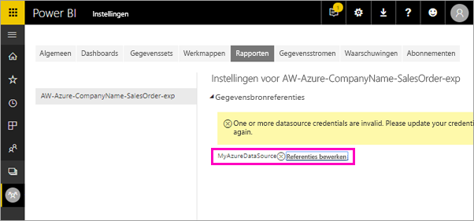

7. U kunt het gepagineerde rapport nu weergeven in de Power BI-service.

    

## Volgende stappen

[Wat zijn gepagineerde rapporten in Power BI Premium?](paginated-reports-report-builder-power-bi.md)
