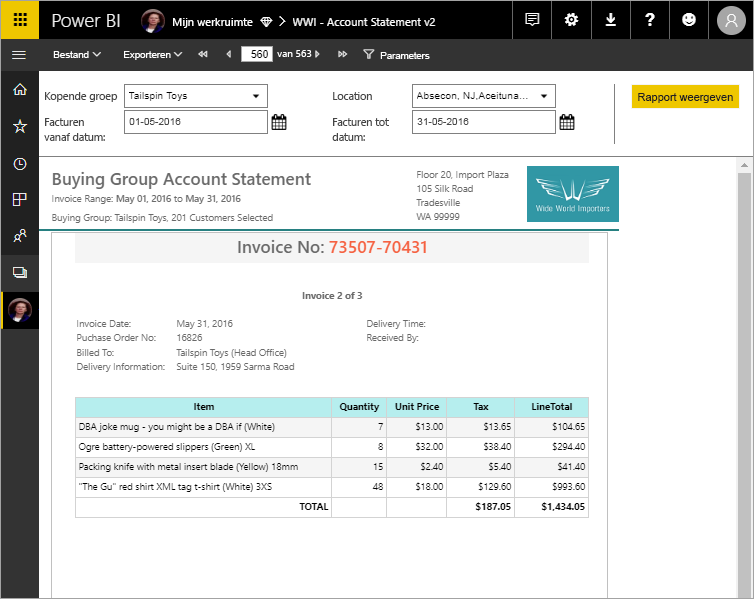

# Wat zijn gepagineerde rapporten in Power BI Premium?

*Gepagineerde rapporten* zijn rapporten die zijn ontworpen om te worden afgedrukt of gedeeld. Ze worden *gepagineerd* genoemd, omdat ze zo zijn opgemaakt dat ze op een pagina passen. Alle gegevens worden in een tabel weergegeven, zelfs als de tabel meerdere pagina's omvat. Ze worden soms *pixelperfect* genoemd omdat de pagina-indeling van dit type rapport exact kan worden ingesteld. De Power BI Report Builder is het zelfstandige hulpprogramma voor het maken van gepagineerde rapporten. Gepagineerde rapporten zijn gebaseerd op de RDL-rapporttechnologie, dat lang de standaard rapportindeling was in SQL Server Reporting Services. 

Gepagineerde rapporten hebben vaak veel pagina's. Dit rapport heeft bijvoorbeeld 563 pagina's. Alle pagina's zijn zorgvuldig opgemaakt, met één pagina per factuur en herhalende kopteksten en voetteksten.

U kunt een voorbeeld van uw rapport bekijken in Report Builder en het rapport vervolgens publiceren naar de Power BI-service, app.powerbi.com. U hebt een Power BI Pro-licentie nodig om een rapport te publiceren in de service. U kunt gepagineerde rapporten publiceren en delen in Mijn werkruimte of in de werkruimten, zolang de werkruimte zich in een Power BI Premium-capaciteit bevindt. Bovendien moet een beheerder van Power BI gepagineerde rapporten inschakelen in het [gedeelte met Premium-mogelijkheden](../admin/service-admin-premium-workloads.md#paginated-reports) in de Power BI-beheerportal. 

## Power BI-rapporten en gepagineerde rapporten vergelijken

Een groot voordeel van gepagineerde rapporten is de mogelijkheid om alle gegevens in een tabel, hoe lang ook, te kunnen afdrukken. Stel u voor dat u een tabel in een Power BI-rapport plaatst. U ziet een aantal van de rijen in de tabel op de pagina en u hebt een schuifbalk om de rest te bekijken. Als u die pagina print, of exporteert naar een PDF, worden alleen de rijen afgedrukt die u op de pagina zag. 

Stel nu dat u dezelfde tabel in een gepagineerd rapport plaatst. Wanneer u deze afdrukt of als PDF exporteert, heeft het gepagineerde rapport zoveel pagina's als nodig is om elke rij in de tabel af te drukken. 

In de volgende video laten Microsoft Most Valued Professional Peter Myers en Principal Program Manager Chris Finlan zien hoe een soortgelijk tabel wordt afgedrukt in de twee rapportindelingen. 

<iframe width="560" height="315" src="https://www.youtube.com/embed/jXTiYJKw1Rs?list=PL1N57mwBHtN1icIhpjQOaRL8r9G-wytpT" frameborder="0" allowfullscreen></iframe>

Deze video maakt deel uit van een op video gebaseerde cursus met acht modules, [Gepagineerde Power BI-rapporten in één dag](../learning-catalog/paginated-reports-online-course.md). De cursus is ontworpen om u, als rapportauteur, de technische kennis te bieden die vereist is voor het maken, publiceren en distribueren van gepagineerde Power BI-rapporten.

## Rapporten maken in Power BI Report Builder

Gepagineerde rapporten hebben hun eigen ontwerpprogramma, Power BI Report Builder genaamd. Dit is een nieuwe tool die dezelfde basis heeft als de tools die u eerder al hebt gebruikt om gepagineerde rapporten voor Power BI Report Server of SQL Server Reporting Services (SSRS) te maken. In feite zijn gepagineerde rapporten die u maakt voor SSRS 2016 en 2017 of voor Power BI Report Server on-premises compatibel met de Power BI-service. De Power BI-service ondersteunt achterwaartse compatibiliteit, zodat u uw rapporten kunt upgraden en u gepagineerde rapporten van een eerdere versie kunt bijwerken. Niet alle rapportfuncties zijn al meteen bij de release beschikbaar. Zie [Beperkingen en overwegingen](#limitations-and-considerations) in dit artikel voor meer informatie.
     
## Rapporteren uit verschillende gegevensbronnen

Een gepagineerd rapport kan een aantal verschillende gegevensbronnen hebben. Dit type rapport heeft geen onderliggende gegevensmodel, zoals Power BI-rapporten. Bij de eerste release van gepagineerde rapporten in de Power BI-service maakt u ingesloten gegevensbronnen en gegevenssets in het rapport zelf. Voorlopig kunt u geen gedeelde gegevensbronnen of gedeelde gegevenssets gebruiken. U maakt rapporten in Report Builder op uw lokale computer. Als een rapport verbinding maakt met on-premises gegevens, moet u na het uploaden van het rapport naar de Power BI-service een gateway maken en de gegevensverbinding omleiden. Dit zijn de gegevensbronnen waarmee u op dit moment verbinding kunt maken:

- Azure SQL Database en Data Warehouse (via Basic en oAuth)
- Azure Analysis Services (via SSO)
- SQL Server via een gateway
- SQL Server Analysis Services via een gateway
- Power BI-gegevenssets
- Oracle
- Teradata

## Het rapport ontwerpen  

### Gepagineerde rapporten maken met matrix-, grafiek- en vrije vorm-indelingen

Tabelrapporten werken goed voor gegevens op basis van kolommen. Matrixrapporten, zoals kruistabel- of draaitabelrapporten, zijn geschikt voor samengevatte gegevens. Grafiekrapporten presenteren gegevens in een grafische indeling en *lijstrapporten* in vrije vorm kunnen vrijwel al het overige presenteren, bijvoorbeeld facturen. 
  
U kunt beginnen met een van de wizards van Report Builder. De wizards Tabel, Matrix en Grafiek begeleiden u stapsgewijs bij het maken van de ingesloten verbinding met de gegevensbron en de ingesloten gegevensset. Vervolgens sleept u velden om een gegevensset-query te maken, selecteert u een indeling en stijl, en past u het rapport aan.  
  
Met de wizard Kaart maakt u rapporten waarin geaggregeerde gegevens worden uitgezet tegen een geografische of geometrische achtergrond. Kaartgegevens kunnen ruimtelijke gegevens zijn uit een Transact-SQL-query of een ESRI-vormbestand (Environmental Systems Research Institute, Inc). U kunt ook een achtergrond bestaande uit een tegel met een kaart van Microsoft Bing toevoegen.  

### Meer toevoegen aan uw rapport

Pas uw gegevens aan door deze te filteren, te groeperen en te sorteren, of door formules of expressies toe te voegen. Voeg grafieken, meters, sparklines en indicatoren toe om gegevens in een visuele indeling samen te vatten.  Gebruik parameters en filters om gegevens te filteren voor aangepaste weergaven. U kunt ook afbeeldingen en andere bronnen insluiten of hiernaar verwijzen, met inbegrip van externe inhoud.  

Alles in een gepagineerd rapport, van het rapport zelf tot de tekstvakken, afbeeldingen, tabellen en grafieken, is gekoppeld aan een matrix van eigenschappen die u kunt instellen om het rapport op exact de gewenste manier weer te geven.

## Een rapportdefinitie maken

Wanneer u een gepagineerd rapport ontwerpt, maakt u in feite een *rapportdefinitie*. Het rapport bevat geen gegevens. Er wordt aangegeven waar de gegevens moeten worden opgehaald, welke gegevens u wilt ophalen en hoe u de gegevens wilt weergeven. Wanneer u het rapport uitvoert, worden er gegevens opgehaald aan de hand van de definitie van het rapport die u hebt opgegeven, waarna deze worden gecombineerd met de rapportindeling om het rapport te genereren. U uploadt de rapportdefinitie naar de Power BI-service, `https://app.powerbi.com`, naar uw Mijn werkruimte of naar een werkruimte die u deelt met uw collega's. Als de gegevensbron van het rapport on-premises is, moet u na het uploaden van het rapport de verbinding met de gegevensbron omleiden via een gateway. 

## Een gepagineerd rapport weergeven
U kunt een gepagineerd rapport weergeven in de Power BI-service in een browser en ook in de mobiele Power BI-apps. In de Power BI-service kunt u het rapport exporteren naar verschillende indelingen, zoals HTML, MHTML, PDF, XML, CSV, TIFF, Word en Excel. U kunt het rapport ook delen met anderen.  

## Een abonnement voor uw rapport maken

U kunt nu e-mailabonnementen maken voor uzelf en anderen voor gepagineerde rapporten in de Power BI-service. Over het algemeen is dit hetzelfde proces als voor abonneren op rapporten en dashboard in de Power BI-service. Wanneer u abonnementen instelt, kiest u hoe vaak u de e-mails wilt ontvangen: dagelijks, wekelijks of per uur. Het abonnement bevat een PDF-bijlage met de uitvoer van het gehele rapport.

Zie het artikel [Uzelf en anderen abonneren op gepagineerde rapporten in Power BI-service](../consumer/paginated-reports-subscriptions.md) voor meer informatie. 

## Beperkingen en overwegingen

Hier volgen enkele andere functies die niet worden ondersteund in de eerste release:

- Rapportpagina's of visualisaties vastmaken aan Power BI-dashboards. U kunt nog steeds visualisaties aan een Power BI-dashboard vastmaken die afkomstig zijn van een on-premises gepagineerd rapport op een Power BI Report-server of Reporting Services-rapportserver. Zie [Items van Reporting Services vastmaken aan Power BI-dashboards](https://docs.microsoft.com/sql/reporting-services/pin-reporting-services-items-to-power-bi-dashboards) voor meer informatie.
- Documentstructuren.
- Drillthrough-rapporten.  U kunt overwegen om URL-parameters met gepagineerde rapporten te gebruiken voor drillthrough-scenario's.
- Gedeelde gegevensbronnen en gedeelde gegevenssets.

 
## Volgende stappen

- [Power BI Report Builder installeren vanuit het Microsoft Downloadcentrum](https://aka.ms/pbireportbuilder)
- [Zelfstudie: een gepagineerd rapport maken](paginated-reports-quickstart-aw.md)
- [Onlinecursus: gepagineerde rapporten in Power BI in een dag](../learning-catalog/paginated-reports-online-course.md)
- [Gegevens rechtstreeks in een gepagineerd rapport invoeren](paginated-reports-enter-data.md)
- [Zelfstudie: Gepagineerde Power BI-rapporten insluiten in een toepassing voor uw klanten](../developer/embedded/embed-paginated-reports-customers.md)
