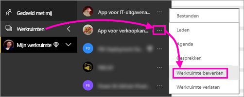

# Een gepagineerd rapport publiceren in de Power BI-service

In dit artikel krijgt u informatie over het publiceren van een gepagineerd rapport in de Power BI-service door het te uploaden vanaf de lokale computer. U kunt gepagineerde rapporten uploaden naar Mijn werkruimte of een andere ruimte, zolang deze werkruimte zich maar in een Premium-capaciteit bevindt. Ga naar het ruitvormige pictogram  naast de naam van een werkruimte. 

Als de gegevensbron van het rapport on-premises is, moet u een gateway maken nadat u het rapport hebt geüpload. Zie de sectie [Een gateway maken](#create-a-gateway) verderop in dit artikel.

## Een werkruimte toevoegen aan een Premium-capaciteit

Als u naast de naam van de werkruimte het ruitvormige pictogram  niet ziet, moet u de werkruimte toevoegen aan een Premium-capaciteit. 

1. Selecteer **Werkruimten** en selecteer het beletselteken ( **...** ) naast de naam van de werkruimte. Selecteer vervolgens **Werkruimte bewerken**.

    

1. Vouw in het dialoogvenster **Werkruimte bewerken** de optie **Geavanceerd** uit. Schuif **Toegewezen capaciteit** vervolgens naar **Aan**.

    

   Mogelijk kunt u dit niet wijzigen. Zo niet, vraag de beheerder van de Power BI Premium-capaciteit dan om u toewijzingsrechten te verlenen om uw werkruimte toe te voegen aan een Premium-capaciteit.

## Vanuit Report Builder een gepagineerd rapport publiceren

1. Maak uw gepagineerde rapport in Report Builder en sla het op de lokale computer op.

1. Selecteer in het menu **Bestand** van Report Builder de optie **Opslaan als**.

    

    Als u nog niet bent aangemeld bij Power BI, moet u zich nu aanmelden of een nieuw account maken. Selecteer **Aanmelden** in de rechterbovenhoek van Report Builder en voer de stappen uit.

2. Selecteer in de lijst met werkruimten aan de linkerkant een werkruimte met het ruitpictogram  naast de naam. Typ een **Bestandsnaam** in het vak > **Opslaan**. 

    

4. Open de Power BI-service in een browser en blader naar de Premium-werkruimte waarin u het gepagineerde rapport hebt gepubliceerd. Op het tabblad **Rapporten** wordt het rapport weergegeven.

    

5. Selecteer het gepagineerde rapport om dit in de Power BI-service te openen. Als het rapport parameters bevat, moet u deze selecteren voordat u het rapport kunt weergeven.

    

6. Als de gegevensbron van uw rapport zich on-premises bevindt, leest u in dit artikel hoe u [een gateway maakt](#create-a-gateway) om toegang te krijgen tot de gegevensbron.

## Een gepagineerd rapport uploaden vanuit de Power BI-service

U kunt ook beginnen met de Power BI-service en een gepagineerd rapport uploaden.

1. Maak uw gepagineerde rapport in Report Builder en sla het op de lokale computer op.

1. Open de Power BI-service in een browser en blader naar de Premium-werkruimte waarin u het rapport wilt publiceren. U ziet nu het ruitvormige pictogram  naast de naam. 

1. Selecteer **Gegevens ophalen**.

    

1. Selecteer in het vak **Bestanden** de optie **Ophalen**.

    

1. Selecteer **Lokaal bestand** > blader naar het gepagineerde rapport > **Openen**.

    

1. Selecteer **Doorgaan** > **Referenties bewerken**.

    

1. Configureer uw referenties > **Aanmelden**.

    

   Op het tabblad **Rapporten** wordt het rapport weergegeven.

    

1. Selecteer het rapport om het te openen in de Power BI-service. Als het rapport parameters bevat, moet u deze selecteren voordat u het rapport kunt weergeven.
 
    

6. Als de gegevensbron van uw rapport zich on-premises bevindt, leest u in dit artikel hoe u [een gateway maakt](#create-a-gateway) om toegang te krijgen tot de gegevensbron.

## Een gateway maken

Als de gegevensbron van het rapport on-premises is, moet u, net als bij elk ander Power BI-rapport, een gateway maken of verbinding maken met een gateway om de gegevens te openen.

1. Selecteer naast de rapportnaam de optie **Beheren**.

   

1. Zie het artikel van de Power BI-service [Wat is een on-premises gegevensgateway?](../service-gateway-onprem.md) voor details en volgende stappen.

### Beperkingen van een gateway

Momenteel bieden gateways geen ondersteuning voor parameters met meerdere waarden.

## Volgende stappen

- [Een gepagineerd rapport weergeven in de Power BI-service](../consumer/paginated-reports-view-power-bi-service.md)
- [Wat zijn gepagineerde rapporten in Power BI Premium?](paginated-reports-report-builder-power-bi.md)
- [Zelfstudie: Gepagineerde Power BI-rapporten insluiten in een toepassing voor uw klanten](../developer/embed-paginated-reports-customers.md)

