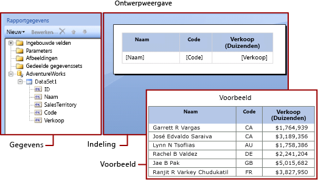

# Expressies in Power BI Report Builder
  Expressies worden op grote schaal in gepagineerde rapporten van Power BI Report Builder gebruikt voor het ophalen, berekenen, weergeven, groeperen, sorteren en filteren van gegevens, om parameters aan gegevens toe te wijzen en om gegevens op te maken. 
  
  Veel eigenschappen van rapportitems kunnen op een expressie worden ingesteld. Met behulp van expressies kunt u de inhoud, het ontwerp en de interactiviteit van uw rapport beheren. Expressies worden geschreven in Microsoft Visual Basic, opgeslagen in de rapportdefinitie en geëvalueerd door het rapportverwerkingsprogramma wanneer u het rapport uitvoert.  
  
 In tegenstelling tot toepassingen zoals Microsoft Office Excel, waarin u gegevens rechtstreeks in een werkblad bewerkt, werkt u in een rapport met expressies die tijdelijke aanduidingen voor gegevens zijn. Open een voorbeeldweergave van het rapport om de daadwerkelijke gegevens uit de geëvalueerde expressies weer te geven. Wanneer u het rapport uitvoert, wordt elke expressie geëvalueerd zodra rapportgegevens en indelingselementen van het rapport, zoals tabellen en grafieken, door het rapportverwerkingsprogramma worden gecombineerd.  
  
 Tijdens het ontwerpen van een rapport worden vele expressies voor rapportitems voor u ingesteld. Als u bijvoorbeeld een veld van het gegevensdeelvenster naar een tabelcel in de ontwerpweergave voor rapporten sleept, wordt de waarde van het tekstvak ingesteld op een eenvoudige expressie voor het veld. In de volgende afbeelding worden in het deelvenster Rapportgegevens de gegevenssetvelden Id, Naam, Verkoopgebied, Code en Verkoop weergegeven. Er zijn drie velden aan de tabel toegevoegd: [Naam], [Code] en [Verkoop]. De notatie [Naam] in de ontwerpweergave staat voor de onderliggende expressie `=Fields!Name.Value`.  
  

  
 Wanneer u een voorbeeldweergave van het rapport bekijkt, wordt het tabelgegevensgebied gecombineerd met de daadwerkelijke gegevens van de gegevensverbinding en wordt voor elke rij in de resultatenset een rij in de tabel weergegeven.  
  
 Als u expressies handmatig wilt invoeren, selecteert u een item in de ontwerpweergave en gebruikt u de snelmenu's en dialoogvensters om de eigenschappen van het item in te stellen. Wanneer u de knop ***(fx)*** of de waarde `<Expression>` in een vervolgkeuzelijst ziet, weet u dat u de eigenschap op een expressie kunt instellen. 
  
##   Informatie over eenvoudige en complexe expressies  
 Expressies beginnen met een is-gelijkteken (=) en worden geschreven in Microsoft Visual Basic. Expressies kunnen een combinatie van constanten, operators en verwijzingen naar ingebouwde waarden (velden, verzamelingen en functies) en naar externe of aangepaste code bevatten.  
  
 U kunt expressies gebruiken om de waarde van veel eigenschappen van rapportitems op te geven. De meest gebruikte eigenschappen zijn waarden voor tekstvakken en tijdelijke aanduidingen. Als een tekstvak maar één expressie bevat, is de expressie vaak de waarde van de tekstvakeigenschap. Als een tekstvak meerdere expressies bevat, is elke expressie de waarde van een tijdelijke aanduiding in het tekstvak.  
  
 Standaard worden expressies in de ontwerpweergave voor rapporten weergegeven als *eenvoudige* of *complexe expressies*.  
  
-   **Eenvoudig**: een eenvoudige expressie bevat een verwijzing naar één item in een ingebouwde verzameling zoals een gegevenssetveld, een parameter of een ingebouwd veld. In de ontwerpweergave wordt een eenvoudige expressie tussen haken weergegeven. `[FieldName]` komt bijvoorbeeld overeen met de onderliggende expressie `=Fields!FieldName.Value`. Eenvoudige expressies worden automatisch voor u gemaakt wanneer u de rapportindeling maakt en items van het deelvenster Rapportgegevens naar de ontwerpweergave sleept. Zie [Informatie over voorvoegselsymbolen in eenvoudige expressies](#DisplayText) voor meer informatie over de symbolen die voor de verschillende ingebouwde verzamelingen staan.  
  
-   **Complex**: een complexe expressie bevat verwijzingen naar meerdere ingebouwde verwijzingen, operators en functieaanroepen. Een complexe expressie wordt weergegeven als <\<Expr>> wanneer de expressiewaarde meer dan een eenvoudige verwijzing bevat. Beweeg de cursor over de expressie en gebruik de knopinfo als u de expressie wilt zien. U kunt de expressie bewerken door deze te openen in het dialoogvenster **Expressie**.  
  
 In de volgende afbeeldingen ziet u typische eenvoudige en complexe expressies voor zowel tekstvakken als tijdelijke aanduidingen.  
  
 
  
 Als u voorbeeldwaarden wilt weergeven in plaats van tekst voor expressies, moet u opmaak toepassen op het tekstvak of de tijdelijke aanduiding. In de volgende afbeelding ziet u dat de ontwerpweergave voor rapporten is ingesteld op de weergave van voorbeeldwaarden:  
  
  

##  Informatie over voorvoegselsymbolen in eenvoudige expressies  

Voor eenvoudige expressies worden symbolen gebruikt om aan te geven of de verwijzing naar een veld, een parameter, een ingebouwde collectie of de ReportItems-verzameling verwijst. In de volgende tabel staan voorbeelden van weergegeven tekst en tekst voor expressies:  
  
|Item|Voorbeeld van weergegeven tekst|Voorbeeld van tekst voor een expressie|  
|----------|--------------------------|-----------------------------|  
|Gegevenssetvelden|`[Sales]`   `[SUM(Sales)]`   `[FIRST(Store)]`|`=Fields!Sales.Value`   `=Sum(Fields!Sales.Value)`   `=First(Fields!Store.Value)`|  
|Rapportparameters|`[@Param]`   `[@Param.Label]`|`=Parameters!Param.Value`   `=Parameters!Param.Label`|  
|Ingebouwde velden|`[&ReportName]`|`=Globals!ReportName.Value`|  
|Lettertekens die voor weergegeven tekst worden gebruikt|`\[Sales\]`|`[Sales]`|  
  
##   Complexe expressies schrijven  
 Expressies kunnen verwijzingen bevatten naar functies, operators, constanten, velden, parameters, items uit ingebouwde verzamelingen en ingesloten aangepaste code of aangepaste assembly's.  
  
 In de volgende tabel staan de verwijzingstypen die u in een expressie kunt insluiten:  
  
|Verwijzingen|Description|Voorbeeld|  
|----------------|-----------------|-------------|  
|Constanten|Hiermee worden de constanten beschreven waartoe u interactief toegang hebt voor eigenschappen waarvoor constante waarden zijn vereist, zoals de tekstkleur.|`="Blue"`|  
|Operators|Hiermee worden de operators beschreven die u kunt gebruiken om verwijzingen in een expressie te combineren. De operator **&** wordt bijvoorbeeld gebruikt om tekenreeksen samen te voegen.|`="The report ran at: " & Globals!ExecutionTime & "."`|  
|Ingebouwde verzamelingen|Hiermee worden de ingebouwde verzamelingen beschreven die u in een expressie kunt opnemen, zoals `Fields`, `Parameters` en `Variables`.|`=Fields!Sales.Value`   `=Parameters!Store.Value`   `=Variables!MyCalculation.Value`|  
|Ingebouwde rapport- en aggregatiefuncties|Hiermee worden de ingebouwde functies beschreven zoals `Sum` en `Previous` die vanuit een expressie toegankelijk zijn.|`=Previous(Sum(Fields!Sales.Value))`|  
|Aangepaste code en assemblyverwijzingen in expressies in Report Builder |Hiermee wordt beschreven op welke manier u toegang kunt krijgen tot de ingebouwde CLR-klassen `xref:System.Math` en `xref:System.Convert`, andere CLR-klassen, functies in de runtimebibliotheek van Visual Basic of methoden vanuit een externe assembly.   Hiermee wordt beschreven op welke manier u toegang kunt krijgen tot aangepaste code die in uw rapport is ingesloten of die u samenstelt en als een aangepaste assembly op zowel de rapportclient als de rapportserver installeert.|`=Sum(Fields!Sales.Value)`   `=CDate(Fields!SalesDate.Value)`   `=DateAdd("d",3,Fields!BirthDate.Value)`   `=Code.ToUSD(Fields!StandardCost.Value)`|  
   
##   Expressies valideren  
 Wanneer u een expressie voor een specifieke rapportitemeigenschap maakt, hangt het van de waarden die door de rapportitemeigenschap kunnen worden geaccepteerd en van het bereik waarin de eigenschap wordt geëvalueerd af welke referenties u in een expressie kunt opnemen. Bijvoorbeeld:  
  
-   Met de expressie [Sum] wordt standaard de som van gegevens binnen bereik berekend op het moment dat de expressie wordt geëvalueerd. Voor een tabelcel hangt het bereik af van het lidmaatschap van rij- en kolomgroepen. 
  
-   Voor de waarde voor een eigenschap van het lettertype moet de waarde de naam van een lettertype evalueren.  
  
-   De syntaxis van de expressie wordt in de ontwerpfase gevalideerd. De validatie van het bereik van de expressie vindt plaats wanneer u het rapport publiceert. Voor validatie die van de daadwerkelijke gegevens afhankelijk is, kunnen fouten alleen in runtime worden gedetecteerd. Voor een aantal van deze expressies wordt #Error als foutbericht in het weergegeven rapport gegenereerd. 

## Volgende stappen

- [Wat zijn gepagineerde rapporten in Power BI Premium?](paginated-reports-report-builder-power-bi.md)
