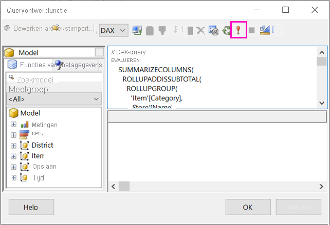
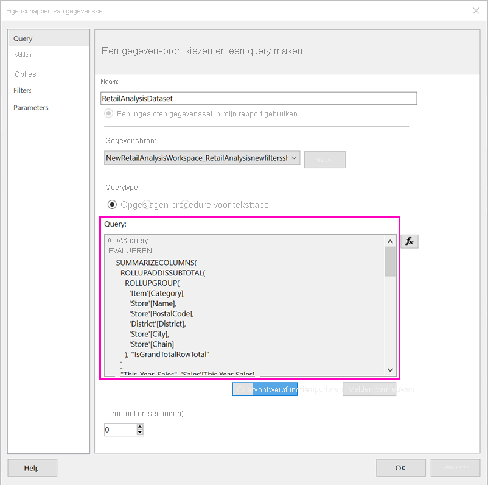

# Een gepagineerd rapport maken op basis van een gedeelde Power BI-gegevensset

U kunt een gegevensset die u in Power BI Desktop maakt, gebruiken als gegevensbron voor gepagineerde rapporten in Power BI Report Builder. Denk aan het volgende scenario: U hebt een Power BI-rapport gemaakt in Power BI Desktop. U hebt veel tijd besteed aan het ontwerpen van het gegevensmodel en vervolgens hebt u een fraai Power BI-rapport gemaakt met allerlei interessante visuals. Uw rapport heeft een matrix met veel rijen, dus u moet schuiven om ze allemaal weer te geven. De lezers van uw rapport willen een rapport dat ze kunnen afdrukken, en waarin alle rijen van die matrix worden weergegeven. Een gepagineerd rapport van Power BI kan dat: een tabel of matrix afdrukken die meerdere pagina's lang is, met paginakopteksten en -voetteksten en een perfecte pagina-lay-out die u ontwerpt. Het vormt een aanvulling op het Power BI Desktop-rapport. U wilt dat ze worden gebaseerd op exact dezelfde gegevens, zonder discrepanties, dus u gebruikt dezelfde gegevensset.

De gegevensset hoeft zich niet in een werkruimte met Premium-capaciteit te bevinden, en u hoeft geen lid te zijn van die werkruimte. U hebt alleen een [Samenstellingmachtiging](../connect-data/service-datasets-build-permissions.md) voor de gegevensset nodig. Als u uw gepagineerde rapport wilt publiceren, hebt u wel een Power BI Pro-licentie nodig. U hebt ook minimaal de rol Inzender nodig voor een werkruimte met Premium-capaciteit.

## Wat u nodig hebt

Hier volgt een lijst met wat u wel en niet nodig hebt om een gedeelde gegevensset te kunnen gebruiken in Power BI Report Builder.

- Power BI Report Builder. [Download en installeer Power BI Report Builder](https://go.microsoft.com/fwlink/?linkid=2086513).
- Om toegang te krijgen tot een Power BI-gegevensset, hebt u een samenstellingsmachtiging nodig voor de gegevensset. Lees meer over de [Samenstellingsmachtiging](../connect-data/service-datasets-build-permissions.md).
- U hebt geen Power BI Pro-licentie nodig om een gepagineerd rapport te maken in Report Builder. 
- U hebt wel een Power BI Pro-licentie nodig als u uw gepagineerde rapport wilt publiceren. U hebt ook minimaal de rol Inzender nodig voor een werkruimte met Premium-capaciteit. 
- Optioneel: Als u mee wilt doen met dit artikel, download dan het bestand [Retail Analysis Sample PBIX.pbix](https://download.microsoft.com/download/9/6/D/96DDC2FF-2568-491D-AAFA-AFDD6F763AE3/Retail%20Analysis%20Sample%20PBIX.pbix) van Power BI Desktop, open het in Power BI Desktop en voeg een tabel met een groot aantal kolommen toe. Schakel in het deelvenster **Opmaak** de optie **Totalen** uit. Publiceer het rapport vervolgens naar een werkruimte in de Power BI-service.

    

## Verbinding maken met de Power BI-gegevensset

1. Open Power BI Report Builder.
1. Selecteer **Aanmelden** in de rechterbovenhoek van Report Builder om u aan te melden bij uw Power BI-account.
1. Selecteer in het deelvenster Rapportgegevens de optie **Nieuw** > **Verbinding met Power BI-gegevensset**.

    

    > [!NOTE]
    > U kunt de gegevensbron of gegevensset voor een Power BI-gegevensset niet maken met behulp van de wizards Tabel, Matrix of Grafiek van Power BI. Nadat u ze hebt gemaakt, kunt u de wizards gebruiken om tabellen, matrices of grafieken te maken op basis ervan.

1. Zoek of blader naar de gegevensset of de werkruimte waar deze zich bevindt en klik op **Selecteren**.
    De naam van de gegevensset wordt ingevuld.

    
    
1. De gegevensset wordt weergegeven onder Gegevensbronnen in het deelvenster Rapportgegevens.

    

    U kunt verbinding maken met meerdere Power BI-gegevenssets in hetzelfde gepagineerde rapport.

## De DAX-query voor de gegevensset ophalen

Wanneer u wilt dat de gegevens in uw Power BI-rapport en in uw Report Builder-rapport hetzelfde zijn, is het niet voldoende om verbinding te maken met de gegevensset. U hebt ook de query nodig die op die gegevensset is gebouwd.

### Video: De DAX-query ophalen

In de volgende video toont Chris Finlan hoe u de DAX kunt ophalen die u nodig hebt voor uw gepagineerde rapport.

<iframe width="400" height="450" src="https://www.youtube.com/embed/NfoOK4QRkhI" frameborder="0" allowfullscreen></iframe>

### Stappen voor het ophalen van de DAX-query

Hier volgen de stappen voor het ophalen van de query.

1. Open het Power BI-rapport (.pbix) in Power BI Desktop.
1. Zorg ervoor dat uw rapport een tabel bevat met alle gegevens die u in het gepagineerde rapport wilt opnemen. De tabel moet voldoen aan deze twee vereisten:
    - Het moet een platte tabel zijn, geen matrix of andere visual. Als het geen tabel is, converteert u het item nu naar een tabel, doorloopt u de Performance Analyzer-stappen die volgen en converteert u de tabel weer naar de gewenste visual.
    - Voor uw numerieke velden moet u *vooraf gedefinieerde metingen* gebruiken. Deze worden weergegeven met een rekenmachinesymbool ernaast. Meer informatie over het [maken van metingen](../transform-model/desktop-measures.md). 

        

1. Selecteer **Performance Analyzer** in het lint **Beeld**.

    

1. Selecteer in het deelvenster **Performance Analyzer** de optie **Opname starten** en selecteer vervolgens **Visuals vernieuwen**.

    

1. Vouw het plusteken ( **+** ) naast de tabelnaam uit en selecteer **Query kopiëren**. De query is de DAX-formule die u nodig hebt voor de gegevensset in Power BI Report Builder.

    

## De gegevensset met de query maken

1. Ga terug naar Power BI Report Builder.
1. Klik met de rechtermuisknop op de gegevensset onder **Gegevensbronnen** en selecteer **Gegevensset toevoegen**.

    

1. Geef deze een naam in Eigenschappen van gegevensset en selecteer **Queryontwerp**.

4. Verzeker u ervan dat **DAX** is geselecteerd en deselecteer het pictogram **Ontwerpmodus**.

    

1. Plak in het bovenste vak de query die u hebt gekopieerd uit Power BI Desktop.

1. Selecteer **Query uitvoeren** (het rode uitroepteken !) om ervoor te zorgen dat uw query werkt. 

    

    U ziet de resultaten van de query in het onderste vak.

    

1. Selecteer **OK**.

    U ziet de query in het **Query**-venster van het dialoogvenster **Eigenschappen van gegevensset**.

    

1. Selecteer **OK**.

    Nu ziet u de nieuwe gegevensset met een lijst van de velden die deze bevat in het deelvenster Rapportgegevens.

    

## Een tabel maken in het rapport

Een snelle manier om een tabel te maken, is met behulp van de wizard Tabel.

1. Selecteer op het lint **Invoegen** de optie **Tabel** > **Wizard Tabel**.

    

1. Kies de gegevensset die u hebt gemaakt met de DAX-query > **Volgende**.

    

1. Selecteer de gewenste velden in **Beschikbare velden** om een platte tabel te maken. U kunt meerdere velden tegelijk selecteren door het eerste gewenste veld te selecteren, de Shift-toets ingedrukt te houden en het laatste veld te selecteren.

    

1. Sleep de velden naar het vak **Waarden** >  **Volgende**.

    

1. Kies de gewenste lay-out-opties > **Volgende**.

1. Selecteer **Voltooien**.
    U ziet uw tabel in de ontwerpweergave.

    

1. Selecteer **Klik om een titel toe te voegen** en voeg een titel toe.

1. Selecteer **Uitvoeren** om een voorbeeld van het rapport te bekijken.

    

1. Selecteer **Afdrukweergave** om te kijken hoe uw rapport eruit zal zien wanneer het wordt afgedrukt. 

    Deze rapportindeling moet wat worden aangepast. Het rapport heeft 54 pagina's, omdat de kolommen en marges de tabel twee pagina's breed maken.

    

## Het rapport opmaken

U hebt verschillende opmaakopties om ervoor te zorgen dat de tabel op één pagina past. 

1. U kunt de paginamarges smaller maken in het deelvenster Eigenschappen. Als u het deelvenster Eigenschappen niet ziet, schakelt u op het lint **Beeld** het selectievakje **Eigenschappen** in.

1. Selecteer het rapport, en niet de tabel of titel.
1. Vouw **Marges** uit in het deelvenster **Rapporteigenschappen** onder **Pagina**, en wijzig alle marges in **0,75 inch**.

    

1. U kunt ook kolommen smaller maken. Selecteer de kolomrand en sleep de rechterkant naar links.

    

1. Een andere optie is om ervoor te zorgen dat de numerieke waarden goed zijn opgemaakt. Selecteer een cel met een numerieke waarde. 
    > [!TIP]
    > U kunt meer dan één cel tegelijk opmaken door de Shift-toets ingedrukt te houden terwijl u de andere cellen selecteert.

    

1. Wijzig op het lint **Start** in de sectie **Getal** de **Standaard**-opmaak in een numerieke notatie zoals **Valuta**.

    

1. Wijzig de stijl van **Tijdelijke aanduidingen** in **Voorbeeldwaarden**, zodat u de opmaak in de cel kunt zien. 

    

1. Verminder zo mogelijk in de sectie **Getal** het aantal decimalen om nog meer ruimte te besparen.

### Lege pagina's weghalen

Zelfs als u de marges en de tabelkolommen smaller hebt gemaakt, kan het nog gebeuren dat om de andere pagina leeg is. Hoe kan dat? Reken maar uit. 

Wanneer u de paginamarges die u hebt ingesteld, optelt bij de breedte van de *hoofdtekst* van het rapport, moet het resultaat kleiner zijn dan de breedte van de rapportindeling.

Stel bijvoorbeeld dat uw rapport een indeling van 8,5 bij 11 inch heeft, en dat u de zijmarges beide hebt ingesteld op 0,75 inch. De twee marges zijn samen 1,5 inch, dus moet de hoofdtekst minder dan 7 inch breed zijn.

1. Selecteer de rechterrand van het ontwerpoppervlak van het rapport, en sleep deze zo dat het op de liniaal minder is dan de gewenste breedte. 

    > [!TIP]
    > U kunt dit nauw keuriger instellen in eigenschappen van de **Hoofdtekst**. Stel onder **Grootte** de eigenschap **Breedte** in.

    

1. Selecteer **Uitvoeren** om een voorbeeld van het rapport te bekijken en te controleren of de lege pagina's nu weg zijn. Dit rapport heeft nu slechts 26 pagina's in plaats van de oorspronkelijke 54. Geslaagd.

    

## Beperkingen en overwegingen 

- Voor gegevenssets die gebruikmaken van een liveverbinding met Analysis Services kunt u rechtstreeks verbinding maken door de onderliggende Analysis Services-verbinding te gebruiken in plaats van een gedeelde gegevensset.
- Gegevenssets met gepromoveerde of gecertificeerde vermeldingen worden weergegeven in de lijst met beschikbare gegevenssets, maar ze worden niet als zodanig gemarkeerd. 
- U kunt geen gepagineerde rapporten insluiten die zijn gebaseerd op gedeelde Power BI-gegevenssets in het scenario 'App is eigenaar van gegevens'.

## Volgende stappen

- [Wat zijn gepagineerde rapporten in Power BI Premium?](paginated-reports-report-builder-power-bi.md)
