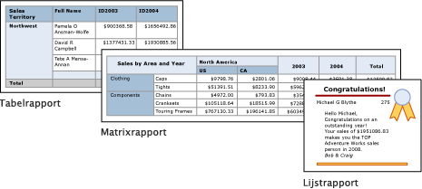

# Tabellen, matrices en lijsten in Power BI Report Builder
 In Report Builder zijn tabellen, matrices en lijsten *gegevensgebieden* waarin gepagineerde rapportgegevens worden weergegeven in cellen die in rijen en kolommen zijn geordend. De cellen bevatten doorgaans tekstgegevens zoals tekst, datums en getallen, maar ze kunnen ook meters, grafieken of rapportitems zoals afbeeldingen bevatten. Gezamenlijk worden tabellen, matrices en lijsten vaak *tablix-gegevensgebieden* genoemd.  
  
 De tabel-, matrix- en lijstsjablonen worden gebouwd in het tablix-gegevensgebied. Dit is een flexibel raster waarin gegevens in cellen kunnen worden weergegeven. In de tabel- en matrixsjablonen worden cellen in rijen en kolommen geordend. Omdat sjablonen variaties van het onderliggende generieke tablix-gegevensgebied zijn, kunt u gegevens weergeven in combinatie met sjabloonindelingen en de tabel, matrix of lijst wijzigen om de functies van een ander gegevensgebied op te nemen wanneer u uw rapport opstelt. Als u bijvoorbeeld een tabel toevoegt maar deze niet aan uw behoeften voldoet, kunt u kolomgroepen toevoegen om van de tabel een matrix te maken.  
  
 In de tabel- en matrixgegevensgebieden kunnen complexe gegevensrelaties worden weergegeven door geneste tabellen, matrices, lijsten, grafieken en meters op te nemen. Tabellen en matrices hebben een indeling met tabbladen. Hun gegevens zijn afkomstig van één gegevensset die op één gegevensbron is gebouwd. Het belangrijkste verschil tussen tabellen en matrices is dat in tabellen alleen rijgroepen kunnen worden opgenomen, terwijl matrices zowel rij- als kolomgroepen kunnen bevatten.  
  
 Lijsten zijn nog weer iets anders. Lijsten bieden ondersteuning voor een vrije indeling en hierin kunnen meerdere peer-tabellen of -matrices zijn opgenomen, elk met gegevens van een andere gegevensset. Ook kunnen lijsten worden gebruikt voor formulieren, zoals facturen.  
  
 In de volgende afbeeldingen ziet u eenvoudige rapporten met een tabel, matrix of lijst.  

  
##   Tabellen  
 Gebruik een tabel om gedetailleerde gegevens weer te geven en/of de gegevens in rijgroepen te ordenen. De sjabloon Tabel bevat drie kolommen met een tabelheaderrij en een rij met details voor gegevens. In de volgende afbeelding ziet u de initiële tabelsjabloon, die in de ontwerpweergave is geselecteerd:  

  
 U kunt gegevens op één veld, op meerdere velden of met behulp van uw eigen expressie groeperen. U kunt geneste of onafhankelijke, aangrenzende groepen maken en geaggregeerde waarden voor gegroepeerde gegevens weergeven of totalen aan groepen toevoegen. Als uw tabel bijvoorbeeld een rij met de naam **Categorie** heeft, kunt u een subtotaal voor elke groep en een totaal voor het rapport toevoegen. Als u de weergave van de tabel wilt verbeteren en gegevens wilt markeren die u wilt benadrukken, kunt u cellen samenvoegen en opmaak op gegevens en tabelkoppen toepassen.  
  
 U kunt details of gegroepeerde gegevens eerst verbergen en drilldown-schakelknoppen opnemen zodat gebruikers interactief kunnen kiezen hoeveel gegevens moeten worden weergegeven.  
  
##   Matrices  
 Gebruik een matrix om geaggregeerde samenvattingen van gegevens weer te geven, gegroepeerd in rijen en kolommen (zoals bij een draai- of kruistabel). Het aantal rijen en kolommen voor groepen wordt bepaald door het aantal unieke waarden voor elke rij- en kolomgroep. In de volgende afbeelding ziet u de initiële matrixsjabloon, die in de ontwerpweergave is geselecteerd:  

 
 U kunt gegevens op meerdere velden of expressies groeperen in rij- en kolomgroepen. Tijdens de runtime, wanneer de rapportgegevens en gegevensgebieden worden gecombineerd, wordt horizontaal en verticaal op de pagina een matrix weergegeven die steeds groter wordt naarmate er meer kolommen aan kolomgroepen en rijen aan rijgroepen worden toegevoegd. In de matrixcellen worden de geaggregeerde waarden weergegeven die op het snijpunt van de rij- en kolomgroepen waartoe de cel behoort, zijn gericht. Als uw matrix bijvoorbeeld bestaat uit een rijgroep (Categorie) en twee kolomgroepen (Gebied en Jaar) waarin de som van alle verkoopactiviteiten wordt weergegeven, worden in het rapport twee cellen weergegeven met daarin de sommen van de verkoopactiviteiten voor elke waarde in de groep Categorie. Het bereik van de cellen zijn de twee snijpunten, in dit geval: Categorie en Gebied, en Categorie en Jaar. De matrix kan geneste en aangrenzende groepen bevatten. Geneste groepen hebben een bovenliggende/onderliggende relatie; aangrenzende groepen hebben een peer-relatie. U kunt subtotalen toevoegen voor elke en alle niveaus van geneste rij- en kolomgroepen in de matrix.  
  
 Als u de matrixgegevens gemakkelijker leesbaar wilt maken en de gegevens wilt markeren die u wilt benadrukken, kunt u cellen samenvoegen of horizontaal en verticaal splitsen of opmaak toepassen op gegevens- en groepskoppen.  
  
 U kunt ook drilldown-schakelknoppen opnemen waarmee details in eerste instantie worden verborgen; gebruikers kunnen zelf op de schakelknoppen klikken als ze meer of minder details willen zien.  
  
##   Lijsten  
 Gebruik een lijst om een vrije indeling te maken. U bent niet gebonden aan een rasterindeling, maar u kunt velden juist waar u maar wilt in de lijst plaatsen. Met behulp van lijsten kunt u een formulier ontwerpen waarmee u veel gegevenssetvelden kunt weergeven, of als container om meerdere gegevensgebieden naast elkaar weer te geven voor gegroepeerde gegevens. U kunt bijvoorbeeld een groep voor een lijst definiëren, een tabel, grafiek en afbeelding toevoegen en waarden in de vorm van tabellen of een afbeelding weergeven voor elke groepswaarde, zoals u bijvoorbeeld ook voor een werknemers- of patiëntendossier zou doen.  

  
##   Gegevens voorbereiden  
 In gegevensgebieden in een tabel, matrix en lijst worden gegevens uit een gegevensset weergegeven. U kunt de gegevens voorbereiden in de query waarmee de gegevens voor de gegevensset worden opgehaald of door eigenschappen in te stellen in de tabel, matrix of lijst.  
  
 Met de querytalen zoals Transact-SQL, die u gebruikt om de gegevens voor de rapportgegevenssets op te halen, kunt u de gegevens voorbereiden door filters toe te passen zodat alleen een subset van de gegevens wordt opgenomen, waarbij null-waarden of lege velden worden vervangen door constanten waardoor het rapport makkelijker te lezen is, en door gegevens te sorteren en te groeperen.  
  
 Als u de gegevens gaat voorbereiden in het gegevensgebied van een tabel, matrix of lijst, moet u eigenschappen voor het gegevensgebied of cellen in het gegevensgebied instellen. Als u de gegevens wilt filteren of sorteren, moet u de eigenschappen voor het gegevensgebied instellen. Als u bijvoorbeeld gegevens wilt sorteren, geeft u de kolommen waarop moet worden gesorteerd en de sorteerrichting op. Als u een alternatieve waarde voor een veld wilt opgeven, stelt u de waarden van de celtekst in waarin het veld wordt weergegeven. Als bijvoorbeeld Leeg moet worden weergegeven als een veld leeg of null is, gebruikt u een expressie om de waarde in te stellen.  
  
##   Een tabel, matrix of lijst bouwen en configureren  
 Wanneer u tabellen of matrices aan uw rapport toevoegt, kunt u de tabel- en matrixwizard gebruiken of de tabellen of matrices handmatig bouwen met behulp van de Report Builder-sjablonen. Lijsten worden handmatig gebouwd met behulp van de lijstsjabloon.  
  
 De wizard begeleidt u door de stappen om snel een tabel of matrix te bouwen en te configureren. Zodra u de wizard hebt voltooid of als u de tablix-gegevensgebieden helemaal vanaf het begin bouwt, kunt u ze verder configureren en verfijnen. Met behulp van dialoogvensters (beschikbaar via de contextmenu's van de gegevensgebieden) kunt u eenvoudig de meest gebruikte eigenschappen voor pagina-einden, herhaalbaarheid en zichtbaarheid van headers en footers, weergaveopties, filters en sorteringen instellen. Maar het tablix-gegevensgebied biedt tal van aanvullende eigenschappen, die u alleen in het deelvenster Eigenschappen van Report Builder kunt instellen. Als u bijvoorbeeld een bericht wilt weergeven wanneer de gegevensset voor een tabel, matrix of lijst leeg is, geeft u de berichttekst op in de tablix-eigenschap NoRowsMessage in het deelvenster Eigenschappen.  
  
##   Wisselen tussen tablix-sjablonen  
 Welke tablix-sjabloon u in eerste instantie kiest, maakt niet uit. Wanneer u groepen, totalen en labels toevoegt, wilt u wellicht uw tablix-ontwerp aanpassen. U begint bijvoorbeeld met een tabel en u wilt vervolgens de rij met details verwijderen en kolomgroepen toevoegen.  
  
 U kunt doorgaan met het ontwikkelen van een tabel, matrix of lijst door eender welke tablix-functie toe te voegen. Tablix-functies zijn bijvoorbeeld de weergave van gedetailleerde gegevens of aggregaties voor gegroepeerde gegevens in rijen en kolommen. U kunt geneste groepen, onafhankelijke aangrenzende groepen of recursieve groepen maken. U kunt gegroepeerde gegevens filteren en sorteren en groepen eenvoudig combineren door meerdere groepsexpressies op te nemen in een groepsdefinitie  
  
 Ook kunt u totalen voor een groep of totalen voor het gegevensgebied toevoegen. U kunt rijen of kolommen verbergen om een rapport te vereenvoudigen en gebruikers de mogelijkheid geven om tussen de weergave van verborgen gegevens te wisselen, net zoals in een drilldown-rapport. 

## Volgende stappen

- [Wat zijn gepagineerde rapporten in Power BI Premium?](paginated-reports-report-builder-power-bi.md)
