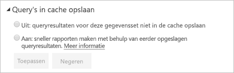

# Query opslaan in cache in Power BI Premium

Organisaties met Power BI Premium kunnen gebruikmaken van *query opslaan in cache* om rapporten die zijn gekoppeld aan een gegevensset sneller weer te geven. Hierbij kan de Premium-capaciteit gebruikmaken van de lokale cacheservice om de queryresultaten op te slaan, zodat de onderliggende gegevensbron deze resultaten niet meer hoeft te berekenen.

> [!IMPORTANT]
> Query opslaan in cache is alleen beschikbaar in Power BI Premium. Het is niet van toepassing op Live Connect-gegevenssets die gebruikmaken van Azure Analysis Services of SQL Server Analysis Services.

Queryresultaten in cache zijn specifiek voor de gebruiker en gegevensset en volgen altijd de beveiligingsregels. Momenteel wordt alleen een query in de cache opgeslagen voor de oorspronkelijke pagina waarop u terechtkomt. Met andere woorden, query's worden niet in de cache opgeslagen wanneer u werkt met het rapport. De cache bevat persoonlijke bladwijzers en permanente filters. [Dashboardtegels](service-dashboard-tiles.md) die worden aangestuurd door de dezelfde query's profiteren er ook van wanneer de query in de cache is opgeslagen. Het levert met name een voordeel op met betrekking tot de prestaties wanneer een gegevensset vaak wordt geopend en niet vaak hoeft te worden vernieuwd. Als u query's in de cache opslaat, kan de belasting op uw Premium-capaciteit ook worden teruggedrongen door het totale aantal query's te reduceren.

U kunt de instellingen voor query's in de cache opgeven op de pagina **Instellingen** voor de gegevensset in de Power BI-service. Het heeft twee mogelijke instellingen:

- **Uit**: Voor deze gegevensset worden geen query's in de cache opgeslagen.

- **Aan**: Voor deze gegevensset worden query's in de cache opgeslagen.

> [!NOTE]
> Wanneer u de cache-instellingen wijzigt van **Aan** naar **Uit**, worden alle eerder opgeslagen queryresultaten voor de gegevensset verwijderd uit de cache van de capaciteit. U kunt het opslaan van query's in de cache expliciet uitschakelen of de standaardinstelling voor een capaciteit gebruiken, die door een beheerder is ingesteld op **Uit**. Wanneer u de cache-instelling uitschakelt, vindt er mogelijk een kleine vertraging plaats wanneer een rapport query's op deze gegevensset uitvoert. De vertraging wordt veroorzaakt door de rapportquery's die op aanvraag worden uitgevoerd en geen gebruikmaken van de opgeslagen resultaten. Bovendien moet de vereiste gegevensset mogelijk in het geheugen geladen zijn voordat u hiervoor query's kunt uitvoeren.

