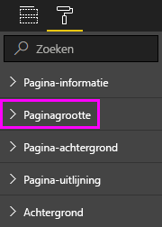

# Instellingen voor de paginaweergave in een Power BI-rapport
We begrijpen dat het essentieel is dat uw rapport perfect is ingedeeld. Dit kan lastig zijn omdat u en uw collega's dezelfde rapporten mogelijk weergeven op schermen met verschillende verhoudingen en afmetingen. 

De standaardweergave is **Aanpassen aan pagina** en standaardgrootte van de weergave is **16:9**. Als u een andere hoogte-breedteverhouding wilt vastleggen of uw rapport op een andere manier wilt aanpassen, kunt u twee opties gebruiken: instellingen voor ***Paginaweergave*** en instellingen voor ***Paginaformaat***.

<iframe width="560" height="315" src="https://www.youtube.com/embed/5tg-OXzxe2g" frameborder="0" allowfullscreen></iframe>

## Locatie van de instellingen voor Paginaweergave in de Power BI-service en in Power BI Desktop
De instellingen voor de paginaweergave zijn zowel beschikbaar in de Power BI-service als in Power BI Desktop, maar de interfaces zijn niet helemaal hetzelfde. In de volgende secties wordt uitgelegd waar u de weergave-instellingen in de Power BI-hulpprogramma's kunt vinden.

### In Power BI Desktop
Selecteer in de rapportweergave het tabblad **Weergeven** om de Instellingen voor paginaweergave en de instellingen voor de telefoonindeling te openen.

  

### In de Power BI-service (app.powerbi.com)
Open een rapport in de Power BI-service en selecteer **Weergeven** in de menubalk linksboven.

Instellingen voor paginaweergave zijn beschikbaar voor zowel de [leesweergave als de bewerkingsweergave](consumer/end-user-reading-view.md). De rapporteigenaar kan in de bewerkingsweergave instellingen voor de paginaweergave toewijzen aan afzonderlijke rapportpagina's. Deze instellingen worden opgeslagen met het rapport. Wanneer collega’s dat rapport openen in de leesweergave, worden de rapportpagina's weergegeven volgens de instellingen van de eigenaar. In de leesweergave kunnen collega's *een aantal* instellingen voor **Paginaweergave** wijzigen, maar de wijzigingen worden niet opgeslagen wanneer ze het rapport afsluiten.

## Instellingen voor paginaweergave
Met de eerste set instellingen voor Paginaweergave wordt bepaald hoe de rapportpagina wordt weergegeven ten opzichte van het browservenster. Kies tussen:

* **Aanpassen aan pagina** (standaard): de inhoud wordt geschaald om op de pagina te passen
* **Aan breedte aanpassen**: de inhoud wordt geschaald om te passen binnen de breedte van de pagina
* **Werkelijke grootte**: de inhoud wordt weergegeven op volledige grootte

Met de tweede set instellingen voor Paginaweergave wordt bepaald hoe objecten op het rapportcanvas worden geplaatst. Kies tussen:

* **Rasterlijnen weergeven**: schakel rasterlijnen in om objecten op het rapportcanvas te plaatsen.
* **Uitlijnen op raster**: gebruik deze optie in combinatie met **Rasterlijnen weergeven** om objecten nauwkeurig te plaatsen en uit te lijnen op het rapportcanvas. 
* **Objecten vergrendelen**: vergrendel alle objecten op het canvas zodat deze niet kunnen worden verplaatst of gewijzigd.
* **Selectiedeelvenster**: het deelvenster **Selectie** bevat alle objecten op het canvas. U kunt bepalen welke objecten worden weergegeven en welke objecten worden verborgen.

    

## Instellingen voor paginaformaat

De instellingen voor **Paginaformaat** zijn alleen beschikbaar voor rapporteigenaren. In de Power BI-service (app.powerbi.com) betekent dit dat u het rapport kunt openen in de [bewerkingsweergave](consumer/end-user-reading-view.md). De instellingen voor **Paginaformaat** bevinden zich in het deelvenster **Visualisaties** en bepalen de hoogte-breedteverhouding en de werkelijke grootte (in pixels) van het rapportcanvas:   

* 4:3-verhouding
* 16:9-verhouding (standaard)
* Cortana
* Letter
* Aangepast (hoogte en breedte in pixels)

## Volgende stappen
[Rapportweergave in Power BI Desktop](desktop-report-view.md)

[De instellingen voor Paginaweergave en Paginaformaat wijzigen in uw eigen Power BI-rapporten](consumer/end-user-report-view.md)

Lees meer over [rapporten in Power BI](consumer/end-user-reports.md)

[Basisconcepten voor ontwerpers in de Power BI-service](service-basic-concepts.md)

Hebt u nog vragen? [Misschien dat de Power BI-community het antwoord weet](https://community.powerbi.com/)

