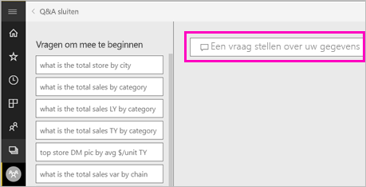
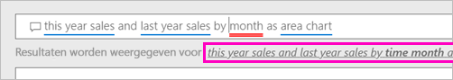
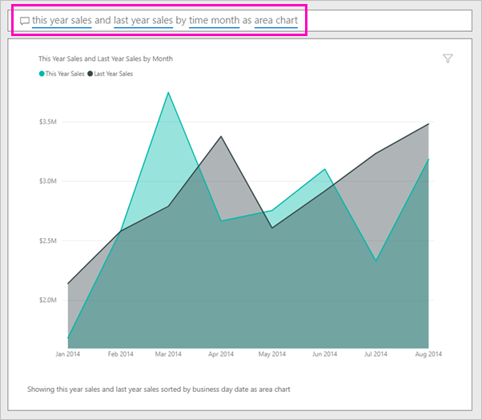

# Een visual maken met Power BI Q&A

Soms krijgt u het snelst een antwoord uit uw gegevens wanneer u een vraag stelt in natuurlijke taal.  In dit artikel bekijken we twee verschillende manieren om dezelfde visualisatie te maken: ten eerste een vraag stellen met Q&A en ten tweede samenstellen in een rapport. We gebruiken Power BI-service om de visual in het rapport samen te stellen, maar het proces is bijna identiek aan als u dit doet met behulp van Power BI Desktop.

Als u dit wilt volgen, moet u een rapport gebruiken dat u kunt bewerken. Daarom maken we gebruik van een van de voorbeelden die beschikbaar zijn met Power BI.

## Een visual maken met Q&A

Hoe zouden we dit lijndiagram maken met Q&A?

1. Selecteer in de Power BI-werkruimte **Gegevens ophalen** \> **Voorbeelden** \> **Voorbeeld van een retailanalyse** > **Verbinding maken**.

1. Open het dashboard met het voorbeeld van een retailanalyse en plaats de cursor in het vak Q&A, **Stel een vraag over uw gegevens**.

    

2. Typ in het vak Q&A iets zoals deze vraag:
   
    **verkoop van dit jaar en van vorig jaar per maand als vlakdiagram**
   
    Als u een vraag typt, kiest de Q&A-functie de beste visualisatie om uw antwoord weer te geven. De visualisatie wordt dynamisch gewijzigd als u de vraag wijzigt. Q&A helpt u ook om uw vraag te formuleren door suggesties te bieden, de vraag automatisch aan te vullen en spellingcorrecties toe te passen. Q&A raadt een kleine wijziging in de formulering aan: "verkoop van dit jaar en van vorig jaar per *tijdstip/maand* als vlakdiagram".  

    

4. Selecteer de zin om de suggestie te accepteren. 
   
   Als u de vraag hebt getypt, resulteert dit in hetzelfde diagram als u in het dashboard hebt gezien.
   
   

4. Selecteer het speldpictogram om uw diagram aan het dashboard vast te maken  in de rechterbovenhoek.

## Een visual maken in de rapporteditor

1. Navigeer terug naar het dashboard Voorbeeld van een retailanalyse.
   
2. Het dashboard bevat dezelfde vlakdiagramtegel voor de omzet van het afgelopen jaar en de omzet van dit jaar.  Selecteer deze tegel. Selecteer niet de tegel die u hebt gemaakt met Q&A. Als u deze selecteert, wordt Q&A geopend. De oorspronkelijke vlakdiagramtegel is echter gemaakt in een rapport, waardoor het rapport wordt geopend op de pagina met deze visualisatie.

    

1. Open het rapport in de bewerkingsweergave en selecteer **Rapport bewerken**.  Als u niet de eigenaar van een rapport bent, kunt u het rapport niet openen in de bewerkingsweergave.
   
    
4. Selecteer het vlakdiagram en controleer de instellingen in het deelvenster **Velden**.  De maker van het rapport heeft dit diagram samengesteld door deze drie waarden (**Verkoop vorig jaar** en **Verkoop dit jaar > Waarde** uit de tabel **Verkoop** en **FiscalMonth** uit de tabel **Tijd**) te selecteren en ze te ordenen in de bronnen **As** en **Waarden**.
   
    

    U ziet dat ze uiteindelijk dezelfde visual hebben. Het was niet al te moeilijk om deze te maken. Maar het maken met Q&A was eenvoudiger!

## Volgende stappen

- [Q&A in dashboards en rapporten gebruiken](power-bi-tutorial-q-and-a.md)  
- [Q&A voor gebruikers](consumer/end-user-q-and-a.md)
- [Uw gegevens geschikt maken voor Q&A in Power BI](service-prepare-data-for-q-and-a.md)

Hebt u nog vragen? [Misschien dat de Power BI-community het antwoord weet](https://community.powerbi.com/)

