# <a name="configure-power-bi-report-server-with-azure-application-proxy"></a>Een Power BI Report Server configureren met Azure-toepassingsproxy

In dit artikel wordt besproken hoe u Azure Active Directory-toepassingsproxy kunt gebruiken om verbinding te maken met Power BI Report Server en SQL Server Reporting Services (SSRS) 2016 en hoger. Via deze integratie hebben gebruikers die zich buiten het bedrijfsnetwerk bevinden toegang tot hun Power BI Report Server- en Reporting Services-rapporten vanuit hun clientbrowser en worden ze beschermd door verificatie vooraf door Azure Active Directory (AD). Zie [Azure Active Directory-toepassingsproxy](https://docs.microsoft.com/azure/active-directory/manage-apps/application-proxy) voor meer informatie over externe toegang tot on-premises toepassingen.

## <a name="environment-details"></a>Omgevingsdetails

We hebben deze waarden gebruikt in het voorbeeld dat we hebben gemaakt. 

- Domein: umacontoso.com
- Power BI Report Server: PBIRSAZUREAPP.umacontoso.com
- SQL Server-gegevensbron: SQLSERVERAZURE.umacontoso.com

## <a name="configure-power-bi-report-server"></a>Power BI Report Server configureren

Na de installatie van Power BI Report Server (uitgaande van een Azure-VM) configureert u de URL's van de Power BI Report Server-webservice en webportal door de volgende stappen uit te voeren:

1. Maak regels voor binnenkomend en uitgaand verkeer op de VM-Firewall voor poort 80 (poort 443 als u HTTPS-URL's hebt geconfigureerd). Maak ook regels voor binnenkomend en uitgaand verkeer voor de Azure-VM vanuit de Azure-portal voor TCP-protocol - poort 80.
2. De DNS-naam die voor de virtuele machine in onze omgeving is geconfigureerd, is `pbirsazureapp.eastus.cloudapp.azure.com`.
3. Configureer de URL voor de externe Power BI Report Server-webservice en webportal door het tabblad **Geavanceerd** te selecteren > knop **Toevoegen** > **Kies naam van host-header** en voeg de hostnaam (DNS-naam) toe, zoals hier wordt weergegeven.

    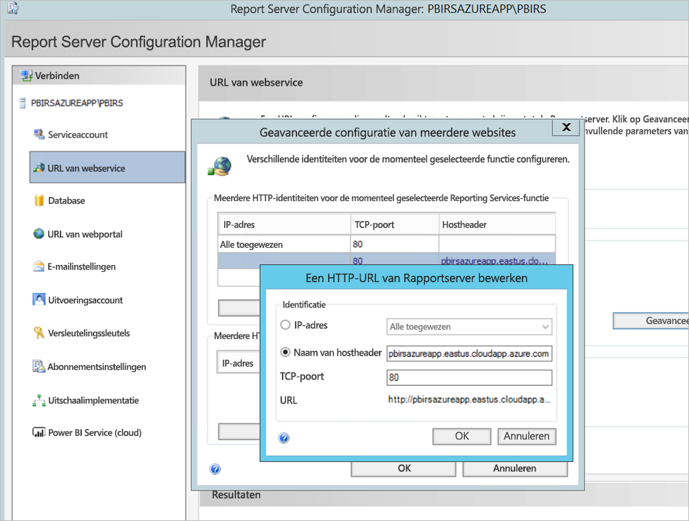

1. We hebben de vorige stap uitgevoerd voor zowel de sectie Webservice als de sectie Webportal en we hebben de URL's gekregen die zijn geregistreerd in de Report Server Configuration Manager:

    - `https://pbirsazureapp.eastus.cloudapp.azure.com/ReportServer`
    - `https://pbirsazureapp.eastus.cloudapp.azure.com/Reports`

2. In de Azure-portal zien we twee IP-adressen voor de virtuele machine in de netwerksectie 

    - **Openbare IP**. 
    - **Privé IP-adres**. 
    
    Het openbare IP-adres wordt gebruikt voor toegang van buiten de virtuele machine.

3. Daarom hebben we de vermelding voor het hostbestand op de VM (Power BI Report Server) toegevoegd om het openbare IP-adres en de hostnaam `pbirsazureapp.eastus.cloudapp.azure.com` op te nemen.
4. Wanneer de virtuele machine opnieuw wordt opgestart, is het mogelijk dat het dynamische IP-adres verandert, in welk geval u het juiste IP-adres opnieuw moet toevoegen in het hostbestand. U kunt dit voorkomen door het openbare IP-adres in de Azure-portal in te stellen op Statisch.
5. De URL's van de webservice en webportal moeten toegankelijk zijn nadat u de bovenstaande wijzigingen hebt aangebracht.
6. Bij het openen van de URL `https://pbirsazureapp.eastus.cloudapp.azure.com/ReportServer` op de server, wordt er drie keer om referenties gevraagd, waarna er een leeg scherm wordt weergegeven.
7. Voeg de volgende registervermelding toe:

    registersleutel `HKEY\_LOCAL\_MACHINE \SYSTEM\CurrentControlset\Control \Lsa\ MSV1\_0`

1. Voeg een nieuwe waarde `BackConnectionHostNames` toe, een waarde met meerdere tekenreeksen en geef de hostnaam `pbirsazureapp.eastus.cloudapp.azure.com` op.

Daarna hebben we ook toegang tot de URL's op de server.

## <a name="configure-power-bi-report-server-to-work-with-kerberos"></a>Power BI Report Server configureren voor het gebruik van Kerberos

### <a name="1-configure-the-authentication-type"></a>1. Het verificatietype configureren

We moeten het verificatietype voor de rapportserver configureren om beperkte Kerberos-delegering mogelijk te maken. Deze configuratie gebeurt in het bestand **rsreportserver.config**.

Zoek in het bestand rsreportserver.config naar de sectie **Authentication/AuthenticationTypes**.

Controleer of RSWindowsNegotiate wordt vermeld en of deze bovenaan staat in de lijst met verificatietypen. De koppeling moet er als volgt uitzien.

```
<AuthenticationTypes>

    <RSWindowsNegotiate/>

</AuthenticationTypes>
```

Als u het configuratiebestand moet wijzigen, **stopt u de rapportserverservice en start u deze weer** vanuit Report Server Configuration Manager om de wijzigingen door te voeren.

### <a name="2-register-service-principal-names-spns"></a>2. SPN's (Service Principal Names) registreren

Open de opdrachtprompt als beheerder en voer de volgende stappen uit.

Registreer de volgende SPN's onder het account **Power BI Report Server-serviceaccount** met behulp van de volgende opdrachten

```
setspn -s http/ Netbios name\_of\_Power BI Report Server\_server<space> Power BI Report Server\_ServiceAccount

setspn -s http/ FQDN\_of Power BI Report Server\_server<space> Power BI Report Server\_ServiceAccount
```

Registreer de volgende SPN's onder het SQL Server-serviceaccount met behulp van de volgende opdrachten (voor een standaardexemplaar van SQL Server):

```
setspn -s MSSQLSVC/FQDN\_of\_SQL\_Server: 1433 (PortNumber) <SQL service service account>

setspn -s MSSQLSVC/FQDN\_of\_SQL\_Server<SQL service service account>
```

### <a name="3-configure-delegation-settings"></a>3. Delegatie-instellingen configureren

We moeten de delegatie-instellingen voor het serviceaccount van de rapportserver configureren.

1. Open Active Directory-gebruikers en -computers.
2. Open de Eigenschappen van het serviceaccount van de rapportserver in Active Directory-gebruikers en computers.
3. We gaan beperkte delegatie configureren met protocoldoorvoer. Met beperkte delegatie moet u expliciet zijn met betrekking tot aan welke services u wilt delegeren.
4. Klik met de rechtermuisknop op het **serviceaccount van de rapportserver** en selecteer **Eigenschappen**.
5. Selecteer het tabblad **Delegering**.
6. Selecteer **Deze gebruiker mag alleen aan opgegeven services delegeren**.
7. Selecteer **Elk verificatieprotocol gebruiken**.
8. Selecteer **Toevoegen** onder **Services waaraan dit account gedelegeerde referenties kan presenteren**.
9. Selecteer **Gebruikers of computers** in het nieuwe dialoogvenster.
10. Voer het **serviceaccount voor de SQL Server-service** in en selecteer **OK**.

    Het begint met MSSQLSVC.

1. Voeg de SPN's toe.
2. Selecteer **OK**. De SPN staat nu in de lijst.

Met deze stappen kunt u Power BI Report Server configureren voor het gebruik van het Kerberos-verificatiemechanisme en de testverbinding met de gegevensbron op uw lokale computer tot stand brengen.

## <a name="configure-azure-application-proxy-connector"></a>Azure Application Proxy Connector configureren

Raadpleeg het artikel over [configuratie met betrekking tot de Application Proxy Connector](https://docs.microsoft.com/azure/active-directory/manage-apps/application-proxy-add-on-premises-application#add-an-on-premises-app-to-azure-ad)

We hebben de Application Proxy Connector geïnstalleerd op Power BI Report Server, maar u kunt deze configureren op een afzonderlijke server en ervoor zorgen dat delegatie correct is ingesteld.

### <a name="ensure-the-connector-is-trusted-for-delegation"></a>Ervoor zorgen dat de Connector wordt vertrouwd voor delegatie

Zorg ervoor dat de Connector wordt vertrouwd voor delegatie naar de SPN die is toegevoegd aan het account van de groep van toepassingen van de rapportserver.

Configureer KCD (beperkte Kerberos-delegering), zodat de Azure AD-toepassingsproxy-service gebruikersidentiteiten kan delegeren aan het account van de groep van toepassingen van de rapportserver. Configureer KCD zodanig dat de Application Proxy Connector Kerberos-tickets ophaalt voor uw gebruikers die zijn geverifieerd in Azure AD. Daarna geeft die server de context door aan de doeltoepassing, in dit geval Power BI Report Server.

Voor de configuratie van KCD herhaalt u de volgende stappen voor elke connectorcomputer.

1. Meld u als een domeinbeheerder aan bij een domeincontroller en open **Active Directory-gebruikers en -computers**.
2. Zoek de computer waarop de connector wordt uitgevoerd.
3. Dubbelklik op de computer en selecteer het tabblad **Delegatie**.
4. Stel de delegatie-instellingen in op **Deze computer mag alleen delegeren aan de opgegeven services**. Selecteer vervolgens **Elk verificatieprotocol gebruiken**.
5. Selecteer **Toevoegen** en vervolgens **Gebruikers of Computers**.
6. Voer het serviceaccount in dat u voor Power BI Report Server gebruikt. Dit account is het account waaraan u in de configuratie van de rapportserver de SPN hebt toegevoegd.
7. Klik op **OK**. 
8. Klik op **OK** om de wijzigingen op te slaan.

## <a name="publish-through-azure-ad-application-proxy"></a>Publiceren via Azure AD-toepassingsproxy

Nu kunt u Azure AD-toepassingsproxy gaan configureren.

Publiceer Power BI Report Server via een toepassingsproxy met de volgende instellingen. Zie [Toepassingen publiceren met Azure AD-toepassingsproxy](https://docs.microsoft.com/azure/active-directory/manage-apps/application-proxy-add-on-premises-application#add-an-on-premises-app-to-azure-ad) voor stapsgewijze instructies voor het publiceren van een toepassing via een toepassingsproxy.

- **Interne URL**: Voer de URL naar de rapportserver in waartoe de connector in het bedrijfsnetwerk toegang heeft. Zorg dat deze URL bereikbaar is vanaf de server waarop de connector is geïnstalleerd. Een best practice is het gebruik van een domein op het hoogste niveau, zoals `https://servername/`, om problemen te voorkomen met subpaden die zijn gepubliceerd via toepassingsproxy. Gebruik bijvoorbeeld `https://servername/` en niet `https://servername/reports/` of `https://servername/reportserver/`. We hebben onze omgeving geconfigureerd met `https://pbirsazureapp.eastus.cloudapp.azure.com/`.

    > [!NOTE]
    > U kunt het beste een beveiligde HTTPS-verbinding met de rapportserver gebruiken. Zie [SSL-verbindingen configureren op een rapportserver in de native modus](https://docs.microsoft.com/sql/reporting-services/security/configure-ssl-connections-on-a-native-mode-report-server?view=sql-server-2017) voor meer informatie over hoe u dit doet.

- **Externe URL**: Voer de openbare URL in waarmee de mobiele Power BI-app verbinding maakt. Als er een aangepast domein wordt gebruikt, kan het er bijvoorbeeld uitzien als `https://reports.contoso.com`. Als u een aangepast domein wilt gebruiken, uploadt u een certificaat voor het domein en laat u een DNS-record naar het standaarddomein msappproxy.net voor uw toepassing wijzen. Zie [Aangepaste domeinen configureren met Azure AD-toepassingsproxy](https://docs.microsoft.com/azure/active-directory/manage-apps/application-proxy-configure-custom-domain) voor gedetailleerde stappen.

We hebben de externe URL voor onze omgeving geconfigureerd als `https://pbirsazureapp-umacontoso2410.msappproxy.net/`.

- **Pre-authenticatiemethode**: Azure Active Directory
- **Connectorgroep**: Standaard.

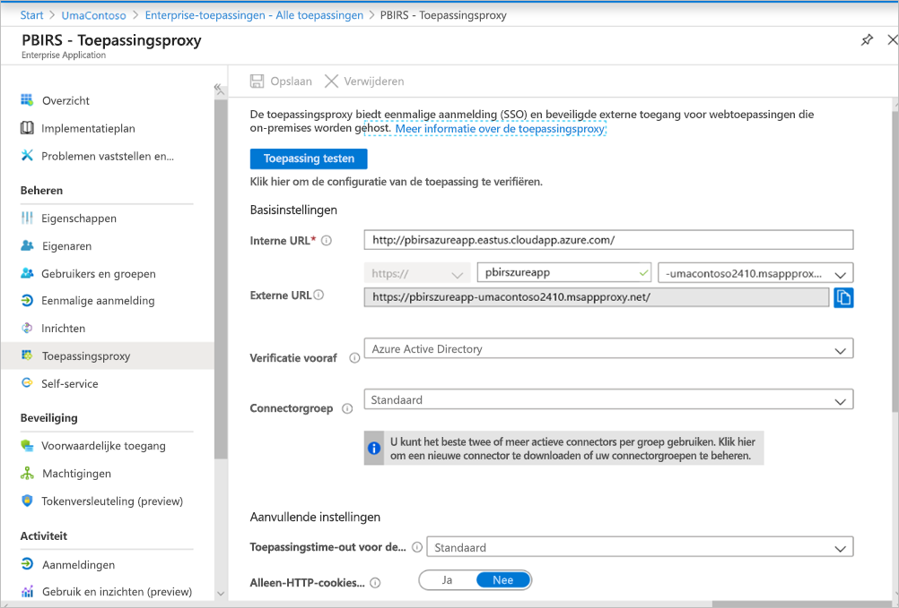

Er zijn geen wijzigingen aangebracht in de sectie **Aanvullende instellingen**. Deze is geconfigureerd met de standaardopties.

> [!IMPORTANT]
> Houd er rekening mee dat bij het configureren van de toepassingsproxy de eigenschap **Toepassingstime-out voor de back-end** is ingesteld op **standaard** (85 seconden). Als u rapporten hebt die langer dan 85 seconden duren om uit te voeren, stelt u deze eigenschap in op **Lang** (180 seconden). Dit is de hoogst mogelijke time-outwaarde. Bij de configuratie van **Lang** moeten alle rapporten binnen 180 seconden worden voltooid, anders treedt een time-out en een fout op.


### <a name="configure-single-sign-on"></a>Eenmalige aanmelding configureren

Nadat de app is gepubliceerd, configureert u de instellingen voor eenmalige aanmelding met de volgende stappen:

1. Selecteer op de toepassingspagina in de Portal de optie **Eenmalige aanmelding**.
2. Selecteer bij **Modus Eenmalige aanmelding** de optie **Geïntegreerde Windows-verificatie**.
3. Stel **SPN voor interne toepassing** in op de waarde die u eerder hebt ingesteld. U kunt deze waarde identificeren met behulp van de volgende stappen:

    - Probeer een rapport uit te voeren of een testverbinding met de gegevensbron tot stand te brengen, zodat er een Kerberos-ticket wordt gemaakt.
    - Nadat het rapport is gemaakt of een testverbinding tot stand is gebracht, opent u de opdrachtprompt en voert u de volgende opdracht uit: `klist`. In de sectie met resultaten ziet u een ticket met `http/` SPN. Als dit hetzelfde is als de SPN die u hebt geconfigureerd met Power BI Report Server, gebruikt u deze SPN in deze sectie.

1. Kies de **Gedelegeerde aanmeldingsidentiteit** voor de connector die u namens uw gebruikers wilt gebruiken. Zie [Werken met verschillende on-premises en cloud-identiteiten](https://docs.microsoft.com/azure/active-directory/manage-apps/application-proxy-configure-single-sign-on-with-kcd#working-with-different-on-premises-and-cloud-identities) voor meer informatie.

    U kunt het beste de principal-naam van de gebruiker gebruiken. In ons voorbeeld hebben we deze geconfigureerd om te werken met de optie **Principal-naam van gebruiker**:

    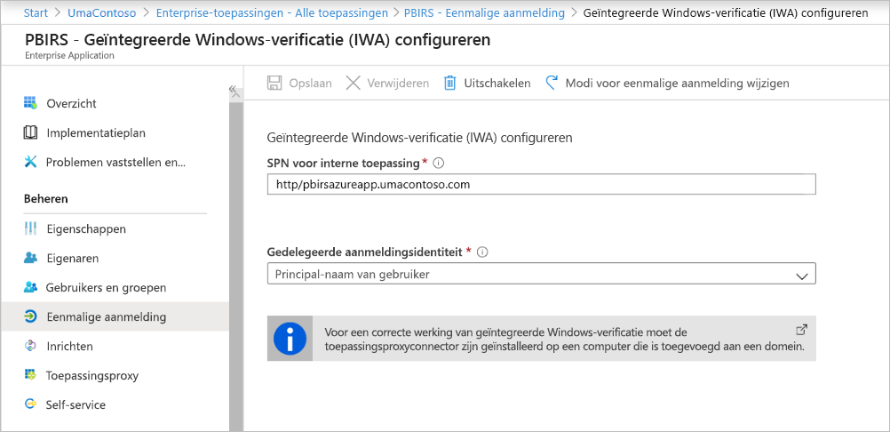

1. Klik op **Opslaan** om uw wijzigingen op te slaan.

### <a name="finish-setting-up-your-application"></a>De configuratie van uw toepassing voltooien

U voltooit het instellen van uw toepassing door naar de sectie **Gebruikers en groepen** te gaan en gebruikers toe te wijzen die toegang krijgen tot deze toepassing.

1. Configureer de sectie **Verificatie** van de app-registratie voor de Power BI Report Server-toepassing als volgt voor **Omleidings-URL's** en **Geavanceerde instellingen**:

    - Een nieuwe omleidings-URL maken en deze configureren met **Type** = **Web** en **Omleidings-URI** = `https://pbirsazureapp-umacontoso2410.msappproxy.net/`
    - In de sectie **Geavanceerde instellingen** stelt u de **URL voor afmelden** in op `https://pbirsazureapp-umacontoso2410.msappproxy.net/?Appproxy=logout`

    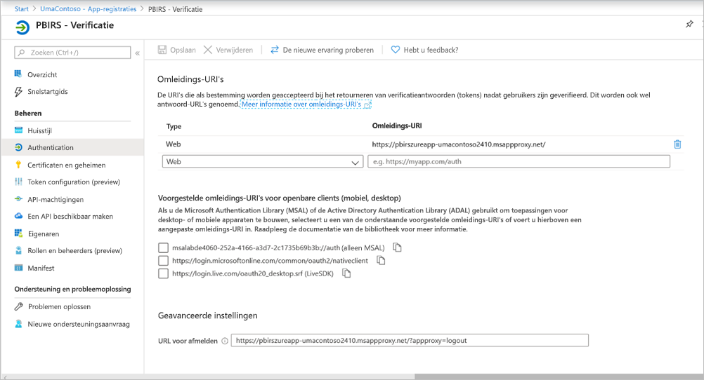

1. Ga als volgt verder met de configuratie van de sectie **Verificatie** van de app-registratie voor de Power BI Report Server-toepassing voor **Impliciete toekenning**, **Standaardclienttype** en **Ondersteunde accounttypen**:

    - Stel **Impliciete toekenning** in op **ID-tokens**.
    - Stel **Standaardclienttype** in op **Nee**.
    - Stel **Ondersteunde accounttypen** in op **Alleen accounts in deze organisatieadreslijst (alleen UmaContoso - één tenant)** .

    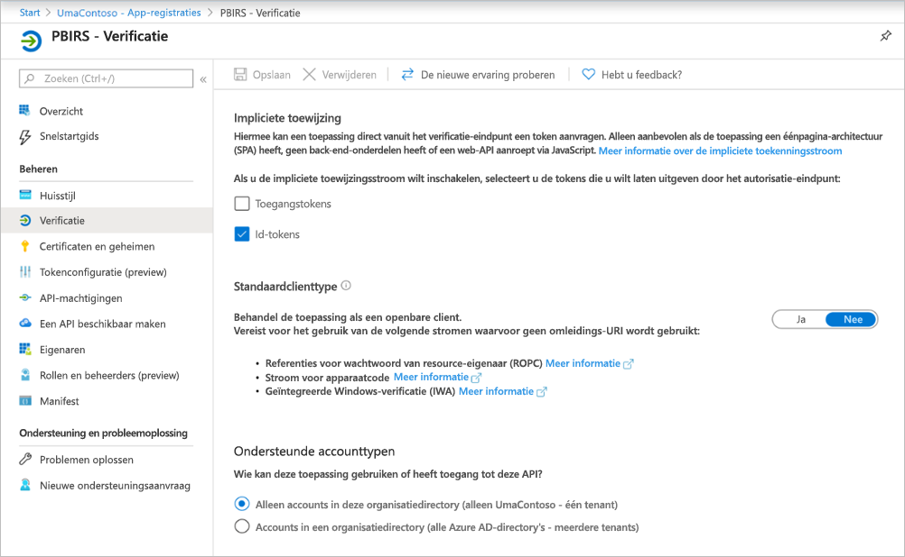

1. Wanneer de eenmalige aanmelding is ingesteld en de URL `https://pbirsazureapp-umacontoso2410.msappproxy.net` werkt, moeten we ervoor zorgen dat het account waarmee we ons aanmelden, wordt gesynchroniseerd met het account waarvoor de machtigingen zijn opgegeven in Power BI Report Server.

1. Eerst moeten we het aangepaste domein configureren dat we in de aanmelding willen gaan gebruiken en vervolgens moeten we ervoor zorgen dat het wordt geverifieerd
2. In dit geval hebben we een domein met de naam umacontoso.com aangeschaft en de DNS-zone met de vermeldingen geconfigureerd. U kunt ook proberen het domein `onmicrosoft.com` te gebruiken en dit te synchroniseren met on-premises AD.

    Zie het artikel [Zelfstudie: Een bestaande aangepaste DNS-naam toewijzen aan Azure App Service](https://docs.microsoft.com/Azure/app-service/app-service-web-tutorial-custom-domain) voor meer informatie.

1. Wanneer de DNS-vermelding voor het aangepaste domein is geverifieerd, zou de status moeten worden weergegeven als **Geverifieerd**, overeenkomstig het domein in de portal.

    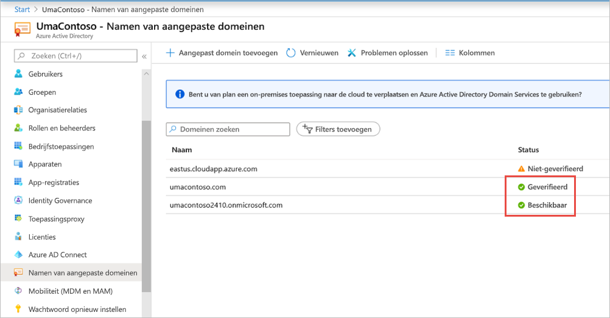

1. Installeer Microsoft Azure AD Connect op de server van de domeincontroller en configureer deze voor synchronisatie met Azure AD.

    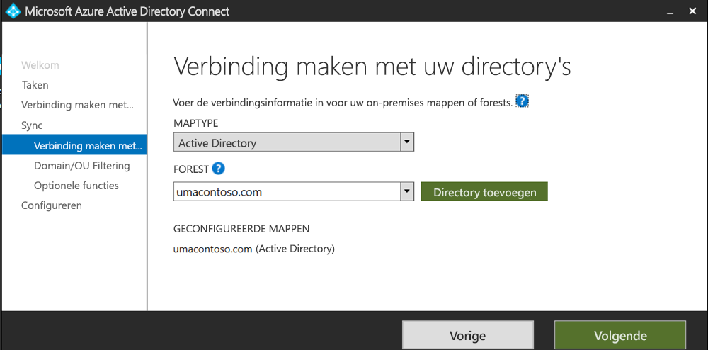

1. Zodra de Azure AD is gesynchroniseerd met on-premises AD, zien we de volgende status in de Azure-portal:

    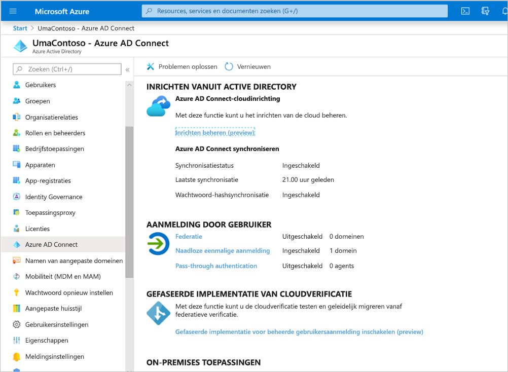

1. Wanneer de synchronisatie is voltooid, opent u de AD-domeinen en vertrouwensrelaties op de domeincontroller. Klik met de rechtermuisknop op Active Directory - domeinen en vertrouwensrelaties > Eigenschappen en voeg de UPN toe. In onze omgeving is `umacontoso.com` het aangepaste domein dat we hebben gekocht.

1. Nadat u de UPN hebt toegevoegd, moet u de gebruikersaccounts met de UPN kunnen configureren, zodat het Azure AD-account en het on-premises AD-account zijn verbonden en het token tijdens de verificatie wordt herkend.

    De naam van het AD-domein wordt na de vorige stap weergegeven in de vervolgkeuzelijst in de sectie **Aanmeldingsnaam van gebruiker**. Configureer de gebruikersnaam en selecteer het domein in de vervolgkeuzelijst in de sectie **Aanmeldingsnaam van gebruiker** van de eigenschappen voor AD-gebruiker.

    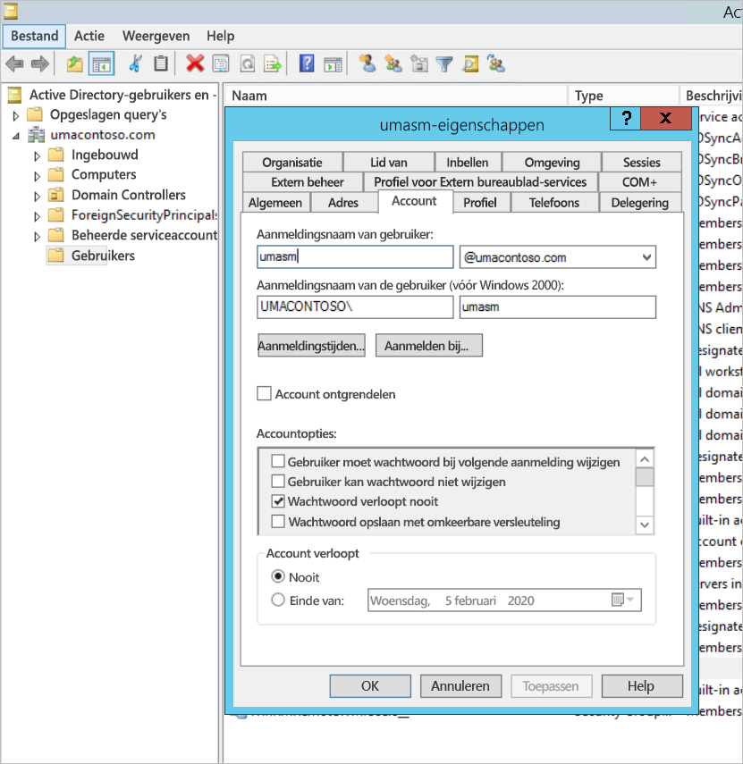

1. Zodra de AD-synchronisatie is geslaagd, wordt het on-premises AD-account in de Azure-portal weergegeven in de sectie **Gebruikers en groepen** van de toepassing. De bron voor het account is **Windows Server AD.**
2. Aanmelden met `umasm@umacontoso.com` komt overeen met het gebruik van de Windows-referenties `Umacontoso\umasm`.

    Deze vorige stappen zijn van toepassing als u on-premises AD hebt geconfigureerd en wilt gaan synchroniseren met Azure AD.

    Geslaagde aanmelding na implementatie van bovenstaande stappen:

    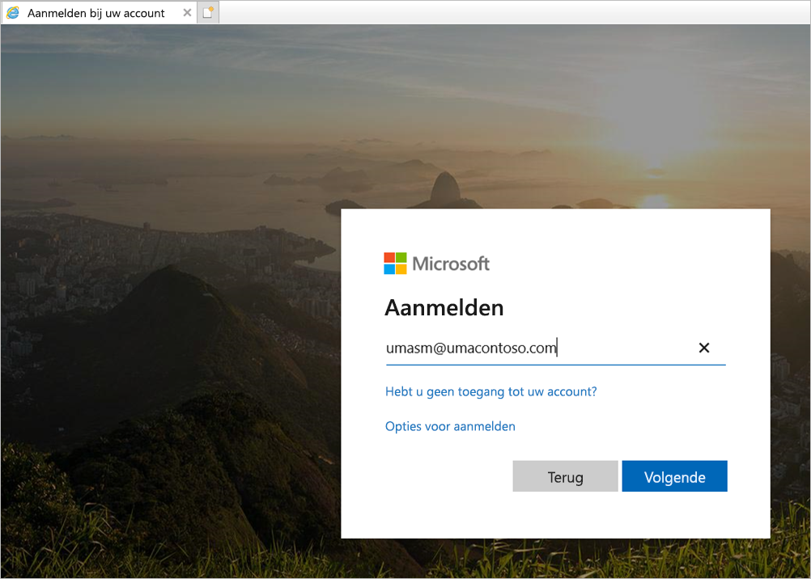

    Gevolgd door de weergave van de webportal:

    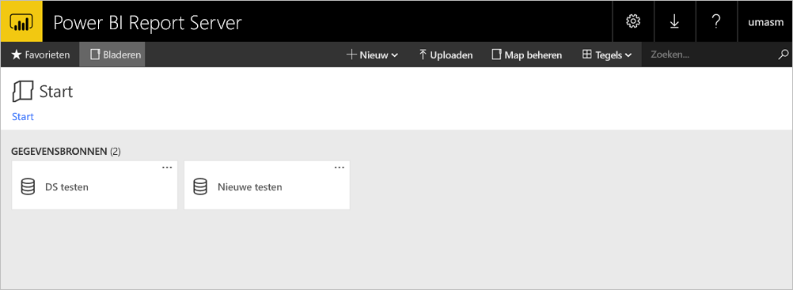

    Met een geslaagde testverbinding met een gegevensbron met behulp van Kerberos als verificatie:

    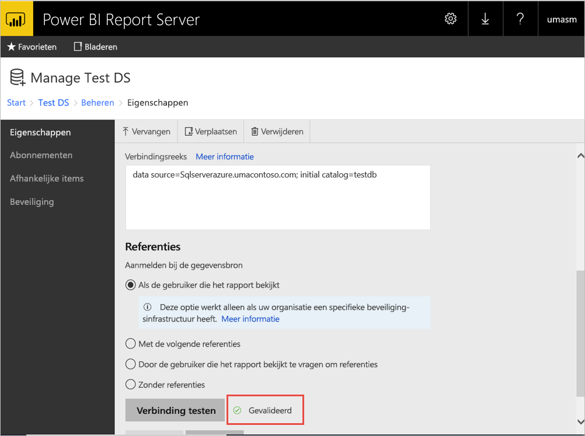

## <a name="access-from-power-bi-mobile-apps"></a>Toegang vanuit mobiele Power BI-apps

### <a name="configure-the-application-registration"></a>De toepassingsregistratie configureren

Voordat de mobiele Power BI-app verbinding kan maken met en toegang kan krijgen tot Power BI Report Server, moet u de toepassingsregistratie configureren die automatisch voor u is gemaakt in [Publiceren via Azure AD-toepassingsproxy](#publish-through-azure-ad-application-proxy), eerder in dit artikel.

1. Selecteer in het **Overzicht** van Azure Active Directory de optie **App-registraties**.
2. Zoek op het tabblad **Alle toepassingen** naar de toepassing die u hebt gemaakt voor Power BI Report Server.
3. Selecteer de toepassing en vervolgens **Verificatie**.
4. Voeg de volgende omleidings-URI's toe op basis van het platform dat u gebruikt.

    Bij het configureren van de app voor Power BI Mobiel **iOS** voegt u de volgende omleidings-URI's van het type Openbare client (Mobile en Desktop) toe:

    - `msauth://code/mspbi-adal%3a%2f%2fcom.microsoft.powerbimobile`
    - `msauth://code/mspbi-adalms%3a%2f%2fcom.microsoft.powerbimobilems`
    - `mspbi-adal://com.microsoft.powerbimobile`
    - `mspbi-adalms://com.microsoft.powerbimobilems`

    Bij het configureren van de app voor Power BI Mobiel **Android** voegt u de volgende omleidings-URI's van het type Openbare client (Mobile en Desktop) toe:

    - `urn:ietf:wg:oauth:2.0:oob`
    - `mspbi-adal://com.microsoft.powerbimobile`
    - `msauth://com.microsoft.powerbim/g79ekQEgXBL5foHfTlO2TPawrbI%3D`
    - `msauth://com.microsoft.powerbim/izba1HXNWrSmQ7ZvMXgqeZPtNEU%3D`

    Bij het configureren van de app voor zowel Power BI Mobiel iOS als Android, voegt u de volgende omleidings-URI van het type Openbare client (Mobile en Desktop) toe aan de lijst met omleidings-URI's die zijn geconfigureerd voor iOS:

    - `urn:ietf:wg:oauth:2.0:oob`

    > [!IMPORTANT]
    > De toepassing werkt alleen correct als de omleidings-URI's zijn toegevoegd.

### <a name="connect-from-the-power-bi-mobile-apps"></a>Verbinding maken vanuit de mobiele Power BI-apps

1. Maak in de mobiele Power BI-app verbinding met uw exemplaar van de rapportserver. U maakt verbinding door de **Externe URL** in te voeren voor de toepassing die u via de toepassingsproxy hebt gepubliceerd.
2. Selecteer **Verbinding maken**. U wordt omgeleid naar de aanmeldingspagina van Azure Active Directory.
3. Voer geldige referenties in voor uw gebruiker en selecteer **Aanmelden**. U ziet de elementen vanuit de rapportserver.

## <a name="next-steps"></a>Volgende stappen

[Externe toegang tot Power BI - Mobiel met Azure AD-toepassingsproxy inschakelen](https://docs.microsoft.com/azure/active-directory/manage-apps/application-proxy-integrate-with-power-bi)

Hebt u nog vragen? [Misschien dat de Power BI-community het antwoord weet](https://community.powerbi.com/)

                
