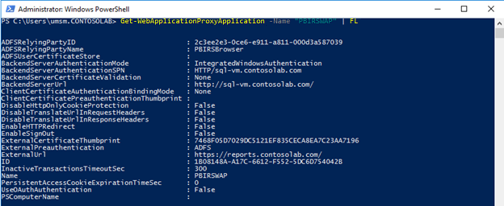

# <a name="use-web-application-proxy-and-active-directory-federated-services---power-bi-report-server"></a>Web Application Proxy en Active Directory Federated Services gebruiken - Power BI Report Server

In dit artikel wordt besproken hoe u Web Application proxy (WAP) en Active Directory Federated Services (AD FS) kunt gebruiken om verbinding te maken met Power BI Report Server en SQL Server Reporting Services (SSRS) 2016 en hoger. Via deze integratie hebben gebruikers die zich buiten het bedrijfsnetwerk bevinden toegang tot hun Power BI Report Server- en Reporting Services-rapporten vanuit hun clientbrowser en worden ze beschermd door verificatie vooraf door AD FS. Voor de mobiele apps van Power BI moet u ook [OAuth configureren om verbinding te maken met Power BI Report Server en SSRS](../consumer/mobile/mobile-oauth-ssrs.md).

## <a name="prerequisites"></a>Vereisten

### <a name="domain-name-services-dns-configuration"></a>DNS-configuratie (Domain Name Services)

- Bepaal de openbare URL waarmee de gebruiker verbinding maakt. Deze ziet er ongeveer uit als in het volgende voorbeeld: `https://reports.contosolab.com`.
- Configureer uw DNS-record voor de hostnaam, `reports.contosolab.com`, bijvoorbeeld om naar het openbare IP-adres van de WAP-server (Web Application Proxy) te verwijzen.
- Configureer een openbaar DNS-record voor uw AD FS-server. U kunt de AD FS-server bijvoorbeeld met de volgende URL hebben geconfigureerd: `https://adfs.contosolab.com`.
- Configureer uw DNS-record om naar het openbare IP-adres van de WAP-server (Web Application Proxy) te verwijzen, bijvoorbeeld `adfs.contosolab.com`. Dit wordt als onderdeel van de WAP-toepassing gepubliceerd.

### <a name="certificates"></a>Certificaten

U moet certificaten voor de WAP-toepassing en de AD FS-server configureren. Beide certificaten moeten deel uitmaken van een geldige certificeringsinstantie die door uw apparaten wordt herkend.

## <a name="1-configure-the-report-server"></a>1. De rapportserver configureren

U moet er zeker van zijn dat u een geldige SPN (Service Principal Name) hebt. Met de geldige SPN kan de juiste Kerberos-verificatie worden uitgevoerd en wordt de rapportserver voor negotiate-verificatie ingeschakeld.

### <a name="service-principal-name-spn"></a>Service Principal Name (SPN)

De SPN is een unieke id voor een service die Kerberos-verificatie gebruikt. Zorg ervoor dat er een geschikte HTTP-SPN aanwezig is voor de rapportserver.

Zie [Een Service Principal Name (SPN) voor een rapportserver registreren](/sql/reporting-services/report-server/register-a-service-principal-name-spn-for-a-report-server) voor meer informatie over het configureren van de juiste Service Principal Name (SPN) voor de rapportserver.

### <a name="enabling-negotiate-authentication"></a>Negotiate-verificatie inschakelen

Het verificatietype van de rapportserver moet als RSWindowsNegotiate worden geconfigureerd om een rapportserver Kerberos-verificatie te laten gebruiken. U configureert dat in het bestand rsreportserver.config.

```
<AuthenticationTypes>

    <RSWindowsNegotiate />

    <RSWindowsNTLM />

</AuthenticationTypes>
```

Zie [Een Reporting Services-configuratiebestand wijzigen](/sql/reporting-services/report-server/modify-a-reporting-services-configuration-file-rsreportserver-config) en [Windows-verificatie op een rapportserver configureren](/sql/reporting-services/security/configure-windows-authentication-on-the-report-server) voor meer informatie.

## <a name="2-configure-active-directory-federation-services-ad-fs"></a>2. Active Directory Federation Services (AD FS) configureren

U moet AD FS op een Windows 2016-server binnen uw omgeving configureren. De configuratie kan via Serverbeheer worden gedaan door onder Beheren Functies en onderdelen toevoegen te selecteren. Zie [Active Directory Federation Services](/windows-server/identity/active-directory-federation-services) voor meer informatie.

Voer op de AD FS-server de volgende stappen uit met behulp van AD FS-beheer-app.

1. Klik met de rechtermuisknop op **Vertrouwensrelaties van Relying Party** > **Vertrouwensrelatie van Relying Party toevoegen**.

    

2. Volg de stappen in de wizard **Vertrouwensrelatie van Relying Party toevoegen**.

    Kies de optie **Niet claimbewust** om geïntegreerde beveiliging van Windows als verificatiemechanisme te gebruiken.

    

    Voer de naam die u wilt gebruiken in **Weergavenaam opgeven** in en selecteer **Volgende**.
    Voeg de id van de vertrouwensrelaties van de Relying Party toe: `<ADFS\_URL>/adfs/services/trust`

    Bijvoorbeeld:`https://adfs.contosolab.com/adfs/services/trust`

    

    Kies het **Toegangsbeheerbeleid** dat bij de behoeften van uw organisatie past en selecteer **Volgende**.

    
    
    Selecteer **Volgende**en selecteer **Voltooien** om de wizard **Vertrouwensrelatie van Relying Party toevoegen** te voltooien.

    Wanneer dit is voltooid, moeten de eigenschappen van de vertrouwensrelaties van de Relying Party er als volgt uitzien.

    

## <a name="3-configure-web-application-proxy-wap"></a>3. WAP (Web Application Proxy) configureren

Schakel de Windows-rol webtoepassingsproxy in op een server in uw omgeving. Dit moet op een Windows 2016-server gebeuren. Zie voor meer informatie [Webtoepassingsproxy in Windows Server 2016](/windows-server/remote/remote-access/web-application-proxy/web-application-proxy-windows-server) en [Toepassingen publiceren met behulp van AD FS-verificatie](/windows-server/remote/remote-access/web-application-proxy/Publishing-Applications-using-AD-FS-Preauthentication).

### <a name="configure-constrained-delegation"></a>Beperkte delegering configureren

U moet beperkte delegatie met protocolovergang gebruiken om van formulierverificatie op Windows-verificatie over te gaan. Deze stap maakt deel uit van de Kerberos-configuratie. De SPN van de rapportserver is al gedefinieerd in de configuratie van de rapportserver.

U moet beperkte delegatie configureren op het computeraccount voor de WAP-server in Active Directory. U moet mogelijk een domeinbeheerder inzetten als u geen rechten voor Active Directory hebt.

Voer de volgende stappen uit om beperkte delegering te configureren.

1. Start **Active Directory: gebruikers en computers** op een computer waarop de Active Directory-hulpprogramma's zijn geïnstalleerd.
2. Zoek het computeraccount voor de WAP-server. Standaard staat dit in de container **Computers**.
3. Klik met de rechtermuisknop op de WAP-server en ga naar **Eigenschappen**.
4. Selecteer op het tabblad **Delegering** de optie **Deze computer mag alleen aan opgegeven services delegeren** en vervolgens **Elk protocol voor authenticatie gebruiken**.

    

1. Met deze optie stelt u beperkte delegatie voor het computeraccount van deze WAP-server in. Vervolgens moet u de services opgeven waarnaar deze computer mag delegeren.
2. Selecteer **Toevoegen** onder het servicesvak.

    

1. Selecteer **Gebruikers of computers**.
2. Voer het serviceaccount in dat u voor de rapportserver gebruikt. Dit account is hetzelfde als u hebt gebruikt om de HTTP-SPN toe te voegen in de eerdere sectie over de [configuratie van de rapportserver](#1-configure-the-report-server). 

3. Selecteer de HTTP-SPN voor de rapportserver en selecteer **OK**.

    > [!NOTE]
    > Mogelijk wordt alleen de SPN voor NetBIOS weergegeven. De SPN's voor NetBIOS en FQDN worden beide geselecteerd als ze beide bestaan.

1. Wanneer u het selectievakje **Uitgevouwen** hebt geselecteerd, moet het resultaat er ongeveer uitzien als het volgende voorbeeld.

    

### <a name="add-wap-application"></a>WAP-toepassing toevoegen

1. Open op de Web Application Proxy-server de console voor **Beheer van externe toegang** en selecteer **Web Application Proxy** in het navigatiedeelvenster. 

2. Selecteer **Publiceren**in het deelvenster **Taken**.

2. Selecteer **Volgende** op de welkomstpagina.

    

3. Selecteer op de pagina **Verificatie vooraf** de optie **Active Directory Federation Services (AD FS)** en selecteer **Volgende**.

    

4. Selecteer **Web en MSOFBA** als verificatie vooraf omdat we alleen browsertoegang willen instellen voor de rapportserver, en geen toegang tot mobiele apps.

    

5. Voeg de **Relying Party** toe die u hebt gemaakt op de AD FS server, zoals hieronder wordt weergegeven en selecteer **Volgende**.

    

6. Plaats de openbaar toegankelijke URL die is geconfigureerd op de WAP-server in de sectie **Externe URL**. Voeg de URL toe die is geconfigureerd met de rapportserver (Report Server Configuration Manager), zoals hieronder wordt weergegeven in de sectie **SPN van back-endserver**. Voeg de SPN van de rapportserver toe aan de sectie **SPN van back-endserver**.

    

7. Selecteer **Volgende** en **Publiceren**.
8. Voer de volgende PowerShell-opdracht uit om de WAP-configuratie te valideren.

    ```
    Get-WebApplicationProxyApplication -Name "PBIRSWAP" | FL
    ```

    

## <a name="connect-to-the-report-server-through-the-browser"></a>Verbinding maken met de rapportserver via de browser

U kunt vervolgens toegang krijgen tot de openbare WAP-URL, bijvoorbeeld `https://reports.contosolab.com/ReportServer` voor de webservice en `https://reports.contosolab.com/Reports` voor de webportal vanuit de browser. Wanneer u de verificatie hebt voltooid, kunt u de rapporten weergeven.


## <a name="next-steps"></a>Volgende stappen

* [OAuth configureren om verbinding te maken met Power BI Report Server en SSRS](../consumer/mobile/mobile-oauth-ssrs.md)
*[Wat is Power BI Report Server?](get-started.md)  

Hebt u nog vragen? [Misschien dat de Power BI-community het antwoord weet](https://community.powerbi.com/)
