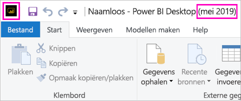

# Voor Power BI Report Server geoptimaliseerde versie van Power BI Desktop installeren

Als u Power BI-rapporten wilt maken voor Power BI Report Server, moet u Power BI Desktop downloaden dat is geoptimaliseerd voor Power BI Report Server. Dit is een andere versie van Power BI Desktop dan de versie die wordt gebruikt met de Power BI-service. De versie van Power BI Desktop voor de Power BI-service bevat bijvoorbeeld preview-functies die niet beschikbaar zijn in de Power BI Report Server-versie totdat deze zijn vrijgegeven. Als u deze versie gebruikt, moet u ervoor zorgen dat de rapportserver kan werken met een bekende versie van de rapporten en het model. 

Het goede nieuws is dat u Power BI Desktop en de voor Power BI Report Server geoptimaliseerde versie van Power BI Desktop naast elkaar op dezelfde computer kunt installeren.

## Power BI Desktop downloaden en installeren

U kunt het snelste controleren of u over de meest recente versie van de voor Power BI Report Server geoptimaliseerde versie van Power BI Desktop beschikt, is door te starten vanuit de webportal van de rapportserver.

1. Selecteer in de webportal van report server de pijl **Downloaden** > **Power BI Desktop**.

    

    Of Ga rechtstreeks naar [Microsoft Power BI Desktop](https://www.microsoft.com/download/details.aspx?id=56723) (geoptimaliseerd voor Power BI Report Server - mei 2019) in het Microsoft Download Center.

2. Selecteer **Downloaden** in het downloadcentrum.

3. Selecteer het volgende, afhankelijk van uw computer: 

    - **PBIDesktopRS.msi** (de 32-bits versie) of

    - **PBIDesktopRS_x64.msi** (de 64-bits versie).

1. Nadat u het installatieprogramma hebt gedownload, voert u de installatiewizard van Power BI Desktop (mei 2019).

2. Aan het einde van de installatie, selecteert u **start Power BI Desktop**.

    Het programma wordt automatisch gestart en u kunt aan de slag.

## Controleer of u de juiste versie gebruikt
U kunt eenvoudig controleren of u de juiste versie van Power BI Desktop gebruikt: Bekijk het beginscherm of de titelbalk in Power BI Desktop. In de titelbalk worden de maand en het jaar van de versie weergegeven. De kleuren in het Power BI-logo zijn ook omgekeerd: geel op zwart in plaats van zwart op geel.

In de Power BI Desktop-versie van de Power BI-service staan de maand en het jaar niet in de titelbalk.

## Bestandsindelingen kopppelen
Als u zowel Power BI Desktop als de voor Power BI Report Server geoptimaliseerde versie van Power BI Desktop op dezelfde computer hebt geïnstalleerd, krijgt de meest recente installatie van Power BI Desktop een koppeling met .pbix-bestanden. Wanneer u dubbelklikt op een pbix-bestand, wordt de Power BI Desktop-versie die u het meest recent hebt geïnstalleerd, geopend.

Als u Power BI Desktop hebt en u daarna de voor Power BI Report Server geoptimaliseerde versie van Power BI Desktop installeert, worden alle pbix-bestanden standaard geopend in de voor Power BI Report Server geoptimaliseerde versie van Power BI Desktop. Als u .pbix-bestanden liever standaard opent met Power BI Desktop, installeert u [Power BI Desktop opnieuw vanuit de Microsoft Store](http://aka.ms/pbidesktopstore).

U kunt ook eerst de versie van Power BI Desktop die u wilt gebruiken openen. En daarna opent u het bestand vanuit Power BI Desktop.

Een Power BI-rapport in Power BI Report Server bewerken of maken van een nieuw Power BI-rapport van de web-portal, moet u altijd de juiste versie van Power BI Desktop geopend.

## Overwegingen en beperkingen

Power BI-rapporten in Power BI Report Server, in de Power BI-service (http://app.powerbi.com)) en in mobiele Power BI-apps werken bijna exact dezelfde, op een paar functies na.

### In een browser

Rapporten van Power BI Report Server ondersteunen bijna alle visualisaties, met inbegrip van aangepaste visuele elementen. Rapporten voor Power BI Report Server bieden geen ondersteuning voor:

* R-visuals
* ArcGIS-kaarten
* Breadcrumbs
* Preview-functies in Power BI Desktop

### In de mobiele Power BI-apps

Rapporten voor Power BI Report Server ondersteunen alle basisfunctionaliteit in de [mobiele Power BI-apps](../consumer/mobile/mobile-apps-for-mobile-devices.md), waaronder:

* [Indeling van telefoonrapport](../desktop-create-phone-report.md): u kunt een rapport optimaliseren voor de mobiele Power BI-apps. Op uw mobiele telefoon hebben geoptimaliseerde rapporten een speciaal pictogram, , en een speciale indeling.
  
    

Rapporten voor Power BI Report Server bieden geen ondersteuning voor deze functies in de mobiele Power BI-apps:

* R-visuals
* ArcGIS-kaarten
* Aangepaste visualisaties
* Breadcrumbs
* Geografisch filteren of balk codes

## Power BI Desktop voor eerdere versies van Power BI Report Server

Als u een rapportserver heeft met een eerdere versie, moet u de overeenkomstige versie van Power BI Desktop gebruiken. Hier is de koppeling om de vorige versie te downloaden.

- Microsoft Power BI Desktop ([geoptimaliseerd voor Power BI Report Server - januari 2019](https://go.microsoft.com/fwlink/?linkid=2055039))

## Volgende stappen

Nu u Power BI Desktop hebt geïnstalleerd, kunt u beginnen met het maken van Power BI-rapporten.

[Een Power BI-rapport maken voor Power BI Report Server](quickstart-create-powerbi-report.md)  
[Wat is Power BI Report Server?](get-started.md)

Hebt u nog vragen? [Misschien dat de Power BI-community het antwoord weet](https://community.powerbi.com/)
