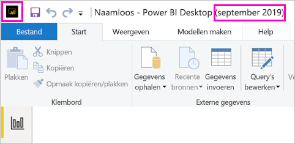

# Voor Power BI Report Server geoptimaliseerde versie van Power BI Desktop installeren

Als u Power BI-rapporten wilt maken voor Power BI Report Server, moet u de versie van Power BI Desktop downloaden en installeren die is geoptimaliseerd voor Power BI Report Server. Dit is een andere versie van Power BI Desktop dan de versie die wordt gebruikt met de Power BI-service. De versie van Power BI Desktop voor de Power BI-service bevat bijvoorbeeld preview-functies die niet beschikbaar zijn in de Power BI Report Server-versie totdat deze algemeen beschikbaar zijn. Als u deze versie gebruikt, moet u ervoor zorgen dat de rapportserver kan werken met een bekende versie van de rapporten en het model. 

Het goede nieuws is dat u Power BI Desktop en de voor Power BI Report Server geoptimaliseerde versie van Power BI Desktop naast elkaar op dezelfde computer kunt installeren.

## Power BI Desktop downloaden en installeren

U kunt het snelste controleren of u over de meest recente versie van de voor Power BI Report Server geoptimaliseerde versie van Power BI Desktop beschikt, is door te starten vanuit de webportal van de rapportserver.

1. Selecteer in de webportal van report server de pijl **Downloaden** > **Power BI Desktop**.

    

    Of ga naar de startpagina van [Power BI Report Server](https://powerbi.microsoft.com/report-server/) en selecteer **Geavanceerde downloadopties**.

2. Selecteer een taal op de pagina van het downloadcentrum en selecteer **Downloaden**.

3. Selecteer het volgende, afhankelijk van uw computer: 

    - **PBIDesktopRS.msi** (de 32-bits versie) of
    - **PBIDesktopRS_x64.msi** (de 64-bits versie).

1. Nadat u het installatieprogramma hebt gedownload, voert u de installatiewizard van Power BI Desktop (september 2019) uit.

2. Selecteer aan het einde van de installatie de optie **Power BI Desktop starten**.

    Het programma wordt automatisch gestart en u kunt aan de slag.

## Controleer of u de juiste versie gebruikt
U kunt eenvoudig controleren of u de juiste versie van Power BI Desktop gebruikt: Bekijk het beginscherm of de titelbalk in Power BI Desktop. U beschikt over de juiste versie als **Power BI Desktop (september 2019)** wordt vermeld in de titelbalk. De kleuren in het Power BI-logo zijn ook omgekeerd: geel op zwart in plaats van zwart op geel.

Voor de versie van Power BI Desktop voor de Power BI-service worden de maand en het jaar niet in de titelbalk weergegeven.

## Bestandsindelingen kopppelen
Als u zowel Power BI Desktop als de voor Power BI Report Server geoptimaliseerde versie van Power BI Desktop op dezelfde computer hebt geïnstalleerd, krijgt de meest recente installatie van Power BI Desktop een koppeling met .pbix-bestanden. Wanneer u dubbelklikt op een pbix-bestand, wordt de Power BI Desktop-versie die u het meest recent hebt geïnstalleerd, geopend.

Als u Power BI Desktop hebt en u daarna de voor Power BI Report Server geoptimaliseerde versie van Power BI Desktop installeert, worden alle pbix-bestanden standaard geopend in de voor Power BI Report Server geoptimaliseerde versie van Power BI Desktop. Als u .pbix-bestanden liever standaard opent met Power BI Desktop, installeert u [Power BI Desktop opnieuw vanuit de Microsoft Store](https://aka.ms/pbidesktopstore).

U kunt ook eerst de versie van Power BI Desktop die u wilt gebruiken openen. En daarna opent u het bestand vanuit Power BI Desktop.

Wanneer u een Power BI-rapport wilt bewerken vanuit Power BI Report Server of u een nieuw Power BI-rapport wilt maken vanuit de webportal, wordt altijd de juiste versie van Power BI Desktop geopend.

## Overwegingen en beperkingen

Power BI-rapporten in Power BI Report Server, in de Power BI-service (`https://app.powerbi.com`) en in mobiele Power BI-apps werken bijna exact dezelfde, op een paar functies na.

### Een taal selecteren

Voor Power BI Desktop geoptimaliseerd voor Power BI Report Server selecteert u de taal wanneer u de app installeert. U kunt deze later niet meer wijzigen, maar u kunt een versie in een andere taal installeren.

### Rapportvisuals in een browser

Power BI Report Server-rapporten ondersteunen bijna alle visualisaties, met inbegrip van Power BI-visuals. Rapporten voor Power BI Report Server bieden geen ondersteuning voor:

* R-visuals
* ArcGIS-kaarten
* Breadcrumbs
* Preview-functies in Power BI Desktop

### Rapporten in de Power BI - Mobiel-apps

Rapporten voor Power BI Report Server ondersteunen alle basisfunctionaliteit in de [mobiele Power BI-apps](../consumer/mobile/mobile-apps-for-mobile-devices.md), waaronder:

* [Indeling van telefoonrapport](../create-reports/desktop-create-phone-report.md): u kunt een rapport optimaliseren voor de mobiele Power BI-apps. Op uw mobiele telefoon hebben geoptimaliseerde rapporten een speciaal pictogram, , en een speciale indeling.
  
    

Rapporten voor Power BI Report Server bieden geen ondersteuning voor deze functies in de mobiele Power BI-apps:

* R-visuals
* ArcGIS-kaarten
* Power BI-visuals
* Breadcrumbs
* Het filteren van geografische gebieden of streepjescodes

### Aangepaste beveiliging

Power BI Desktop geoptimaliseerd voor Power BI Report Server biedt geen ondersteuning voor aangepaste beveiliging. Als uw Power BI Report Server is geconfigureerd met een aangepaste beveiligingsextensie, kunt u een Power BI-rapport niet opslaan vanaf Power BI Desktop (geoptimaliseerd voor Power BI Report Server) naar het Power BI Report Server-exemplaar. U moet het .pbix-rapport bestand opslaan vanuit Power BI Desktop en dit uploaden naar de Power BI Report Server-portal-site.

### Rapporten in Power BI Report Server opslaan in een ander domein

Wanneer u een Power BI-rapport opslaat in Power BI Report Server, worden uw Windows-referenties gebruikt. Er is geen ondersteuning voor het rechtstreeks op een rapportserver opslaan in een ander domein met uw Windows-referenties. U kunt in plaats daarvan een webbrowser gebruiken om de rapportserver weer te geven en het bestand handmatig uploaden vanaf uw computer.

## Power BI Desktop voor eerdere versies van Power BI Report Server

Als u een rapportserver heeft met een eerdere versie, moet u de overeenkomstige versie van Power BI Desktop gebruiken. Dit is de koppeling voor het downloaden van een eerdere versie.

- Microsoft Power BI Desktop ([geoptimaliseerd voor Power BI Report Server, september 2019](https://go.microsoft.com/fwlink/?linkid=2103723))

## Volgende stappen

Nu u Power BI Desktop hebt geïnstalleerd, kunt u beginnen met het maken van Power BI-rapporten.

[Een Power BI-rapport maken voor Power BI Report Server](quickstart-create-powerbi-report.md)  
[Wat is Power BI Report Server?](get-started.md)

Hebt u nog vragen? [Misschien dat de Power BI-community het antwoord weet](https://community.powerbi.com/)

