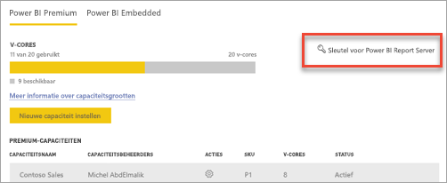
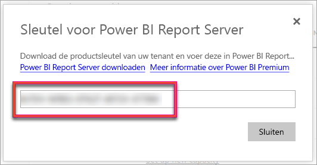

# Power BI Report Server installeren

Lees hoe u Power BI Report Server installeert.

## Power BI Report Server downloaden

Ga naar de pagina [On-premises rapportage met Power BI Report Server](https://powerbi.microsoft.com/report-server/) en selecteer **Gratis proefversie downloaden**.

Wanneer u het bestand PowerBIReportServer.exe uitvoert, selecteert u de gratis proefversie of voert u uw productcode in. Lees verder voor meer informatie.

## Voordat u installeert

Voordat u Power BI Report Server installeert, is het raadzaam om de [hardware- en softwarevereisten voor het installeren van Power BI Report Server](system-requirements.md) door te lezen.

 > [!IMPORTANT]
 > Power BI Report Server kan worden geïnstalleerd in een omgeving met een alleen-lezen domeincontroller (RODC), maar voor de juiste werking van Power BI Report Server is toegang tot een domeincontroller voor lezen en schrijven vereist. Als Power BI Report Server alleen toegang heeft tot een RODC, kunnen fouten optreden bij het beheren van de service.

### Productcode van Power BI Report Server

U kunt de productcode voor Power BI Report Server ophalen uit twee verschillende bronnen:

- Power BI Premium
- SQL Server Enterprise Software Assurance (SA)

Lees verder voor meer informatie.

#### Power BI Premium

Als u Power BI Premium hebt gekocht, vindt u de productcode voor Power BI Report Server op het tabblad **Premium-instellingen** in de Power BI-beheerportal. De beheerportal is alleen beschikbaar voor hoofdbeheerders of gebruikers aan wie de rol Power BI-servicebeheerder is toegewezen.

Als u **Power BI Report Server-sleutel** selecteert, wordt een dialoogvenster weergegeven met uw productcode. U kunt deze kopiëren en gebruiken bij de installatie.

#### SQL Server Enterprise Software Assurance (SA)

Als u een SQL Server Enterprise SA-overeenkomst hebt, kunt u uw productcode vinden in het [Volume Licensing Service Center](https://www.microsoft.com/Licensing/servicecenter/).

## Een rapportserver installeren

Het installeren van Power BI Report Server is vrij eenvoudig. U hoeft slechts een paar stappen uit te voeren om de bestanden te installeren.

Er is geen SQL Server Database Engine-server nodig tijdens de installatie. U hebt die wel nodig om Reporting Services na de installatie te configureren.

1. Zoek de locatie van PowerBIReportServer.exe en start het installatieprogramma.

2. Selecteer **Install Power BI Report Server**.

    
3. Kies een editie om te installeren en selecteer vervolgens **Next**.

    

    Kies de evaluatie- of ontwikkelaarseditie.

    

    Voer anders de productcode in die u hebt verkregen via de Power BI-service of het servicecentrum voor volumelicenties. Zie het gedeelte [Voordat u installeert](#before-you-install) hierboven als u wilt weten hoe u in het bezit komt van een productcode.
4. Lees de licentievoorwaarden, ga hiermee akkoord en selecteer vervolgens **Volgende**.

    
5. U hebt een database-engine nodig om de database van de rapportserver te kunnen opslaan. Selecteer **Next** om alleen de rapportserver te installeren.

    
6. Geef de installatielocatie op voor de rapportserver. Selecteer **Install** om door te gaan.

    

    Het standaardpad isC:\Program Files\Microsoft Power BI Report Server.

7. Als de installatie is voltooid, selecteert u **Configure report server** om Reporting Services Configuration Manager te starten.

    

## Uw rapportserver configureren

Nadat u **Configure Report Server** hebt geselecteerd tijdens de installatie, ziet u het scherm van Reporting Services Configuration Manager. Zie [Reporting Services Configuration Manager](https://docs.microsoft.com/sql/reporting-services/install-windows/reporting-services-configuration-manager-native-mode) voor meer informatie.

U maakt een [rapportserverdatabase](https://docs.microsoft.com/sql/reporting-services/install-windows/ssrs-report-server-create-a-report-server-database) om de eerste configuratie van Reporting Services te voltooien. Voor deze stap hebt u een server met een SQL Server-database nodig.

### Een database maken op een andere server

Als u de database voor de rapportserver maakt op een databaseserver op een andere computer, wijzigt u het serviceaccount voor de rapportserver in een referentie die wordt herkend op de databaseserver. 

De rapportserver gebruikt standaard het virtuele serviceaccount. Als u probeert een database op een andere server te maken, kan de volgende fout optreden in de stap voor het toepassen van de verbindingsrechten.

`System.Data.SqlClient.SqlException (0x80131904): Windows NT user or group '(null)' not found. Check the name again.`

U kunt deze fout omzeilen door het serviceaccount te wijzigen in Network Service of een domeinaccount. Als u het serviceaccount wijzigt in Network Service, worden er rechten toegepast in de context van het computeraccount voor de rapportserver.

Zie [Configure the Report Server Service Account (SSRS Configuration Manager)](https://docs.microsoft.com/sql/reporting-services/install-windows/configure-the-report-server-service-account-ssrs-configuration-manager) (Report Server Service Account (SSRS Configuration Manager) configureren) voor meer informatie.

## Windows-service

Tijdens de installatie wordt er ook een Windows-service gemaakt. Deze wordt weergegeven als **Power BI Report Server**. De servicenaam is **PowerBIReportServer**.

## Standaard-URL-reserveringen

URL-reserveringen bestaan uit een voorvoegsel, de hostnaam, de poort en de virtuele map:

| Onderdeel | Beschrijving |
| --- | --- |
| Voorvoegsel |Het standaardvoorvoegsel is HTTP. Als u eerder een SSL-certificaat (Secure Sockets Layer) hebt geïnstalleerd, wordt er geprobeerd om URL-reserveringen te maken met het voorvoegsel HTTPS. |
| Hostnaam |De standaardhostnaam is een sterk jokerteken (+). Dit geeft aan dat de rapportserver op de opgegeven poort elke HTTP-aanvraag accepteert voor elke hostnaam die wordt omgezet naar de computer, met inbegrip van `https://<computername>/reportserver`, `https://localhost/reportserver` of `https://<IPAddress>/reportserver.` |
| Poort |De standaardpoort is 80. Als u een andere poort dan poort 80 gebruikt, moet u deze expliciet toevoegen aan de URL wanneer u de webportal opent in een browservenster. |
| Virtuele map |Standaard worden virtuele mappen gemaakt in de indeling van ReportServer voor de webservice Report Server en Reports voor de webportal. Voor de webservice Report Server is **reportserver** de standaard virtuele map. Voor de webportal is de standaard virtuele map **reports**. |

Een voorbeeld van de volledige URL-reeks ziet er dan zo uit:

* `https://+:80/reportserver`, biedt toegang tot de rapportserver.
* `https://+:80/reports`, biedt toegang tot de webportal.

## Firewall

Als u de rapportserver benadert vanaf een externe computer, moet u ervoor zorgen dat u firewallregels hebt geconfigureerd als er een firewall aanwezig is.

Open de TCP-poort die u hebt geconfigureerd voor uw webservice-URL en webportal-URL. Deze zijn standaard geconfigureerd op TCP-poort 80.

## Aanvullende configuratie

* Als u integratie met de Power BI-service wilt configureren zodat u rapportitems kunt vastmaken aan een Power BI-dashboard, leest u [Power BI Report Server Integration (Configuration Manager)](https://docs.microsoft.com/sql/reporting-services/install-windows/power-bi-report-server-integration-configuration-manager) (Power BI Report Server-integratie (Configuration Manager)).
* Zie [E-Mail settings](https://docs.microsoft.com/sql/reporting-services/install-windows/e-mail-settings-reporting-services-native-mode-configuration-manager) (E-mailinstellingen) en [E-Mail delivery in a report server](https://docs.microsoft.com/sql/reporting-services/subscriptions/e-mail-delivery-in-reporting-services) (E-mailbezorging op een rapportserver) om e-mail te configureren voor de verwerking van abonnementen.
* Als u de webportal zo wilt configureren dat u vanaf een computer met rapportserver rapporten kunt weergeven en beheren, raadpleegt u [Configure a firewall for report server access](https://docs.microsoft.com/sql/reporting-services/report-server/configure-a-firewall-for-report-server-access) (Een firewall configureren voor toegang tot Report Server) en [Configure a report server for remote administration](https://docs.microsoft.com/sql/reporting-services/report-server/configure-a-report-server-for-remote-administration) (Een rapportserver configureren voor extern beheer).

## Volgende stappen

[Administratoroverzicht](admin-handbook-overview.md)  
[De productcode van uw rapportserver zoeken](find-product-key.md)  
[Voor Power BI Report Server geoptimaliseerde versie van Power BI Desktop installeren](install-powerbi-desktop.md)  
[Een installatie van Reporting Services verifiëren](https://docs.microsoft.com/sql/reporting-services/install-windows/verify-a-reporting-services-installation)  
[Het serviceaccount van de rapportserver configureren](https://docs.microsoft.com/sql/reporting-services/install-windows/configure-the-report-server-service-account-ssrs-configuration-manager)  
[De URL's van de rapportserver configureren](https://docs.microsoft.com/sql/reporting-services/install-windows/configure-report-server-urls-ssrs-configuration-manager)  
[Configure a report server database connection](https://docs.microsoft.com/sql/reporting-services/install-windows/configure-a-report-server-database-connection-ssrs-configuration-manager) (De verbinding van een rapportserverdatabase configureren)  
[Een rapportserver initialiseren](https://docs.microsoft.com/sql/reporting-services/install-windows/ssrs-encryption-keys-initialize-a-report-server)  
[SSL-verbindingen voor een rapportserver configureren](https://docs.microsoft.com/sql/reporting-services/security/configure-ssl-connections-on-a-native-mode-report-server)  
[Windows-serviceaccounts en machtigingen configureren](https://docs.microsoft.com/sql/database-engine/configure-windows/configure-windows-service-accounts-and-permissions)  
[Browserondersteuning voor Power BI Report Server](browser-support.md)

Hebt u nog vragen? [Misschien dat de Power BI-community het antwoord weet](https://community.powerbi.com/)