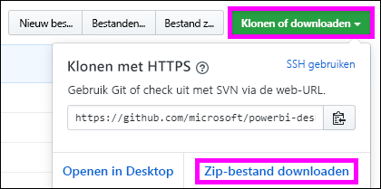

# <a name="embed-a-power-bi-report-server-report-using-an-iframe-in-sharepoint-server"></a>Een Power BI Report Server-rapport insluiten met behulp van een iFrame in SharePoint Server

In dit artikel leert u hoe u een Power BI Report Server-rapport insluit met behulp van een iFrame op een SharePoint-pagina. Als u met SharePoint Online werkt, moet Power BI Report Server openbaar toegankelijk zijn. In SharePoint Online werkt het Power BI-webonderdeel dat geschikt is voor de Power BI-service niet met Power BI Report Server.  


## <a name="prerequisites"></a>Vereisten
* [Power BI Report Server](https://powerbi.microsoft.com/report-server/) moet zijn geïnstalleerd en geconfigureerd.
* [De voor Power BI Report Server geoptimaliseerde versie van Power BI Desktop](install-powerbi-desktop.md) moet zijn geïnstalleerd.
* Er moet een [SharePoint](https://docs.microsoft.com/sharepoint/install/install)-omgeving zijn geïnstalleerd en geconfigureerd.

## <a name="create-the-power-bi-report-url"></a>De Power BI-rapport-URL maken

1. Download het voorbeeld vanuit GitHub: [Blogdemo](https://github.com/Microsoft/powerbi-desktop-samples). Selecteer **Klonen of downloaden** en selecteer vervolgens **ZIP-bestand downloaden**.

    

2. Pak het bestand uit en open het PBIX-voorbeeldbestand in de voor Power BI Report Server geoptimaliseerde versie van Power BI Desktop.

    

3. Sla het rapport op naar **Power BI Report Server**. 

    

4. Bekijk het rapport in de webportal van Power BI Report Server.

    

### <a name="capture-the-url-parameter"></a>De URL-parameter vastleggen

Zodra u de URL hebt, kunt u een iFrame binnen een SharePoint-pagina maken om het rapport te hosten. Voeg voor elke Power BI Report Server-rapport-URL de volgende queryreeksparameter toe om uw rapport in te sluiten in een iFrame in SharePoint: `?rs:embed=true`.

   Bijvoorbeeld:
    ``` 
    https://myserver/reports/powerbi/Sales?rs:embed=true
    ```
## <a name="embed-the-report-in-a-sharepoint-iframe"></a>Het rapport insluiten in een iFrame van SharePoint

1. Navigeer naar een SharePoint **Site-inhoud**-pagina.

    

2. Kies de pagina waaraan u uw rapport wilt toevoegen.

    

3. Selecteer het tandwielpictogram in de rechterbovenhoek en selecteer vervolgens **Pagina bewerken**.

    

4. Selecteer **Een webonderdeel toevoegen**.

5. Selecteer onder **Categorieën** de optie **Media en inhoud**. Selecteer onder **Onderdelen** de optie **Inhoudseditor** en selecteer vervolgens **Toevoegen**.

    

6. Selecteer **Klik hier om nieuwe inhoud toe te voegen**.

7. Selecteer in het bovenste menu **Tekst opmaken** en selecteer vervolgens **Bron bewerken**.

     

8. Plak in het venster **Bron bewerken** uw iFrame-code in **HTML-bron** en selecteer vervolgens **OK**.

    

     Bijvoorbeeld:
     ```html
     <iframe width="800" height="600" src="https://myserver/reports/powerbi/Sales?rs:embed=true" frameborder="0" allowFullScreen="true"></iframe>
     ```

9. Selecteer **Pagina** in het bovenste menu en selecteer vervolgens **Stoppen met bewerken**.

    

    Het rapport wordt op de pagina weergegeven.

    

## <a name="next-steps"></a>Volgende stappen

- [Maak een Power BI-rapport voor Power BI Report Server](quickstart-create-powerbi-report.md).  
- [Maak een gepagineerd rapport voor Power BI Report Server](quickstart-create-paginated-report.md).  

Hebt u nog vragen? [Misschien dat de Power BI-community het antwoord weet](https://community.powerbi.com/). 