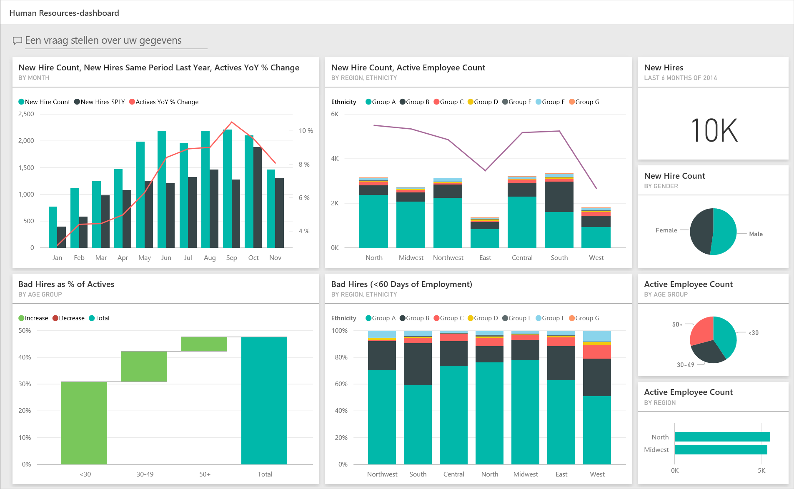
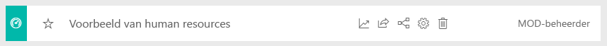
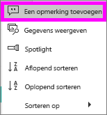
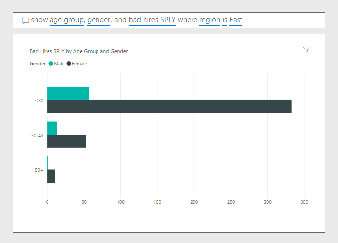

# Voorbeeld van human resources voor Power BI: Rondleiding volgen

Het inhoudspakket Human Resources Sample bevat een dashboard, rapport en gegevensset voor een HR-afdeling. In dit voorbeeld hanteert de HR-afdeling hetzelfde rapportagemodel voor verschillende bedrijven, zelfs wanneer deze verschillen qua branche of omvang. In dit voorbeeld wordt er gekeken naar nieuwe medewerkers, actieve medewerkers en medewerkers die zijn vertrokken. De bedoeling is om trends te ontdekken in de strategie voor het aannemen van personeel. Dit zijn de belangrijkste doelstellingen die we beter willen begrijpen:

* Wie nemen we aan
* Vooroordelen in onze strategie voor het aannemen van personeel
* Trends in het vrijwillig ontslag nemen

Dit voorbeeld maakt deel uit van een serie die laat zien hoe u Power BI kunt gebruiken met bedrijfsgegevens, rapporten en dashboards. Het voorbeeld is door [obviEnce](http://www.obvience.com/) met echte, geanonimiseerde gegevens gemaakt. De gegevens zijn beschikbaar in verschillende indelingen: inhoudspakket, een PBIX-bestand van Power BI Desktop of een Excel-werkmap. Zie [Voorbeelden voor Power BI](sample-datasets.md). 

In deze zelfstudie gebruiken we het inhoudspakket Voorbeeld van human resources in de Power BI-service. Omdat de rapportervaringen in Power BI Desktop en in de service zo vergelijkbaar zijn, kunt u de zelfstudie ook volgen met het PBIX-voorbeeldbestand in Power BI Desktop. 

U hebt geen licentie voor Power BI nodig om de voorbeelden te bekijken in Power BI Desktop. Als u geen Power BI Pro-licentie hebt, kunt u het voorbeeld opslaan in uw Mijn werkruimte in de Power BI-service. 

## Het voorbeeld ophalen

Voordat u het voorbeeld kunt gebruiken, moet u het eerst downloaden als een [inhoudspakket](#get-the-content-pack-for-this-sample), een [PBIX-bestand](#get-the-pbix-file-for-this-sample) of een [Excel-werkmap](#get-the-excel-workbook-for-this-sample).

### Het inhoudspakket voor dit voorbeeld ophalen

1. Open de Power BI-service (app.powerbi.com), meld u aan en open de werkruimte waar u het voorbeeld wilt opslaan.

   Als u geen Power BI Pro-licentie hebt, kunt u het voorbeeld opslaan in uw Mijn werkruimte.

2. Selecteer **Gegevens ophalen** in de linkerbenedenhoek.
   
   
3. Selecteer **Voorbeelden** op de pagina **Gegevens ophalen** die wordt weergegeven.
   
4. Selecteer **Voorbeeld van human resources** en kies vervolgens **Verbinden**.  
   
   

5. Het inhoudspakket wordt geïmporteerd in Power BI en er wordt een nieuw dashboard, een nieuw rapport en een nieuwe gegevensset toegevoegd aan de huidige werkruimte.
   
   
  
### Het pbix-bestand voor dit voorbeeld ophalen

U kunt het voorbeeld ook downloaden als een [.pbix-bestand](https://download.microsoft.com/download/6/9/5/69503155-05A5-483E-829A-F7B5F3DD5D27/Human%20Resources%20Sample%20PBIX.pbix), dat bedoeld is voor gebruik met Power BI Desktop.

### De Excel-werkmap ophalen voor dit voorbeeld

Als u de gegevensbron voor dit voorbeeld wilt bekijken, is dit ook beschikbaar als [Excel-werkmap](https://go.microsoft.com/fwlink/?LinkId=529780). De werkmap bevat Power View-werkbladen die u kunt bekijken en wijzigen. Als u de onbewerkte gegevens wilt zien, schakelt u de invoegtoepassingen van Gegevensanalyse in en selecteert u vervolgens **Power Pivot > Beheren**. Zie [De Excel-voorbeelden in Excel bekijken](sample-datasets.md#explore-excel-samples-inside-excel) als u de Power View- en Power Pivot-invoegtoepassingen wilt inschakelen.

## Nieuwe medewerkers
Laten we eerst eens kijken naar de gegevens van nieuwe medewerkers.

1. Selecteer in uw werkruimte het tabblad **Dashboards** en open het dashboard **Human Resources Sample**.
2. Selecteer in het dashboard de tegel **New Hire Count, New Hires Same Period Last Year, Actives YoY % Change By Month**.  

     

   De pagina **New Hires** van het voorbeeldrapport Human Resources wordt geopend.  

   

3. Bekijk deze belangrijke items:

    * De combinatiegrafiek **New Hire Count, New Hires SPLY en Actives YoY % Change per Month** toont aan dat we dit jaar elke maand meer mensen hebben aangenomen dan vorig jaar, waarbij het in sommige maanden om aanzienlijk meer mensen gaat.
    * In de combinatiegrafiek **New Hire Count en Active Employee Count per Region en Ethnicity** valt op dat we minder nieuwe mensen aannemen in de regio **East**.
    * De watervalgrafiek **New Hires YoY Var per Age Group** laat zien dat we voornamelijk jongere mensen in dienst nemen. De reden voor deze trend kan zijn dat het hoofdzakelijk om part-time banen gaat.
    * Het cirkeldiagram **New Hire Count by Gender** toont een redelijk gelijkmatige verdeling.

    Kunt u nog meer inzichten vinden? Bijvoorbeeld een regio waar de verdeling tussen mannen en vrouwen sterk afwijkt? 

4. Selecteer verschillende leeftijdsgroepen en geslachten in de grafieken om de relaties tussen leeftijd, geslacht, regio en etniciteit te verkennen.

5. Selecteer in het bovenste navigatievenster **Human Resource Sample** om terug te keren naar het dashboard.

   

## Actieve en voormalige medewerkers vergelijken
Laten we eens kijken naar gegevens van de huidige medewerkers en medewerkers die niet langer voor het bedrijf werken.

1. Selecteer op het dashboard de tegel **Active Employee Count by Age Group**.

   

   Het voorbeeldrapport van Human Resources wordt geopend op de pagina **Active Employees vs. Separations**.  

   

 2. Bekijk deze belangrijke items:

    * De twee combinatiegrafieken aan de linkerkant tonen de jaar-tot-jaarwijzigingen voor actieve medewerkers en vrijwillig vertrokken medewerkers. We hebben dit jaar meer actieve medewerkers door snelle inhuur, maar ook meer medewerkers die de organisatie hebben verlaten dan vorig jaar.
    * In augustus zijn er meer mensen vertrokken dan in andere maanden. Selecteer de verschillende leeftijdsgroepen, geslachten of regio's om te zien of u uitbijters kunt vinden.
    * Als we naar de cirkeldiagrammen kijken, valt op dat de actieve medewerkers mooi zijn verdeeld naar geslacht en leeftijdsgroep. Selecteer verschillende leeftijdsgroepen om te zien of de verdeling naar geslacht verschillen oplevert in leeftijd. Hebben we binnen elke leeftijdsgroep een evenredige verdeling naar geslacht?

## Redenen voor ontslag
Laten we het rapport eens bekijken in de bewerkingsweergave. U kunt de cirkeldiagrammen aanpassen om gegevens weer te geven van werknemers die ontslag hebben genomen in plaats van gegevens van actieve medewerkers.

1. Selecteer **Rapport bewerken** in de linkerbovenhoek.

2. Selecteer het cirkeldiagram **Active Employee Count per Age Group**.

3. Selecteer bij **Velden** **Employees** om de tabel **Employees** uit te vouwen. Schakel **Active Employee Count** uit om dat veld te verwijderen.

4. Selecteer **Separation Count** in de tabel **Employees** om dat veld toe te voegen aan het vak **Waarden** in het gebied **Velden**.

5. Selecteer op het rapportcanvas de staaf **Voluntary** in het staafdiagram **Separation Count by Separation Reason**. 

   In deze staaf worden de medewerkers gemarkeerd die vrijwillig in de andere visualisaties in het rapport zijn vertrokken.

6. Selecteer het segment 50+ van het cirkeldiagram **Separation Count by Age Group**.

7. Kijk naar het lijndiagram in de rechterbenedenhoek. Dit diagram is gefilterd op alleen vrijwillig vertrokken medewerkers.  

   

   Ziet u de trend in de leeftijdsgroep 50+? Tijdens het laatste gedeelte van het jaar hebben meer medewerkers ouder dan 50 op vrijwillige basis de organisatie verlaten. Deze trend is een gebied om met meer gegevens nader te onderzoeken.

8. U kunt ook dezelfde stappen volgen voor het cirkeldiagram **Active Employee Count by Gender** en hier het aantal vertrokken medewerkers weergeven in plaats van actieve medewerkers. Bekijk de gegevens van vrijwillig vertrokken medewerkers onderverdeeld naar geslacht om te zien of dat andere inzichten oplevert.

9. Selecteer in het bovenste navigatievenster **Human Resource Sample** om terug te keren naar het dashboard. U kunt ervoor kiezen om de wijzigingen die u hebt aangebracht in het rapport op te slaan.

## Kortstondige medewerkers
Het laatste gebied dat we gaan onderzoeken zijn kortstondige medewerkers. Dit zijn medewerkers die niet meer dan 60 dagen in dienst zijn geweest. We nemen snel nieuwe mensen in dienst, maar zijn dit ook goede kandidaten?

1. Selecteer de tegel **Bad Hires as % of Actives by Age Group** in het dashboard. Het rapport wordt geopend op het derde tabblad, **Bad Hires**.

     
2. Selecteer **Northwest** in de slicer **Region** aan de linkerkant en selecteer **Male** in het ringdiagram **Bad Hire Count per Gender**. Bekijk de andere grafieken op de pagina **Bad Hires**. U ziet dat er meer mannen dan vrouwen heel snel zijn vertrokken en dat er veel kortstondige medewerkers uit groep A afkomstig zijn.

     

3. Als u naar kijkt naar het ringdiagram **Bad Hire Count by Gender** en verschillende regio's selecteert in de slicer **Region**, zult u merken dat de regio East de enige regio is waarin meer vrouwen dan mannelijke kortstondig in dienst zijn.  

4. Selecteer de naam van het dashboard in het bovenste navigatievenster om terug te keren naar het dashboard.

## Een vraag stellen in het Q&A-vak van het dashboard
In het [vak Q&A](power-bi-tutorial-q-and-a.md) in het dashboard kunt u een vraag stellen over uw gegevens met behulp van natuurlijke taal. Q&A herkent de woorden die u typt, en zoekt uit waar in de gegevensset het antwoord kan worden gevonden.

1. Klik in het Q&A-vraagvak. Zelfs voordat u begint te typen, worden er suggesties weergegeven om u te helpen uw vraag te formuleren.

   

2. Kies een van deze suggesties of typ: *show age group, gender, and bad hires SPLY where region is east*.  

   

   U ziet dat de meeste kortstondige medewerkers vrouwen zijn jonger dan 30.

## Volgende stappen: Verbinding maken met uw gegevens
Dit is een veilige omgeving om in te experimenten, omdat er geen optie is om uw wijzigingen op te slaan. Als u dat toch doet, kunt u altijd **Gegevens ophalen** selecteren voor een nieuw exemplaar van dit voorbeeld.

We hopen dat deze rondleiding heeft laten zien hoe Power BI-dashboards, Q&A en rapporten inzicht kunnen geven in voorbeeldgegevens. Nu is het uw beurt om verbinding met uw eigen gegevens te maken. Met Power BI kunt u verbinding maken met een groot aantal gegevensbronnen. Zie [Aan de slag met de Power BI-service](service-get-started.md) voor meer informatie.
