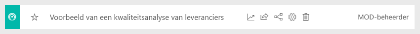
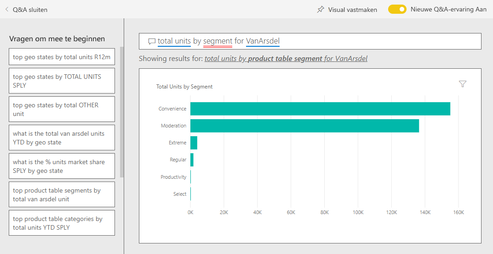
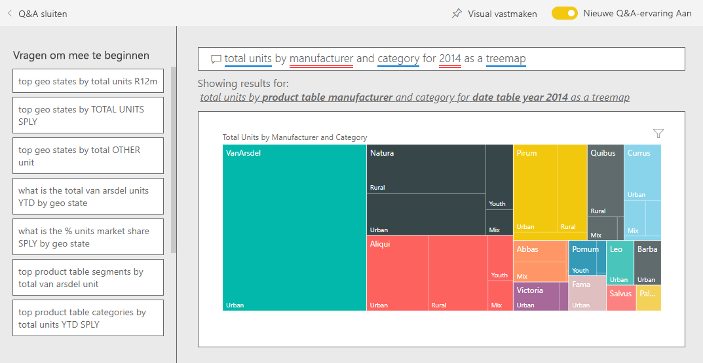

# Voorbeeld van verkoop en marketing voor Power BI: Rondleiding volgen

Het voorbeeld van verkoop en marketing bevat een dashboard en rapport voor een fictief productiebedrijf met de naam VanArsdel Ltd. De Chief Marketing Officer (CMO) van VanArsdel heeft dit dashboard gemaakt om de branche en het marktaandeel, productvolume, de verkopen en het sentiment over het bedrijf in de gaten te houden.

VanArsdel heeft veel concurrenten, maar is de marktleider binnen de branche. De CMO wil het marktaandeel vergroten en de groeimogelijkheden verkennen. Het marktaandeel van VanArsdel is echter om onbekende redenen kleiner aan het worden, met een aanzienlijke dip in juni.

Dit voorbeeld maakt deel uit van een serie die laat zien hoe u Power BI kunt gebruiken met bedrijfsgegevens, rapporten en dashboards. Het voorbeeld is door [obviEnce](http://www.obvience.com/) met echte, geanonimiseerde gegevens gemaakt. De gegevens zijn beschikbaar in verschillende indelingen: inhoudspakket, een PBIX-bestand van Power BI Desktop of een Excel-werkmap. Zie [Voorbeelden voor Power BI](sample-datasets.md). 

In deze zelfstudie gebruiken we het voorbeeldinhoudspakket voor verkoop en marketing in de Power BI-service. Omdat de rapportervaringen in Power BI Desktop en in de service zo vergelijkbaar zijn, kunt u de zelfstudie ook volgen met het PBIX-voorbeeldbestand in Power BI Desktop. 

U hebt geen licentie voor Power BI nodig om de voorbeelden te bekijken in Power BI Desktop. Als u geen Power BI Pro-licentie hebt, kunt u het voorbeeld opslaan in uw Mijn werkruimte in de Power BI-service. 

## Het voorbeeld ophalen

Voordat u het voorbeeld kunt gebruiken, moet u het eerst downloaden als een [inhoudspakket](#get-the-content-pack-for-this-sample), een [PBIX-bestand](#get-the-pbix-file-for-this-sample) of een [Excel-werkmap](#get-the-excel-workbook-for-this-sample).

### Het inhoudspakket voor dit voorbeeld ophalen

1. Open de Power BI-service (app.powerbi.com), meld u aan en open de werkruimte waar u het voorbeeld wilt opslaan.

   Als u geen Power BI Pro-licentie hebt, kunt u het voorbeeld opslaan in uw Mijn werkruimte.

2. Selecteer **Gegevens ophalen** in de linkerbenedenhoek.
   
   
3. Selecteer **Voorbeelden** op de pagina **Gegevens ophalen** die wordt weergegeven.
   
4. Selecteer het **voorbeeld van verkoop en marketing** en kies vervolgens **Verbinding maken**.   
  
   
   
5. Het inhoudspakket wordt geïmporteerd in Power BI en er wordt een nieuw dashboard, een nieuw rapport en een nieuwe gegevensset toegevoegd aan de huidige werkruimte.
   
   
  
### Het pbix-bestand voor dit voorbeeld ophalen

U kunt ook het voorbeeld van verkoop en marketing downloaden als [PBIX-bestand](https://download.microsoft.com/download/9/7/6/9767913A-29DB-40CF-8944-9AC2BC940C53/Sales%20and%20Marketing%20Sample%20PBIX.pbix), dat bedoeld is voor gebruik met Power BI Desktop.

### De Excel-werkmap ophalen voor dit voorbeeld

Als u de gegevensbron voor dit voorbeeld wilt bekijken, is dit ook beschikbaar als [Excel-werkmap](https://go.microsoft.com/fwlink/?LinkId=529785). De werkmap bevat Power View-werkbladen die u kunt bekijken en wijzigen. Als u de onbewerkte gegevens wilt zien, schakelt u de invoegtoepassingen van Gegevensanalyse in en selecteert u vervolgens **Power Pivot > Beheren**. Zie [De Excel-voorbeelden in Excel bekijken](sample-datasets.md#explore-excel-samples-inside-excel) als u de Power View- en Power Pivot-invoegtoepassingen wilt inschakelen.

## Wat vertelt het dashboard ons?
Laten we de rondleiding beginnen bij het dashboard en eens kijken welke tegels de CMO heeft vastgemaakt. We zien informatie over ons marktaandeel, de verkopen en het sentiment. De gegevens zijn opgedeeld per regio, tijd en concurrentie.

* De getallentegels langs de linkerkolom tonen ons het verkoopvolume van de branche voor het afgelopen jaar (50.000), het marktaandeel (32,86%), het verkoopvolume (16.000), de sentimentscore (68), het sentimenthiaat (4) en het totale aantal verkochten eenheden (1 miljoen).
* In het bovenste lijndiagram (**Percentage eenheden marktaandeel t.o.v. percentage eenheden marktaandeel 12 maanden voortschrijdend**) laat zien hoe ons marktaandeel in de loop van de tijd schommelt. Let op de grote daling in juni. Ons aandeel van 12 maanden voortschrijdend dat enige tijd steeg, begint nu te stagneren.
* Onze grootste concurrent is Aliqui, zoals blijkt uit de middelste kolomdiagramtegel (**Totaal afwijkingspercentage eenheden jaar tot heden**).
* We doen met name veel zaken in de oostelijke en centrale gebieden.
* De lijndiagram onderaan (**Totale eenheden voor 2014**) laat zien dat onze dip in juni niet seizoensgebonden is, aangezien geen van onze concurrenten dezelfde trend laat zien.
* De tegels **Totale eenheden algeheel**en**Totale eenheden jaar tot heden** aan de rechterkant bevatten de verkochte eenheden, per segment en per regio/fabrikant. De grootste marktsegmenten voor onze branche zijn **Productiviteit** en **Convenience**.

## De Q&A-functie gebruiken om wat dieper te graven

Met Q&A kunt u aanvullende informatie in de gegevens ontdekken.

### Welke segmenten zijn goed voor onze verkoop? Komen deze overeen met de trend binnen de branche?
1. Selecteer de tegel **Totaal aantal eenheden geheel per segment** waarmee Q&A wordt geopend en gevuld met de query, *totaal aantal eenheden per segment*.
2. Voeg aan het einde van de bestaande query het volgende toe: *voor VanArsdel*. Q&A interpreteert de een bijgewerkt diagram met het antwoord weer. Zoals u ziet, is ons productvolume doorgaans afkomstig uit de segmenten **Convenience** en **Beheer**.

   
3. Ons aandeel in de categorieën **Beheer** en **Convenience** is hoog. Dit zijn de segmenten waarin wij concurreren.
4. Ga terug naar het dashboard door **Voorbeeld van verkoop en marketing** in het bovenste navigatievenster te selecteren.

### Hoe ziet het marktaandeel voor het totale aantal eenheden eruit voor een categorie (versus regio)?
1. Bekijk de tegel **Totaal eenheden jaar tot heden per fabrikant en categorie**. Wat is het totale marktaandeel van de eenheid per categorie?

   
2. Selecteer bovenaan het dashboard het vragenvak en typ de vraag om het *totale aantal eenheden per fabrikant en categorie voor 2014 als een treemap* weer te geven. Zoals u ziet wordt de visualisatie bijgewerkt terwijl u de vraag typt.

   
3. Als u de bevindingen wilt vergelijken, moet u de diagram vastmaken aan uw dashboard. U ziet dit interessante feit: In 2014 verkocht VanArsdel alleen producten in de categorie **Stedelijk**.
4. Ga terug naar het dashboard.

## Rapport van voorbeeld van verkoop en marketing

Dashboards fungeren als ingangspunt in rapporten. Als er een tegel is gemaakt van een onderliggend rapport, kunt u het rapport openen door de tegel te selecteren.

Op het dashboard is aan de lijn **Percentage eenheden marktaandeel 12 maanden voortschrijdend** in het diagram **Percentage eenheden marktaandeel t.o.v. percentage eenheden marktaandeel 12 maanden voortschrijdend** te zien dat ons marktaandeel niet langer in de loop van de tijd toeneemt. Het neemt zelfs een beetje af. En waarom hebben we in juni een grote dip in het marktaandeel? 

Het rapport voor het voorbeeld van verkoop en marketing heeft vier pagina's.
 
### Pagina VanArsdel - Marktaandeel
Pagina één van het rapport richt zich op het marktaandeel van VanArsdel.

1. Selecteer op het dashboard het diagram **Percentage eenheden marktaandeel t.o.v. percentage eenheden marktaandeel 12 maanden voortschrijdend** om de pagina **VanArsdel - Marktaandeel** van het rapport van het voorbeeld van verkoop en marketing te openen.

   

2. Bekijk onderaan het rapport het kolomdiagram **Totaal aantal eenheden per maand en is VanArsdel**. De zwarte kolom representeert VanArsdel (onze producten) en de groene kolom is onze concurrentie. De dip die VanArsdel in juni 2014 ondervond, vond niet plaats bij de concurrentie.

3. Het staafdiagram **Totaal categorievolume per segment** aan de rechterkant is gefilterd om de twee topsegmenten van VanArsdel weer te geven. Dit filter is als volgt gemaakt:  

   a. Selecteer het diagram **Totaal categorievolume per segment**.

   b. Selecteer het deelvenster **Filters** aan de rechterkant om het uit te vouwen.  

   c. Onder **Filters op niveau van visuele elementen** ziet u dat **Segment** zodanig is gefilterd dat alleen de segmenten **Convenience** en **Beheer** zijn opgenomen.  

   d. Wijzig het filter door **Segment** te selecteren om het uit te vouwen. Vervolgens schakelt u **Productiviteit** in om dat segment toe te voegen.  

4. Selecteer in het diagram **Totaal aantal eenheden per maand en isVanArsdel** de optie **Ja** in de legenda om de pagina kruislings te filteren op VanArsdel. U ziet in het diagram **Totaal categorievolume per segment** dat we niet concurreren in het segment **Productiviteit**.

5. Selecteer opnieuw de optie **Ja** in de legenda om het filter te verwijderen.

6. Bekijk het lijndiagram **Percentage eenheden marktaandeel en percentage eenheden marktaandeel 12 maanden voortschrijdend per maand**. U ziet in het diagram ons maandelijkse marktaandeel en de marktaandelen 12 maanden voortschrijdend. Gegevens van voortschrijdende maanden helpen om de maandelijkse fluctuaties uit te vlakken en de trends voor de lange termijn te tonen. Selecteer in het staafdiagram **Totaal categorievolume per segment** achtereenvolgens **Convenience** en **Beheer** om de schommeling in het marktaandeel voor elk segment te bekijken. Zoals u ziet, laat het segment **Beheer** veel meer schommelingen in het marktaandeel zien.

We proberen nog steeds te achterhalen waarom ons marktaandeel in juni zo'n dip vertoonde. Nu gaan we de pagina **Sentimentanalyse** van het rapport bekijken.

### Pagina Sentimentanalyse
Pagina drie van het rapport is gericht op consumentensentiment.

Tweets, Facebook, blogs en artikelen dragen allemaal bij aan het consumentensentiment, zoals te zien is in de twee lijndiagrammen aan de linkerkant van de pagina. Het diagram **VanArsdel - Sentiment per maand** in de linkerbovenhoek laat zien dat het sentiment met betrekking tot onze producten tot en met februari meestal neutraal was. Vervolgens begon het in februari te kelderen en vond in juni de grootste dip plaats. Wat is er gebeurd waardoor het sentiment zo kelderde? 

Laten we eens naar externe bronnen kijken. In februari werd de klantenservice van VanArsdel in verschillende artikelen en blogberichten zeer negatief beoordeeld. Deze slechte publiciteit is direct gecorreleerd aan het sentiment van klanten en de verkoop. Er is hard gewerkt om de klantenservice te verbeteren en dat is niet onopgemerkt gebleven door klanten en de branche. In juli nam het positieve sentiment toe en bereikte zelfs een recordhoogte van meer dan 60. Deze opleving in het sentiment wordt weerspiegeld in het diagram **Totale eenheden per maand** op pagina's één en twee van het rapport. Misschien verklaart dit gedeeltelijk onze dip in juni voor het marktaandeel?

Sentimenthiaat is misschien een ander gebied om te verkennen. Welke districten hebben het grootste sentimenthiaat, hoe kan het management hierop inspelen en hoe kunnen ze het repliceren in andere districten?

### Pagina Trendanalyse categorie jaar tot heden
Pagina twee van het rapport is gericht op de trend van de categorie jaar tot heden.

Let op de volgende details:
* VanArsdel is het grootste bedrijf in deze categorie en de grootste concurrenten zijn Natura, Aliqui en Pirium. Wij houden ze in de gaten.
* Aliqui groeit, maar het productvolume is in vergelijking met die van ons vrij laag.
* VanArsdel is groen in de treemap. In de regio Oost geven klanten de voorkeur aan onze concurrenten, maar in de regio Centraal doen we het goed. Ons aandeel in de regio Oost is ons laagste aandeel.
* De geografie heeft een impact op het aantal verkochte eenheden. De regio Oost is voor de meeste fabrikanten de dominante regio en VanArsdel is ook sterk vertegenwoordigt in de regio Centraal.
* U ziet in het diagram **Totaal aantal eenheden jaar tot heden var.percentage per maand en fabrikant** rechtsonder dat er sprake is van een positieve afwijking. Dit is een goed teken. We doen het beter dan vorig jaar, maar datzelfde geldt voor onze concurrent Aliqui.

### Pagina Groeikansen
Pagina vier van het rapport richt zich op de analyse van concurrerende producten.

Let op de volgende details:
* In het diagram **Totale eenheden per segment** in de linkerbenedenhoek worden alle categoriesegmenten weergegeven, met uitzondering van de twee sterkste segmenten van VanArsdel. Selecteer de segmenten een voor een om mogelijke uitbreidingsgebieden voor VanArsdel te identificeren. 
* Zoals u ziet, groeien de segmenten **Extreem** en **Productiviteit** sneller dan de andere segmenten. We concurreren echter niet in die segmenten. Als we ons in deze segmenten willen begeven, kunnen we onze gegevens gebruiken om te kijken welke segmenten in welke regio's populair zijn. We kunnen verder onderzoek doen naar vragen als 'welke regio groeit het snelst' en 'wie is onze grootste concurrent in dat segment'.
* Weet u nog dat we een dip voor het marktaandeel hadden in juni? Juni is een belangrijke maand voor het segment **Productiviteit**. Dit is een segment waarin we helemaal niet concurreren. Dit kan mogelijk onze dip in juni ook deels verklaren.

Door de visualisatie te filteren op VanArsdel, per segment, per maand en per regio, kunnen we achterhalen welke groeimogelijkheden VanArsdel heeft.

## Volgende stappen: Verbinding maken met uw gegevens
Dit is een veilige omgeving om in te experimenten, omdat er geen optie is om uw wijzigingen op te slaan. Als u dat toch doet, kunt u altijd **Gegevens ophalen** selecteren voor een nieuw exemplaar van dit voorbeeld.

We hopen dat deze rondleiding heeft laten zien hoe Power BI-dashboards, Q&A en rapporten inzicht kunnen geven in gegevens van de HR-afdeling. Nu is het uw beurt om verbinding met uw eigen gegevens te maken. Met Power BI kunt u verbinding maken met een groot aantal gegevensbronnen. Zie [Aan de slag met de Power BI-service](service-get-started.md) voor meer informatie.
