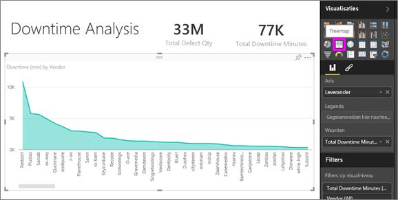
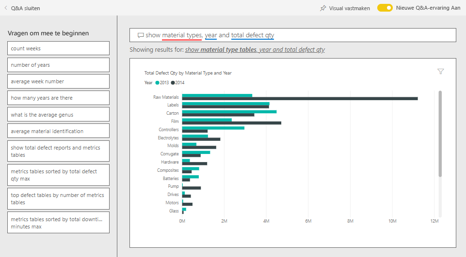
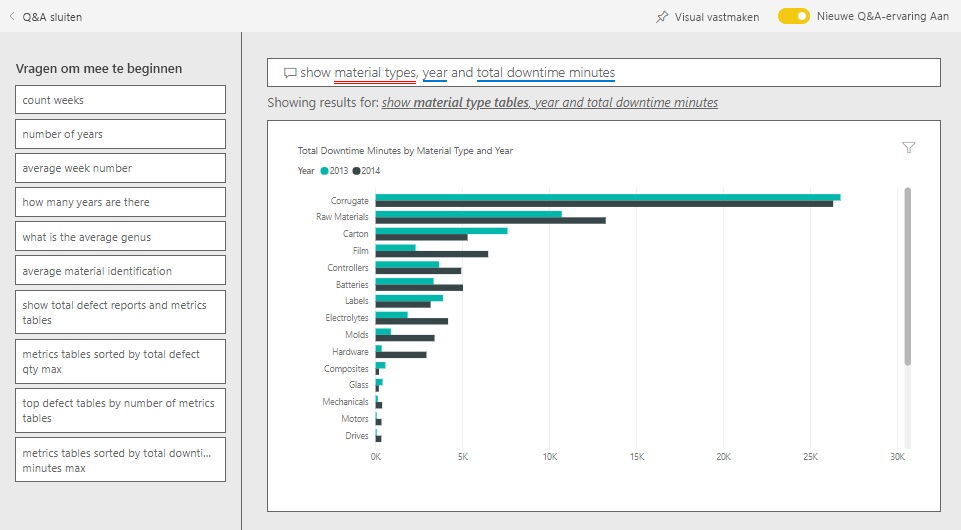
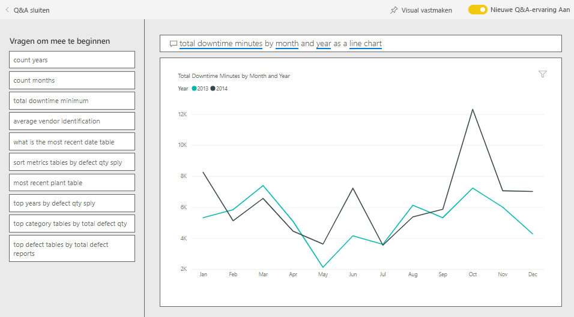

# Voorbeeld van kwaliteitsanalyse van leveranciers voor Power BI: Rondleiding volgen

Dit voorbeelddashboard met bedrijfsgegevens en het onderliggende rapport zijn gericht op een van de typische uitdagingen met betrekking tot de toelevering: kwaliteitsanalyse van leveranciers. In deze analyse zijn twee primaire gegevensgroepen belangrijk: het totale aantal defecte producten en de totale downtime die deze defecte producten hebben veroorzaakt. 

Dit voorbeeld heeft twee belangrijke doelen:

* Begrijpen wie met betrekking tot kwaliteit de beste en de slechtste leveranciers zijn.
* Identificeren welke fabrieken beter zijn in het vinden en verwijderen van defecten om de downtime te minimaliseren.

Dit voorbeeld maakt deel uit van een serie die laat zien hoe u Power BI kunt gebruiken met bedrijfsgegevens, rapporten en dashboards. Het voorbeeld is door [obviEnce](http://www.obvience.com/) met echte, geanonimiseerde gegevens gemaakt. De gegevens zijn beschikbaar in verschillende indelingen: inhoudspakket, een PBIX-bestand van Power BI Desktop of een Excel-werkmap. Zie [Voorbeelden voor Power BI](sample-datasets.md). 

In deze zelfstudie gebruiken we het voorbeeldinhoudspakket Kwaliteitsanalyse van leveranciers in de Power BI-service. Omdat de rapportervaringen in Power BI Desktop en in de service zo vergelijkbaar zijn, kunt u de zelfstudie ook volgen met het PBIX-voorbeeldbestand in Power BI Desktop. 

U hebt geen licentie voor Power BI nodig om de voorbeelden te bekijken in Power BI Desktop. Als u geen Power BI Pro-licentie hebt, kunt u het voorbeeld opslaan in uw Mijn werkruimte in de Power BI-service. 

## Het voorbeeld ophalen

Voordat u het voorbeeld kunt gebruiken, moet u het eerst downloaden als een [inhoudspakket](#get-the-content-pack-for-this-sample), een [PBIX-bestand](#get-the-pbix-file-for-this-sample) of een [Excel-werkmap](#get-the-excel-workbook-for-this-sample).

### Het inhoudspakket voor dit voorbeeld ophalen

1. Open de Power BI-service (app.powerbi.com), meld u aan en open de werkruimte waar u het voorbeeld wilt opslaan.

   Als u geen Power BI Pro-licentie hebt, kunt u het voorbeeld opslaan in uw Mijn werkruimte.

2. Selecteer **Gegevens ophalen** in de linkerbenedenhoek.
   
   
3. Selecteer **Voorbeelden** op de pagina **Gegevens ophalen** die wordt weergegeven.
   
4. Selecteer **Voorbeeld van een kwaliteitsanalyse van leveranciers** en kies **Verbinding maken**.  
   
   

5. Het inhoudspakket wordt geïmporteerd in Power BI en er wordt een nieuw dashboard, een nieuw rapport en een nieuwe gegevensset toegevoegd aan de huidige werkruimte.
   
   
  
### Het pbix-bestand voor dit voorbeeld ophalen

U kunt het voorbeeld ook downloaden als een [PBIX-bestand](http://download.microsoft.com/download/8/C/6/8C661638-C102-4C04-992E-9EA56A5D319B/Supplier-Quality-Analysis-Sample-PBIX.pbix), dat bedoeld is voor gebruik met Power BI Desktop.

### De Excel-werkmap ophalen voor dit voorbeeld

Als u de gegevensbron voor dit voorbeeld wilt bekijken, is dit ook beschikbaar als [Excel-werkmap](http://go.microsoft.com/fwlink/?LinkId=529779). De werkmap bevat Power View-werkbladen die u kunt bekijken en wijzigen. Als u de onbewerkte gegevens wilt zien, schakelt u de invoegtoepassingen van Gegevensanalyse in en selecteert u vervolgens **Power Pivot > Beheren**. Als u de Power View- en Power Pivot-invoegtoepassingen wilt inschakelen, raadpleegt u [De Excel-voorbeelden in Excel bekijken](sample-datasets.md#optional-take-a-look-at-the-excel-samples-from-inside-excel-itself) voor meer informatie.

## Downtime die is veroorzaakt door defecte materialen
Laten we eens analyseren hoeveel downtime het gevolg is van defecte materialen en welke leveranciers hier verantwoordelijk voor zijn.  

1. Selecteer op het dashboard de tegel **Totale aantal defecten** of **Totale downtime in minuten**.

     

   Het rapport Voorbeeld van kwaliteitsanalyse van leveranciers wordt geopend op de pagina **Downtimeanalyse**.

   U ziet dat er sprake is van 33 miljoen defecte delen, waardoor er een totale downtime van 77.000 minuten ontstaat. Hoewel sommige materialen minder defecte delen bevatten, kunnen ze vertragingen veroorzaken, wat tot meer downtime leidt. Laten we ze eens verkennen op de rapportpagina.  
2. Als we naar de lijn **Totale aantal minuten downtime** kijken in de combinatiegrafiek **Defecten en downtime (min.) per materiaaltype**, zien we dat golfkarton de meeste downtime veroorzaakt.  
3. Selecteer de kolom **Golfkarton** om te zien welke fabrieken het meest worden beïnvloed door dit defect en welke leverancier hier verantwoordelijk voor is.  

     
4. Selecteer in de kaart **Downtime (min.) per fabriek** afzonderlijke fabrieken om te zien welke leverancier of welk materiaal verantwoordelijk is voor de downtime voor die fabriek.

### Wie zij de slechtste leveranciers?
 We willen de acht slechtste leveranciers vinden en bepalen voor welk percentage van de downtime ze verantwoordelijk zijn. We kunnen dit doen door het vlakdiagram **Downtime (min.) per leverancier** te wijzigen in een treemap.  

1. Selecteer op de pagina **Downtimeanalyse** van het rapport in de rechterbovenhoek de optie **Rapport bewerken**.  
2. Selecteer het vlakdiagram **Downtime (min.) per leverancier** en selecteer in het deelvenster **Visualisaties** het pictogram **Treemap**.  

     

    Het veld **Leverancier** wordt automatisch ingesteld als de **groep**.  

      

   In deze treemap kunt u zien dat de acht leveranciers de acht blokken aan de linkerkant van de treemap zijn. We kunnen ook zien dat ze verantwoordelijk zijn voor 50% van alle downtimeminuten.  
3. Selecteer in de bovenste navigatiebalk de optie **Voorbeeld van kwaliteitsanalyse van leveranciers** om terug te keren naar het dashboard.

### Fabrieken vergelijken
Laten we nu eens kijken welke fabriek de defecte materialen het beste beheert en daardoor minder downtime heeft.  

1. Selecteer op het dashboard de tegel met de kaart voor het **totaal aantal defectmeldingen per fabriek en type defect**.      

     

   Het rapport wordt geopend op de pagina **Kwaliteitsanalyse van leveranciers**.  

2. Selecteer in de legenda van **Totaal aantal defectmeldingen per fabriek en type defect** de cirkel **Impact**.  

      

    U ziet in het bellendiagram dat **Logistiek** de meest problematische categorie is. Deze categorie heeft de meeste defecten, defectmeldingen en downtimeminuten. Laten we deze categorie eens nader bekijken.  
3. Selecteer in het bellendiagram de bel **Logistiek** en bekijk de fabrieken in Springfield en Naperville, IL. Zo te zien worden de defecte goederen in Naperville veel beter beheerd dan in Springfield, aangezien het aantal afgekeurde goederen vrij hoog is, maar de impact hiervan in vergelijking met het grote aantal impacts in Springfield vrij beperkt is.  

     
4. Selecteer in de bovenste navigatiebalk de optie **Voorbeeld van kwaliteitsanalyse van leveranciers** om terug te keren naar het dashboard.

## Welk type materiaal wordt het best beheerd?
Het beste beheerde type materiaal type is het materiaal met de laagste downtime of zonder impact, ongeacht het aantal defecten.

1. Bekijk de dashboardtegel **Totaal aantal defecten per type materiaal en defect**.

   

   Zoals u kunt zien is het totale aantal defecten voor **Grondstoffen** vrij hoog. Dergelijke items worden echter meestal afgekeurd of ze hebben geen impact.

   Laten we eens controleren of dit type materiaal niet veel downtime veroorzaakt, ondanks het hoge aantal defecten.

2. Bekijk de tegel **Totaal aantal defecten, Totale downtime in minuten per materiaaltype** op het dashboard.

   

   Grondstoffen blijken goed te worden beheerd. Het aantal defecten is groter, maar de totale downtime in minuten is minder.

### Defecten vergelijken met de jaarlijkse downtime
1. Selecteer de kaarttegel **Totaal aantal defectmeldingen per fabriek, defecttype** om de pagina **Kwaliteitsanalyse van leveranciers** te openen.
2. In het diagram **Totaal aantal defect per maand en jaar** ziet u dat het aantal defecten in 2014 hoger is dan in 2013.  

      
3. Laat een groter aantal defecten zich vertalen in meer downtime? Stel vragen in het vak Q&A om dit na te gaan.  
4. Selecteer in de bovenste navigatiebalk de optie **Voorbeeld van kwaliteitsanalyse van leveranciers** om terug te keren naar het dashboard.  
5. Omdat we weten dat grondstoffen het hoogste aantal defecten hebben, typt u in het vragenvak *materiaaltypen, jaar en totaal aantal defect weergeven*.  

    Het aantal defecte grondstoffen was in 2014 aanzienlijk hoger dan in 2013.  

      
6. Wijzig de vraag vervolgens in: _materiaaltype, jaar en totale **downtime in minuten** weergeven_.  

   

   Zoals u ziet, was de downtime voor grondstoffen in 2013 en 2014 ongeveer hetzelfde hoewel er in 2014 veel meer grondstofdefecten waren. Het lijkt erop dat meer defecten voor grondstoffen in 2014 niet leiden tot veel meer downtime voor grondstoffen in 2014.

### Defecten vergelijken met de maandelijkse downtime
Laten we nog een andere dashboardtegel bekijken die gerelateerd is aan het totale aantal defecten.  

1. Selecteer **Q&A sluiten** in de linkerbovenhoek om terug te gaan naar het dashboard.  

    Bekijk de tegel **Totaal aantal defecten per maand, jaar** nader. Hieruit blijkt dat het aantal defecten voor de eerste helft van 2014 vergelijkbaar is met het aantal defecten in 2013, maar dat het aantal defecten voor de tweede helft van 2014 aanzienlijk hoger uitvalt.  

      

    Laten we eens kijken of deze toename in het aantal defecten ook heeft geleid tot een hoger downtime in minuten.  
2. Typ in het vragenvak de vraag *totale downtime in minuten per maand en jaar als lijndiagram*.  

   

   We zien dat downtime in juni en oktober toeneemt, maar voor de overige maanden vertaalt het grotere aantal defecten zich niet in aanzienlijk meer downtime. Hieruit blijkt dat de defecten goed worden beheerd.  
3. Maak dit diagram vast aan uw dashboard door het speldpictogram  boven het vragenvak te selecteren.  
4. Als u de uitschieters, oftewel de maanden juni en oktober, wilt verkennen, kunt u de downtime in minuten voor oktober per materiaaltype, fabriekslocatie, categorie, enzovoort controleren door vragen te stellen als *totale downtime in minuten voor oktober per fabriek*. 
5. Selecteer **Q&A sluiten** in de linkerbovenhoek om terug te gaan naar het dashboard.

## Volgende stappen: Verbinding maken met uw gegevens
Dit is een veilige omgeving om in te experimenten, omdat er geen optie is om uw wijzigingen op te slaan. Als u dat toch doet, kunt u altijd **Gegevens ophalen** selecteren voor een nieuw exemplaar van dit voorbeeld.

We hopen dat deze rondleiding heeft laten zien hoe Power BI-dashboards, Q&A en rapporten inzicht kunnen geven in voorbeeldgegevens. Nu is het uw beurt om verbinding met uw eigen gegevens te maken. Met Power BI kunt u verbinding maken met een groot aantal gegevensbronnen. Zie [Aan de slag met de Power BI-service](service-get-started.md) voor meer informatie.
