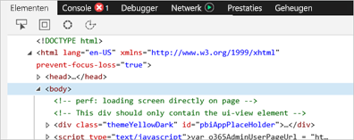
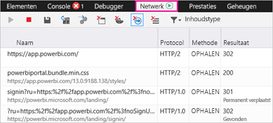
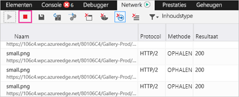
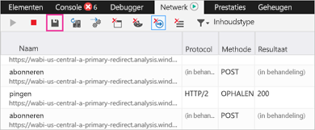

# Aanvullende diagnostische gegevens vastleggen voor Power BI

Dit artikel bevat instructies voor het handmatig verzamelen van aanvullende diagnostische gegevens van de Power BI-webclient.

1. Ga naar [Power BI](https://app.powerbi.com) met Microsoft Edge of Internet Explorer.

1. Druk op **F12** om de ontwikkelhulpprogramma's van Microsoft Edge te openen.

   

1. Selecteer het tabblad **Netwerk**. Hier wordt een lijst weergegeven met het verkeer dat al is vastgelegd.

   

    U kunt:

    * Bladeren in het venster en problemen reproduceren die u tegenkomt.

    * Het venster met ontwikkelhulpprogramma's op elk gewenst moment tijdens de sessie verbergen en weergeven door op F12 te drukken.

1. Als u wilt stoppen met het profileren van de sessie, selecteert u het rode blokje op het tabblad **Netwerk** van de ontwikkelhulpprogramma's.

   

1. Selecteer het diskettepictogram om de gegevens te exporteren als een HTTP-archiefbestand (HAR).

   

1. Geef een bestandsnaam op en sla het HAR-bestand op.

    Het HAR-bestand bevat alle informatie over netwerkaanvragen tussen het browservenster en Power BI, waaronder:

    * De activiteit-id's voor elke aanvraag.

    * De exacte tijdstempel voor elke aanvraag.

    * Eventuele foutgegevens die naar de client zijn geretourneerd.

    Deze tracering bevat ook de gegevens die worden gebruikt voor het vullen van de visuele elementen die op het scherm worden weergegeven.

1. U kunt het HAR-bestand naar ondersteuning verzenden voor controle.

Nog vragen? [Misschien dat de Power BI-community het antwoord weet](http://community.powerbi.com/)
