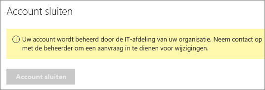

# Uw Power BI-account sluiten

Als u Power BI niet meer wilt gebruiken, kunt u een verzoek indienen om uw Power BI-account te sluiten.  Nadat u uw account hebt gesloten, kunt u zich niet aanmelden bij Power BI. Ook als deze wordt aangegeven in het bewaarbeleid voor gegevens in de Power BI voorwaarden van de Service, Power BI Hiermee verwijdert u eventuele klantgegevens die u hebt geüpload of gemaakt. Wel worden niet bewaard.

## Individuele Power BI-gebruikers

Als u zich als individu hebt geregistreerd voor Power BI, kunt u uw account sluiten via het scherm **Instellingen**.

1. Selecteer in Power BI rechtsboven het tandwielpictogram en selecteer vervolgens **Instellingen**.

    

1. Selecteer **Account sluiten** op het tabblad **Algemeen**.

    

1. Selecteer een reden voor het sluiten van het account (1). U kunt eventueel ook aanvullende informatie opgeven (2). Selecteer vervolgens **Account sluiten**.

    

1. Bevestig dat u uw account wilt sluiten.

    

    U ziet een bevestiging dat Power BI uw account gesloten. Indien nodig kunt u uw account hier opnieuw openen.

    

## Beheerde tenantgebruikers

Als u door uw organisatie bent geregistreerd voor Power BI, neemt u contact op met de tenantbeheerder. Vraag de beheerder om de licentie voor uw account in te trekken.

Hebt u nog vragen? [Misschien dat de Power BI-community het antwoord weet](http://community.powerbi.com/)