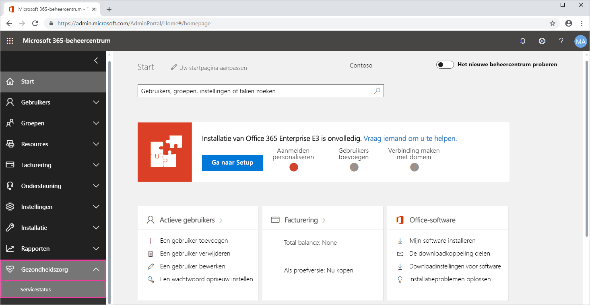
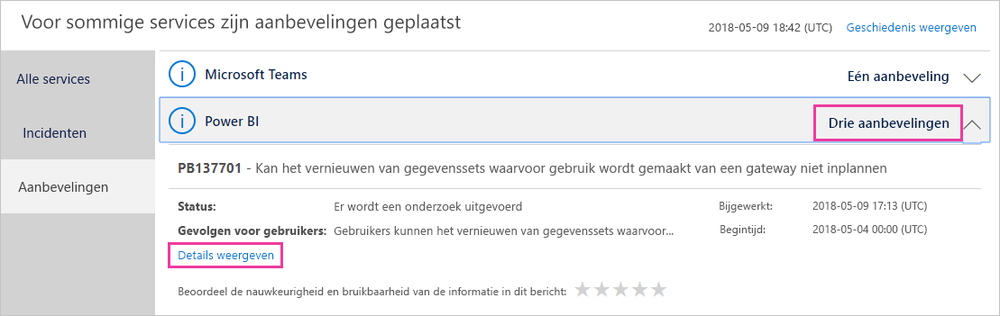

# Status van de Power BI-service in Office 365 bijhouden

De Microsoft 365-beheercentrum biedt belangrijke hulpprogramma's voor Power BI-beheerders. De hulpprogramma's omvatten de huidige en historische informatie over service health. Voor toegang tot service health-informatie, moet u een van de volgende rollen zijn:

* Power BI-servicebeheerder

* Globale beheerder van Office 365

Zie voor meer informatie over rollen [beheerdersrollen met betrekking tot Power BI](service-admin-administering-power-bi-in-your-organization.md#administrator-roles-related-to-power-bi).

1. Meld u aan bij het [Microsoft 365-beheercentrum](https://portal.office.com/adminportal).

1. Selecteer in de linker navigatiebalk **Show all** > **Health** > **servicestatus**. De Service health-pagina wordt weergegeven:

    

1. Uit de **alle services** in de lijst met **adviezen** of **incidenten** en bekijk de resultaten. In de onderstaande schermafbeelding ziet u een van drie actieve aanbevelingen.

    

1. Selecteer **Details weergeven** voor een item als u meer informatie wilt weergeven. In de onderstaande schermafbeelding ziet u aanvullende informatie, zoals de recente van statusupdates.

    

    Schuif naar beneden om meer informatie te bekijken en sluit het deelvenster wanneer u klaar bent.

1. Om te zien van historische gegevens voor alle services, in de rechterbovenhoek van de **servicestatus** weergeeft, schakelt **geschiedenis weergeven**. Selecteer vervolgens **Afgelopen 7 dagen** of **Afgelopen 30 dagen**. 

1. Selecteer **Huidige status weergeven** om terug te gaan naar de huidige servicestatus.