# Power BI beheren in de beheerportal

Via de beheerportal kunt u een Power BI-*tenant* voor uw organisatie beheren. De portal bevat onder andere metrische gegevens over gebruik, toegang tot het Microsoft 365-beheercentrum en instellingen.

Het volledige beheerportal is toegankelijk voor alle gebruikers die globale beheerders zijn in Office 365 of die de rol van beheerder van de Power BI-service hebben. Als u niet een van deze rollen heeft, ziet u in de portal alleen de optie **Capaciteitsinstellingen**. Zie [Understanding the Power BI admin role](service-admin-role.md) (Power BI-beheerdersrol) voor meer informatie over de beheerdersrol voor de Power BI-service.

## Toegang krijgen tot de beheerportal

Als u toegang wilt krijgen tot de Power BI-beheerportal, moet uw account zijn ingesteld als een **Globale beheerder**, in Office 365 of Azure AD (Active Directory), of moet de rol Power BI-servicebeheerder zijn toegewezen aan het account. Zie [Understanding the Power BI admin role](service-admin-role.md) (Power BI-beheerdersrol) voor meer informatie over de beheerdersrol voor de Power BI-service. Ga op de volgende manier te werk om de Power BI-beheerportal te openen.

1. Selecteer het tandwielpictogram in de rechterbovenhoek van de Power BI-service.

1. Selecteer **Beheerportal**.

    

De portal bevat negen tabbladen. De rest van dit artikel geeft informatie over elk van deze tabbladen.

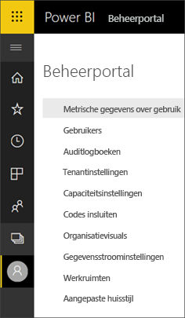

* [Metrische gegevens over gebruik](#usage-metrics)
* [Gebruikers](#users)
* [Auditlogboeken](#audit-logs)
* [Tenantinstellingen](#tenant-settings)
* [Capaciteitsinstellingen](#capacity-settings)
* [Codes insluiten](#embed-codes)
* [Organisatievisuals](#organizational-visuals)
* [Gegevensstroomopslag (preview)](#dataflowStorage)
* [Werkruimten](#workspaces)
* [Aangepaste huisstijl](#custom-branding)

## Metrische gegevens over gebruik

Met de **Metrische gegevens over gebruik** kunt u het Power BI-gebruik voor uw organisatie bewaken. Daarnaast kunt u in het rapport zien welke gebruikers, en groepen, het actiefst zijn binnen Power BI voor uw organisatie. 

> [!NOTE]
> De eerste keer dat u het dashboard opent, of als u het dashboard weergeeft nadat u het lange tijd niet hebt gebruikt, ziet u waarschijnlijk een melding dat het dashboard wordt geladen.

Zodra het dashboard wordt geladen, ziet u twee secties met tegels. De eerste sectie bevat gebruiksgegevens over individuele gebruikers, en de tweede sectie bevat vergelijkbare informatie over groepen in uw organisatie.

Hier volgt een overzicht van wat u in elke tegel kunt zien:

* Unieke telling van alle dashboards, rapporten en gegevenssets in de gebruikerswerkruimte.
  
    

* Het meest gebruikte dashboard qua het aantal gebruikers dat er toegang tot heeft. Als u bijvoorbeeld een dashboard hebt dat u met drie gebruikers hebt gedeeld, en u het dashboard ook hebt toegevoegd aan een inhoudspakket waarmee twee verschillende gebruikers verbinding hebben gemaakt, zou het aantal uitkomen op 6 (1 + 3 + 2).
  
    

* De meest populaire inhoud waarmee gebruikers verbinding hebben gemaakt. Het betreft hier alle inhoud die de gebruikers kunnen bereiken via het proces Gegevens ophalen, zoals SaaS-inhoudspakketten, organisatie-inhoudspakketten, bestanden of databases.
  
    

* Een weergave van de actiefste gebruikers op basis van hoeveel dashboards ze hebben, zowel dashboards die ze zelf hebben gemaakt en dashboards die met ze zijn gedeeld.
  
    

* Een weergave van de actiefste gebruikers op basis van de hoeveelheid rapporten die ze hebben.
  
    

De tweede sectie bevat hetzelfde type informatie, maar dan op basis van groepen. Hier kunt u zien welke groepen in uw organisatie het actiefst zijn en wat voor soort inhoud ze gebruiken.

Aan de hand van deze informatie kunt u een goed beeld krijgen van hoe Power BI in uw organisatie wordt gebruikt. Daarnaast kunt u zien welke gebruikers en groepen zeer actief zijn in uw organisatie.

## Metrische gegevens over gebruik beheren

Rapporten met metrische gegevens over gebruik zijn een functie die de Power BI- of Office 365-beheerder kan in- of uitschakelen. Beheerders hebben gedetailleerde controle over welke gebruikers toegang hebben tot metrische gegevens over gebruik. Ze zijn standaard ingeschakeld (**Aan**) voor alle gebruikers in de organisatie.

Beheerders kunnen ook bepalen of makers van inhoud gegevens per gebruiker kunnen bekijken in metrische gegevens over gebruik. 

Zie [Metrische gegevens over het gebruik van Power BI-dashboards en -rapporten bewaken](service-usage-metrics.md) voor meer informatie over de rapporten zelf.

### Metrische gegevens over het gebruik voor makers van inhoud

1. Selecteer in de beheerportal **Tenantinstellingen** > **Metrische gegevens over het gebruik voor makers van inhoud**.

    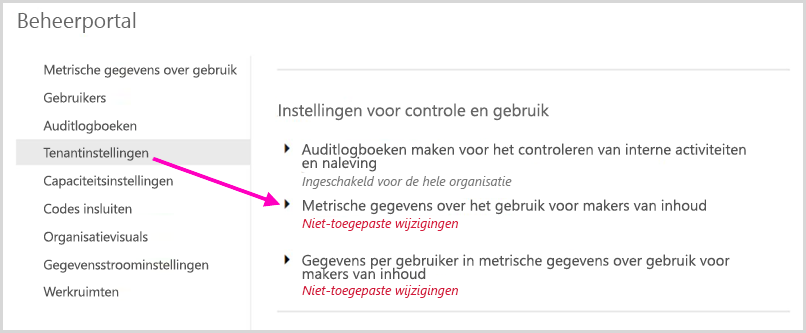

1. Schakel metrische gegevens over gebruik in (of uit) > **Toepassen**.

    

### Metrische gegevens over gebruik per gebruiker

Standaard wordt gegevens per gebruiker ingeschakeld voor metrische gegevens over gebruik. Accountgegevens van gebruikers van inhoud worden in het metrische rapport opgenomen. Als u deze informatie niet voor een bepaalde gebruiker of voor geen enkele gebruiker wilt opnemen, schakelt u de functie voor bepaalde beveiligingsgroepen of voor een hele organisatie uit. Accountgegevens worden dan in het rapport weergegeven als *Naamloos*.

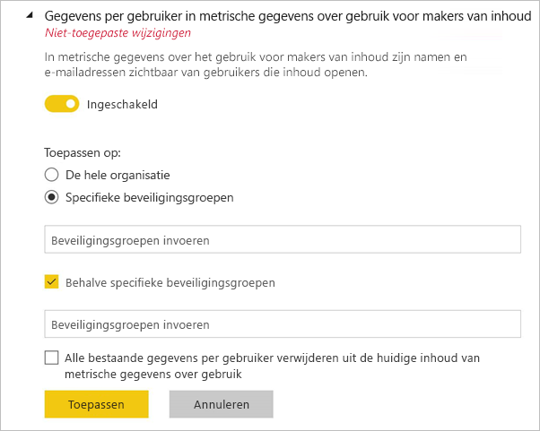

### Alle bestaande inhoud voor metrische gegevens over gebruik verwijderen

Bij het uitschakelen van metrische gegevens over gebruik voor de gehele organisatie kunnen beheerders ook een of beide van deze opties kiezen:

- **Alle bestaande inhoud voor metrische gegevens over gebruik verwijderen** om alle bestaande rapporten en dashboardtegels te verwijderen die zijn gemaakt met behulp van de rapporten en gegevenssets voor metrische gegevens over gebruik. Deze optie verwijdert alle toegang tot metrische gegevens voor alle gebruikers in de organisatie die deze mogelijk al gebruiken. 
- **Alle bestaande gegevens per gebruiker verwijderen uit de huidige inhoud van metrische gegevens over gebruik** om alle toegang te verwijderen tot gegevens per gebruiker voor alle gebruikers in de organisatie die deze mogelijk al gebruiken. 

Let op, want het verwijderen van bestaande metrische gegevens over gebruik en gegevens per gebruiker kan niet ongedaan worden gemaakt.

## Gebruikers

U beheert Power BI-gebruikers, -groepen en -beheerders in het Microsoft 365-beheercentrum. Het tabblad **Gebruikers** bevat een link naar het beheercentrum voor uw tenant.

## Auditlogboeken

U beheert Power BI-auditlogboeken in het Office 365-centrum voor beveiliging en naleving. Het tabblad **Auditlogboeken** bevat een link naar het centrum voor beveiliging en naleving voor uw tenant. [Meer informatie](service-admin-auditing.md)

Als u auditlogboeken wilt gebruiken, zorg dan dat de instelling [**Auditlogboeken maken voor het controleren van interne activiteiten en naleving**](#create-audit-logs-for-internal-activity-auditing-and-compliance) is ingeschakeld.

## Tenantinstellingen

Via het tabblad **Tenantinstellingen** kunt u nauwkeurig bepalen welke functies aan uw organisatie ter beschikking worden gesteld. Als u zich zorgen maakt over gevoelige gegevens, zijn sommige van onze functies mogelijk niet geschikt voor uw organisatie, of misschien wilt u alleen een bepaalde functie beschikbaar stellen aan een specifieke groep.

In de volgende afbeelding worden diverse instellingen op het tabblad **Tenantinstellingen** weergegeven.

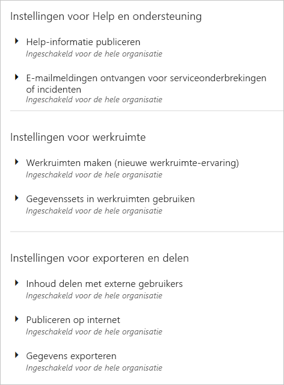

> [!NOTE]
> Het kan maximaal tien minuten duren voordat een instelling voor iedereen in uw tenant is gewijzigd.

Instellingen kunnen drie statussen hebben:

* **Uitgeschakeld voor de hele organisatie**: niemand in uw organisatie kan deze functie gebruiken.

    

* **Ingeschakeld voor de hele organisatie**: iedereen in uw organisatie kan deze functie gebruiken.

    

* **Ingeschakeld voor een subset van de organisatie**: een specifieke subset van gebruikers of groepen in uw organisatie kan deze functie gebruiken.

    U kunt de functie inschakelen voor uw hele organisatie, met uitzondering van een specifieke groep gebruikers.

    

    U kunt de functie ook alleen voor een specifieke groep gebruikers inschakelen en voor een andere groep gebruikers uitschakelen. Op deze manier kunt u ervoor zorgen dat bepaalde gebruikers geen toegang hebben tot de functie, zelfs niet als deel uitmaken van de groep die wel toegang heeft.

    

In de volgende secties ziet u een overzicht van de verschillende typen tenantinstellingen.

## Instellingen voor Help en ondersteuning

### Help-informatie publiceren

Gebruikers in de organisatie kunnen interne resources voor Help en ondersteuning vinden via het menu Help in Power BI. In het bijzonder veranderen deze parameters het gedrag van de menu-items ‘Learn’, ‘Community’ en ‘Hulp vragen’.

Als u een URL voor licentieaanvragen opgeeft, past u ook de doel-URL aan van de knop **Account upgraden**. Gebruikers zonder een Power BI Pro-licentie vinden deze knop in het dialoogvenster **Bijwerken naar Power BI Pro** en op de pagina **Persoonlijke opslag beheren**. Daarnaast beschikt Power BI niet langer over de knop **Pro gratis proberen** in dit dialoogvenster of op de opslagpagina. Dit zorgt ervoor dat Power BI uw gebruikers betrouwbaar door de processen begeleidt die in uw organisatie via uw oplossing voor licentiebeheer zijn gedefinieerd.

### E-mailmeldingen ontvangen voor serviceonderbrekingen of incidenten

Voor e-mail ingeschakelde beveiligingsgroepen ontvangen e-mailmeldingen als deze tenant wordt beïnvloed door een serviceonderbreking of incident. Meer informatie over [Meldingen over onderbrekingen van de service](service-interruption-notifications.md).

## Instellingen voor werkruimte

### Werkruimten maken

Beheerders gebruiken de instelling **Werkruimten maken** om aan te geven welke gebruikers in de organisatie werkruimten mogen maken om samen te werken aan dashboards, rapporten en andere inhoud. Meer informatie over [werkruimten](service-create-the-new-workspaces.md).

De beheerportal heeft nog een sectie met instellingen over de werkruimten in uw tenant. In die sectie kunt u de lijst werkruimten sorteren en filteren, en de details van elke werkruimte weergeven. Zie [Werkruimten](#workspaces) voor meer informatie.

In de beheerportal bepaalt u ook welke gebruikers machtigingen krijgen om apps naar de organisatie te distribueren. Zie [Inhoudspakketten en apps naar de volledige organisatie publiceren](#publish-content-packs-and-apps-to-the-entire-organization) in dit artikel voor meer informatie.

## Instellingen voor exporteren en delen

### Inhoud delen met externe gebruikers

Gebruikers in de organisatie kunnen dashboards, rapporten en apps delen met gebruikers buiten de organisatie. Meer informatie over [extern delen](service-share-dashboards.md#share-a-dashboard-or-report-outside-your-organization).

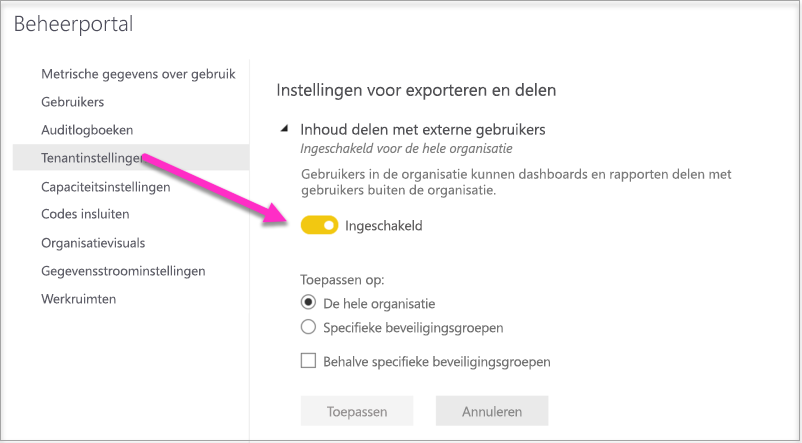

De volgende afbeelding toont het bericht dat verschijnt wanneer u deelt met een externe gebruiker.

  

> [!IMPORTANT]
> Met deze optie wordt bepaald of gebruikers in Power BI externe gebruikers kunnen uitnodigen om gastgebruiker te worden van Azure AD B2B (Active Directory B2B) in uw organisatie, via Power BI. Wanneer deze optie is ingeschakeld, kunnen gebruikers met de rol Afzender van gastuitnodigingen in Azure AD externe e-mailadressen toevoegen wanneer rapporten, dashboards en Power BI-apps worden gedeeld. De externe ontvanger wordt uitgenodigd om lid te worden van uw organisatie als een Azure AD B2B-gastgebruiker. Belangrijk: als u deze instelling uitschakelt, worden externe gebruikers die al Azure AD B2B-gastgebruikers zijn in uw organisatie, nog steeds weergegeven in de UI’s van Personen selecteren in Power BI. Zij kunnen ook toegang krijgen tot items, werkruimten en apps.

### Publiceren op internet

Gebruikers in de organisatie kunnen rapporten op internet publiceren. [Meer informatie](service-publish-to-web.md)

De volgende afbeelding toont het menu **Bestand** voor een rapport wanneer de instelling **Publiceren op internet** is ingeschakeld.

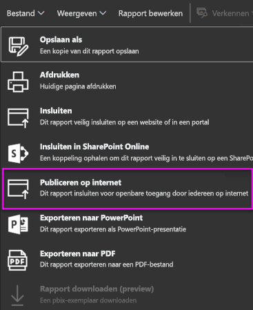

Gebruikers zien verschillende opties in de gebruikersinterface, afhankelijk van de instelling **Publiceren op internet**.

|Functie |Ingeschakeld voor de hele organisatie |Uitgeschakeld voor de hele organisatie |Specifieke beveiligingsgroepen   |
|---------|---------|---------|---------|
|**Publiceren op internet** onder het menu **Bestand** van het rapport.|Ingeschakeld voor iedereen|Niet voor iedereen zichtbaar|Alleen zichtbaar voor gemachtigde gebruikers of groepen.|
|**Invoegcodes beheren** onder **Instellingen**|Ingeschakeld voor iedereen|Ingeschakeld voor iedereen|Ingeschakeld voor iedereen  Optie * **Verwijderen** alleen voor gemachtigde gebruikers of groepen. * **Ophalen van codes** ingeschakeld voor iedereen.|
|**Codes invoegen** binnen de beheerportal|De status geeft een van de volgende opties weer: * Actief * Niet ondersteund * Geblokkeerd|De status geeft **Uitgeschakeld** weer|De status geeft een van de volgende opties weer: * Actief * Niet ondersteund * Geblokkeerd  Als een gebruiker niet is geautoriseerd op basis van de tenantinstelling, wordt de status weergegeven als **geschonden**.|
|Bestaande gepubliceerde rapporten|Iedereen ingeschakeld|Iedereen uitgeschakeld|Rapporten blijven weergeven voor iedereen.|

### Gegevens exporteren

Gebruikers in de organisatie kunnen gegevens uit een tegel of visualisatie exporteren. [Meer informatie](visuals/power-bi-visualization-export-data.md)

De volgende afbeelding toont de optie voor het exporteren van gegevens uit een tegel.

> [!NOTE]
> Als u **Gegevens exporteren** uitschakelt, hebben gebruikers ook geen toegang tot de functie **Analyseren in Excel** en kunnen ze ook de live-verbinding met de Power BI-service niet gebruiken.

### Rapporten als PowerPoint-presentaties of PDF-documenten exporteren

Gebruikers binnen de organisatie kunnen Power BI-rapporten als PowerPoint-bestanden of PDF-documenten exporteren. [Meer informatie](consumer/end-user-powerpoint.md)

De volgende afbeelding toont het menu **Bestand** voor een rapport wanneer de instelling **Rapporten exporteren als PowerPoint-presentaties of PDF-documenten** is ingeschakeld.

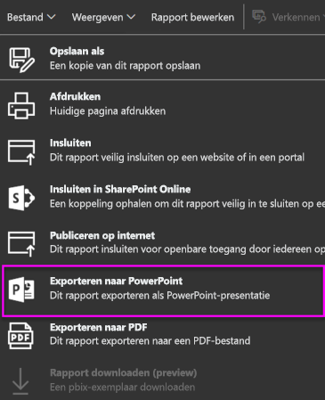

### Dashboards en rapporten afdrukken

Gebruikers in de organisatie kunnen dashboards en rapporten afdrukken. [Meer informatie](consumer/end-user-print.md)

De volgende afbeelding toont de optie voor het afdrukken van een dashboard.

De volgende afbeelding toont het menu **Bestand** voor een rapport wanneer de instelling **Dashboards en rapporten afdrukken** is ingeschakeld.

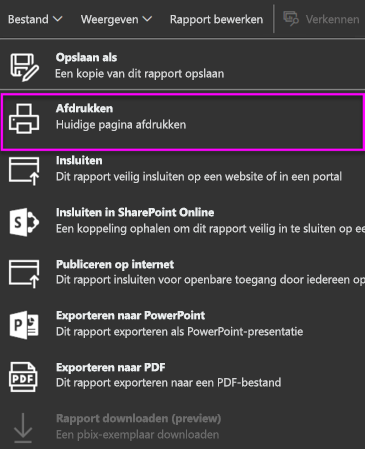

### Externe gastgebruikers toestaan om inhoud in de organisatie te bewerken en te beheren

Azure AD B2B-gastgebruikers kunnen inhoud in de organisatie bewerken en beheren. [Meer informatie](service-admin-azure-ad-b2b.md)

In de volgende afbeelding ziet u de optie Externe gastgebruikers toestaan om inhoud in de organisatie te bewerken en te beheren.

In de beheerportal bepaalt u ook welke gebruikers machtigingen krijgen om externe gebruikers uit te nodigen voor de organisatie. Raadpleeg [Inhoud delen met externe gebruikers](#export-and-sharing-settings) in dit artikel voor details.

### E-mailabonnementen
Gebruikers in de organisatie kunnen e-mailabonnementen maken. Meer informatie over [abonnementen](service-report-subscribe.md).

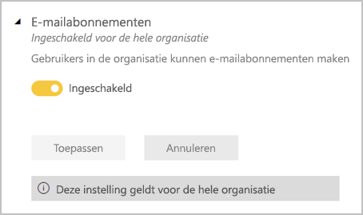

## Instellingen voor inhoudspakket en app

### Inhoudspakketten en apps naar de volledige organisatie publiceren

Beheerders gebruiken deze instelling om de bepalen welke gebruikers inhoudspakketten en apps naar de volledige organisatie mogen publiceren, in plaats van alleen naar specifieke groepen. Meer informatie over [het publiceren van apps](service-create-distribute-apps.md).

De volgende afbeelding toont de optie **Mijn hele organisatie** bij het maken van een inhoudspakket.

### Sjabloon-apps en organisatie-inhoudspakketten maken

Gebruikers in de organisatie kunnen sjabloon-apps en organisatie-inhoudspakketten maken die gegevenssets gebruiken die zijn gebaseerd op één gegevensbron in Power BI Desktop. Meer informatie over [sjabloon-apps](template-content-pack-authoring.md).

### Apps pushen naar eindgebruikers

Makers van rapporten kunnen apps rechtstreeks met eindgebruikers delen zonder dat er installatie vanuit [AppSource](https://appsource.microsoft.com) is vereist. Meer informatie over [het automatisch installeren van apps voor eindgebruikers](service-create-distribute-apps.md#automatically-install-apps-for-end-users).

## Instellingen voor integratie

### Analyseren in Excel gebruiken met on-premises gegevenssets

Gebruikers in de organisatie kunnen Excel gebruiken voor het weergeven van on-premises Power BI-gegevenssets en het werken met deze sets. [Meer informatie](service-analyze-in-excel.md)

> [!NOTE]
> Als u **Gegevens exporteren** uitschakelt, hebben gebruikers ook geen toegang tot de functie **Analyseren in Excel**.

### ArcGIS Maps for Power BI gebruiken

Gebruikers in de organisatie kunnen de visualisatie ArcGIS Maps for Power BI, die is geleverd door Esri, gebruiken. [Meer informatie](visuals/power-bi-visualization-arcgis.md)

### Algemene zoekopdrachten voor Power BI gebruiken (preview-versie)

Gebruikers in de organisatie kunnen externe-zoekopdrachtfuncties gebruiken waarbij gebruik wordt gemaakt van Azure Search.

## Instellingen voor aangepaste visuele elementen

### Aangepaste visuals toevoegen en gebruiken

Gebruikers in de organisatie kunnen aangepaste visuele elementen gebruiken en delen. [Meer informatie](developer/power-bi-custom-visuals.md)

> [!NOTE]
> Deze instelling kan worden toegepast op de hele organisatie of kan worden beperkt tot specifieke groepen.

Power BI Desktop (vanaf de versie van maart 2019) ondersteunt het gebruik van het **Groepsbeleid** om het gebruik van aangepaste visuals op de geïmplementeerde computers van een organisatie uit te schakelen.

<table>
<tr><th>Kenmerk</th><th>Waarde</th>
</tr>
<td>sleutel</td>
    <td>Software\Policies\Microsoft\Power BI Desktop\</td>
<tr>
<td>valueName</td>
<td>EnableCustomVisuals</td>
</tr>
</table>

Met de waarde 1 (decimaal) schakelt u het gebruik van aangepaste visuals in Power BI in (dit is de standaardinstelling).

Met de waarde 0 (decimaal) schakelt u het gebruik van aangepaste visuals in Power BI uit.

### Alleen gecertificeerde visuals toestaan

Gebruikers in de organisatie die zijn gemachtigd om aangepaste visuals toe te voegen en te gebruiken, aangeduid met de instelling Aangepaste visuals toevoegen en gebruiken, kunnen alleen [gecertificeerde aangepaste visuals](https://go.microsoft.com/fwlink/?linkid=2002010) gebruiken (niet-gecertificeerde visuals worden geblokkeerd en leveren een foutbericht op bij gebruik). 

Power BI Desktop (vanaf de versie van maart 2019) ondersteunt het gebruik van het **Groepsbeleid** om het gebruik van niet-gecertificeerde aangepaste visuals op de geïmplementeerde computers van een organisatie uit te schakelen.

<table>
<tr><th>Kenmerk</th><th>Waarde</th>
</tr>
<td>sleutel</td>
    <td>Software\Policies\Microsoft\Power BI Desktop\</td>
<tr>
<td>valueName</td>
<td>EnableUncertifiedVisuals</td>
</tr>
</table>

Met de waarde 1 (decimaal) schakelt u het gebruik van niet-gecertificeerde aangepaste visuals in Power BI in (dit is de standaardinstelling).

Met de waarde 0 (decimaal) schakelt u het gebruik van niet-gecertificeerde aangepaste visuals in Power BI uit (met deze optie schakelt u alleen het gebruik van [gecertificeerde aangepaste visuals](https://go.microsoft.com/fwlink/?linkid=2002010) in).

## Instellingen voor R-visuals

### Interactie met visuele R-elementen en visuele R-elementen delen

Gebruikers in de organisatie kunnen interactie hebben met visuele elementen die zijn gemaakt met R scripts en deze elementen delen. [Meer informatie](visuals/service-r-visuals.md)

> [!NOTE]
> Deze instelling geldt voor de hele organisatie en kan niet worden beperkt tot specifieke groepen.

## Instellingen voor controle en gebruik

### Auditlogboeken maken voor het controleren van interne activiteiten en naleving

Gebruikers in de organisatie kunnen de auditfunctie gebruiken voor het controleren van acties die door andere gebruikers in de organisatie worden uitgevoerd in Power BI. [Meer informatie](service-admin-auditing.md)

Deze instelling moet worden ingeschakeld om vermeldingen te kunnen vastleggen in het auditlogboek. Er kan een vertraging tot 48 uur bestaan tussen het inschakelen van de controlefunctie en het kunnen weergeven van controlegegevens. Als u niet direct gegevens ziet, controleert u de controlelogboeken op een later tijdstip. Er kan een vergelijkbare vertraging optreden tussen het ophalen van machtiging voor het weergeven van controlelogboeken en het kunnen openen van de logboeken.

> [!NOTE]
> Deze instelling geldt voor de hele organisatie en kan niet worden beperkt tot specifieke groepen.

### Metrische gegevens over het gebruik voor makers van inhoud

Gebruikers in de organisatie kunnen metrische gegevens weergeven over het gebruik van de dashboards en rapporten die ze hebben gemaakt. [Meer informatie](service-usage-metrics.md)

### Gegevens per gebruiker in metrische gegevens over gebruik voor makers van inhoud

In metrische gegevens over het gebruik voor makers van inhoud zijn namen en e-mailadressen zichtbaar van gebruikers die inhoud openen. [Meer informatie](service-usage-metrics.md)

Standaard wordt Gegevens per gebruiker ingeschakeld voor metrische gegevens over gebruik. Accountgegevens van makers van inhoud worden in het metrische rapport opgenomen. Als u deze informatie niet voor alle gebruikers wilt verzamelen, schakelt u de functie voor bepaalde beveiligingsgroepen of voor een hele organisatie uit. Accountgegevens voor de uitgesloten gebruikers worden dan in het rapport weergegeven als *Naamloos*.

## Instellingen voor dashboard

### Gegevensclassificatie voor dashboards

Gebruikers in de organisatie kunnen dashboards taggen met classificaties die het beveiligingsniveau van het dashboard aangeven. [Meer informatie](service-data-classification.md)

> [!NOTE]
> Deze instelling geldt voor de hele organisatie en kan niet worden beperkt tot specifieke groepen.

## Instellingen voor ontwikkelaars

### Inhoud in apps insluiten

Gebruikers in de organisatie kunnen Power BI-dashboards en rapporten insluiten in SaaS-toepassingen (Software as a Service). Als u deze instelling uitschakelt, kunnen gebruikers de REST API's niet gebruiken om inhoud van Power BI in hun toepassing in te sluiten. [Meer informatie](developer/embedding.md)

### Toestaan dat service-principals gebruikmaken van API's van Power BI

Web-apps die in Azure AD (Active Directory) zijn geregistreerd, maken gebruik van een toegewezen service-principal voor toegang tot API's van Power BI zonder een aangemelde gebruiker. Als u wilt toestaan dat een app verificatie via een service-principal gebruikt, moet de betreffende service-principal worden opgenomen in een beveiligingsgroep die toegang heeft. [Meer informatie](developer/embed-service-principal.md)

> [!NOTE]
> Service-principals nemen de machtigingen voor alle instellingen van de Power BI-tenant over van hun beveiligingsgroep. Als u deze machtigingen wilt beperken, maakt u een specifieke beveiligingsgroep voor service-principals en voegt u deze toe aan de lijst Behalve specifieke beveiligingsgroepen voor de desbetreffende, ingeschakelde Power BI-instellingen.

## Gegevensstroominstellingen

### Gegevensstromen maken en gebruiken

Gebruikers in de organisatie kunnen gegevensstromen maken en gebruiken. Zie [Selfservice voor gegevensvoorbereiding in Power BI](service-dataflows-overview.md) voor een overzicht van gegevensstromen. Zie [Workloads configureren](service-admin-premium-workloads.md) als u gegevensstromen wilt inschakelen in een Premium-capaciteit.

> [!NOTE]
> Deze instelling geldt voor de hele organisatie en kan niet worden beperkt tot specifieke groepen.

## Instellingen voor sjabloon-apps

Drie instellingen bepalen wie de mogelijkheid heeft om sjabloon-apps te publiceren of te installeren.

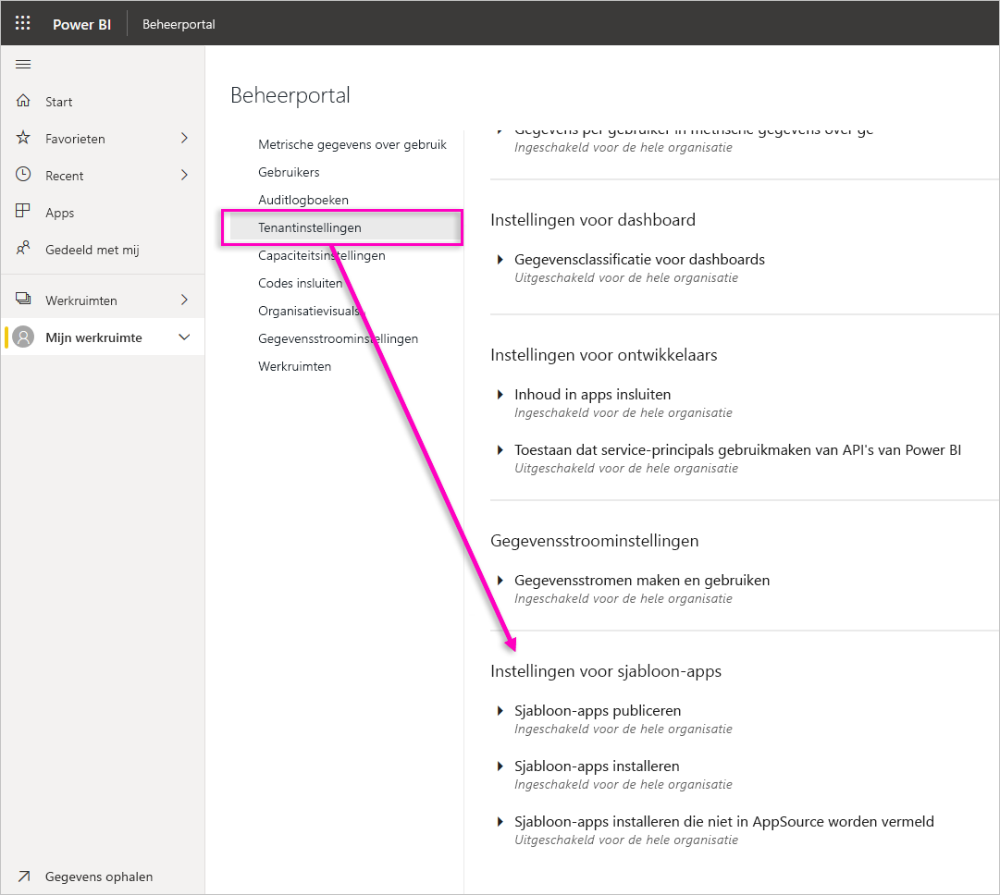

### Sjabloon-apps publiceren

Gebruikers in de organisatie kunnen werkruimten voor sjabloon-apps maken. U bepaalt welke gebruikers sjabloon-apps mogen publiceren of distribueren aan clients buiten uw organisatie via [AppSource](https://appsource.microsoft.com) of andere distributiemethoden.

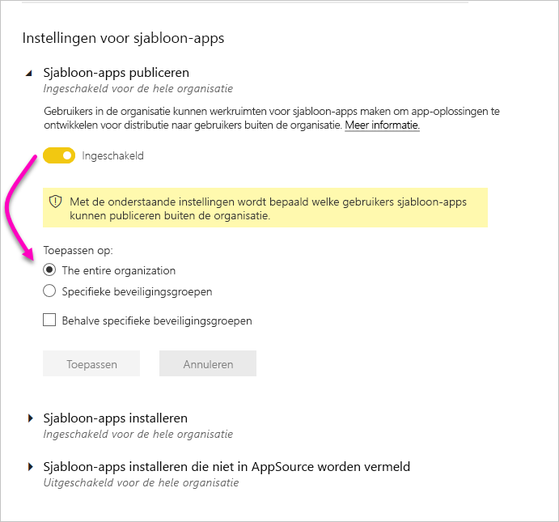

### Sjabloon-apps installeren die in AppSource worden vermeld

Gebruikers in de organisatie kunnen **alleen** vanuit [AppSource](https://appsource.microsoft.com) sjabloon-apps downloaden en installeren. U bepaalt welke specifieke gebruikers of beveiligingsgroepen sjabloon-apps mogen installeren vanuit AppSource.

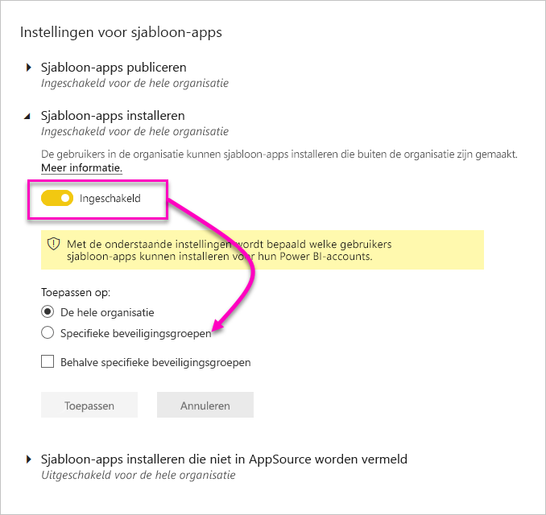

### Sjabloon-apps installeren die niet in AppSource worden vermeld

U bepaalt welke gebruikers in de organisatie sjabloon-apps mogen downloaden en installeren die **niet in [ AppSource](https://appsource.microsoft.com) worden vermeld**.

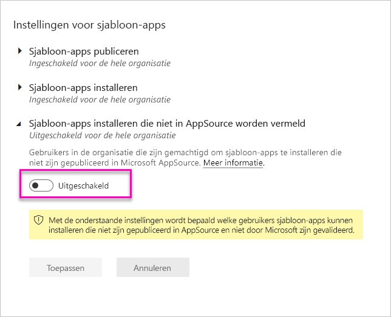

## Capaciteitsinstellingen

### Power BI Premium

Via het tabblad **Power BI Premium-instellingen** kunt u capaciteiten van Power BI Premium (Em of P SKU) beheren die voor uw organisatie zijn gekocht. Alle gebruikers binnen uw organisatie kunnen het tabblad **Power BI Premium-instellingen** zien, maar ze zien alleen inhoud op het tabblad als ze zijn aangewezen als *Capaciteitsbeheerder* of als ze beschikken over toewijzingsmachtigingen. Als een gebruiker geen machtigingen heeft, verschijnt het volgende bericht.

### Power BI Embedded

Via het tabblad **Power BI Embedded-instellingen** kunt u de capaciteiten van Power BI Embedded (A SKU) bekijken die u voor uw klant hebt aangeschaft. Aangezien u alleen A SKU's vanuit Azure kunt aanschaffen, kunt u [ingesloten capaciteiten in Azure beheren](developer/azure-pbie-create-capacity.md) vanuit de **Azure-portal**.

Zie [Wat is Power BI Embedded?](developer/azure-pbie-what-is-power-bi-embedded.md) voor meer informatie over het beheren van Power BI Embedded (A SKU)-instellingen.

## Codes insluiten

Als beheerder kunt u de invoegcodes weergeven die worden gegenereerd voor uw tenant. U kunt ook codes intrekken of verwijderen. [Meer informatie](service-publish-to-web.md)

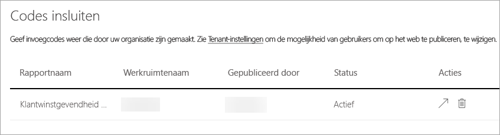

 ## <a name="organizational-visuals">Organisatievisuals</a> 

Via het tabblad **Organisatievisuals** kunt u aangepaste visuals binnen uw organisatie implementeren en beheren. Met organisatievisuals kunt u eenvoudig eigen visuals in uw organisatie implementeren. Auteurs van rapporten kunnen deze vervolgens detecteren en vanuit Power BI Desktop in hun rapporten importeren. [Meer informatie](developer/power-bi-custom-visuals-organization.md)

> [!WARNING]
> Een aangepaste visual kan een code bevatten met beveiligings- of privacyrisico's. Wees er zeker van dat u de auteur en de bron van de aangepaste visual vertrouwt voordat u de visual in de opslagplaats van de organisatie implementeert.

De volgende afbeelding toont alle aangepaste visuals die momenteel in de opslagplaats van de organisatie zijn geïmplementeerd.

### Een nieuwe aangepaste visual toevoegen

Volg deze stappen als u een nieuwe aangepaste visual aan de lijst wilt toevoegen. 

1. Selecteer in het rechterdeelvenster de optie **Een aangepaste visual toevoegen**.

    

1. Vul het formulier **Aangepaste visual toevoegen** in:

    * **Een PBIVIZ-bestand kiezen** (vereist): selecteer een aangepaste visual om te uploaden. Alleen versies van aangepaste API-visuals worden ondersteund (lees hier wat dit betekent).

    Voordat u een aangepaste visual uploadt, moet u controleren of de beveiliging en privacy van die visual past bij de normen van uw organisatie.

    * **Naam van uw aangepaste visual** (vereist): geef een korte titel aan de visual zodat gebruikers van Power BI Desktop gemakkelijk begrijpen wat de visual doet.

    * **Pictogram**: het pictogrambestand dat wordt weergegeven in de gebruikersinterface van Power BI Desktop.

    * **Beschrijving**: een korte beschrijving van de visual zodat de gebruiker meer context heeft en weet waarvoor de visual is bedoeld.

1. Selecteer **Toevoegen** om de uploadaanvraag te starten. U ziet het nieuwe item in de lijst als de aanvraag is geslaagd. Als de aanvraag is mislukt, ziet u de bijbehorende foutmelding

### Een aangepaste visual verwijderen uit de lijst

Als u een visual permanent wilt verwijderen, selecteert u het prullenbakpictogram voor de visual in de opslagplaats.

> [!IMPORTANT]
> Verwijderen kan niet ongedaan worden gemaakt. Wanneer de visual is verwijderd, wordt deze onmiddellijk niet meer weergegeven in bestaande rapporten. Zelfs als u dezelfde visual opnieuw uploadt, zal deze de vorige die u hebt verwijderd, niet vervangen. Gebruikers kunnen echter de nieuwe visual opnieuw importeren en het exemplaar in hun rapporten vervangen.

### Een aangepaste visual uit de lijst verwijderen

Als u de visual in de opslagplaats wilt uitschakelen, selecteert u het tandwielpictogram. In de sectie **Toegang** kunt u de aangepaste visual uitschakelen.

Als de visual is uitgeschakeld, wordt deze niet meer weergegeven in bestaande rapporten en wordt het onderstaande foutbericht weergegeven.

*Deze aangepaste visual is niet langer beschikbaar. Neem voor meer informatie contact op met uw beheerder.*

Visuals met een bladwijzer werken echter nog steeds.

Na elke update of wijziging door een beheerder, moeten gebruikers van Power BI Desktop de toepassing opnieuw starten of de browser in de Power BI-service vernieuwen om de updates te kunnen zien.

### Een visual bijwerken

Selecteer het tandwielpictogram als u de visual wilt bijwerken vanuit de zakelijke opslag. Blader naar een nieuwe versie van de visual en upload deze.

Zorg ervoor dat de id van de visual ongewijzigd blijft. Het nieuwe bestand vervangt het vorige bestand voor alle rapporten in de hele organisatie. Vervang echter niet de vorige versie als de nieuwe versie van de visual een verbruiks- of gegevensstructuur van de vorige versie van de visual kan verbreken. In plaats daarvan moet u een nieuwe vermelding maken voor de nieuwe versie van de visual. Voeg bijvoorbeeld een nieuw versienummer (versie X.X) toe aan de titel van de nieuwe vermelde visual. Op deze manier is het duidelijk dat dit dezelfde visual is, alleen met een bijgewerkt versienummer, zodat bestaande rapporten hun functionaliteit niet verbreken. Zorg er weer voor dat de id van de visual ongewijzigd blijft. De volgende keer dat gebruikers toegang hebben tot de opslagplaats van de organisatie vanuit Power BI Desktop, kunnen ze de nieuwe versie importeren, waarbij wordt gevraagd om de huidige versie in hun rapport te vervangen.

Ga naar [Veelgestelde vragen over aangepaste visuals voor bedrijven](/power-bi/developer/power-bi-custom-visuals-faq#organizational-power-bi-visuals) voor meer informatie

## <a name="dataflowStorage">Gegevensstroomopslag (preview)</a>

Gegevens die worden gebruikt met Power BI worden standaard opgeslagen in de interne opslag die wordt geleverd door Power BI. Met de integratie van gegevensstromen en Azure Data Lake Storage Gen2 (ADLS Gen2) kunt u uw gegevensstromen opslaan in het Azure Data Lake Storage Gen2-account van uw organisatie. Ga naar [Integratie van gegevensstromen en Azure Data Lake (preview)](service-dataflows-azure-data-lake-integration.md) voor meer informatie.

## Werkruimten

Als beheerder kunt u alle werkruimten bekijken die aanwezig zijn in uw tenant. U kunt de lijst werkruimten sorteren en filteren en de details van elke werkruimte weergeven. De tabelkolommen komen overeen met de eigenschappen die worden geretourneerd door de [REST API voor Power BI-beheer](/rest/api/power-bi/admin) voor werkruimten. Persoonlijke werkruimten zijn van het type **PersonalGroup**, klassieke werkruimten zijn van het type **Group** en werkruimten met de nieuwe werkruimte-ervaring zijn van het type **Workspace**. Zie [De nieuwe werkruimten maken in Power BI](service-create-the-new-workspaces.md) voor meer informatie.

Op het tabblad **Werkruimten** wordt de *status* voor elke werkruimte weergegeven. De volgende tabel bevat meer informatie over de betekenis van deze statussen.

|Staat  |Beschrijving  |
|---------|---------|
| Actief | Een normale werkruimte. Er wordt geen informatie gegeven over het gebruik of de inhoud ervan, alleen dat de werkruimte zelf 'normaal' is. |
| Zwevend | Een werkruimte zonder gebruiker met beheerdersrechten. |
| Verwijderd | Een verwijderde werkruimte. We behouden voldoende metagegevens om de werkruimte desgewenst te herstellen. |
| Verwijderen | Een werkruimte die wordt verwijderd, maar nog niet is verdwenen. Gebruikers kunnen hun eigen werkruimten verwijderen door items in Verwijderen en uiteindelijk Verwijderd te plaatsen. |

## Aangepaste huisstijl

Als beheerder kunt u het uiterlijk van Power BI aanpassen voor uw hele organisatie. Op dit moment zijn er drie hoofdopties:

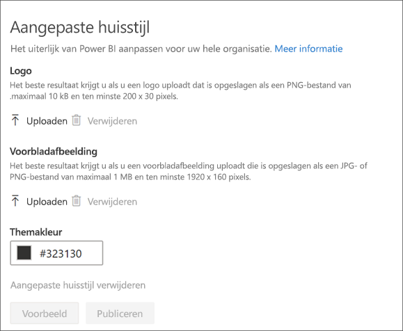

* **Logo uploaden**: het beste resultaat krijgt u als u een logo uploadt dat is opgeslagen als een PNG-bestand van maximaal 10 kB en ten minste 200 x 30 pixels.

* **Voorbladafbeelding uploaden**: het beste resultaat krijgt u als u een voorbladafbeelding uploadt die is opgeslagen als een JPG- of PNG-bestand van maximaal 1 MB en ten minste 1920 x 160 pixels.

* **Themakleur selecteren**: u kunt een thema selecteren op basis van een hexadecimale waarde, een RGB-waarde of uit het beschikbare palet.

Zie [Aangepaste huisstijl voor uw organisatie](https://aka.ms/orgBranding) voor meer informatie.

## Volgende stappen

[Power BI in uw organisatie beheren](service-admin-administering-power-bi-in-your-organization.md)  
[Understanding the Power BI admin role](service-admin-role.md) (Power BI-beheerdersrol)  
[Power BI controleren in uw organisatie](service-admin-auditing.md)  

Hebt u nog vragen? [Misschien dat de Power BI-community het antwoord weet](https://community.powerbi.com/)
