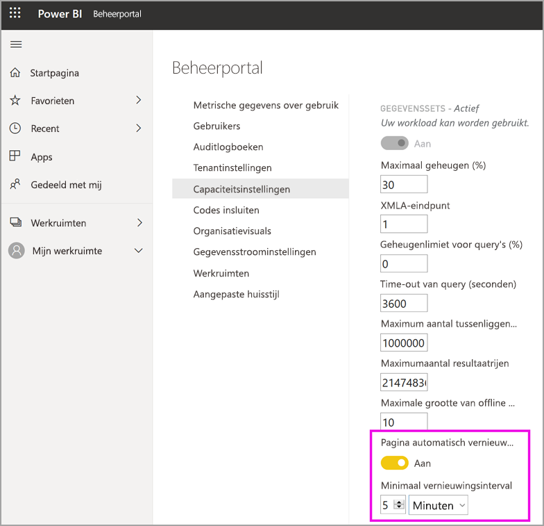

# Workloads configureren in een Premium-capaciteit

In dit artikel wordt het inschakelen en configureren van workloads voor Power BI Premium-capaciteiten beschreven. Standaard bieden capaciteiten alleen ondersteuning voor de workload die aan het uitvoeren van Power BI-query's is gekoppeld. U kunt ook extra workloads inschakelen en configureren voor **[AI (Cognitive Services)](service-cognitive-services.md)** , **[gegevensstromen](service-dataflows-overview.md#dataflow-capabilities-on-power-bi-premium)** en **[gepagineerde rapporten](paginated-reports-save-to-power-bi-service.md)** .

## Standaardinstellingen voor geheugen

Queryworkloads zijn geoptimaliseerd voor en beperkt door de resources die voor uw Premium-capaciteit-SKU zijn vastgesteld. Premium-capaciteiten bieden bovendien ondersteuning voor extra workloads die de resources van uw capaciteit kunnen gebruiken. De standaardgeheugenwaarden voor deze workloads zijn gebaseerd op de capaciteitsknooppunten die voor uw SKU beschikbaar zijn. De maximale geheugeninstellingen zijn niet cumulatief. Het geheugen tot de opgegeven maximumwaarde wordt dynamisch toegewezen voor AI en gegevensstromen, maar statisch voor gepagineerde rapporten.

### Microsoft Office-SKU's voor SaaS-scenario's (Software as a Service)

|                     | EM2                      | EM3                       | P1                      | P2                       | P3                       |
|---------------------|--------------------------|--------------------------|-------------------------|--------------------------|--------------------------|
| AI | N.v.t. | N.v.t. | Standaard 20%; minimaal 20% | standaard 20%; minimaal 10% | standaard 20%; minimaal 5% |
| Gegevensstromen | N.v.t. |Standaard 20%, minimaal 12%  | standaard 20%; minimaal 5%  | Standaard 20%, minimaal 3% | standaard 20%; minimaal 2%  |
| Gepagineerde rapporten | N.v.t. |N.v.t. | standaard 20%; minimaal 10% | standaard 20%; minimaal 5% | standaard 20%; minimaal 2,5% |
| | | | | | |

### Microsoft Azure-SKU's voor PaaS-scenario's (Platform as a Service)

|                  | A1                       | A2                       | A3                      | A4                       | A5                      | A6                        |
|-------------------|--------------------------|--------------------------|-------------------------|--------------------------|-------------------------|---------------------------|
| AI | N.v.t.                      | Standaard 20%; minimaal 100%                     | Standaard 20%; minimaal 50%                     | Standaard 20%; minimaal 20% | standaard 20%; minimaal 10% | standaard 20%; minimaal 5% |
| Gegevensstromen         | Standaard 40%, minimaal 40% | Standaard 24%, minimaal 24% | Standaard 20%, minimaal 12% | standaard 20%; minimaal 5%  | Standaard 20%, minimaal 3% | standaard 20%; minimaal 2%   |
| Gepagineerde rapporten | N.v.t.                      | N.v.t.                      | N.v.t.                     | standaard 20%; minimaal 10% | standaard 20%; minimaal 5% | standaard 20%; minimaal 2,5% |
| | | | | | |

## Workloadinstellingen

### AI (preview)

Met de AI-workload kunt u cognitive services en automatische Machine Learning in Power BI gebruiken. Gebruik de volgende instellingen om het gedrag van workloads te beheren.

| Instellingsnaam | Beschrijving |
|---------------------------------|----------------------------------------|
| **Maximaal geheugen (%)** | Het maximale percentage beschikbaar geheugen dat door AI-processen in een capaciteit kan worden gebruikt. |
| **Gebruik via Power BI Desktop toestaan** | Deze instelling is gereserveerd voor toekomstig gebruik en wordt niet in alle tenants weergegeven. |
| **Het bouwen van Machine Learning-modellen toestaan** | Hiermee geeft u aan of bedrijfsanalisten rechtstreeks in Power BI Machine Learning-modellen mogen trainen, valideren en aanroepen. Zie [Geautomatiseerde Machine Learning in Power BI (preview-versie)](service-machine-learning-automated.md) voor meer informatie. |
| **Parallelle uitvoering voor AI-aanvragen inschakelen** | Hiermee geeft u op of AI-aanvragen parallel kunnen worden uitgevoerd. |
|  |  |

### Gegevenssets

De workload Gegevenssets is standaard ingeschakeld en kan niet worden uitgeschakeld. Gebruik de volgende instellingen om het gedrag van workloads te beheren. Voor sommige instellingen is er meer informatie over het gebruik van de tabel.

| Instellingsnaam | Beschrijving |
|---------------------------------|----------------------------------------|
| **Maximaal geheugen (%)** | Het maximale percentage beschikbaar geheugen dat door gegevenssets in een capaciteit kan worden gebruikt. |
| **XMLA-eindpunt** | Hiermee geeft u op dat verbindingen vanuit clienttoepassingen aan het in de werkruimte en app-niveaus ingestelde lidmaatschap van de beveiligingsgroep moeten voldoen. Zie [Verbinding maken met gegevenssets met clienttoepassingen en hulpprogramma's](service-premium-connect-tools.md) voor meer informatie. |
| **Maximum aantal in te stellen tussenliggende rijen** | Het maximumaantal tussenliggende rijen dat door DirectQuery wordt geretourneerd. De standaardwaarde is ingesteld op 1.000.000 en het toegestane bereik ligt tussen 100.000 en 2.147.483.647. |
| **Maximale grootte van offline gegevensset (GB)** | De maximale grootte van de offline gegevensset in het geheugen. Dit is de gecomprimeerde grootte op een schijf. De standaardwaarde wordt ingesteld per SKU en het toegestane bereik ligt tussen 0,1 en 10 GB. |
| **Maximum aantal in te stellen rijen met resultaten** | Het maximumaantal rijen dat in een DAX-query wordt geretourneerd. De standaardwaarde is ingesteld op -1 (onbeperkt) en het toegestane bereik ligt tussen 100.000 en 2.147.483.647. |
| **Geheugenlimiet voor query's (%)** | Het maximale percentage beschikbaar geheugen dat kan worden gebruikt voor tijdelijke resultaten in een query of een DAX-meting. |
| **Time-out van query (seconden)** | De maximale hoeveelheid tijd voordat een time-out optreedt voor de query. De standaardwaarde is 3600 seconden (1 uur). Met de waarde 0 wordt aangegeven dat er geen time-out zal optreden voor query's. |
| **Pagina automatisch vernieuwen (preview-versie)** | In-/uitschakelen om toe te staan dat Premium-werkruimten rapporten kunnen bevatten waarvoor pagina's automatisch kunnen worden vernieuwd. |
| **Minimaal vernieuwingsinterval** | Als Pagina automatisch vernieuwen is ingeschakeld, is dit het minimale interval dat als interval voor het vernieuwen van pagina's is toegestaan. De standaardwaarde is vijf minuten en het toegestane minimum is één seconde. |
|  |  |  |

#### Maximum aantal in te stellen tussenliggende rijen

Gebruik deze instelling om de impact van resource-intensieve of slecht ontworpen rapporten te beheren. Wanneer een query naar een DirectQuery-gegevensset resulteert in een zeer groot resultaat van de brondatabase, kan dit leiden tot een piek in het geheugengebruik en de verwerkingsoverhead. Deze situatie kan ertoe leiden dat andere gebruikers en rapporten op weinig resources uitgevoerd worden. Met deze instelling kan de capaciteitsbeheerder aanpassen hoeveel rijen een afzonderlijke query uit de gegevensbron kan ophalen.

Als de capaciteit aan de andere kant meer dan de standaardwaarde van een miljoen kan ondersteunen en u een grote gegevensset hebt, vergroot u deze instelling om meer rijen op te halen.

Houd er rekening mee dat deze instelling alleen van invloed is op DirectQuery-query's, terwijl [Maximum aantal in te stellen rijen met resultaten](#max-result-row-set-count) DAX-query's beïnvloedt.

#### Maximale grootte van offline gegevensset

Gebruik deze instelling om te voorkomen dat rapportmakers een grote gegevensset publiceren die de capaciteit negatief kan beïnvloeden. Houd er rekening mee dat Power BI de werkelijke geheugengrootte niet kan bepalen totdat de gegevensset in het geheugen wordt geladen. Het is mogelijk dat een gegevensset met een kleinere offline grootte een grotere geheugen-footprint kan hebben dan een gegevensset met een grotere offline grootte.

Als u een bestaande gegevensset hebt die groter is dan de grootte die u voor deze instelling opgeeft, dan kan de gegevensset niet worden geladen wanneer een gebruiker deze probeert te openen.

#### Maximum aantal in te stellen rijen met resultaten

Gebruik deze instelling om de impact van resource-intensieve of slecht ontworpen rapporten te beheren. Als deze limiet wordt bereikt in een DAX-query, ziet een rapportgebruiker de volgende foutmelding. Hij of zij moet de foutgegevens kopiëren en contact opnemen met een beheerder.

Houd er rekening mee dat deze instelling alleen van invloed is op DAX-query's, terwijl [Maximum aantal in te stellen tussenliggende rijen](#max-intermediate-row-set-count) DirectQuery-query's beïnvloedt.

#### Geheugenlimiet voor query's

Gebruik deze instelling om de impact van resource-intensieve of slecht ontworpen rapporten te beheren. Sommige query's en berekeningen kunnen leiden tot tussenliggende resultaten die veel geheugen van de capaciteit gebruiken. Deze situatie kan ertoe leiden dat andere query's zeer traag worden uitgevoerd en andere gegevenssets van de capaciteit worden verwijderd. Dat kan leiden tot onvoldoende geheugen voor andere gebruikers van de capaciteit.

Deze instelling is van toepassing op het vernieuwen van gegevens en rapportrendering. Gegevensvernieuwing voert zowel het vernieuwen van gegevens uit de gegevensbron uit als het vernieuwen van de query, tenzij het vernieuwen van de query is uitgeschakeld. Als vernieuwen van query's niet is uitgeschakeld, is deze geheugenlimiet ook van toepassing op die query's. Als er mislukte query's worden gegenereerd, wordt de geplande vernieuwingsstatus gerapporteerd als een fout, zelfs als het vernieuwen van de gegevens is geslaagd.

#### Time-out van query

Gebruik deze instelling om langlopende query's beter te kunnen blijven beheersen, waardoor rapporten langzaam kunnen worden geladen voor gebruikers. Deze instelling is van toepassing op het vernieuwen van gegevens en rapportrendering. Gegevensvernieuwing voert zowel het vernieuwen van gegevens uit de gegevensbron uit als het vernieuwen van de query, tenzij het vernieuwen van de query is uitgeschakeld. Als vernieuwen van query's niet is uitgeschakeld, dan is deze time-outlimiet ook van toepassing op die query's.

Deze instelling geldt voor één query en niet de tijdsduur die nodig is voor het uitvoeren van alle query's die zijn gekoppeld aan het bijwerken van een gegevensset of rapport. Kijk eens naar het volgende voorbeeld:

- De instelling voor de **Time-out van query** is 1200 (20 minuten).
- Er zijn vijf query's die moeten worden uitgevoerd en elke query duurt 15 minuten.

De gecombineerde tijd voor alle query's is 75 minuten, maar de limiet voor de instelling is niet bereikt omdat alle afzonderlijke query's in minder dan 20 minuten worden uitgevoerd.

Houd er rekening mee dat Power BI-rapporten deze standaardinstelling overschrijven met een veel kleinere time-out voor elke query op de capaciteit. De time-out voor elke query is doorgaans ongeveer drie minuten.

#### Pagina automatisch vernieuwen (preview-versie)

Indien ingeschakeld, kunnen gebruikers in uw Premium-capaciteit met behulp van de functie Pagina automatisch vernieuwen, ervoor zorgen dat voor DirectQuery-bronnen pagina's in hun rapport op een gedefinieerd interval worden vernieuwd. Als capaciteitsbeheerder kunt u het volgende doen:

1.  Pagina automatisch vernieuwen in- en uitschakelen
2.  Een minimaal vernieuwingsinterval definiëren

In de volgende afbeelding wordt de locatie van de instelling voor het automatische vernieuwingsinterval weergegeven:

Query's die door het automatisch vernieuwen van pagina's worden gemaakt, gaan direct naar de gegevensbron, en het is dus van belang om na te denken over de betrouwbaarheid ervan en welke belasting ze vormen voor die bronnen als u toestaat dat het automatisch vernieuwen van pagina's in uw organisatie kan worden gebruikt. 

### Gegevensstromen

Met de workload Gegevensstromen kunt u de zelfservice voor gegevensvoorbereiding voor gegevensstromen gebruiken om gegevens op te nemen, te transformeren, te integreren en te verrijken. Gebruik de volgende instellingen om het gedrag van workloads te beheren.

| Instellingsnaam | Beschrijving |
|---------------------------------|----------------------------------------|
| **Maximaal geheugen (%)** | Het maximale percentage beschikbaar geheugen dat door gegevensstromen in een capaciteit kan worden gebruikt. |
| **Verbeterde rekenengine voor gegevensstromen (preview-versie)** | Schakel deze optie in voor tot 20x snellere berekening van berekende entiteiten als u grootschalige gegevensvolumes gebruikt. **U moet de capaciteit opnieuw opstarten om de nieuwe engine te activeren.** Zie [Verbeterde rekenengine voor gegevensstromen](#enhanced-dataflows-compute-engine) voor meer informatie. |
| **Containergrootte** | De maximumgrootte van de container die door gegevensstromen wordt gebruikt voor elke entiteit in de gegevensstroom. De standaardwaarde is 700 MB. Zie [Containergrootte](#container-size) voor meer informatie. |
|  |  |

#### Verbeterde rekenengine voor gegevensstromen

Als u wilt profiteren van de nieuwe rekenengine, splitst u de opname van gegevens in afzonderlijke gegevensstromen en plaatst u de transformatielogica in berekende entiteiten in verschillende gegevensstromen. Dit is de aanbevolen methode omdat de rekenengine werkt op gegevensstromen waarin naar een bestaande gegevensstroom wordt verwezen. Dit werkt niet op gegevensstromen voor opname. Als u deze richtlijnen volgt, zorgt u ervoor dat de nieuwe rekenengine transformatiestappen, zoals koppelen en samenvoegen, verwerkt voor optimale prestaties.

#### Containergrootte

Bij het vernieuwen van een gegevensstroom wordt met de gegevensstroomworkload een container voor elke entiteit in de gegevensstroom gegenereerd. Elke container kan geheugen in beslag nemen tot het volume dat is opgegeven in de instelling **Containergrootte. De standaardwaarde voor alle SKU's is 700 MB. Mogelijk wilt u deze instelling wijzigen, indien:

- Het vernieuwen van de gegevensstromen te lang duurt of het vernieuwen van de gegevensstroom mislukt door een time-out.
- Gegevensstroomentiteiten rekenstappen omvatten, bijvoorbeeld een samenvoeging.  

Het is raadzaam om de app [Metrische Power BI Premium-capaciteitsgegevens](service-admin-premium-monitor-capacity.md) te gebruiken voor het analyseren van de prestaties van de gegevensstroomworkloads.

In sommige gevallen worden de prestaties mogelijk niet verbeterd wanneer de containergrootte toeneemt. Als de gegevensstroom bijvoorbeeld alleen gegevens ophaalt uit een bron zonder dat er aanzienlijke berekeningen worden uitgevoerd, zal het wijzigen van de containergrootte waarschijnlijk niet helpen. Een toename van de containergrootte kan helpen indien hiermee in de gegevensstroomworkload meer geheugen wordt toegewezen aan het vernieuwen van entiteiten. Door de toewijzing van extra geheugen kan de tijd worden verkort die benodigd is voor het vernieuwen van entiteiten waarvoor veel rekenkracht is vereist.

De waarde voor containergrootte kan niet groter zijn dan de maximale geheugengrootte voor de gegevensstroomworkload. Een P1-capaciteit heeft bijvoorbeeld 25 GB geheugen. Als de maximale geheugengrootte voor de gegevensstroomworkload (%) is ingesteld op 20%, mag Containergrootte (MB) niet groter zijn dan 5000. In elk geval mag de containergrootte niet groter zijn dan de maximale geheugengrootte, zelfs niet als u een hogere waarde instelt.

### Gepagineerde rapporten

Met de workload Gepagineerde rapporten kunt u gepagineerde rapporten uitvoeren, op basis van de standaardindeling voor SQL Server Reporting Services, in de Power BI-service. Gebruik de volgende instelling om het gedrag van workloads te beheren.

| Instellingsnaam | Beschrijving |
|---------------------------------|----------------------------------------|
| **Maximaal geheugen (%)** | Het maximale percentage beschikbaar geheugen dat door gepagineerde rapporten in een capaciteit kan worden gebruikt. |
|  |  |

Met gepagineerde rapporten kan aangepaste code worden uitgevoerd bij rapportrendering. Een voorbeeld is het dynamisch wijzigen van de tekstkleur op basis van de inhoud, wat extra geheugen kan kosten. In Power BI Premium worden gepagineerde rapporten in een ingesloten ruimte in de capaciteit uitgevoerd. Er wordt van de maximale geheugengrootte gebruikgemaakt, ongeacht of de workload *wel of niet* actief is. Als u de standaardinstelling voor maximale geheugengrootte wijzigt, moet u ervoor zorgen dat u deze zo laag instelt dat er geen nadelig effect optreedt voor andere workloads.

In enkele gevallen kan het gebeuren dat de workload Gepagineerde rapporten niet beschikbaar is. U ziet dan een foutstatus voor de workload in de beheerportal. Gebruikers zien time-outs als ze rapporten willen weergeven. U kunt dit probleem oplossen door de workload uit te schakelen en vervolgens weer in te schakelen.

## Workloads configureren

Maximaliseer de beschikbare resources van uw capaciteit door workloads alleen in te schakelen als ze worden gebruikt. Wijzig de geheugeninstellingen en overige instellingen alleen wanneer u hebt vastgesteld dat de standaardinstellingen niet voldoen aan de resourcevereisten van uw capaciteit.

### Workloads configureren in de Power BI-beheerportal

1. Selecteer een capaciteit bij **Capaciteitsinstellingen** > **PREMIUM-CAPACITEITEN**.

1. Vouw **Workloads** uit onder **MEER OPTIES**.

1. Schakel een of meer workloads in en stel een waarde in voor **Maximaal geheugengrootte** en overige instellingen.

1. Selecteer **Toepassen**.

### REST API

Workloads kunnen worden ingeschakeld en aan een capaciteit worden toegewezen met behulp van de REST API's voor [capaciteiten](https://docs.microsoft.com/rest/api/power-bi/capacities).

## Workloads bewaken

De app [Power BI Premium Capacity Metrics](service-admin-premium-monitor-capacity.md) biedt metrische gegevens over gegevenssets, gegevensstromen en gepagineerde rapporten om workloads te bewaken die zijn ingeschakeld voor uw capaciteiten. 

## Volgende stappen

[Power BI Premium-capaciteiten optimaliseren](service-premium-capacity-optimize.md)     
[Selfservice voor gegevensvoorbereiding in Power BI met gegevensstromen](service-dataflows-overview.md)   
[Wat zijn gepagineerde rapporten in Power BI Premium?](paginated-reports-report-builder-power-bi.md)   
[Automatisch pagina vernieuwen in Power BI Desktop (preview-versie)](desktop-automatic-page-refresh.md)

Hebt u nog vragen? [Stel een vraag aan de Power BI-community](https://community.powerbi.com/)