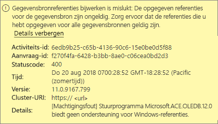
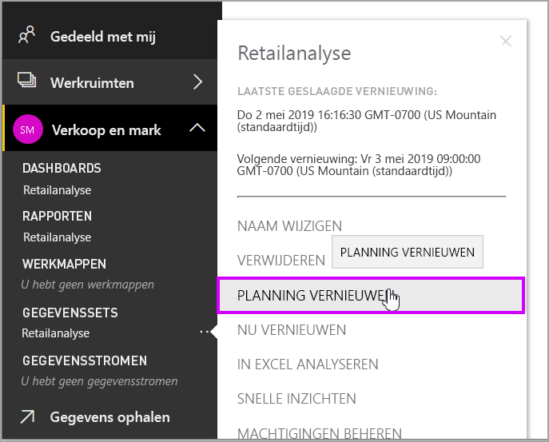
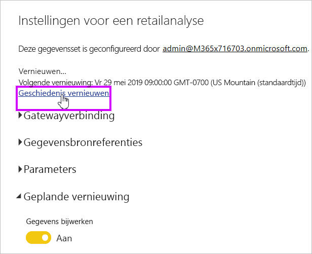
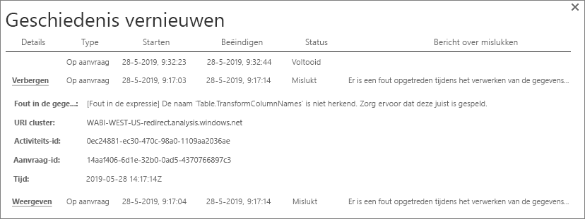
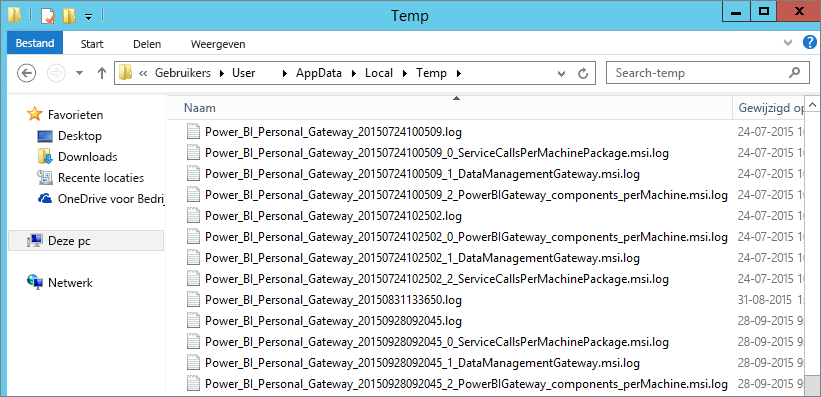

# Problemen met Power BI gateway (persoonlijke modus) oplossen

[!INCLUDE [gateway-rewrite](includes/gateway-rewrite.md)]

In de volgende secties worden enkele veelvoorkomende problemen behandeld die kunnen optreden bij het gebruik van de on-premises gegevensgateway (persoonlijke modus) van Power BI.

## Bijwerken naar de nieuwste versie

De huidige versie van de gateway voor persoonlijk gebruik is de on-premises gegevensgateway (persoonlijke modus). Werk uw installatie bij om deze versie te gebruiken.

Er kunnen zich allerlei problemen voordoen als de gatewayversie verouderd is. Het is een goede en gangbare praktijk om de nieuwste versie te gebruiken. Als u de gateway een maand of langer niet hebt bijgewerkt, wordt aanbevolen de nieuwste versie van de gateway te installeren. Kijk vervolgens of u het probleem kunt reproduceren.

## Installatie
**Gateway (persoonlijke modus) werkt in 64 bitsversies:** Als uw computer een 32 bitsversie is, kunt u de gateway (persoonlijke modus) niet installeren. Uw besturingssysteem moet de 64 bitsversie zijn. Installeer een 64 bitsversie van Windows of installeer de gateway (persoonlijke modus) op een 64 bitscomputer.

**Het installeren van de gateway (persoonlijke modus) als een service mislukt, ook al bent u een lokale beheerder voor de computer:** De installatie kan mislukken als de gebruiker zich in de lokale groep Administrators van de computer bevindt, maar het groepsbeleid niet toestaat dat een gebruiker met deze naam zich aanmeldt als een service. Zorg ervoor dat het volgens het groepsbeleid is toegestaan dat een gebruiker zich aanmeldt als een service. Er wordt gewerkt aan een oplossing voor dit probleem. Zie [Het recht om aan te melden als een service toevoegen aan een account](https://technet.microsoft.com/library/cc739424.aspx) voor meer informatie.

**Time-out van bewerking:** Dit bericht wordt vaak weergegeven als de computer (fysieke of virtuele machine) waarop u de gateway (persoonlijke modus) installeert, een processor met één kern heeft. Sluit alle toepassingen af, beëindig alle niet-essentiële processen en voer de installatie vervolgens opnieuw uit.

**De gegevensbeheergateway of Analysis Services-connector kan niet worden geïnstalleerd op dezelfde computer als de gateway (persoonlijke modus):** Als u al een Analysis Services-connector of een gegevensbeheergateway hebt geïnstalleerd, moet u eerst de connector of de gateway verwijderen. Probeer vervolgens de gateway (persoonlijke modus) te installeren.

> [!NOTE]
> Als er zich een probleem voordoet tijdens de installatie, kunnen de installatielogboeken informatie geven voor het oplossen van het probleem. Zie [Installatielogboeken](#SetupLogs) voor meer informatie.
> 
> 

 **Proxyconfiguratie:** Er kunnen zich problemen voordoen met de configuratie van de gateway (persoonlijke modus) als in uw omgeving het gebruik van een proxy vereist is. In [Proxy-instellingen configureren voor de on-premises gegevensgateway](/data-integration/gateway/service-gateway-proxy) leest u meer over het configureren van proxygegevens.

## Planning vernieuwen
**Fout: De referenties die zijn opgeslagen in de cloud ontbreken.**

Deze fout wordt mogelijk weergegeven in de instellingen voor de \<gegevensset\> als u een vernieuwing hebt gepland en vervolgens de gateway (persoonlijke modus) hebt verwijderd en opnieuw hebt geïnstalleerd. Wanneer u een gateway (persoonlijke modus) verwijdert, worden de gegevensbronreferenties van een gegevensset die was geconfigureerd voor vernieuwen, verwijderd uit de Power BI-service.

**Oplossing:** Ga in Power BI naar de instellingen voor het vernieuwen van een gegevensset. Selecteer in **Gegevensbronnen beheren** voor elke gegevensbron met een fout **Referenties bewerken**. Meld u vervolgens opnieuw aan bij de gegevensbron.

**Fout: De opgegeven referenties voor de gegevensset zijn ongeldig. Werk de referenties bij via een vernieuwingsbewerking of in het dialoogvenster Instellingen voor gegevensbron om door te gaan.**

**Oplossing:** Als u een bericht over referenties krijgt, kan dit het volgende betekenen:

* De gebruikersnamen en wachtwoorden voor aanmelding bij gegevensbronnen zijn niet up-to-date. Ga in Power BI naar de instellingen voor het vernieuwen van de gegevensset. Selecteer in **Gegevensbronnen beheren** de optie **Referenties bewerken** om de referenties voor de gegevensbron bij te werken.
* Mashups tussen een cloudbron en een on-premises bron, in één query, worden niet vernieuwd in de gateway (persoonlijke modus) als een van de bronnen OAuth gebruikt voor verificatie. Een voorbeeld van dit probleem is een mashup tussen CRM Online en een lokaal SQL-server-exemplaar. De mashup mislukt omdat voor CRM Online OAuth vereist is.
  
  Dit is een bekend probleem en er wordt gewerkt aan een oplossing. Een tijdelijke oplossing voor het probleem is een afzonderlijke query te maken voor de cloudbron en de on-premises bron. Combineer deze vervolgens met behulp van een samenvoeg- of toevoegquery.

**Fout: Niet-ondersteunde gegevensbron.**

**Oplossing:** Als u een bericht over een niet-ondersteunde gegevensbron krijgt in de instellingen voor **Vernieuwen plannen**, kan dit het volgende betekenen: 

* De gegevensbron wordt momenteel niet ondersteund voor vernieuwen in Power BI. 
* De Excel-werkmap bevat geen gegevensmodel, alleen werkbladgegevens. Power BI ondersteunt momenteel alleen vernieuwen als de geüploade Excel-werkmap een gegevensmodel bevat. Wanneer u gegevens in Excel importeert met behulp van Power Query, kies dan voor de optie **Laden** om gegevens in een gegevensmodel te laden. Met deze optie zorgt u ervoor dat er gegevens in een gegevensmodel worden geïmporteerd. 

**Fout: [Kan gegevens niet combineren] &lt;queryonderdeel&gt;/&lt;...&gt;/&lt;...&gt; wil toegang tot gegevensbronnen met privacyniveaus die niet samen kunnen worden gebruikt. Bouw deze gegevenscombinatie opnieuw.**

**Oplossing:** Een fout van deze strekking is het gevolg van privacyniveaubeperkingen en de typen gegevensbronnen die u gebruikt.

**Fout: Fout in de gegevensbron: De waarde '\[tabel\]' kan niet worden geconverteerd naar type tabel.**

**Oplossing:** Een fout van deze strekking is het gevolg van privacyniveaubeperkingen en de typen gegevensbronnen die u gebruikt.

**Fout: Er is onvoldoende ruimte voor deze rij.**

**Oplossing:** Deze fout treedt alleen op als een enkele rij groter is dan 4 MB. Zoek de rij in de gegevensbron en probeer deze rij weg te filteren of kleiner te maken.

## Gegevensbronnen
**Ontbrekende gegevensprovider:** De gateway (persoonlijke modus) werkt alleen in 64 bitsversies. Voor de gateway moet een 64-bits versie van de gegevensproviders zijn geïnstalleerd op de computer waarop de gateway (persoonlijke modus) is geïnstalleerd. Als de gegevensbron in de gegevensset bijvoorbeeld Microsoft Access is, moet u de 64-bits ACE-provider installeren op de computer waarop u de gateway (persoonlijke modus) hebt geïnstalleerd. 

>[!NOTE]
>Als u een 32 bitsversie van Excel hebt, kunt u geen 64 bits-ACE-provider installeren op dezelfde computer.

**Windows-verificatie wordt niet ondersteund voor Access-database:** Power BI ondersteunt momenteel alleen anonieme verificatie voor de Access-database.

**Fout: Er is een fout opgetreden bij het invoeren van referenties voor een gegevensbron:** Als er een fout van deze strekking wordt weergegeven bij het invoeren van Windows-referenties voor een gegevensbron: 

  

Mogelijk gebruikt u nog steeds een oudere versie van de gateway (persoonlijke modus). 

**Oplossing:** Zie [De nieuwste versie van Power BI-gateway (persoonlijke modus) installeren](https://powerbi.microsoft.com/gateway/) voor meer informatie.

**Fout: Fout bij aanmelden wanneer u met behulp van ACE OLEDB Windows-verificatie selecteert voor een gegevensbron:** Als het volgende fout bericht wordt weer gegeven wanneer u met behulp van een ACE OLEDB-provider gegevensbronreferenties invoert voor een gegevensbron:

Power BI ondersteunt momenteel geen Windows-verificatie voor een gegevensbron met behulp van een ACE OLEDB-provider.

**Oplossing:** U kunt deze fout omzeilen door **Anonieme verificatie** te selecteren. Voor verouderde ACE OLE DB-providers zijn anonieme referenties gelijk aan Windows-referenties.

## Tegels vernieuwen
Als er een foutbericht wordt weergegeven wanneer dashboardtegels worden vernieuwd, raadpleegt u [Problemen met tegelfouten oplossen](refresh-troubleshooting-tile-errors.md).

## Hulpprogramma's voor het oplossen van problemen
### Geschiedenis vernieuwen
Met de optie **Geschiedenis vernieuwen** kunt u zien welke fouten er zijn opgetreden en kunt u nuttige gegevens vinden als u een ondersteuningsaanvraag moet maken. U kunt zowel geplande vernieuwingen als vernieuwingen op aanvraag bekijken. U krijgt als volgt toegang tot de optie **Geschiedenis vernieuwen**.

1. Ga in het Power BI-navigatievenster naar **Gegevenssets** en selecteer een gegevensset. Open het menu en selecteer **Vernieuwen plannen**.

   
1. Selecteer in **Instellingen voor...** de optie **Geschiedenis vernieuwen**. 

   
   
   

### Gebeurtenislogboeken
Verschillende gebeurtenislogboeken kunnen informatie bieden. De eerste twee, **DMTS** en **PowerBIGateway**, zijn beschikbaar als u een beheerder van de computer bent. Als u geen beheerder bent en u de gegevensgateway (persoonlijke modus) gebruikt, ziet u de logboekvermeldingen in het **Toepassingslogboek**.

De logboeken **Data Management Gateway** en **PowerBIGateway** staan onder **Logboeken Toepassingen en Services**.

### Traceren met Fiddler
[Fiddler](https://www.telerik.com/fiddler) is een gratis hulpprogramma van Telerik waarmee u het HTTP-verkeer kunt controleren. U kunt hiermee de communicatie tussen de Power BI-service en de clientcomputer bekijken. Deze communicatie kan fouten en andere aanverwante informatie bevatten.

### Installatielogboeken
Als de installatie van de gateway (persoonlijke modus) mislukt, ziet u een koppeling om het installatielogboek weer te geven. In het installatielogboek kunt u misschien details van de fout vinden. Deze logboeken zijn Windows Installer-logboeken, ook wel MSI-logboeken genoemd. Deze logboeken kunnen nogal ingewikkeld zijn en moeilijk te lezen. De resulterende fout staat meestal onderaan, maar het bepalen van de oorzaak van de fout is niet eenvoudig. De fout kan het gevolg zijn van fouten in een ander logboek. De fout kan ook het gevolg zijn van een fout die hoger in het logboek is opgetreden.

U kunt ook naar de map Temp (%temp%) gaan en bestanden zoeken die beginnen met *Power\_BI\_* .

> [!NOTE]
> Als u naar %temp% gaat, komt u misschien terecht in een submap van Temp. De *Power\_BI\_* -bestanden staan in de hoofdmap van de map Temp. U moet mogelijk een of twee niveaus omhoog.
> 
> 

## Volgende stappen
- [Proxyinstellingen configureren voor de on-premises gegevensgateway](/data-integration/gateway/service-gateway-proxy)- [Gegevens vernieuwen](refresh-data.md)  
- [Power BI Gateway - Persoonlijk](service-gateway-personal-mode.md)  
- [Problemen met tegelfouten oplossen](refresh-troubleshooting-tile-errors.md)  
- [Problemen met de on-premises gegevensgateway oplossen](service-gateway-onprem-tshoot.md) 
 
Hebt u nog vragen? Misschien dat de[Power Bi-community](https://community.powerbi.com/) het antwoord weet.

