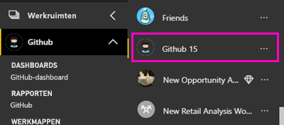
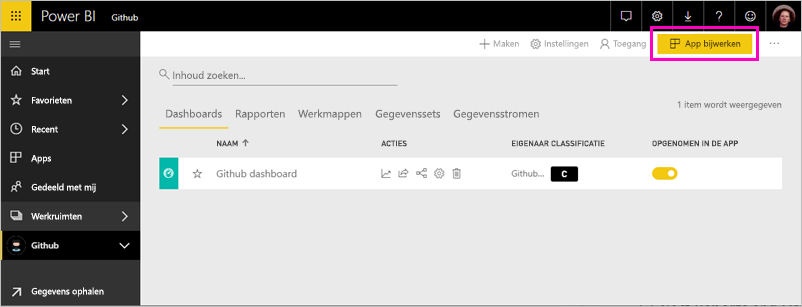

# Verbinding maken met GitHub via Power BI
Dit artikel begeleidt u bij het ophalen van uw gegevens uit uw GitHub-account met een sjabloon voor Power BI-app. De sjabloon-app genereert een werkruimte met een dashboard, een set met rapporten en een gegevensset waarmee u uw GitHub-gegevens kunt verkennen. De GitHub-app voor Power BI geeft u inzicht in uw GitHub-opslagplaats, ook wel bekend als opslagplaats, met gegevens omtrent bijdragen, problemen, pull-aanvragen en actieve gebruikers.

Nadat u de sjabloon-app hebt geïnstalleerd, kunt u het dashboard en rapport wijzigen. Vervolgens kunt u deze distribueren als een app naar collega's in uw organisatie.

Verbinding maken met de [GitHub sjabloon app](https://app.powerbi.com/getdata/services/github) of lees meer over de [GitHub-integratie](https://powerbi.microsoft.com/integrations/github) met Power BI.

U kunt ook proberen de [GitHub zelfstudie](service-tutorial-connect-to-github.md). Echte GitHub-gegevens over de openbare opslagplaats voor de Power BI-documentatie worden geïnstalleerd.

>[!NOTE]
>De sjabloon-app is vereist voor de GitHub-account toegang hebben tot de opslagplaats. Meer informatie over de vereisten volgt hieronder.

## Verbinding maken
[!INCLUDE [powerbi-service-apps-get-more-apps](./includes/powerbi-service-apps-get-more-apps.md)]
   
3. Selecteer **GitHub** \> **nu downloaden**.
4. In **deze Power BI-App installeren?** Selecteer **installeren**.
4. In de **Apps** venster de **GitHub** tegel.

    

6. In **aan de slag met uw nieuwe app**, selecteer **verbinding maken met gegevens**.

    

5. Voer de naam in van de opslagplaats en de naam van de eigenaar van de opslagplaats. Hieronder vindt u informatie over [het vinden van deze parameters](#FindingParams).
   
    

5. Voer uw GitHub-referenties (deze stap kan worden overgeslagen als u al bent aangemeld met uw browser). 
6. Selecteer voor **Verificatiemethode** **oAuth2**\> **Aanmelden**. 
7. Volg de schermen van GitHub-verificatie. Verleen het GitHub voor Power BI-sjabloon app-machtiging aan het GitHub-gegevens.
   
   
   
    Power BI maakt verbinding met GitHub en uw gegevens.  De gegevens worden eenmaal per dag vernieuwd. Nadat de gegevens in Power BI geïmporteerd, ziet u de inhoud van uw nieuwe GitHub-werkruimte.

## Wijzigen en uw Apps distribueren

U kunt de GitHub-sjabloon-app hebt geïnstalleerd. Dit betekent dat u ook de GitHub-app-werkruimte hebt gemaakt. In de werkruimte, kunt u het rapport en dashboard wijzigen en vervolgens distribueren als een *app* naar collega's in uw organisatie. 

1. Selecteer de pijl naast de naam van de werkruimte in de linker navigatiebalk. U ziet in dat de werkruimte bevat een dashboard en een rapport.

    

8. Selecteer de nieuwe [GitHub-dashboard](https://powerbi.microsoft.com/integrations/github).    
    

3. Als u wilt weergeven van alle inhoud van uw nieuwe GitHub-werkruimte in de linker navigatiebalk, selecteer **werkruimten** > **GitHub**.
 
   

    In deze weergave wordt de lijst met inhoud van de werkruimte. In de rechterbovenhoek ziet u **app bijwerken**. Wanneer u klaar bent om uw Apps distribueren aan uw collega's, is dat waar u begint. 

    

2. Selecteer **rapporten** en **gegevenssets** om te zien van de andere elementen in de werkruimte.

    Meer informatie over [distribueren van apps](service-create-distribute-apps.md) naar uw collega's.

## Wat inbegrepen bij de app.
De volgende gegevens van GitHub zijn beschikbaar in Power BI:     

| Tabelnaam | Beschrijving |
| --- | --- |
| Bijdragen |Deze tabel geeft het totale aantal toevoegingen, verwijderingen en wijzigingen dat een inzender per week heeft bijgedragen. De tabel bevat gegevens van de 100 actiefste medewerkers. |
| Issues |Een overzicht van alle problemen voor de geselecteerde opslagplaats en berekeningen zoals de totale en gemiddelde tijd voor het afhandelen van een probleem, het totale aantal openstaande problemen en het totale aantal afgesloten problemen. Deze tabel is leeg wanneer er geen problemen zijn gemeld voor de opslagplaats. |
| Pull requests |Deze tabel bevat alle pull-aanvragen voor de opslagplaats en wie de aanvraag heeft gedaan. Het bevat ook berekeningen hoeveel openen, gesloten en totaal aantal pull-aanvragen, hoe lang het heeft geduurd om aanvragen te verwerken en hoe lang de gemiddelde pull-aanvraag heeft geduurd. Deze tabel is leeg wanneer er geen problemen zijn gemeld voor de opslagplaats. |
| Gebruikers |Deze tabel bevat een lijst met GitHub-gebruikers of -inzenders die bijdragen, problemen melden of opgelost Pull-aanvragen voor de geselecteerde opslagplaats. |
| Milestones |Deze tabel bevat alle mijlpalen voor de geselecteerde opslagplaats. |
| DateTable |Deze tabel bevat datums vanaf vandaag tot jaren in het verleden waarmee u uw GitHub-gegevens analyseren op datum. |
| ContributionPunchCard |Deze tabel kan worden gebruikt als een controlemiddel voor bijdragen aan de geselecteerde opslagplaats. U ziet hier 'commits' per dag van de week en tijdstip van de dag. Deze tabel is niet verbonden met andere tabellen in het model. |
| RepoDetails |Deze tabel bevat details voor de geselecteerde opslagplaats. |

## Systeemvereisten
* Een GitHub-account met toegang tot de opslagplaats.  
* Machtiging verleend aan de app Power BI voor GitHub tijdens de eerste aanmelding. Zie de details hieronder om de toegang weer in te trekken.  
* Er zijn voldoende API-aanroepen beschikbaar om de gegevens op te halen en te vernieuwen.  

### Autorisatie van Power BI intrekken
Om autorisatie voor Power BI ongedaan maken van verbinding met uw GitHub-opslagplaats, kunt u in GitHub toegang intrekken. Raadpleeg deze [GitHub help](https://help.github.com/articles/keeping-your-ssh-keys-and-application-access-tokens-safe/#reviewing-your-authorized-applications-oauth) onderwerp voor meer informatie.

## Parameters zoeken
U kunt de eigenaar en opslagplaats vaststellen door te kijken naar de opslagplaats in GitHub zelf:

Het eerste deel, 'Azure', is de eigenaar en het tweede deel, 'azure-sdk-for-php', is de opslagplaats zelf.  Deze twee items komen ook terug in de URL van de opslagplaats:

    <https://github.com/Azure/azure-sdk-for-php> .

## Probleemoplossing
Indien nodig kunt u uw GitHub-referenties controleren.  

1. In een ander browservenster, gaat u naar de website van GitHub en meld u aan bij GitHub. U kunt in de rechterbovenhoek van de GitHub-site zien of u bent aangemeld.    
2. Navigeer in GitHub naar de URL van de opslagplaats die u wilt raadplegen in Power BI, Bijvoorbeeld: https://github.com/dotnet/corefx.  
3. Ga terug naar Power BI en probeer verbinding te maken met GitHub. Gebruik in het dialoogvenster Configure GitHub de naam van de opslagplaats en de naam van de eigenaar van dezelfde opslagplaats.  

## Volgende stappen

* [Zelfstudie: Verbinding maken met een GitHub-opslagplaats met Power BI](service-tutorial-connect-to-github.md)
* [De nieuwe werkruimten maken in Power BI](service-create-the-new-workspaces.md)
* [Apps in Power BI installeren en gebruiken](consumer/end-user-apps.md)
* [Verbinding maken met Power BI-apps voor externe services](service-connect-to-services.md)
* Vragen? [Misschien dat de Power BI-community het antwoord weet](http://community.powerbi.com/)

