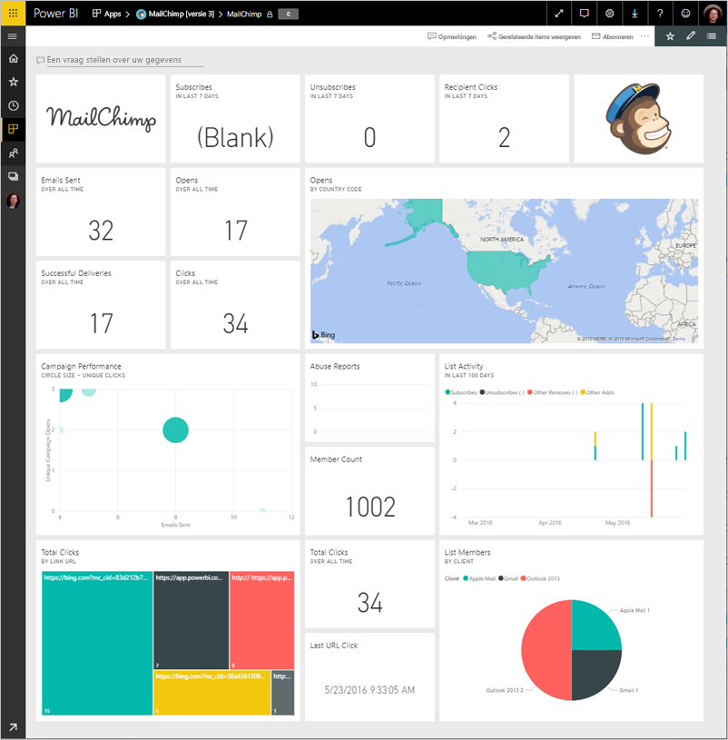
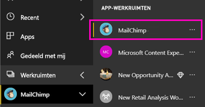
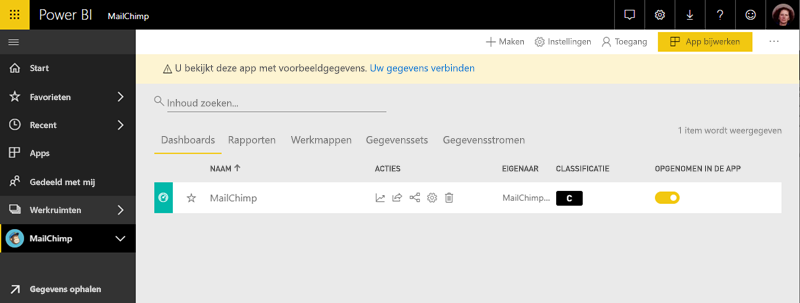

# Verbinding met MailChimp maken via Power BI
Dit artikel begeleidt u bij het ophalen van uw gegevens uit uw MailChimp-account met een sjabloon voor Power BI-app. De sjabloon-app genereert een werkruimte met een dashboard, een set met rapporten en een gegevensset waarmee u uw MailChimp-gegevens kunt verkennen. Haal analyses op om [MailChimp-dashboards](https://powerbi.microsoft.com/integrations/mailchimp) te maken en snel trends voor uw campagnes, rapporten en individuele abonnees te identificeren. De gegevens worden dagelijks vernieuwd ervoor te zorgen dat de gegevens die u uw bewakingsgegevens up-to-date is.

Nadat u de sjabloon-app hebt geïnstalleerd, kunt u het dashboard en rapport wijzigen. Vervolgens kunt u deze distribueren als een app naar collega's in uw organisatie.

Verbinding maken met de [MailChimp sjabloon app](https://app.powerbi.com/getdata/services/mailchimp) voor Power BI.

## Verbinding maken

[!INCLUDE [powerbi-service-apps-get-more-apps](./includes/powerbi-service-apps-get-more-apps.md)]

3. Selecteer **MailChimp** \> **nu downloaden**.
4. In **deze Power BI-App installeren?** Selecteer **installeren**.
4. In de **Apps** venster de **MailChimp** tegel.

    

6. In **aan de slag met uw nieuwe app**, selecteer **verbinding maken met gegevens**.

    

1. Selecteer voor de verificatiemethode **oAuth2** \> **Aanmelden**.
   
    Geef desgevraagd uw MailChimp-referenties op en voer het verificatieproces uit.
   
    De eerste keer dat u verbinding maakt, wordt u door Power BI gevraagd om alleen-lezen toegang tot uw account te geven. Selecteer **Toestaan** om te beginnen met het importproces. Het kan enkele minuten duren, afhankelijk van het volume van gegevens in uw account.
   
    

5. Nadat de gegevens in Power BI geïmporteerd, wordt het MailChimp-dashboard geopend.
   
    

## Wijzigen en uw Apps distribueren

U kunt de MailChimp-sjabloon-app hebt geïnstalleerd. Dit betekent dat u ook de MailChimp-app-werkruimte hebt gemaakt. In de werkruimte, kunt u het rapport en dashboard wijzigen en vervolgens distribueren als een *app* naar collega's in uw organisatie. 

1. Als u wilt weergeven van alle inhoud van uw nieuwe MailChimp-werkruimte in de linker navigatiebalk, selecteer **werkruimten** > **MailChimp**. 

    

    In deze weergave wordt de lijst met inhoud van de werkruimte. In de rechterbovenhoek ziet u **app bijwerken**. Wanneer u klaar bent om uw Apps distribueren aan uw collega's, is dat waar u begint.

    

2. Selecteer **rapporten** en **gegevenssets** om te zien van de andere elementen in de werkruimte. 

    Meer informatie over [distribueren van apps](service-create-distribute-apps.md) naar uw collega's.

## Volgende stappen

* [De nieuwe werkruimten maken in Power BI](service-create-the-new-workspaces.md)
* [Apps in Power BI installeren en gebruiken](consumer/end-user-apps.md)
* [Power BI-apps voor externe services](service-connect-to-services.md)
* Vragen? [Misschien dat de Power BI-community het antwoord weet](http://community.powerbi.com/)

