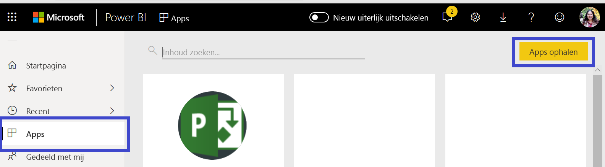
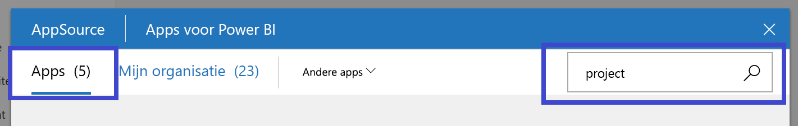
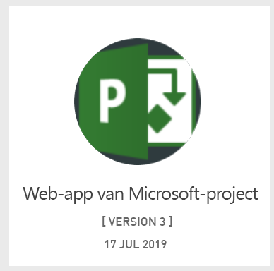
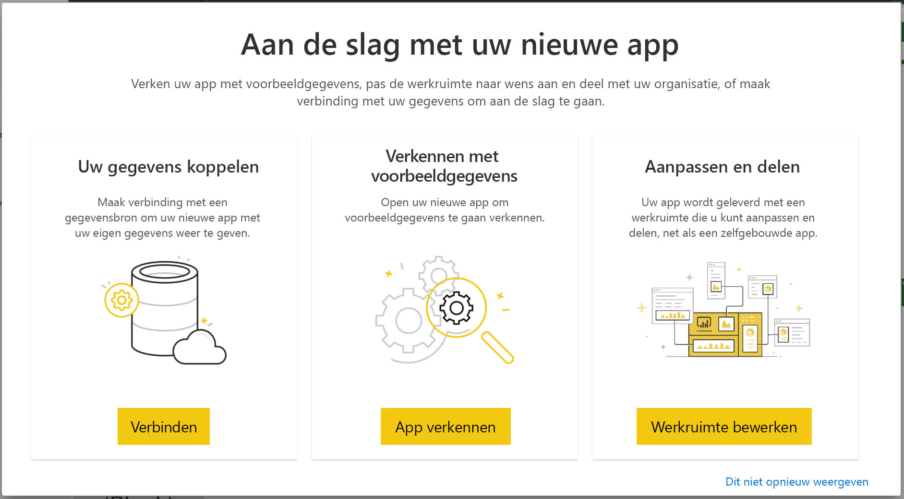

# Verbinding maken met Project Web App via Power BI
Microsoft Project Web App is een flexibele onlineoplossing voor Project Portfolio Management (PPM) en dagelijkse werkzaamheden. Met Project Web App kunnen organisaties meteen aan de slag, projectportfolio-investeringen prioriteren en de beoogde bedrijfswaarde leveren. Met het Project Web App-inhoudspakket voor Power BI kunt u inzichten ontlenen aan Power Web App om projecten, portfolio's en resources te beheren.

Maak verbinding met de [Project Web App-sjabloon-app](https://appsource.microsoft.com/product/power-bi/pbi_msprojectonline.pbi-microsoftprojectwebapp) voor Power BI.

## Verbinding maken

   
1. Selecteer in het linkernavigatievenster **Apps** en selecteer in de rechterbovenhoek vervolgens **Apps downloaden**.
2. Selecteer **Ophalen** in het vak **Services**.
   
   
3. Selecteer in AppSource het tabblad **Apps** en zoek/selecteer **Microsoft Project Web App**.
   
4. U krijgt de vraag **Wilt u deze Power BI-app installeren?** Selecteer **Installeren**. 

   
5. Selecteer in het deelvenster **Apps** de tegel **Microsoft Project Web App**. 
   
   
6. Selecteer in **Aan de slag met uw nieuwe app** de optie **Verbinding maken met gegevens**.
   
   
7. Voer in het tekstvak **Project Web App-URL** de URL in voor de Project Web APP (PWA) waarmee u verbinding wilt maken.  Houd er rekening mee dat deze instructie kan afwijken van het voorbeeld als u een aangepast domein hebt. Typ in het tekstvak **Taal PWA-site** het getal dat overeenkomt met de taal van uw PWA-site. Typ het cijfer '1' voor Engels, '2' voor Frans, '3' voor Duits, '4' voor Portugees (Brazilië), '5' voor Portugees (Portugal) en '6' voor Spaans. 
   
   
8. Selecteer voor de verificatiemethode **oAuth2** \> **Aanmelden**. Geef uw Project Web App-referenties op als hierom wordt gevraagd en voer het verificatieproces uit.

    
Houd er rekening mee dat u machtigingen als Portfolioviewer, Portfoliomanager of beheerder moet hebben voor de Project Web App waarmee u verbinding maakt.

9. U ziet een melding dat uw gegevens geladen worden. Dit kan enige tijd duren, afhankelijk van de grootte van uw account. Nadat de gegevens zijn geïmporteerd in Power BI wordt de inhoud van uw nieuwe werkruimte weergegeven. Mogelijk moet u de gegevensset vernieuwen om de nieuwste updates op te halen. 

Nadat de gegevens in Power BI zijn geïmporteerd, ziet u een rapport van dertien pagina's en een gegevensset in het navigatiedeelvenster aan de linkerzijde. 

10. Wanneer uw rapporten klaar zijn, kunt u uw Project Web App-gegevens verkennen. De sjabloon-app wordt geleverd met dertien uitgebreide en gedetailleerde rapporten voor het Portfolio-overzicht (zes rapportpagina's), het Resource-overzicht (vijf rapportpagina's) en de Project-status (twee rapportpagina's). 

   
   
   
   
   

**Wat nu?**

* Als uw gegevensset is ingesteld op dagelijks vernieuwen, kunt u het vernieuwingsschema wijzigen of de gegevensset handmatig vernieuwen met **Nu vernieuwen**

**De sjabloon-app uitbreiden**

Download het [GitHub PBIT-bestand](https://github.com/OfficeDev/Project-Power-BI-Content-Packs) om het inhoudspakket verder aan te passen en bij te werken

## Volgende stappen
[Aan de slag in Power BI](service-get-started.md)

[Gegevens ophalen in Power BI](service-get-data.md)

