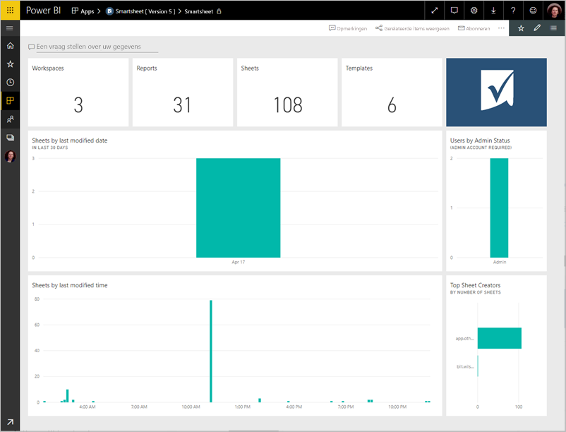
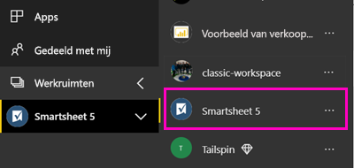
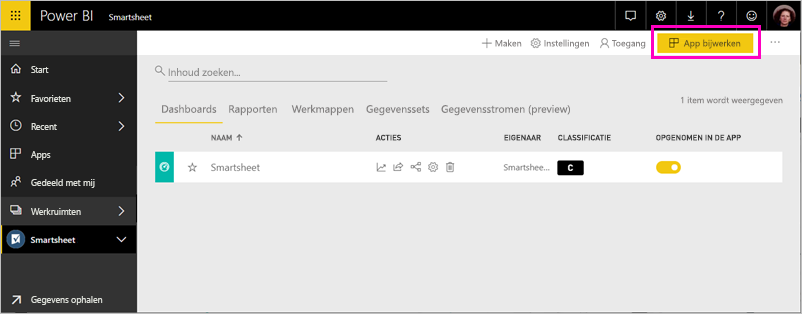

# Verbinding maken met Smartsheet via Power BI
Dit artikel begeleidt u bij het ophalen van uw gegevens uit uw Smartsheet-account met een sjabloon voor Power BI-app. Smartsheet biedt een gebruiksvriendelijk platform voor samenwerking en het delen van bestanden. De Smartsheet-sjabloon-app voor Power BI biedt een dashboard, rapporten en gegevenssets die een overzicht van uw Smartsheet-account weergeven. U kunt ook [Power BI Desktop](desktop-connect-to-data.md) direct verbinding maken met afzonderlijke werkbladen in uw account. 

Nadat u de sjabloon-app hebt geïnstalleerd, kunt u het dashboard en rapport wijzigen. Vervolgens kunt u deze distribueren als een app naar collega's in uw organisatie.

Verbinding maken met de [Smartsheet sjabloon app](https://app.powerbi.com/groups/me/getdata/services/smartsheet) voor Power BI.

>[!NOTE]
>Een Smartsheet-beheerdersaccount heeft de voorkeur om verbinding te maken en te laden van de Power BI-sjabloon-app omdat er aanvullende toegang.

## Verbinding maken

[!INCLUDE [powerbi-service-apps-get-more-apps](./includes/powerbi-service-apps-get-more-apps.md)]

3. Selecteer **Smartsheet** \> **nu downloaden**.
4. In **deze Power BI-App installeren?** Selecteer **installeren**.
4. In de **Apps** venster de **Smartsheet** tegel.

    

6. In **aan de slag met uw nieuwe app**, selecteer **verbinding maken met gegevens**.

    

4. Selecteer voor de verificatiemethode de optie **oAuth2 \> Aanmelden**.
   
   Geef desgevraagd uw Smartsheet-referenties op en voer het verificatieproces uit.
   
   
   
   

5. Nadat de gegevens in Power BI geïmporteerd, wordt het Smartsheet-dashboard geopend.
   
   

## Wijzigen en uw Apps distribueren

U kunt de Smartsheet-sjabloon-app hebt geïnstalleerd. Dit betekent dat u ook de Smartsheet-app-werkruimte hebt gemaakt. In de werkruimte, kunt u het rapport en dashboard wijzigen en vervolgens distribueren als een *app* naar collega's in uw organisatie. 

1. Als u wilt weergeven van de inhoud van uw nieuwe Smartsheet-werkruimte, in de linker navigatiebalk, selecteren **werkruimten** > **Smartsheet**. 

    

    In deze weergave wordt de lijst met inhoud van de werkruimte. In de rechterbovenhoek ziet u **app bijwerken**. Wanneer u klaar bent om uw Apps distribueren aan uw collega's, is dat waar u begint. 

    

2. Selecteer **rapporten** en **gegevenssets** om te zien van de andere elementen in de werkruimte.

    Meer informatie over [distribueren van apps](service-create-distribute-apps.md) naar uw collega's.

## Wat is inbegrepen
Het Smartsheet sjabloon-app voor Power BI een overzicht van uw Smartsheet-account, zoals het aantal werkruimten bevat, rapporten en werkbladen hebt, wanneer deze zijn gewijzigd enzovoort. Gebruikers die beheerder ziet ook bepaalde gegevens weergegeven over de gebruikers in hun systeem, zoals de belangrijkste auteurs blad.  

Als u rechtstreeks verbinding wilt maken met afzonderlijke werkbladen in uw account, kunt u de Smartsheet-connector in [Power BI Desktop](desktop-connect-to-data.md) gebruiken.  

## Volgende stappen

* [De nieuwe werkruimten maken in Power BI](service-create-the-new-workspaces.md)
* [Apps in Power BI installeren en gebruiken](consumer/end-user-apps.md)
* [Verbinding maken met Power BI-apps voor externe services](service-connect-to-services.md)
* Vragen? [Misschien dat de Power BI-community het antwoord weet](http://community.powerbi.com/)