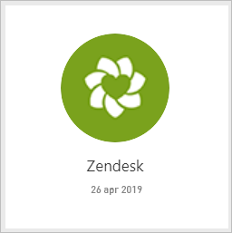
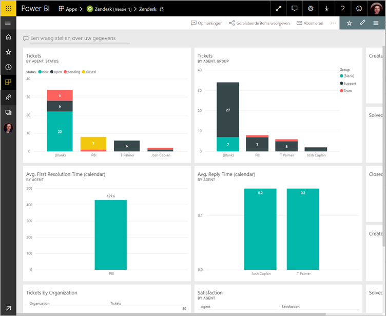
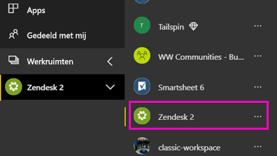
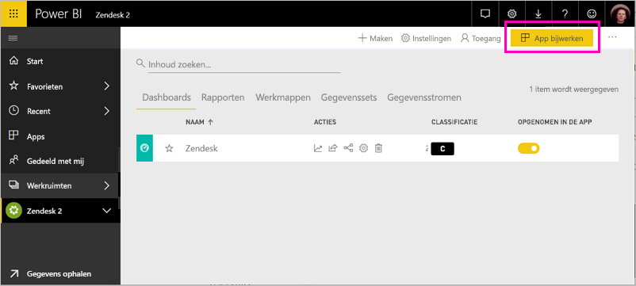

# Verbinding maken met Zendesk met Power BI

Dit artikel begeleidt u bij het ophalen van uw gegevens uit uw Zendesk-account met een sjabloon voor Power BI-app. De Zendesk-app biedt een Power BI-dashboard en een set Power BI-rapporten die inzicht in uw ticketaantallen en agentprestaties. De gegevens worden eenmaal per dag automatisch vernieuwd. 

Nadat u de sjabloon-app hebt geïnstalleerd, kunt u het dashboard en rapport te krijgen in de gegevens die u het belangrijkst zijn. Vervolgens kunt u deze distribueren als een app naar collega's in uw organisatie.

Maak verbinding met het [Zendesk-inhoudspakket](https://app.powerbi.com/getdata/services/zendesk) of lees meer over de [Zendesk-integratie](https://powerbi.microsoft.com/integrations/zendesk) met Power BI.

Nadat u de sjabloon-app hebt geïnstalleerd, kunt u het dashboard en rapport wijzigen. Vervolgens kunt u deze distribueren als een app naar collega's in uw organisatie.

>[!NOTE]
>U moet een Zendesk-Admin-account om verbinding te maken. Meer informatie over de [vereisten](#system-requirements) leest u hieronder.

## Verbinding maken

[!INCLUDE [powerbi-service-apps-get-more-apps](./includes/powerbi-service-apps-get-more-apps.md)]

3. Selecteer **Zendesk** \> **nu downloaden**.
4. In **deze Power BI-App installeren?** Selecteer **installeren**.
4. In de **Apps** venster de **Zendesk** tegel.

    

6. In **aan de slag met uw nieuwe app**, selecteer **verbinding maken met gegevens**.

    

4. Geef de URL die is gekoppeld aan uw account. De URL heeft de vorm **https://company.zendesk.com** . Hieronder vindt u informatie over [het vinden van deze parameters](#finding-parameters).
   
   

5. Geef desgevraagd uw Zendesk-referenties op.  Selecteer **oAuth 2** als verificatiemethode en klik op **Aanmelden**. Volg de Zendesk-verificatieprocedure. (Als u bent al aangemeld bij Zendesk in uw browser, u mogelijk niet gevraagd om referenties.)
   
   > [!NOTE]
   > Dit inhoudspakket vereist dat u verbinding met een Zendesk-Admin-account maken. 
   > 
   
   
6. Klik op **Toestaan** om Power BI toegang te geven tot uw Zendesk-gegevens.
   
   
7. Klik op **Verbinding maken** om het importproces te starten. 
8. Nadat de gegevens in Power BI geïmporteerd, ziet u de lijst met inhoud voor uw Zendesk-app: een nieuw dashboard, rapport en gegevensset.
9. Selecteer het dashboard om het proces verkennen te starten.

    
   
## Wijzigen en uw Apps distribueren

U kunt de Zendesk-sjabloon-app hebt geïnstalleerd. Dit betekent dat u ook de Zendesk-app-werkruimte hebt gemaakt. In de werkruimte, kunt u het rapport en dashboard wijzigen en vervolgens distribueren als een *app* naar collega's in uw organisatie. 

1. Als u wilt weergeven van alle inhoud van uw nieuwe Zendesk-werkruimte in de linker navigatiebalk, selecteer **werkruimten** > **Zendesk**. 

    

    In deze weergave wordt de lijst met inhoud van de werkruimte. In de rechterbovenhoek ziet u **app bijwerken**. Wanneer u klaar bent om uw Apps distribueren aan uw collega's, is dat waar u begint. 

    

2. Selecteer **rapporten** en **gegevenssets** om te zien van de andere elementen in de werkruimte.

    Meer informatie over [distribueren van apps](service-create-distribute-apps.md) naar uw collega's.

## Systeemvereisten
Een Zendesk-beheerdersaccount is vereist voor toegang tot het Zendesk-inhoudspakket. Als u een agent of een gebruiker en zijn geïnteresseerd in uw Zendesk-gegevens weergeven, Voeg een suggestie toe en controleer de Zendesk-connector in de [Power BI Desktop](desktop-connect-to-data.md).

## Parameters zoeken
De URL van uw Zendesk is hetzelfde als de URL die u gebruikt bij het aanmelden bij uw Zendesk-account. Als u niet zeker weet wat uw Zendesk-URL is, kunt u de [hulp bij aanmelden](https://www.zendesk.com/login/) van Zendesk gebruiken.

## Problemen oplossen
Als u bent geen verbinding worden gemaakt, controleert u uw Zendesk-URL en Bevestig dat u een Zendesk-beheerdersaccount.

## Volgende stappen

* [De nieuwe werkruimten maken in Power BI](service-create-the-new-workspaces.md)
* [Apps in Power BI installeren en gebruiken](consumer/end-user-apps.md)
* [Verbinding maken met Power BI-apps voor externe services](service-connect-to-services.md)
* Vragen? [Misschien dat de Power BI-community het antwoord weet](http://community.powerbi.com/)

