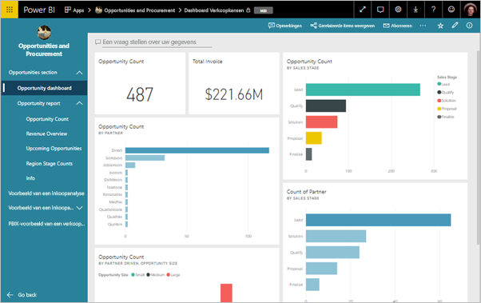
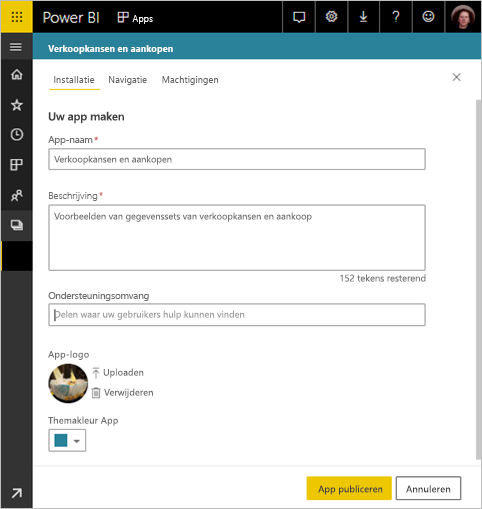
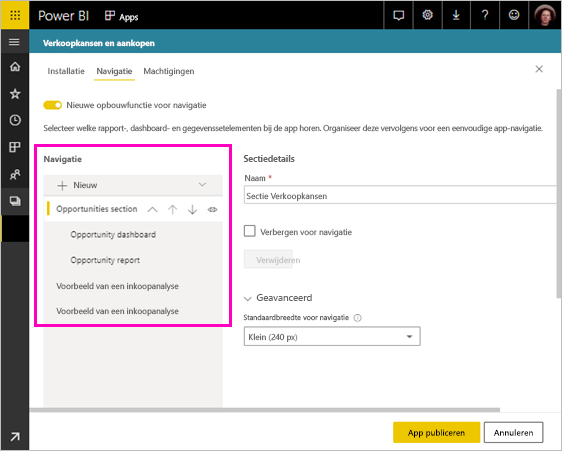
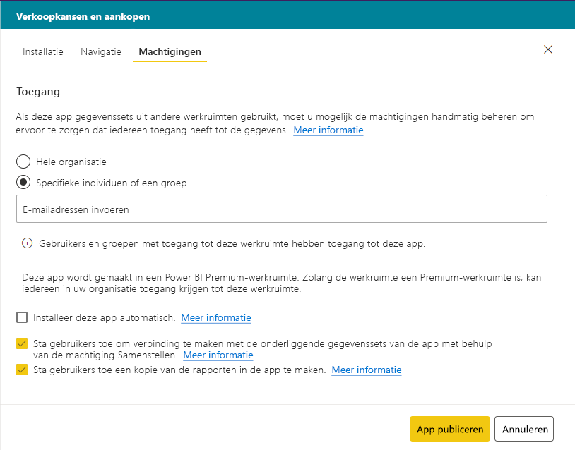
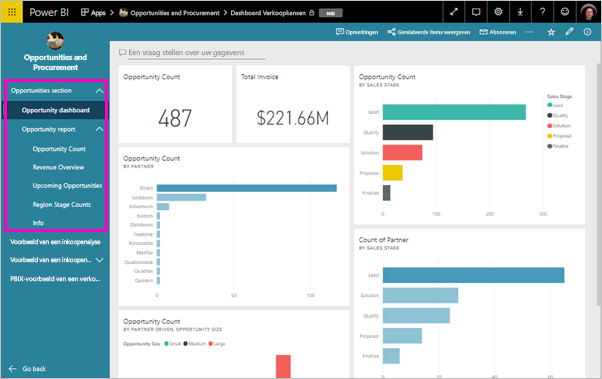

# Een app publiceren in Power BI

In Power BI kunt u officieel verpakte inhoud maken en deze als een *app* naar een brede doelgroep distribueren. U maakt apps in *werkruimten*, waar u samen met uw collega's aan Power BI-inhoud kunt werken. Vervolgens kunt u de voltooide apps naar grote groepen mensen in uw organisatie publiceren. 

Uw zakelijke gebruikers hebben vaak meerdere Power BI-dashboards en rapporten nodig voor hun bedrijfsvoering. Met Power BI-apps kunt u verzamelingen van dashboards en rapporten maken en deze verzamelingen als apps naar uw hele organisatie of naar specifieke personen of groepen publiceren. Apps maken het u als beheerder of rapportmaker gemakkelijker om machtigingen voor deze verzamelingen te beheren.

Zakelijke gebruikers kunnen uw apps op een aantal verschillende manieren installeren:

- Ze kunnen uw app zoeken en installeren via Microsoft AppSource.
- U kunt ze een rechtstreekse koppeling sturen.
- U kunt de app automatisch installeren in de Power BI-accounts van uw collega's als uw Power BI-beheerder u hiervoor toestemming geeft.
- Power BI stuurt geen e-mailberichten naar interne gebruikers wanneer u een app distribueert of bijwerkt. Als u distribueert naar externe gebruikers, ontvangen deze gebruikers een e-mail met een directe koppeling. 

U kunt de app maken met een eigen ingebouwde navigatie, zodat uw gebruikers eenvoudig de weg in uw inhoud kunnen vinden. Ze kunnen de inhoud van de app niet wijzigen. Ze kunnen wel bepaalde acties uitvoeren in de Power BI-service of een van de mobiele apps: filteren, markeren en de gegevens sorteren. Ze ontvangen automatisch updates en u kunt bepalen hoe vaak de gegevens worden vernieuwd. U kunt hun ook samenstellingsmachtigingen geven om verbinding te maken met de onderliggende gegevenssets en kopieën van de rapporten in de app te maken. Meer informatie over de [Samenstellingsmachtiging](service-datasets-build-permissions.md).

## Licenties voor apps
U hebt een Power BI Pro-licentie nodig om apps bij te werken of te maken. Voor*app-consumenten* zijn er twee opties.

* **Optie 1** De werkruimte voor deze app bevindt zich *niet* in een Power BI Premium capaciteit: alle zakelijke gebruikers moeten Power BI Pro-licenties hebben om uw app te bekijken. 
* **Optie 2** De werkruimte voor deze app bevindt zich *wel* in een Power BI Premium capaciteit: zakelijke gebruikers zonder Power BI Pro licenties in uw organisatie kunnen app-inhoud bekijken. Ze kunnen de rapporten echter niet kopiëren en kunnen geen rapporten maken op basis van de onderliggende gegevenssets. Lees [Wat is Power BI Premium?](service-premium.md) voor meer informatie.

## Uw app publiceren
Wanneer de dashboards en rapporten in uw werkruimte klaar zijn, kiest u welke dashboards en rapporten u wilt publiceren en publiceert u deze vervolgens als een app. 

1. Kies in de lijstweergave van de werkruimte welke dashboards en rapporten moeten worden **opgenomen in de app**.

    

    Als u ervoor kiest om een rapport waaraan een dashboard is gekoppeld, niet op te nemen, wordt er een waarschuwing naast het rapport weergegeven. U kunt de app nog steeds publiceren, maar het bijbehorende dashboard bevat dan niet de tegels uit het rapport.

    

2. Selecteer de knop **App publiceren** in de rechterbovenhoek om vanuit de werkruimte een app te maken en te publiceren.
   
    

3. Geef bij **Setup** de naam en een beschrijving op, zodat mensen de app kunnen vinden. U kunt een themakleur instellen om de app te personaliseren. U kunt ook een koppeling naar een ondersteuningssite toevoegen.
   
    

4. Bij **Navigatie** selecteert u de inhoud die moet worden gepubliceerd als onderdeel van de app. Vervolgens voegt u app-navigatie toe om de inhoud in de secties te ordenen. Zie [De navigatie-ervaring voor uw app ontwerpen](#design-the-navigation-experience) in dit artikel voor meer informatie.
   
    

5. Bepaal bij **Machtigingen** wie toegang heeft tot de app en wat ze ermee kunnen doen. 

    - In [klassieke werkruimten](service-create-workspaces.md): iedereen in uw organisatie, specifieke personen of Azure Active Directory-beveiligingsgroepen (Azure AD).
    - In de [nieuwe werkruimte-ervaring](service-create-the-new-workspaces.md): specifieke personen, Azure AD-beveiligingsgroepen en -distributielijsten en Office 365-groepen. Alle werkruimtegebruikers krijgen automatisch toegang tot de app voor de werkruimte.
    - U kunt app-gebruikers toestaan verbinding te maken met de onderliggende gegevenssets van de app door hen samenstellingsmachtiging te geven. Deze gegevenssets worden weergegeven wanneer ze naar gedeelde gegevenssets zoeken. Lees meer over [het toestaan van gebruikers om verbinding te maken met de gegevenssets van de app](#allow-users-to-connect-to-datasets) in dit artikel.
    - Gebruikers met samenstellingsmachtigingen kunnen ook zijn gemachtigd om rapporten van deze app naar een andere werkruimte te kopiëren. Lees meer over [het toestaan van gebruikers om rapporten te kopiëren in de app](#allow-users-to-copy-reports) in dit artikel.
    
    >[!IMPORTANT]
    >Als uw app afhankelijk is van gegevenssets uit andere werkruimten, is het uw verantwoordelijkheid om te controleren of alle app-gebruikers toegang tot de onderliggende gegevenssets hebben.
    >

6. Als u deze instelling in de Power BI-beheerportal door uw Power BI-beheerder is ingeschakeld, kunt u de app automatisch voor de ontvangers installeren. Raadpleeg dit artikel voor meer informatie over het [automatisch installeren van een app](#automatically-install-apps-for-end-users).

    

7. Wanneer u **App publiceren** selecteert, wordt er een bevestigingsbericht weergegeven dat de app gereed is om te publiceren. In het dialoogvenster **Deze app delen** kunt u de URL kopiëren. De URL is een rechtstreekse koppeling naar deze app.
   
    

U kunt deze rechtstreekse koppeling naar de mensen sturen waarmee u de app wilt delen. Ze kunnen uw app ook op het tabblad Apps vinden door naar **Meer apps downloaden en verkennen vanuit AppSource** te gaan. Meer informatie over de [app-ervaring voor zakelijke gebruikers](consumer/end-user-apps.md).

## Uw gepubliceerde app wijzigen
Nadat u uw app hebt gepubliceerd, kunt u deze wijzigen of bijwerken. Als u een beheerder of lid van de nieuwe werkruimte bent, kunt u de app eenvoudig bijwerken. 

1. Open de werkruimte die bij de app hoort. 
   
    

2. U kunt de dashboards of rapporten naar wens aanpassen.
 
    De werkruimte is uw faseringsgebied. Uw wijzigingen worden pas live in de app wanneer u de app opnieuw publiceert. Dit betekent dat u wijzigingen kunt aanbrengen zonder dat dit de gepubliceerde apps beïnvloedt.  
 
    > [!IMPORTANT]
    > Als u een rapport verwijdert en de app bijwerkt, verliezen de gebruikers van uw app alle aanpassingen, zoals bladwijzers, opmerkingen, enzovoort, zelfs als u het rapport later weer aan de app toevoegt.  
 
3. Ga terug naar de werkruimtelijst met inhoud en selecteer in de rechterbovenhoek **App bijwerken**.
   
1. Bijwerken **Setup**, **Navigatie** en **Machtigingen** en selecteer vervolgens zo nodig **App bijwerken**.
   
De mensen waarnaar u de app hebt gepubliceerd, zien automatisch de bijgewerkte versie van de app. 

## De navigatie-ervaring ontwerpen
Met de optie **Nieuwe opbouwfunctie voor navigatie** kunt u een aangepaste navigatie voor uw app maken. De aangepaste navigatie zorgt ervoor dat uw gebruikers eenvoudiger inhoud in de app kunnen vinden en gebruiken. Voor bestaande apps is deze optie uitgeschakeld, maar voor nieuwe apps is deze optie standaard ingeschakeld.

Als de optie uitgeschakeld is, kunt u voor **Landingspagina van app** **Specifieke inhoud** selecteren, zoals een dashboard of rapport of **Geen** selecteren om eenvoudige lijst met inhoud voor de gebruiker weer te geven.

Wanneer u **Nieuwe opbouwfunctie voor navigatie** inschakelt, kunt u een aangepaste navigatie ontwerpen. Alle rapporten, dashboards en Excel-werkmappen die u opneemt in uw app, worden standaard weergegeven als een platte lijst. 

U kunt de app-navigatie als volgt verder aanpassen:

* U kunt met de pijl-omhoog of pijl-omlaag de volgorde van de items aanpassen. 
* U kun de namen van items in **Rapportdetails**, **Dashboarddetails** en **Werkmapdetails** wijzigen.
* U kun bepaalde items in de navigatie verbergen.
* U kunt de optie **Nieuw** gebruiken om **secties** aan groepsgerelateerde inhoud toe te voegen.
* U kunt met de optie **Nieuw** een **koppeling** naar een externe resource aan het navigatievenster toevoegen. 

Wanneer u een **koppeling** aan **Koppelingsdetails** toevoegt, kunt u kiezen waar de koppeling wordt geopend. De standaardinstelling voor het openen van koppelingen is **Huidig tabblad**, maar u kunt ook de optie **Nieuw tabblad** of **Inhoudsgebied** selecteren. 

### Overwegingen voor het gebruik van de optie Nieuwe opbouwfunctie voor navigatie
Hier vindt u enkele algemene zaken waarmee u rekening moet houden wanneer u Nieuwe opbouwfunctie voor navigatie gebruikt:

* De rapportpagina's worden in het navigatiegebied van de app weergegeven als een uitvouwbare sectie. Wanneer een rapport één zichtbare pagina heeft, wordt alleen de rapportnaam weergegeven. Als u op de naam van het rapport in de navigatie klikt, wordt de eerste pagina van het rapport geopend. 

    > [!NOTE]
    > Uw rapport heeft mogelijk slechts één zichtbare pagina, omdat u navigatie hebt ingesteld met knoppen of drillthrough-acties voor de rest van de pagina's.

* Als u de optie Nieuwe opbouwfunctie voor navigatie uitschakelt en uw app vervolgens publiceert of bijwerkt, verliest u alle aanpassingen die u hebt aangebracht. U verliest bijvoorbeeld de secties, volgorde, koppelingen en aangepaste namen voor navigatie-items.
* De optie om de app-opbouwfunctie niet te gebruiken, is beschikbaar.

Wanneer u koppelingen aan uw app-navigatie toevoegt en de optie Inhoudsgebied selecteert:
* Zorg ervoor dat de koppeling kan worden ingesloten. Sommige services zorgen ervoor dat hun inhoud niet kan worden ingesloten in sites van derden, zoals Power BI.
* Het insluiten van inhoud van de Power BI-service, zoals rapporten of dashboards, in andere werkruimten wordt niet ondersteund. 
* Gebruik de systeemeigen insluitings-URL om vanaf de on-premises implementatie Power BI Report Server-inhoud in te sluiten. Gebruik de stappen in het gedeelte over [het maken van de Power BI Report Server-URL](https://docs.microsoft.com/power-bi/report-server/quickstart-embed#create-the-power-bi-report-url) om de URL te verkrijgen. Let erop dat de reguliere verificatieregels van toepassing zijn. Er is dus een VPN-verbinding met de on-premises server vereist om de inhoud weer te geven. 
* Bovenaan de ingesloten inhoud wordt een beveiligingswaarschuwing weergegeven om aan te geven dat de inhoud zich niet in Power BI bevindt.

## Automatisch apps voor eindgebruikers installeren
Als een beheerder machtigingen aan u toekent, kunt u de apps automatisch installeren door ze naar de eindgebruikers te *pushen*. Met deze pushfunctie kunt u gemakkelijker de juiste apps naar de juiste mensen of groepen distribueren. Uw app wordt automatisch weergegeven in de lijst met app-inhoud van uw eindgebruikers. Ze hoeven de app niet te zoeken in Microsoft AppSource en ze hoeven geen installatiekoppeling te volgen. Zie in het artikel over de Power BI-beheerportal hoe beheerders de functie voor het [pushen van apps naar eindgebruikers](service-admin-portal.md#push-apps-to-end-users) inschakelen.

### Automatisch een app naar eindgebruikers pushen
Nadat de beheerder u machtigingen heeft verleend, hebt u een nieuwe optie om **de app automatisch te installeren**. Wanneer u het selectievakje inschakelt en **App publiceren** (of **App bijwerken** selecteert voor bestaande apps), wordt de app naar alle gebruikers of groepen gepusht die zijn gedefinieerd in de sectie **Machtigingen** van de app op het tabblad **Toegang**.

### Hoe krijgen gebruikers de apps die u naar ze pusht?
Nadat u een app hebt gepusht, wordt deze automatisch weergegeven in hun lijst met apps. Zodoende kunt u de apps cureren die specifieke gebruikers of gebruikersrollen in uw organisatie paraat moeten hebben.

### Overwegingen voor het automatisch installeren van apps
Hier volgt een aantal zaken waarmee u rekening moet houden wanneer u apps naar eindgebruikers pusht:

* Het automatisch installeren van apps voor gebruikers kan enige tijd in beslag nemen. De meeste apps worden direct voor gebruikers geïnstalleerd, maar het pushen van apps kan enige tijd duren.  Hoe lang dit duurt, is afhankelijk van het aantal items in de app en het aantal personen dat toegang tot de app heeft. U wordt aangeraden apps buiten bedrijfsuren te pushen en te zorgen dat er voldoende tijd voor de installatie is voordat gebruikers de app nodig hebben. Voordat u een algemene mededeling over de beschikbaarheid van de app verzendt, kunt u bij meerdere gebruikers controleren of de app is geïnstalleerd.

* Vernieuw de browser. Voordat de gepushte app in de lijst Apps wordt weergegeven, kan het zijn dat gebruikers de browser moeten vernieuwen of moeten sluiten en vervolgens opnieuw moeten openen.

* Als gebruikers de app niet direct in de lijst met apps zien, moeten ze de browser vernieuwen of sluiten en opnieuw openen.

* Probeer gebruikers niet te overspoelen met apps. Zorg ervoor dat u niet te veel apps pusht, zodat gebruikers het gevoel hebben dat de vooraf geïnstalleerde apps ook daadwerkelijk nuttig voor ze zijn. Voor een goed afstemming van de timing is het verstandig te bepalen wie apps naar eindgebruikers mag pushen. Wijs een contactpersoon binnen uw organisatie aan die verantwoordelijk is voor het pushen van apps naar eindgebruikers.

* Gastgebruikers die een uitnodiging niet hebben geaccepteerd, ontvangen geen apps die automatisch voor hen worden geïnstalleerd.  

## Gebruikers toestaan om verbinding te maken met gegevenssets

Wanneer u de optie inschakelt voor **Gebruikers toestaan om verbinding te maken met de onderliggende gegevenssets van de app**, geeft u de app-gebruikers een *samenstellingsmachtiging* voor die gegevenssets. Met deze machtiging kunnen ze verschillende belangrijke acties uitvoeren:

- [Gebruik de gegevenssets van de app](service-datasets-across-workspaces.md) als basis voor hun rapporten.
- Zoek deze gegevenssets op in Power BI Desktop en in de ervaring voor het ophalen van gegevens in de Power BI-service.
- Maak rapporten en dashboards op basis van deze gegevenssets.

Wanneer u deze optie uitschakelt, krijgen de nieuwe gebruikers die u aan de app toevoegt, geen samenstellingsmachtiging meer. De machtigingen voor bestaande app-gebruikers ten aanzien van onderliggende gegevenssets worden echter niet gewijzigd. U kunt de samenstellingsmachtiging handmatig verwijderen voor app-gebruikers die de machtiging niet meer mogen hebben. Meer informatie over de [Samenstellingsmachtiging](service-datasets-build-permissions.md).

## Gebruikers toestaan om rapporten te kopiëren

Wanneer u de optie **Gebruikers toestaan om een kopie van de rapporten in deze app te maken** inschakelt, kunnen uw gebruikers eventuele rapporten in de app opslaan in hun Mijn werkruimte-exemplaar of een andere werkruimte. Voor het maken van een kopie hebben gebruikers een Pro-licentie nodig, zelfs als het oorspronkelijke rapport zich in een werkruimte in een Premium-capaciteit bevindt. Ze kunnen vervolgens de rapporten aan hun unieke behoeften aanpassen. U moet eerst de optie **Gebruikers toestaan om verbinding te maken met onderliggende gegevenssets van de app met behulp van de samenstellingsmachtiging** inschakelen. Als u deze opties inschakelt, schakelt u de nieuwe [functie voor het kopiëren van rapporten uit andere werkruimten](service-datasets-copy-reports.md) in.

## Een app publiceren ongedaan maken
Elk lid van een werkruimte kan het publiceren van de app ongedaan maken.

>[!IMPORTANT]
>Wanneer u de publicatie van een app ongedaan maakt, verliezen gebruikers van de app hun aanpassingen. Ze verliezen alle persoonlijke bladwijzers, opmerkingen of abonnementen die bij de inhoud van de app horen. Maak de publicatie van een app alleen ongedaan als u deze moet verwijderen.
> 

* Selecteer in een werkruimte het beletselteken ( **...** ) in de rechterbovenhoek > **Publicatie van app ongedaan maken**.
  
    

Met deze actie wordt de app verwijderd voor iedereen waarnaar u deze hebt gepubliceerd, waarna ze geen toegang meer tot de app hebben. De werkruimte en de inhoud ervan worden niet verwijderd.

## Uw gepubliceerde app weergeven

Wanneer gebruikers uw app openen, zien ze in plaats van het standaard Power BI-navigatievenster de navigatie die u hebt gemaakt. De app-navigatie bevat de rapporten en dashboards in de secties die u hebt gedefinieerd. Dit gedeelte bevat ook de afzonderlijke pagina's in elk rapport, in plaats van alleen de naam van het rapport. U kunt de linkernavigatiebalk uitvouwen en samenvouwen met behulp van de pijlen in de menubalk.

In de modus Volledig scherm kunt u de navigatie weergeven of verbergen door de optie in de hoek te selecteren.

## Overwegingen en beperkingen
Houd rekening met het volgende bij het publiceren van dashboards:

* De machtigingenpagina biedt geen wijziging in de machtiging voor gegevenssets in andere werkruimten. Er wordt wel een waarschuwing weergegeven om u eraan te herinneren dat u onafhankelijk toegang moet verlenen tot die gegevenssets. Een best practice is dat u contact opneemt met de eigenaar van de gegevensset voordat u begint met het bouwen van uw app, zodat u zeker weet dat het in orde is om alle app-gebruikers toegang te geven tot deze gegevenssets. 
* De toegangslijst voor de app mag maximaal 100 gebruikers of groepen bevatten. U kunt echter meer dan 100 gebruikers toegang verlenen tot de app. Gebruik hiervoor een of meer gebruikersgroepen die alle gewenste gebruikers bevatten.
* Als de gebruikers die zijn toegevoegd aan de toegangslijst voor de app, al toegang hebben tot de app via de werkruimte, worden ze in de nieuwe weergave voor de werkruimte niet weergegeven in de toegangslijst voor de app.  
* Wanneer u het nieuwe uiterlijk voor de Power BI-service gebruikt, wordt de URL van de ondersteuningssite weergegeven in de gegevenskaart van het item. Lees meer over het [nieuwe uiterlijk in Power BI](service-new-look.md).
* Apps beschikken over de optie om gebruikers toe te staan de app en de onderliggende gegevenssets van de app te delen met behulp van de machtiging voor delen. Deze optie is standaard uitgeschakeld voor nieuwe apps. Het wordt aanbevolen deze optie uit te schakelen voor uw bestaande apps en om de machtiging voor de onderliggende gegevenssets bij te werken. De optie is ingeschakeld voor bestaande apps omdat apps in eerste instantie zijn ontworpen ter vervanging van inhoudspakketten, die dit gedrag hadden.

## Volgende stappen
* [Een werkruimte maken](service-create-workspaces.md)
* [Apps in Power BI installeren en gebruiken](consumer/end-user-apps.md)
* [Power BI-apps voor externe services](service-connect-to-services.md)
* [Power BI-beheerportal](https://docs.microsoft.com/power-bi/service-admin-portal)
* Vragen? [Misschien dat de Power BI-community het antwoord weet](https://community.powerbi.com/)