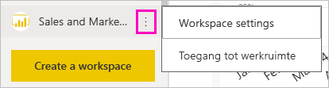
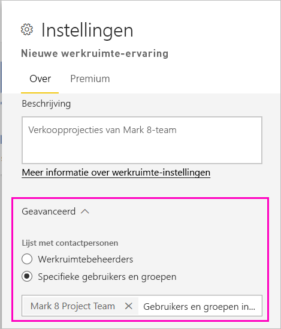
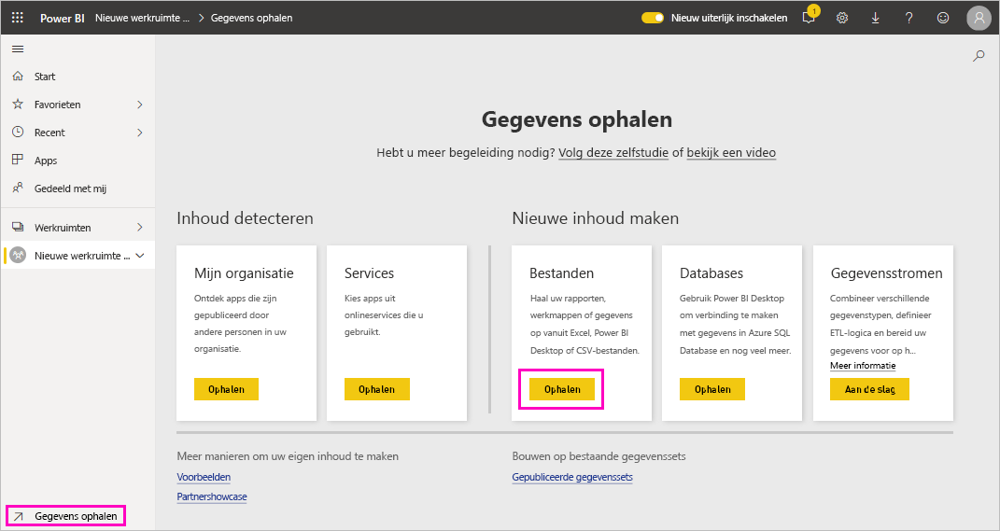
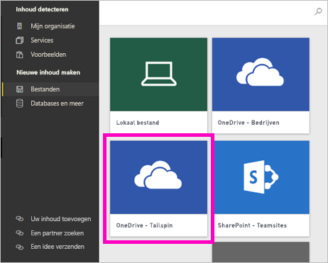
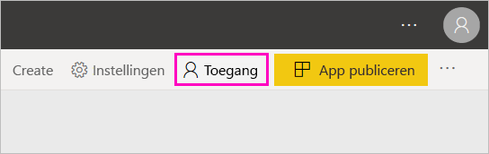
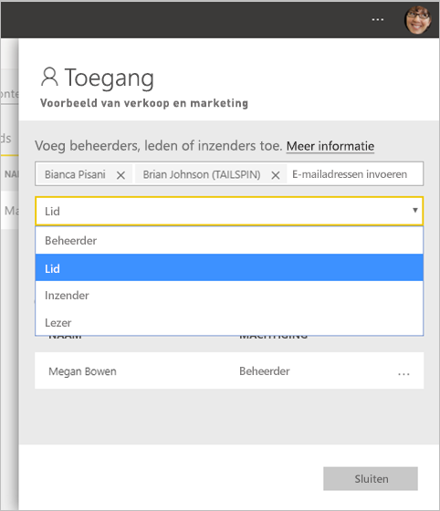

# De nieuwe werkruimten maken in Power BI

Power BI introduceert een nieuwe werkruimte-ervaring. Werkruimten zijn nog steeds de plek waar u met collega's samenwerkt om verzamelingen dashboards, rapporten en gepagineerde rapporten te maken. Vervolgens kunt u die verzameling bundelen in een *app* en die verspreiden in uw hele organisatie, of bij specifieke mensen of groepen. 

Nu wordt uitgelegd wat anders is. In de nieuwe werkruimten is het volgende mogelijk:

- Werkruimterollen toewijzen aan gebruikersgroepen: beveiligingsgroepen, distributielijsten, Office 365-groepen en personen.
- Een werkruimte in Power BI maken zonder een Office 365-groep te maken.
- Gedetailleerdere werkruimterollen gebruiken voor flexibeler beheer van machtigingen in een werkruimte.

> [!NOTE]
> De gebruikers toewijzen aan de rol Kijker om de beveiliging op rijniveau (RLS) af te dwingen voor Power BI Pro-gebruikers die door inhoud in een werkruimte bladeren.

Lees het artikel [Nieuwe werkruimten](service-new-workspaces.md) voor meer achtergrondinformatie.

## Een van de nieuwe werkruimten maken

1. Maak eerst de werkruimte. Selecteer **Werkruimten** > **Werkruimte maken**.
   
     

2. U maakt automatisch een bijgewerkte werkruimte, tenzij u kiest voor **Terugkeren naar klassieke werkruimte**.
   
     
     
     Als u **Terugkeren naar klassieke werkruimte** selecteert, maakt u een [werkruimte op basis van een Office 365-groep](service-create-workspaces.md). 

2. Geef een naam op voor de werkruimte. Als de naam niet beschikbaar is, bewerkt u deze tot een unieke naam.
   
     De app voor de werkruimte heeft dezelfde naam en hetzelfde pictogram als de werkruimte.
   
1. Dit zijn een paar optionele items die u kunt instellen voor uw werkruimte:

    Een **Werkruimteafbeelding** uploaden. Goedgekeurde bestanden zijn .png- of .jpg-bestanden. Het bestand moet kleiner zijn dan 45 kB.
    
    [Een **Lijst met contactpersonen** toevoegen](#workspace-contact-list). De werkruimtebeheerders zijn standaard contactpersonen. 
    
    [Een **OneDrive voor de werkruimte** opgeven](#workspace-onedrive) door de naam van een bestaande Office 365-groep te typen, niet de URL. Nu kan deze werkruimte gebruikmaken van de opslaglocatie van die Office 365-groep. 

    

    Als u de werkruimte wilt toewijzen aan een **Toegewezen capaciteit**, selecteert u op het tabblad **Premium** de optie **Toegewezen capaciteit**.
     
    

1. Selecteer **Opslaan**.

    De werkruimte wordt gemaakt en in Power BI geopend. De werkruimte wordt weergegeven in de lijst met werkruimten waarvan u lid bent. 

## Lijst met contactpersonen van werkruimte

U kunt opgeven welke gebruikers meldingen moeten ontvangen over problemen die optreden in de werkruimte. De standaardinstelling is dat elke gebruiker of groep die is ingesteld als een beheerder van de werkruimte, een melding krijgt, maar u kunt de lijst aanpassen door hen toe te voegen aan de *lijst met contactpersonen*. Gebruikers of groepen in de lijst met contactpersonen worden weergegeven in de UI (gebruikersinterface), zodat gebruikers hulp kunnen krijgen met betrekking tot de werkruimte.

1. U opent de instellingen voor de nieuwe **Lijst met contactpersonen** op een van twee manieren:

    In het deelvenster **Een werkruimte maken** wanneer u voor het eerst een werkruimte maakt.

    Selecteer in het navigatievenster de pijl naast **Werkruimten**, selecteer **Meer opties** (...) naast de naam van de werkruimte > **Werkruimte-instellingen**. Het deelvenster **Instellingen** wordt geopend.

    

2. Onder **Geavanceerd** > **Lijst met contactpersonen** accepteert u de standaardinstellingen, **Werkruimtebeheerders** of voegt u uw eigen lijst of **Specifieke gebruikers of groepen** toe. 

    

3. Selecteer **Opslaan**.

## Werkruimte op OneDrive

Met de functie Werkruimte op OneDrive kunt u een Office 365-groep configureren waarvan de bestandsopslag uit de SharePoint-documentbibliotheek beschikbaar voor werkruimtegebruikers. Eerst maakt u de groep buiten Power BI. 

Power BI biedt geen synchronisatie voor machtigingen van gebruikers of groepen die zijn geconfigureerd voor werkruimtetoegang met behulp van het lidmaatschap van een Office 365-groep. Het beste is om dezelfde Office 365-groep, waarvan u de bestandsopslag configureert bij het instellen van deze Office 365-groep, [toegang te geven tot de werkruimte](#give-access-to-your-workspace). Vervolgens beheert u werkruimtetoegang via het lidmaatschapsbeheer van de Office 365-groep. 

1. U opent de instellingen van de **OneDrive voor de werkruimte** op een van twee manieren:

    In het deelvenster **Een werkruimte maken** wanneer u voor het eerst een werkruimte maakt.

    Selecteer in het navigatievenster de pijl naast **Werkruimten**, selecteer **Meer opties** (...) naast de naam van de werkruimte > **Werkruimte-instellingen**. Het deelvenster **Instellingen** wordt geopend.

    

2. Onder **Geavanceerd** > **OneDrive van werkruimte** voert u naam van de Office 365-groep in die u eerder hebt gemaakt. Power BI haalt automatisch de OneDrive voor de groep op.

    

3. Selecteer **Opslaan**.

### Toegang tot de OneDrive-locatie van de werkruimte

Nadat u de OneDrive-locatie hebt geconfigureerd, bereikt u deze op dezelfde manier als de andere gegevensbronnen in de Power BI-service.

1. Selecteer in het navigatievenster de optie **Gegevens ophalen** en selecteer vervolgens in het vak **Bestanden** de optie **Ophalen**.

    

1.  De invoer **OneDrive - Bedrijven** is uw eigen OneDrive voor Bedrijven. De tweede OneDrive is de OneDrive die u hebt toegevoegd.

    

### Verbinding maken met services van derden in nieuwe werkruimten

In de nieuwe werkruimte-ervaring ligt de nadruk nu op *apps*. Gebruikers kunnen met apps voor services van derden gemakkelijk gegevens verkrijgen van de services die ze gebruiken, zoals Microsoft Dynamics CRM, Salesforce of Google Analytics.

In de nieuwe werkruimte-ervaring kunt u geen organisatie-inhoudspakketten maken of gebruiken. In plaats daarvan kunt u de geleverde apps gebruiken om verbinding te maken met services van derden, of u kunt uw interne teams vragen apps te leveren voor inhoudspakketten die u momenteel gebruikt. 

## Toegang verlenen tot uw werkruimte

1. In de inhoudslijst van de werkruimte ziet u een nieuwe actie omdat u beheerder bent: **Toegang**.

    

1. Voeg aan deze werkruimten beveiligingsgroepen, distributielijsten, Office 365-groepen of personen toe als kijkers, leden, inzenders of beheerders. Zie [Rollen in de nieuwe werkruimten](service-new-workspaces.md#roles-in-the-new-workspaces) voor een uitleg over de verschillende rollen.

    

9. Selecteer **Toevoegen** > **Sluiten**.

## Een app distribueren

Als u officiële inhoud wilt distribueren naar een grote doelgroep binnen uw organisatie, kunt u een app vanuit uw werkruimte publiceren.  Wanneer de inhoud klaar is, kunt u kiezen welke dashboards en rapporten u wilt publiceren. Vervolgens publiceert u deze als een *app*. U kunt vanuit elke werkruimte een app maken.

Meer informatie [over het publiceren van een app vanuit de nieuwe werkruimten](service-create-distribute-apps.md)

## Volgende stappen
* Lees meer over het [organiseren van werk in de nieuwe werkruimte-ervaring in Power BI](service-new-workspaces.md)
* [Klassieke werkruimten maken](service-create-workspaces.md)
* [Publish an app from the new workspaces in Power BI](service-create-distribute-apps.md) (Een app publiceren vanuit de nieuwe werkruimten in Power BI)
* Vragen? [Misschien dat de Power BI-community het antwoord weet](https://community.powerbi.com/)
