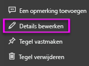

# <a name="add-images-videos-and-more-to-your-dashboard"></a>Afbeeldingen, video's en meer toevoegen aan uw dashboard

Door een tegel aan uw dashboard toe te voegen kunt u een afbeelding, tekstvak, video, streaminggegevens of webcode op uw dashboard plaatsen. 

Bekijk hoe Amanda tegels toevoegt aan een dashboard.

   
<iframe width="560" height="315" src="https://www.youtube.com/embed/e2PD8m1Q0vU" frameborder="0" allowfullscreen></iframe>


## <a name="add-an-image-video-or-other-tile"></a>Een afbeelding, video of andere tegel toevoegen
U kunt rechtstreeks een afbeelding, tekstvak, video, streaminggegevens of webcode aan uw dashboard toevoegen.

1. Selecteer **Tegel toevoegen** in de bovenste menubalk van uw dashboard. Afhankelijk van de beschikbare ruimte ziet u mogelijk alleen het plusteken .
   
    
2. Selecteer het type tegel dat u wilt toevoegen: 

    **[Webinhoud](#add-web-content)**

    **[Afbeelding](#add-an-image)**

    **[Tekstvak](#add-a-text-box-or-dashboard-heading)**

    **[Video](#add-a-video)**

    **[Aangepaste streaminggegevens](#add-streaming-data)**
   
    

## <a name="add-an-image"></a>Een afbeelding toevoegen
Als u uw bedrijfslogo of een andere afbeelding aan uw dashboard wilt toevoegen, slaat u het afbeeldingsbestand online op en koppelt u het. Zorg ervoor dat er geen beveiligingsreferenties nodig zijn voor toegang tot het afbeeldingsbestand. Omdat er bijvoorbeeld verificatie vereist is voor OneDrive en SharePoint, kunnen afbeeldingen die daar zijn opgeslagen niet op deze manier aan een dashboard worden toegevoegd.  

1. Selecteer in het venster **Tegel toevoegen** de optie **Afbeelding** > **Volgende**.

2. Voeg in het deelvenster **Een afbeeldingstegel toevoegen** informatie over de afbeelding toe:   
   
   a. Als u een titel wilt weergeven boven de afbeelding, selecteert u **Titel en subtitel weergeven** en voert u een **titel** en optioneel een **subtitel** in.

   b. Voer de **URL** van de afbeelding in.

   c. Als u van de tegel een hyperlink wilt maken, schakelt u **Aangepaste koppeling instellen** in en voert u de **URL** in. 

      Als collega's op de afbeelding of titel klikken, gaan ze naar deze URL.

   d. Selecteer **Toepassen**. 

      

3. Op het dashboard kunt u de afbeelding groter of kleiner maken en verplaatsen.
     
     

## <a name="add-a-text-box-or-dashboard-heading"></a>Een tekstvak of koptekst toevoegen

als u een koptekst wilt toevoegen aan het dashboard, typt u de tekst in het tekstvak en vergroot u het lettertype.

1. Selecteer in het venster **Tegel toevoegen** de optie **Tekstvak** > **Volgende**.

2. Het tekstvak opmaken:
   
   a. Als u een titel wilt weergeven boven het tekstvak, selecteert u **Titel en subtitel weergeven** en voert u een **titel** en optioneel een **subtitel** in.

   b. Voer **Inhoud** in voor het tekstvak en maak deze op.  

   c. U kunt desgewenst een aangepaste koppeling instellen voor de titel. Een aangepaste koppeling kan een externe site of een dashboard of rapport in uw werkruimte zijn. In dit voorbeeld hebben we echter hyperlinks toegevoegd aan het tekstvak zelf, dus laten we **Aangepaste koppeling instellen** uitgeschakeld.

   d. Selecteer **Toepassen**. 

     
   
3. Op het dashboard kunt u het tekstvak groter of kleiner maken en verplaatsen.
   
   

## <a name="add-a-video"></a>Een video toevoegen
Wanneer u een videotegel van YouTube of Vimeo aan uw dashboard toevoegt, wordt de video direct op uw dashboard afgespeeld.

1. Selecteer in het venster **Tegel toevoegen** de optie **Video** > **Volgende**.
2. Voeg informatie over de video toe in het venster **Een videotegel toevoegen**:   
   
   a. Als u een titel en subtitel wilt weergeven bovenaan de videotegel, selecteert u **Titel en subtitel weergeven** en voert u een **titel** en optioneel een **subtitel** in. In dit voorbeeld voegen we een **Subtitel** toe en converteren we deze naar een hyperlink naar de volledige afspeellijst op YouTube.

   b. Voer de **Video-URL** voor de video in.

   c. Voeg een hyperlink voor de **titel** en **subtitel** toe, zodat uw collega's de volledige afspeellijst op YouTube kunnen bekijken nadat ze de ingesloten video hebben bekeken. Selecteer hiervoor onder **Functionaliteit** de optie **Aangepaste koppeling instellen** en voer de **URL** voor de afspeellijst in.

   d. Selecteer **Toepassen**.  

   

3. Op het dashboard kunt u de videotegel groter of kleiner maken en verplaatsen.
     
   
4. Selecteer de videotegel om de video af te spelen.
5. Selecteer de subtitel om naar de afspeellijst op YouTube te gaan.

## <a name="add-streaming-data"></a>Streaminggegevens toevoegen
U kunt PubNub gebruiken om streaminggegevens, zoals Twitter-feeds of sensorgegevens, toe te voegen aan een tegel op uw dashboard. In Power BI is een integratie gemaakt om de gegevens op te halen uit PubNub. Hier wordt uitgelegd hoe het werkt.
   

U kunt PubNub gebruiken om streaminggegevens, zoals Twitter-feeds of sensorgegevens, toe te voegen aan een tegel op uw dashboard. In Power BI is een integratie gemaakt om de gegevens op te halen uit PubNub. Hier wordt uitgelegd hoe het werkt. 

<iframe width="560" height="315" src="https://www.youtube.com/embed/kOuINwgkEkQ" frameborder="0" allowfullscreen></iframe>

1. Selecteer in het venster **Tegel toevoegen** de optie **Aangepaste streaminggegevens** > **Volgende.**
2. Selecteer **Streaminggegevensset toevoegen**.
3. Maak een **Nieuwe streaminggegevensset** met behulp van de API van Power BI of met PubNub.
4. Vul de velden in voor **Naam van de gegevensset**, **Abonnementssleutel** en **Kanaalnaam**. Als het een beveiligde verbinding is, heeft deze ook een autorisatiesleutel. U kunt de voorbeeldwaarden van PubNub gebruiken om dit te testen.
5. Selecteer **Volgende**.
    U ziet de velden die beschikbaar zijn in de gegevensset, met de gegevenstypen en JSON-indeling ervan.
6. Selecteer **Verbinding maken**.
    U hebt een streaminggegevensset gemaakt.
7. Ga terug naar het dashboard en selecteer nogmaals **Tegel toevoegen** > **Aangepaste streaminggegevens** > **Volgende**.
8. Selecteer de sensorgegevensset die u hebt gemaakt > **Volgende**.
9. Selecteer het gewenste visualtype. Een lijndiagram is vaak geschikt voor deze gegevens.
10. Selecteer de **As**, **Legenda**en **Waarden**.
11. Bepaal de tijdsduur die u wilt weergeven, in seconden, minuten of uren.
12. Selecteer **Volgende**.
13. Geef het desgewenst een **titel** en een **subtitel**.
14. Maak het vast aan uw dashboard.


1. Selecteer in het venster **Tegel toevoegen** de optie **Aangepaste streaminggegevens** > **Volgende.**

2. Selecteer **Streaminggegevensset toevoegen**.

3. Maak een **Nieuwe streaminggegevensset** met behulp van de API van Power BI of met PubNub.

4. Vul de velden in voor **Naam van de gegevensset**, **Abonnementssleutel** en **Kanaalnaam**. Als het een beveiligde verbinding is, heeft deze ook een autorisatiesleutel. U kunt de voorbeeldwaarden van PubNub gebruiken om dit te testen.

5. Selecteer **Volgende**.

   U ziet de velden die beschikbaar zijn in de gegevensset, met de gegevenstypen en JSON-indeling ervan.

6. Selecteer **Verbinding maken**.

   U hebt een streaminggegevensset gemaakt.

7. Ga terug naar het dashboard en selecteer nogmaals **Tegel toevoegen** > **Aangepaste streaminggegevens** > **Volgende**.

8. Selecteer de sensorgegevensset die u hebt gemaakt > **Volgende**.

9. Selecteer het gewenste visualtype. Een lijndiagram is vaak geschikt voor deze gegevens.

10. Selecteer de **As**, **Legenda**en **Waarden**.

11. Bepaal de tijdsduur die u wilt weergeven, in seconden, minuten of uren.

12. Selecteer **Volgende**.

13. Geef het optioneel een **titel** en **subtitel**.

14. Maak het vast aan uw dashboard.

## <a name="add-web-content"></a>Webinhoud toevoegen
U kunt elke willekeurige HTML-inhoud, als een tegel, in uw rapport of dashboard plakken of typen. Insluitcode kunt u handmatig invoeren of kopiëren en plakken van sites zoals Twitter, YouTube en embed.ly.

1. Selecteer in het venster **Tegel toevoegen** de optie **Webinhoud** > **Volgende**.

2. Voeg gegevens toe aan het venster **Een webinhoudtegel toevoegen**:
   
   a. Als u een titel wilt weergeven boven de tegel, selecteert u **Titel en subtitel weergeven** en voert u een **titel** en optioneel een **subtitel** in.

   b. Voer de insluitcode in. In dit voorbeeld kopiëren en plakken we een Twitter-feed.

   c. Selecteer **Toepassen**.

   
   

3. Op het dashboard kunt u de tegel met webinhoud groter of kleiner maken en verplaatsen.
     
   

### <a name="tips-for-embedding-web-content"></a>Tips voor het insluiten van webinhoud
* Gebruik een beveiligde bron voor iframes. Als u de insluitcode voor het iframe invoert en vervolgens een lege tegel ziet, controleert u of u geen *http* gebruikt voor de bron van het iframe. Als dat wel zo is, wijzigt u dit in *https*.
  
  ```html
  <iframe src="https://xyz.com">
  ```
* Pas de breedte en hoogte aan. Met deze insluitcode wordt er een video ingesloten en wordt de videospeler ingesteld op 560 x 315 pixels. Deze grootte verandert niet als u de grootte van de tegel aanpast.
  
  ```html
  <iframe width="560" height="315"
  src="https://www.youtube.com/embed/Cle_rKBpZ28" frameborder="0"
   allowfullscreen></iframe>
  ```
  
  Als u wilt dat de grootte van de speler wordt aangepast aan de tegelgrootte, stelt u de breedte en hoogte in op 100%.
  
  ```html
  <iframe width="100%" height="100%"
  src="https://www.youtube.com/embed/Cle_rKBpZ28" frameborder="0"
   allowfullscreen></iframe>
  ```
* Met deze code wordt een tweet ingesloten en worden, als afzonderlijke koppelingen op het dashboard, koppelingen behouden voor de AFK-podcast, de Twitter-pagina van \@GuyInACube, Volgen, #analytics, beantwoorden, retweeten en leuk vinden.  Als u de tegel zelf selecteert, gaat u naar de podcast op Twitter.
  
  ```html
  <blockquote class="twitter-tweet" data-partner="tweetdeck">
  <p lang="en" dir="ltr">Listen to
  <a href="https://twitter.com/GuyInACube">@GuyInACube</a> talk to
  us about making videos about Microsoft Business Intelligence
  platform
  <a href="https://t.co/TmRgalz7tv">https://t.co/TmRgalz7tv </a>
  <a href="https://twitter.com/hashtag/analytics?src=hash">
  #analytics</a></p>&mdash; AFTK Podcast (@aftkpodcast) <a
  href="https://twitter.com/aftkpodcast/status/693465456531771392">
  January 30, 2016</a></blockquote> <script async src="//platform.twitter.com/widgets.js" charset="utf-8"></script>
  ```

## <a name="edit-a-tile"></a>Een tegel bewerken
Wijzigingen aanbrengen aan een bestaande tegel:

1. Wijs de rechterbovenhoek van de tegel aan en selecteer **Meer opties** (...).
   
    
2. Selecteer **Details bewerken** om het venster **Details van de tegel** weer te geven en wijzigingen aan te brengen.
   
    

## <a name="considerations-and-troubleshooting"></a>Aandachtspunten en probleemoplossing
* U kunt een tegel op een dashboard eenvoudiger verplaatsen door een titel en optioneel een subtitel toe te voegen.
* Als u inhoud van een website wilt insluiten, maar de website geen insluitcode biedt om te kopiëren en plakken, raadpleegt u embed.ly voor ondersteuning bij het genereren van de insluitcode.

## <a name="next-steps"></a>Volgende stappen
[Inleiding tot dashboardtegels voor Power BI-ontwerpers](service-dashboard-tiles.md)

Hebt u nog vragen? [Misschien dat de Power BI-community het antwoord weet](http://community.powerbi.com/).

