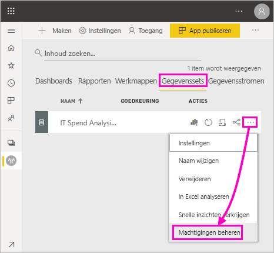
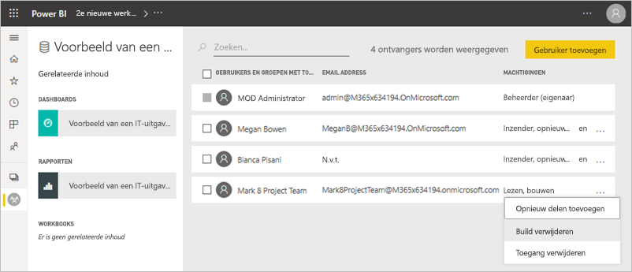
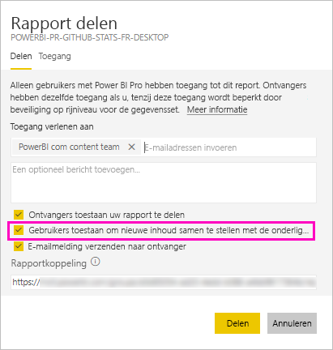
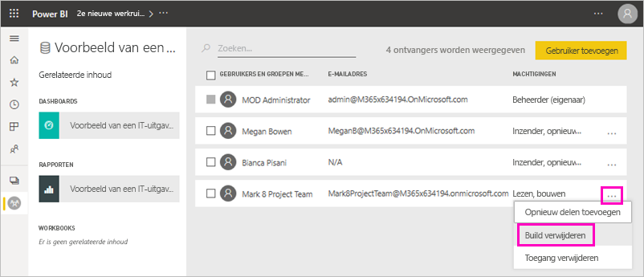
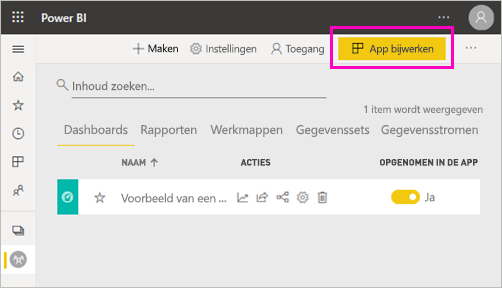
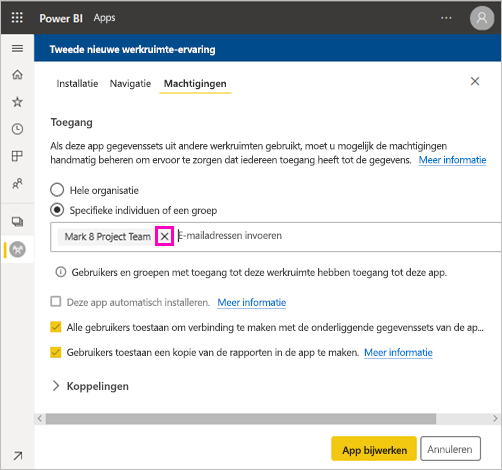
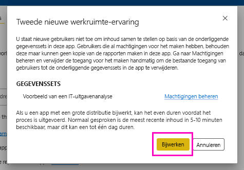

# Samenstellingsmachtiging voor gedeelde gegevenssets (preview)

Als maker van *gegevensmodellen* in Power BI Desktop kunt u de gegevensmodellen in de Power BI-service ook delen als *gegevenssets*. Makers van rapporten kunnen vervolgens eenvoudig de gegevenssets die u hebt gedeeld ontdekken en hergebruiken. Ontdek hoe u de controle houdt over wie toegang heeft tot de gegevens met behulp van de samenstellingsmachtiging.

De samenstellingsmachtiging is alleen relevant voor gegevenssets. Met de samenstellingsmachtiging kunnen gebruikers nieuwe inhoud samenstellen op basis van een gegevensset, zoals rapporten, dashboards, tegels die zijn vastgemaakt vanuit Q&A en statistieken. Zij kunnen ook nieuwe inhoud ontwikkelen op basis van de gegevensset buiten Power BI, zoals Excel-bladen via Analyseren in Excel, XMLA en onderliggende gegevens exporteren.

## Manieren om een samenstellingsmachtiging te geven

U kunt een samenstellingsmachtiging voor een gegevensset op een aantal verschillende manieren opgeven:

- Leden van een werkruimte met minimaal de rol van Inzender beschikken automatisch over de samenstellingsmachtiging voor gegevenssets in die werkruimte en de machtiging om een rapport te kopiëren.
 
- Leden van de werkruimte waarin de gegevensset zich bevindt, kunnen de machtiging in het machtigingencentrum toewijzen aan specifieke gebruikers en beveiligingsgroepen. Selecteer als u een lid van de werkruimte bent **Meer opties** (...) naast de gegevensset > **Machtigingen beheren**.

    

    Hiermee wordt het machtigingencentrum voor de gegevensset geopend; hier kunt u machtigingen instellen en wijzigen.

    

- Beheerders en leden van de werkruimte waarin de gegevensset zich bevindt, kunnen tijdens het publiceren van apps besluiten dat gebruikers met machtigingen voor de app ook de samenstellingsmachtiging krijgen voor onderliggende gegevenssets. Zie [Een gegevensset delen](service-datasets-share.md) voor meer informatie.

- Stel dat u een machtiging voor opnieuw delen en een samenstellingsmachtiging hebt voor een gegevensset. Wanneer u een rapport of dashboard deelt dat is samengesteld op basis van die gegevensset, kunt u opgeven dat de ontvangers ook een samenstellingsmachtiging krijgen voor de onderliggende gegevensset.

    

U kunt de samenstellingsmachtiging die iemand voor een gegevensset heeft ook verwijderen. Als u dit doet, kunnen ze het rapport dat is samengesteld op basis van de gedeelde gegevensset nog steeds zien, maar ze kunnen de set niet meer bewerken. Zie de volgende sectie voor details.

## Samenstellingsmachtiging voor een gegevensset verwijderen

Op een bepaald punt moet u mogelijk de samenstellingsmachtiging verwijderen voor sommige gebruikers van een gedeelde gegevensset. 

1. Ga in een werkruimte naar de lijstpagina **Gegevenssets**. 
1. Selecteer **Meer opties** (...) naast de gegevensset > **Machtigingen beheren**.

    

1. Selecteer **Meer opties** (...) naast een naam > **Build verwijderen**.

    

    Gebruikers kunnen het rapport dat is samengesteld op basis van de gedeelde gegevensset nog steeds zien, maar ze kunnen de set niet meer bewerken.

### Samenstellingsmachtiging voor een gegevensset in een app verwijderen

Stel dat u een app vanuit een werkruimte naar een groep personen hebt gedistribueerd. Later besluit u om toegang tot de app voor sommige personen te verwijderen. Wanneer toegang tot de app wordt verwijderd, worden de samenstellingsmachtiging en machtiging voor opnieuw delen niet automatisch ook verwijderd. Dat is een extra stap. 

1. Selecteer **App bijwerken** op een werkruimtepagina. 

    

1. Selecteer op het tabblad **Machtigingen** de **X** om de persoon of groep te verwijderen. 

    
1. Selecteer **App bijwerken**.

    Er wordt een bericht weergegeven met de melding dat u naar **Machtigingen beheren** moet gaan om de samenstellingsmachtiging te verwijderen voor gebruikers die toegang hebben. 

    

1. Selecteer **Bijwerken**.

1. Ga in de werkruimte naar de lijstpagina **Gegevenssets**. 
1. Selecteer **Meer opties** (...) naast de gegevensset > **Machtigingen beheren**.

    

1. Selecteer **Meer opties** (...) naast de naam > **Build verwijderen**.

    

    Gebruikers kunnen het rapport dat is samengesteld op basis van de gedeelde gegevensset nog steeds zien, maar ze kunnen de set niet meer bewerken.

## Meer gedetailleerde machtigingen

De samenstellingsmachtiging is in juni 2019 geïntroduceerd in Power BI als aanvulling op de bestaande machtigingen voor lezen en opnieuw delen. Alle gebruikers die via app-machtigingen, delen of toegang tot werkruimten al leesmachtiging hadden voor gegevenssets, hebben op dat moment ook de samenstellingsmachtiging gekregen voor die gegevenssets. Ze hebben de samenstellingsmachtiging automatisch gekregen omdat ze met de leesmachtiging sowieso al het recht hadden om nieuwe inhoud samen te stellen op basis van de gegevensset (bijvoorbeeld via In Excel analyseren of Exporteren).

Met deze meer gedetailleerde samenstellingsmachtiging kunt u selecteren wie alleen de inhoud van de rapporten en dashboards mag bekijken en wie ook inhoud mag samenstellen op basis van de onderliggende gegevenssets.

Als uw gegevensset voor een rapport buiten de werkruimte van de gegevensset wordt gebruikt, kunt u die gegevensset niet verwijderen. In plaats daarvan krijgt u een foutmelding te zien.

U kunt samenstellingsmachtigingen verwijderen. Als u dit doet, kunnen de mensen van wie u de machtigingen hebt ingetrokken het rapport wel nog bekijken, maar ze kunnen het rapport niet langer bewerken of onderliggende gegevens exporteren. Gebruikers met alleen een leesmachtiging kunnen nog wel samengevatte gegevens exporteren. 

## Volgende stappen

- [Gegevenssets in meerdere werkruimten gebruiken (preview)](service-datasets-across-workspaces.md)
- Vragen? [Misschien dat de Power BI-community het antwoord weet](https://community.powerbi.com/)
