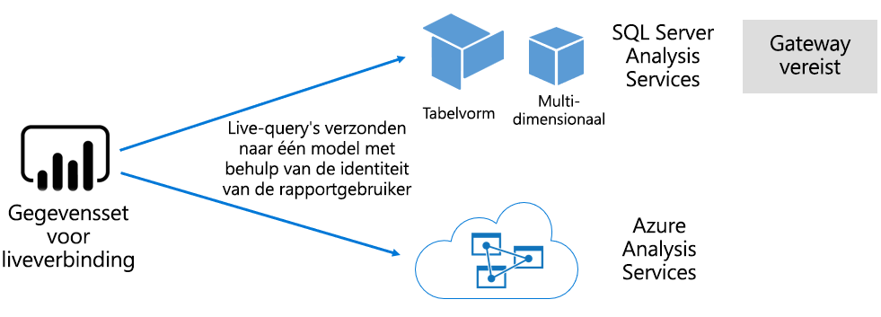

# Gegevenssets in de Power BI-service

Dit artikel bevat een technische uitleg van Power BI-gegevenssets.

## Typen gegevenssets

Een Power BI-gegevensset is een bron van gegevens die gereed zijn voor rapportage en visualisatie. Er zijn vijf verschillende typen gegevenssets, die op de volgende manieren worden gemaakt:

- Verbinding maken met een bestaand gegevensmodel dat niet wordt gehost in een Power BI-capaciteit
- Een Power BI Desktop-bestand met een model uploaden
- Een Excel-werkmap (met een of meer Excel-tabellen en/of een gegevensmodel van een werkmap) of een CSV-bestand (met door komma's gescheiden waarden) uploaden
- De Power BI-service gebruiken voor het maken van een [push-gegevensset](developer/automation/walkthrough-push-data.md)
- De Power BI-service gebruiken voor het maken van een [streaming- of een hybride streaminggegevensset](service-real-time-streaming.md)

Elke gegevensset, behalve een streaminggegevensset, vertegenwoordigt een gegevensmodel, dat gebruikmaakt van de volwassen modelleertechnologieën van [Analysis Services](/analysis-services/analysis-services-overview).

> [!NOTE]
> In onze documentatie worden de termen _gegevenssets_ en _modellen_ soms door elkaar gebruikt. Over het algemeen spreken we van een **gegevensset** in de context van een Power BI-service en van een **model** in de context van ontwikkeling. In onze documentatie betekenen ze vrijwel hetzelfde.

### Extern gehoste modellen

Er zijn twee typen extern gehoste modellen: SQL Server Analysis Services en [Azure Analysis Services](/azure/analysis-services/analysis-services-overview).

Als u verbinding wilt maken met een SQL Server Analysis Services-model, moet u de [on-premises gegevensgateway](service-gateway-onprem.md) installeren, ongeacht of deze on-premises is of wordt gehost op een VM in IaaS (Infrastructure-as-a-Service). Voor Azure Analysis Services is geen gateway vereist.

Een verbinding met Analysis Services is vaak nuttig bij bestaande modelinvesteringen, die vaak deel uitmaken van een zakelijk datawarehouse. Met Power BI kunt u een _liveverbinding_ met Analysis Services maken, waarbij machtigingen voor gegevens worden afgedwongen met behulp van de identiteit van de Power BI-rapportgebruiker. Voor SQL Server Analysis Services worden zowel multidimensionale modellen (kubussen) als tabellaire modellen ondersteund. Zoals u in de volgende afbeelding ziet, worden via een gegevensset met een liveverbinding query's doorgegeven aan extern gehoste modellen.

### Met Power BI Desktop ontwikkelde modellen

Power BI Desktop, een clienttoepassing voor Power BI-ontwikkelingsdoeleinden, kan worden gebruikt om een model te ontwikkelen. Het model is in feite een tabellair Analysis Services-model. Modellen kunnen worden ontwikkeld door gegevens te importeren uit gegevensstromen, die vervolgens kunnen worden geïntegreerd met externe gegevensbronnen. Dit artikel bevat geen specifieke informatie over het modelleren zelf, maar het is belangrijk te weten dat er drie verschillende typen modellen (ook wel _modi_ genoemd, zijn die kunnen worden ontwikkeld met behulp van Power BI Desktop. Aan de hand van deze modi wordt bepaald of de gegevens in het model worden geïmporteerd of in de gegevensbron aanwezig blijven. De drie modi zijn: Import, DirectQuery en Samengesteld. Zie het artikel over de [gegevenssetmodi in de Power BI-service](service-dataset-modes-understand.md) voor meer informatie over elke modus.

Extern gehoste modellen en Power BI Desktop-modellen kunnen beveiliging op rijniveau (RLS) afdwingen voor het beperken van de gegevens die worden opgehaald voor een bepaalde gebruiker. Zo kunnen gebruikers die zijn toegewezen aan de beveiligingsgroep **Verkopers** alleen rapportgegevens bekijken voor de verkoopregio('s) waaraan ze zijn toegewezen. Rollen voor beveiliging op rijniveau zijn _dynamisch_ of _statisch_. Bij dynamische rollen worden gegevens gefilterd op de rapportgebruiker. Bij statische rollen worden dezelfde filters toegepast op alle gebruikers die aan de rol zijn toegewezen. Zie [Beveiliging op rijniveau (RLS) met Power BI](service-admin-rls.md) voor meer informatie.

### Excel-werkmapmodellen

Bij het maken van gegevenssets op basis van [Excel-werkmappen](service-excel-workbook-files.md) of [CSV-bestanden](service-comma-separated-value-files.md) wordt automatisch een model gemaakt. Excel-tabellen en CSV-gegevens worden geïmporteerd om modeltabellen te maken, terwijl een Excel-werkmapgegevensmodel wordt getransponeerd om een Power BI-model te maken. In alle gevallen worden bestandsgegevens in een model geïmporteerd.

## Samenvatting

Er kan onderscheid worden gemaakt tussen Power BI-gegevenssets die modellen vertegenwoordigen:

- Ze worden gehost in de Power BI-service of ze worden extern gehost door Analysis Services.
- Ze kunnen geïmporteerde gegevens opslaan of ze kunnen Pass Through-queryaanvragen verzenden naar onderliggende gegevensbronnen, of een combinatie van beide.

Hier volgt een overzicht van belangrijke feiten over Power BI-gegevenssets die modellen vertegenwoordigen:

- Bij gehoste SQL Server Analysis Services-modellen is een gateway vereist om query's via een liveverbinding uit te voeren.
- Gehoste Power BI-modellen waarmee gegevens worden geïmporteerd:
  - moeten volledig in het geheugen worden geladen, zodat ze kunnen worden opgevraagd.
  - moeten worden vernieuwd om de gegevens actueel te houden en vereisen een gateway als brongegevens niet rechtstreeks via internet toegankelijk zijn.
- Gehoste Power BI-modellen die gebruikmaken van de [DirectQuery](desktop-directquery-about.md)-opslagmodus, moeten verbinding hebben met de brongegevens. Wanneer het model wordt opgevraagd, worden met Power BI query's op de brongegevens uitgevoerd om de huidige gegevens op te halen. Voor deze modus is een gateway vereist als de brongegevens niet rechtstreeks via internet toegankelijk zijn.
- Modellen kunnen regels voor beveiliging op rijniveau afdwingen en filters toepassen om de toegang tot gegevens voor bepaalde gebruikers te beperken.

## Overwegingen

Voor de implementatie en het beheer van Power BI is het belangrijk het volgende te begrijpen: waar modellen worden gehost, welke opslagmodus wordt gebruikt, of er afhankelijkheden van gateways zijn, hoe groot de geïmporteerde gegevens zijn en hoe (vaak) ze worden vernieuwd. Al deze configuratie-instellingen kunnen van grote invloed zijn op de resources voor de Power BI-capaciteit. Daarnaast is het modelontwerp zelf, met inbegrip van de gegevensvoorbereidingsquery's, relaties en berekeningen, van belang bij het overwegen van al deze aspecten.

Het is ook belangrijk om te begrijpen dat gegevens bij gehoste Power BI-importmodellen kunnen worden vernieuwd volgens een bepaald schema, of op aanvraag door een gebruiker in de Power BI-service.

## Volgende stappen

- [Gegevenssetmodi in de Power BI-service](service-dataset-modes-understand.md)
- Hebt u nog vragen? [Misschien dat de Power BI-community het antwoord weet](https://community.powerbi.com/)
