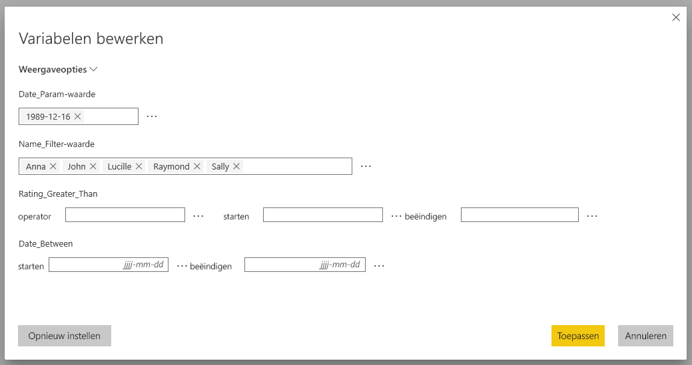
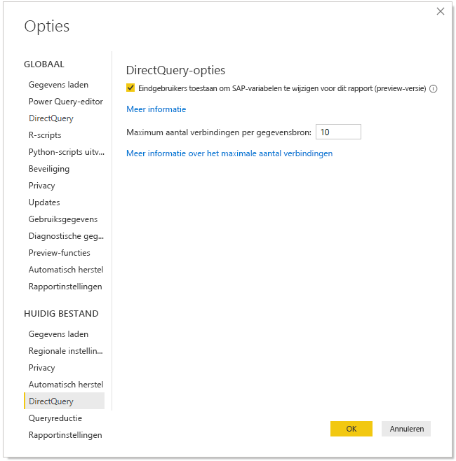
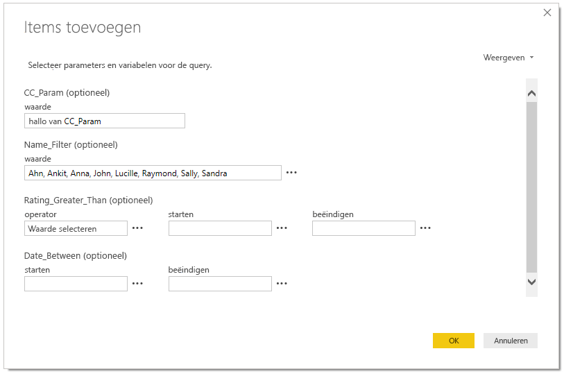
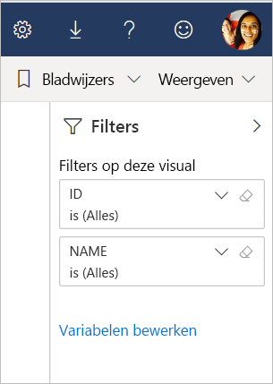

# SAP-variabelen bewerken in de Power BI-service (preview)

Bij het gebruik van SAP Business Warehouse of SAP HANA met DirectQuery, kunnen rapportauteurs eindgebruikers nu machtigen om SAP-variabelen in de **Power BI-service** voor Premium-werkruimten te bewerken.

In dit document worden de vereisten beschreven voor het bewerken van variabelen in Power BI. Ook wordt beschreven hoe u deze preview-functie inschakelt en waar u variabelen in de Power BI-service kunt bewerken.

## Vereisten voor SAP-bewerkingsvariabelen

Er zijn een aantal vereisten voor het gebruik van de functie SAP-bewerkingsvariabelen. In de volgende lijst worden deze vereisten beschreven.

**Nieuwe filterervaring vereist**: de [nieuwe filterervaring](power-bi-report-filter.md) moet voor uw rapport zijn ingeschakeld. U kunt deze ervaring als volgt inschakelen voor uw rapport in Power BI Desktop:
- In Power BI Desktop selecteert u **Bestand** > **Opties en instellingen** > **Opties**
- Selecteer in de linkernavigatiebalk **Rapportinstellingen** onder **Huidig bestand**.
- Onder **Filterervaring** selecteert u **Het bijgewerkte filtervenster inschakelen**.

**DirectQuery-verbindingen vereist**: u moet verbinding maken met de SAP-gegevensbron met behulp van DirectQuery. Importverbindingen worden niet ondersteund.

**Power BI Premium-abonnement vereist**: de functie SAP-bewerkingsvariabelen werkt momenteel alleen in Power BI Premium-abonnementen.

**Instelling van SSO vereist**: deze functie werkt alleen als eenmalige aanmelding (SSO) is geconfigureerd. Zie [Overzicht van eenmalige aanmelding (SSO)](service-gateway-sso-overview.md) voor meer informatie.

**Nieuwe gatewaybits vereist**: download de meest recente gateway en werk uw bestaande gateway bij. Zie [servicegateway](service-gateway-onprem.md) voor meer informatie.

**Alleen multidimensionaal voor SAP HANA**: voor SAP HANA werkt de functie SAP-bewerkingsvariabelen alleen in combinatie met multidimensionale modellen, niet voor relationele bronnen.

**Niet ondersteund in onafhankelijke clouds**: momenteel is Power Query Online niet beschikbaar in onafhankelijke clouds; daarom wordt deze functie ook niet ondersteund in onafhankelijke clouds.

## De functie inschakelen

Als u de functie **SAP-bewerkingsvariabelen** wilt inschakelen, maakt u in Power BI Desktop verbinding met een SAP HANA- of SAP BW-gegevensbron. Vervolgens gaat u naar **Bestand > Opties en instellingen > Opties** en selecteert u **DirectQuery** in het gedeelte Huidig bestand in het linkerdeelvenster. Wanneer u die optie selecteert, ziet DirectQuery-opties in het rechterdeelvenster en selectievakje waar u **eindgebruikers toestemming geeft om SAP-variabelen in het rapport te wijzigen (preview)** (zie de volgende afbeelding).

## SAP-bewerkingsvariabelen gebruiken in Power BI Desktop

Wanneer u SAP-bewerkingsvariabelen in Power BI Desktop gebruikt, kunt u de variabelen bewerken door de koppeling Variabelen bewerken te selecteren vanuit het menu **Query's bewerken** in het lint. Van daaruit wordt het volgende dialoogvenster weergegeven. Deze functie is al enige tijd beschikbaar in Power BI Desktop. Rapportmakers kunnen variabelen voor het rapport selecteren met behulp van het volgende dialoogvenster.

## SAP-bewerkingsvariabelen in de service gebruiken

Zodra het rapport naar de Power BI-service is gepubliceerd, zien gebruikers de koppeling **Variabelen bewerken** in het nieuwe Filterdeelvenster. Als u het rapport voor de eerste keer publiceert, kan het tot 5 minuten duren voordat de koppeling Variabelen bewerken wordt weergegeven. Als de koppeling niet wordt weergegeven, moet u de gegevensset handmatig vernieuwen.
U kunt dit als volgt doen:

1. Selecteer in de Power BI-service het tabblad **Gegevenssets** in de inhoudslijst voor een werkruimte.

2. Zoek de gegevensset die u wilt vernieuwen en selecteer het pictogram **Vernieuwen**.

    

3. Door het selecteren van de koppeling Variabelen bewerken wordt het dialoogvenster **Variabelen bewerken** geopend, waarin gebruikers variabelen kunnen overschrijven. Door het selecteren van de knop **Opnieuw instellen**, worden de oorspronkelijke waarden van de variabelen hersteld die werden weergegeven toen dit dialoogvenster werd geopend.

    

4. Alle eventuele wijzigingen in het dialoogvenster **Variabelen bewerken** worden alleen bewaard voor deze gebruiker (vergelijkbaar met ander bewaargedrag in Power BI). Door het selecteren van **Standaardinstelling herstellen** (zie de volgende afbeelding), worden de standaardinstellingen van het rapport hersteld, inclusief de variabelen.

    

Wanneer u met een gepubliceerd rapport in de Power BI-service werkt waarvoor SAP HANA of SAP BW wordt gebruikt terwijl de functie **Variabelen bewerken** is ingeschakeld, kan de rapporteigenaar die standaardinstellingen wijzigen. De eigenaar van het rapport kan de variabelen in de bewerkmodus wijzigen en het rapport opslaan, zodat die instellingen de *nieuwe standaardinstellingen* voor dat rapport worden. Andere gebruikers die toegang tot het rapport krijgen nadat die wijzigingen door de rapporteigenaar zijn doorgevoerd, zien die nieuwe instellingen als de standaardinstellingen.

## Problemen en overwegingen

Op dit moment wordt de functie SAP-bewerkingsvariabelen niet ondersteund in apps.

## Volgende stappen

Lees de volgende artikelen voor meer informatie over SAP HANA, SAP BW of DirectQuery:

- [SAP HANA in Power BI Desktop gebruiken](desktop-sap-hana.md)
- [DirectQuery en SAP Business Warehouse (BW)](desktop-directquery-sap-bw.md)
- [DirectQuery en SAP HANA](desktop-directquery-sap-hana.md)
- [DirectQuery gebruiken in Power BI](desktop-directquery-about.md)