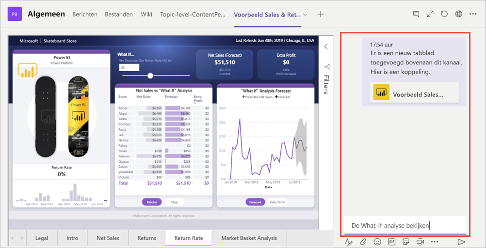

# Rapporten insluiten in Microsoft Teams met het Power BI-tabblad

Met het bijgewerkte Power BI-tabblad voor Microsoft Teams kunt u eenvoudig interactieve rapporten insluiten in Microsoft Teams-kanalen en -chats. Gebruik het Power BI-tabblad voor Microsoft Teams om uw collega's te helpen de gegevens te vinden die uw team gebruikt en de gegevens te bespreken in uw teamkanalen.  Wanneer u een koppeling naar uw rapporten, dashboards en apps in het Microsoft Teams-berichtvak plakt, wordt in de koppelingsvoorbeeld informatie erover weergegeven. Uw gebruikers kunnen gemakkelijker begrijpen naar welk item de koppeling ze leidt.

## Vereisten

Voor een goede werking van het **Power BI-tabblad voor Microsoft Teams** moet u ervoor zorgen dat:

- Uw gebruikers over een Power BI Pro-licentie beschikken, of dat het rapport is ingesloten in een [Power BI Premium-capaciteit (EM of P SKU)](service-premium-what-is.md) met een Power BI-licentie.
- Microsoft Teams het Power BI-tabblad bevat.
- Gebruikers zich hebben aangemeld bij de Power BI-service om hun Power BI-licentie te activeren, zodat zij het rapport kunnen gebruiken.
- Gebruikers gemachtigd zijn om het rapport te bekijken.

Daarnaast moet u voor de goede werking van de **koppelingsvoorbeelden** de volgende handelingen uitvoeren:
- Gebruikers moeten voldoen aan de vereisten voor het gebruik van het Power BI-tabblad voor Microsoft Teams.
- Gebruikers moeten zijn aangemeld bij de Power BI-service. 

## Uw rapport insluiten

Volg deze stappen als u uw rapport wilt insluiten in een Microsoft Teams-kanaal of -chat.

1. Open een kanaal of chat in Microsoft Teams en selecteer het pictogram **+** .

    

2. Selecteer het Power BI-tabblad.

    

3. De beschikbare opties gebruiken om een rapport te kiezen uit een werkruimte, Gedeeld met mij of een Power BI-app.

    

4. De naam van het tabblad wordt automatisch bijgewerkt met de naam van het rapport, maar u kunt deze wijzigen. 

5. Klik op **Opslaan**.

## Ondersteunde rapporten voor het insluiten van het Power BI-tabblad
U kunt de volgende rapporttypen insluiten op het Power BI-tabblad:

- Interactieve en gepagineerde rapporten.
- Rapporten in Mijn werkruimte, de nieuwe werkruimte-ervaringen en klassieke werkruimten.
- Rapporten in Power BI-apps.

## Een koppelingsvoorbeeld verkrijgen

Volg deze stappen om een koppelingsvoorbeeld te krijgen voor inhoud in de Power BI-service.

1. Kopieer een koppeling naar een rapport, een dashboard of een app in de Power BI-service. U kunt bijvoorbeeld de koppeling uit de adresbalk van de browser kopiëren.

2. Plak de koppeling in het berichtvak van Microsoft Teams. Meld u aan bij de service voor het koppelingsvoorbeeld als u hierom wordt gevraagd. Mogelijk moet u enkele seconden wachten voordat het koppelingsvoorbeeld wordt geladen.

    

3. Het basiskoppelingsvoorbeeld wordt weergegeven nadat u zich hebt aangemeld.

    

4. Selecteer het pictogram voor uitvouwen om de uitgebreide voorbeeldkaart weer te geven.

    

5. De uitgebreide voorbeeldkaart toont de koppeling en relevante actieknoppen

    

6. Verzend het bericht.

## Toegang verlenen tot rapporten

Wanneer een rapport wordt ingesloten in Microsoft Teams of een koppeling naar een item wordt verzonden, zijn gebruikers niet automatisch gemachtigd om het rapport weer te geven. U moet [gebruikers toestaan om het rapport weer te geven in Power BI](service-share-dashboards.md). U kunt een Office 365-groep voor uw team gebruiken om dat gemakkelijker te maken. 

> [!IMPORTANT]
> Controleer wie het rapport kan raadplegen in de Power BI-service en verleen toegang tot personen die niet worden vermeld.

Eén manier om ervoor te zorgen dat iedereen in uw team toegang heeft tot rapporten, is door de rapporten in één werkruimte in Power BI te plaatsen en de Office 365-groep voor uw team toegang te geven tot de werkruimte.

## Koppelingsvoorbeelden 

Er worden koppelingsvoorbeelden gegeven voor de volgende items in Power BI:
- Rapporten
- Dashboards
- Apps

Voor de service voor koppelingsvoorbeelden moeten uw gebruikers zich aanmelden. Als u zich wilt afmelden, selecteert u het pictogram Power BI onderaan het berichtvak en selecteert u vervolgens afmelden.

## Een gesprek starten

Wanneer u een tabblad voor een Power BI-rapport toevoegt aan Teams, maakt Teams automatisch een tabgesprek voor het rapport. 

- Selecteer **Tabgesprek weergeven** in de rechterbovenhoek.

    

    De eerste opmerking is een koppeling naar het rapport. Iedereen in dat Teams-kanaal kan het rapport in de conversatie bekijken en bespreken.

    

## Bekende problemen en beperkingen

- Power BI ondersteunt niet dezelfde gelokaliseerde talen als Microsoft Teams. U kunt hierdoor mogelijk niet de juiste lokalisatie zien in een ingesloten rapport.
- Power BI-dashboards kunnen niet worden ingesloten in het Power BI-tabblad voor Microsoft Teams.
- Gebruikers zonder een Power BI-licentie of machtiging voor het rapport krijgen een bericht dat de inhoud niet beschikbaar is.
- U kunt problemen ervaren als u Internet Explorer 10 gebruikt. <!--You can look at the [browsers support for Power BI](consumer/end-user-browsers.md) and for [Office 365](https://products.office.com/office-system-requirements#Browsers-section). -->
- [URL-filters](service-url-filters.md) worden niet ondersteund voor het Power BI-tabblad voor Microsoft Teams.
- In nationale clouds is het nieuwe Power BI-tabblad niet beschikbaar. Er is mogelijk een oudere versie beschikbaar die geen ondersteuning biedt voor de werkruimten of rapporten met nieuwe werkruimte-ervaring in Power BI-apps. 
- Nadat u het tabblad hebt opgeslagen, kunt u de naam van het tabblad niet wijzigen via de instellingen op het tabblad. Gebruik de naamswijzigingsoptie om deze te wijzigen.
- Eenmalige aanmelding wordt niet ondersteund voor de service voor koppelingsvoorbeelden.
- Koppelingsvoorbeelden werken niet in chat- of privé-kanalen voor vergaderingen.

## Volgende stappen
- [Een dashboard delen met collega's en anderen](service-share-dashboards.md)  
- [Een app maken en distribueren in Power BI](service-create-distribute-apps.md)  
- [Wat is Power BI Premium?](service-premium-what-is.md)

Hebt u nog vragen? [Misschien dat de Power BI-community het antwoord weet](https://community.powerbi.com/)
